가을 날은 산책하기에 너무 좋은 계절입니다. 서울에서도 가깝고 경기 북부에서 많이 찾는 광릉수목원은 2010년도에 유네스코에 의해 생물권보전지역으로 선정된 만큼 자연환경이 너무 좋은 곳입니다.  
작년부터 개장된 광릉수목원 산책길떄문인지 사람들이 많이 찾아오고 있습니다. 하지만 한가지 아쉬운 점은 교통이라고 할 수 있습니다. 자동차가 다닐 수 있는 길은 1차선의 아름답고 좁은 숲길 1개만 있어서 사람들이 몰릴 경우 오도 가도 못하는 경우가 있기 때문입니다.

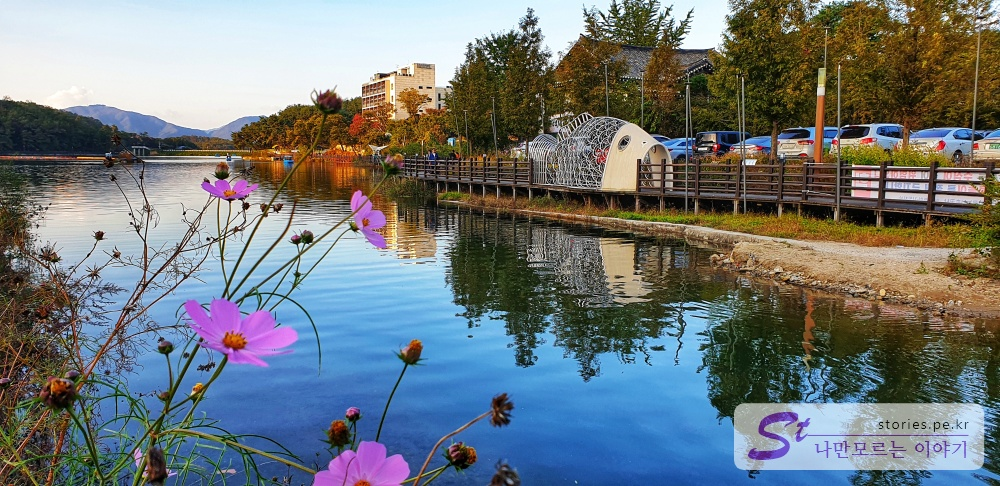  
제가 소개할 곳은 광릉수목원과 가까이에 있는 **고모 저수지 둘레길**입니다. **주말에 자연을 즐기며 걷고 싶은 곳**을 찾으신다면 고모저수지를 방문해 보시기를 추천합니다. 저희는 주말에 식사를 하고 소화도 시킬겸 걷는 곳이기도 합니다.
고모저수지 둘레길을 걷다보면 짧지만 여러가지의 가을을 만날 수 있습니다.

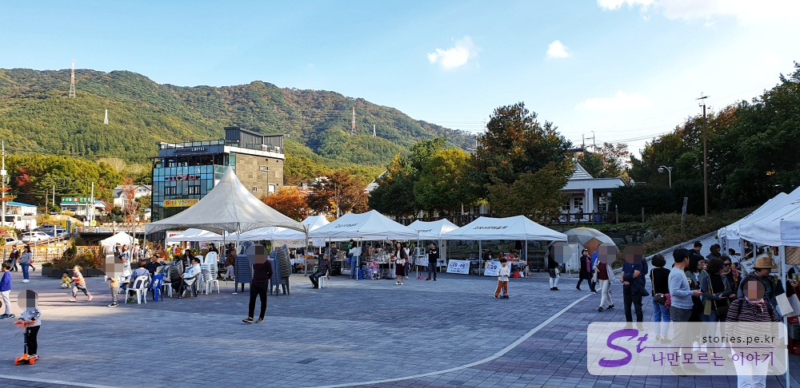  
고모저수지의 둘레길을 돌기위한 시작지점인 광장입니다. 오늘은 지역의 소상공인의 축제가 있는지 사람들이 꽤 있는 편이였습니다.

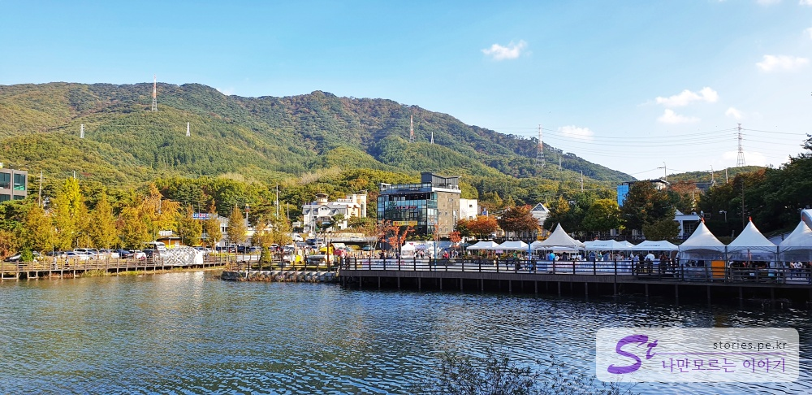  
광장의 왼쪽, 또는 오른쪽으로 시작해서 저수지를 한바퀴 돌아 반대의 방향으로 돌아오는 코스입니다.

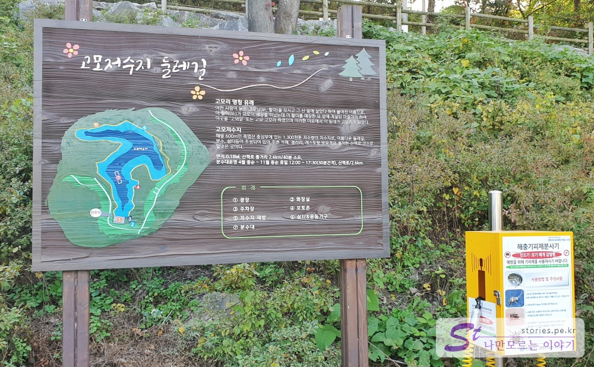  
안내 표지판은 오른쪽으로 도는 것으로 표시가 되어있으나 우리는 처음부터 왼쪽으로 돌아서 인지 그쪽이 더 편하고 정감이 갑니다.  
왼쪽으로 광장끝에 안내 표지판과 해충 기피제 분사기가 있습니다.

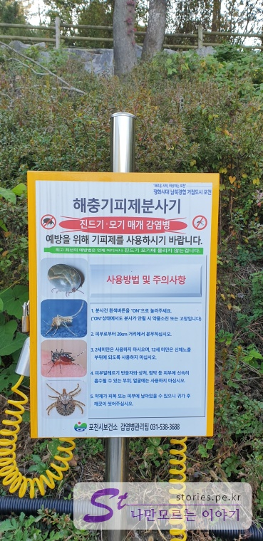  
둘레길을 시작하기 전에 기피제 분사기를 한번 뿌려주고 가는 것이 좋겠지요? 분무기는 가능하면 옷에 뿌려주고 피부에는 20cm이상 거리에서 분사해 주시면 됩니다.

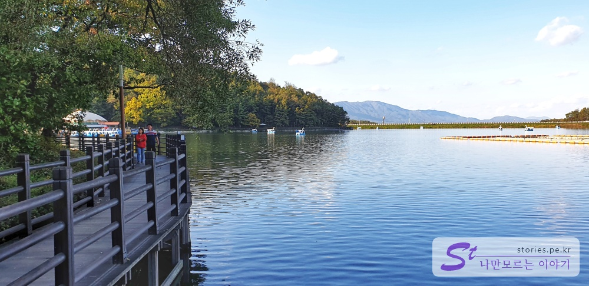  
둘레길은 기본적으로 데크로 되어 있습니다. 길을 걸으면서 대화하기 같이 걷고 있느사람과 대화하기 좋습니다.

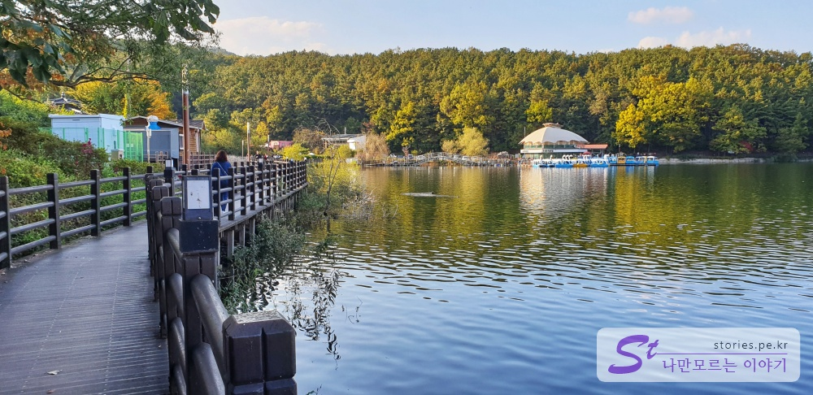  
길을 걷다보면 저 멀리 수상 휴게실이 보입니다. 수상휴게실에서 쉴 수도 있지만 오리배를 탈 수도 있습니다.

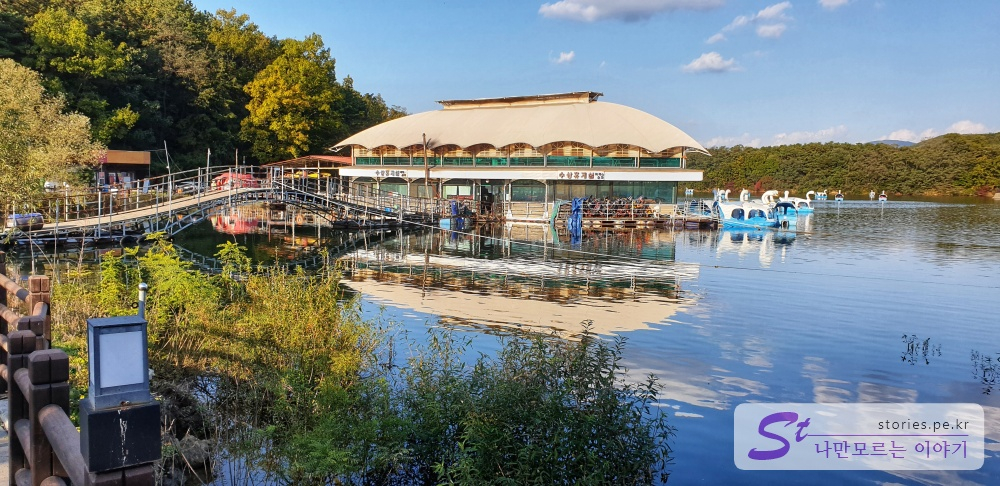  
오리배 선착장이 있습니다. 오리배 뿐만 아니라 보트도 탈 수 있습니다.

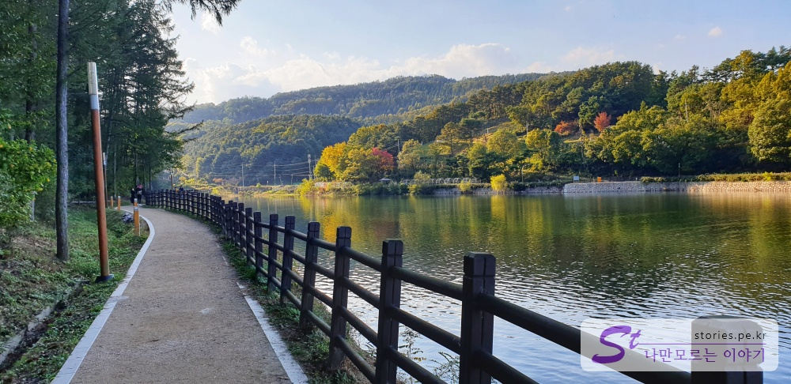  
수상휴게소를 지나면 바로 데크에서 벗어나 뚝방 흙길을 걸을 수 있습니다.

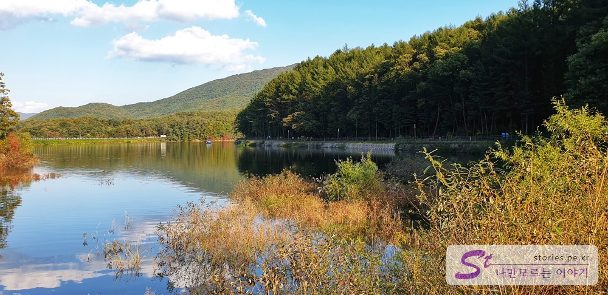  
이제 둘레길의 반바퀴를 돌았습니다.

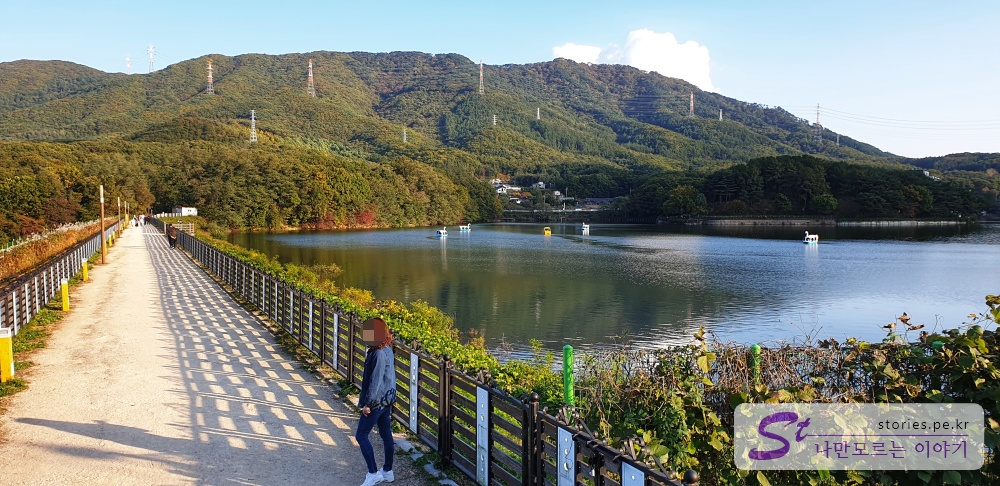  
조금 더 걷다보면 저수지를 막고 있는 뚝방길을 걸을 수 있습니다. 더운 여름에는 햇빛을 피할 길이 없는 곳이기도 하지만 넓게 탁트여 있어 호연지기를 키울 수 있는 곳입니다. ㅎㅎ

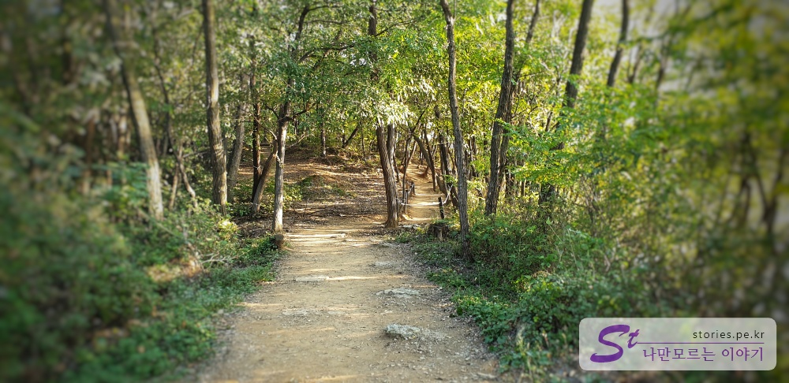  
뚝방길을 지나면 바로 솦속길을 걸을 수 있습니다. 별로 길지 않은 둘레 길이지만 다양한 형태의 길이 있어 지루하지 않습니다.

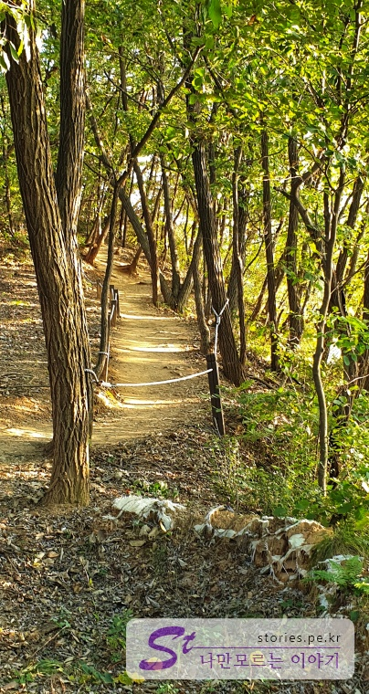  
약간의 오르막과 내리막이 있는 솦속길입니다.

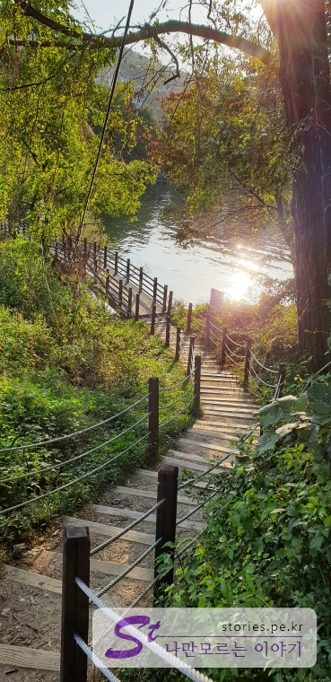  
잠깐의 숲속길을 지나면 다시 저수지로 내려오는 길이 있습니다. 이 길도 데크로 되어 있습니다.

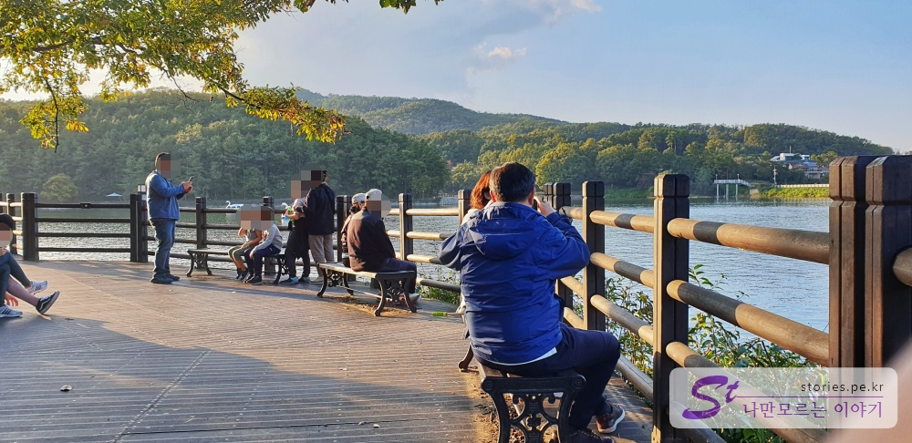  
저수지 위로 사람이 잠시 쉬어 갈 수 있는 넓은 데크존이 있습니다. 힘들때쯤 되었을때 쉬어 갈 수 있습니다.

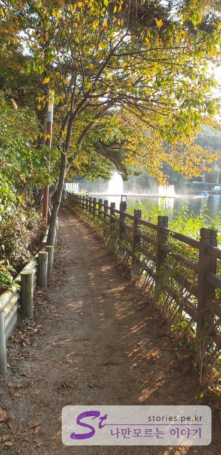  
좀 더 걷다보면 분수가 보이는 좁은 길을 걸을 수 있습니다.

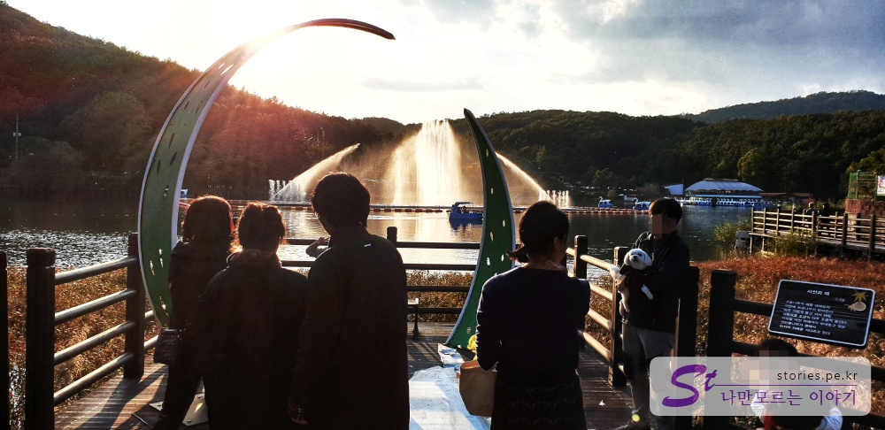  
분수를 배경으로 사진을 찍을 수 있는 포토존이 있습니다. 거의 해가 질 무렵이라 사진이 역광으로 찍히네요.

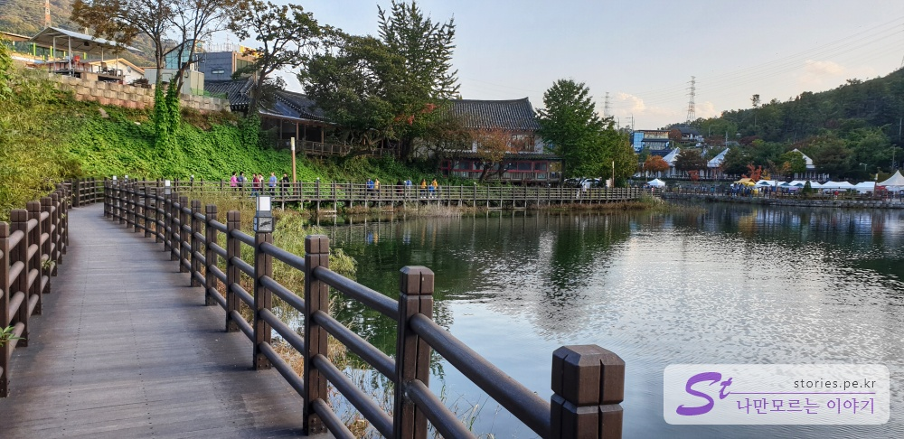  
이제 마지막 구간입니다. 저멀리 광장이 보입니다.

이 둘레길을 한바퀴 도는데 대략 30분에서 1시간정도 걸립니다.

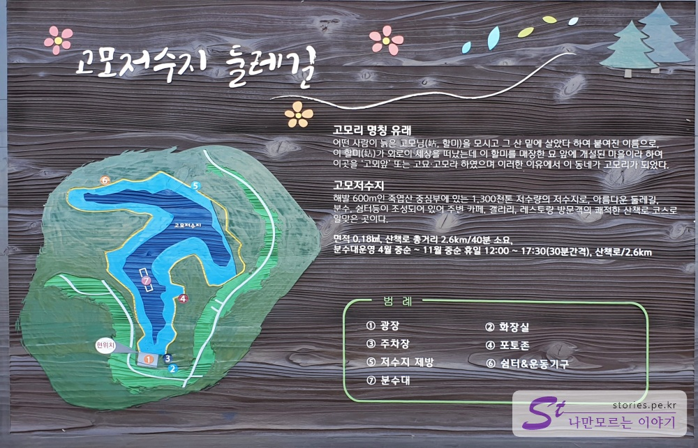  
고모리의 명칭유래와 고모저수지의정보가 있습니다.

## 여행지 정보

- 주소 : 경기 포천시 소흘읍 고모리 678-1

## 주차정보

주차장은 있긴한데 크기가 좀 작습니다.

## 인근맛집

인근이 고모리 카페거리라서 식당이나 카페들이 주위에 많이 있습니다.
저희는 좀 떨어져 있기는 하지만 간판없는 맛집으로 유명한 광릉불고기집을 자주갑니다.
아래 이전에 포스팅한 글을 참고하세요.

> [남양주의 간판없는 집으로 유명한 광릉불고기 본점 방문기](https://stories.pe.kr/275)
