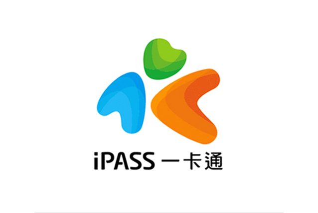
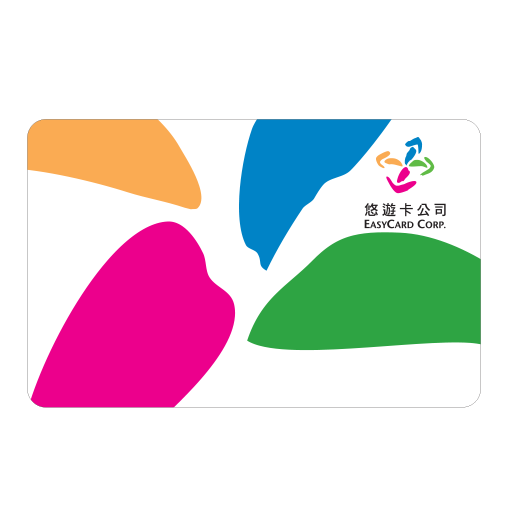
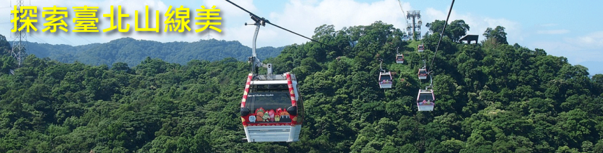
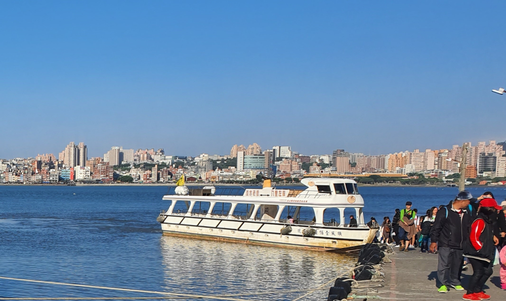
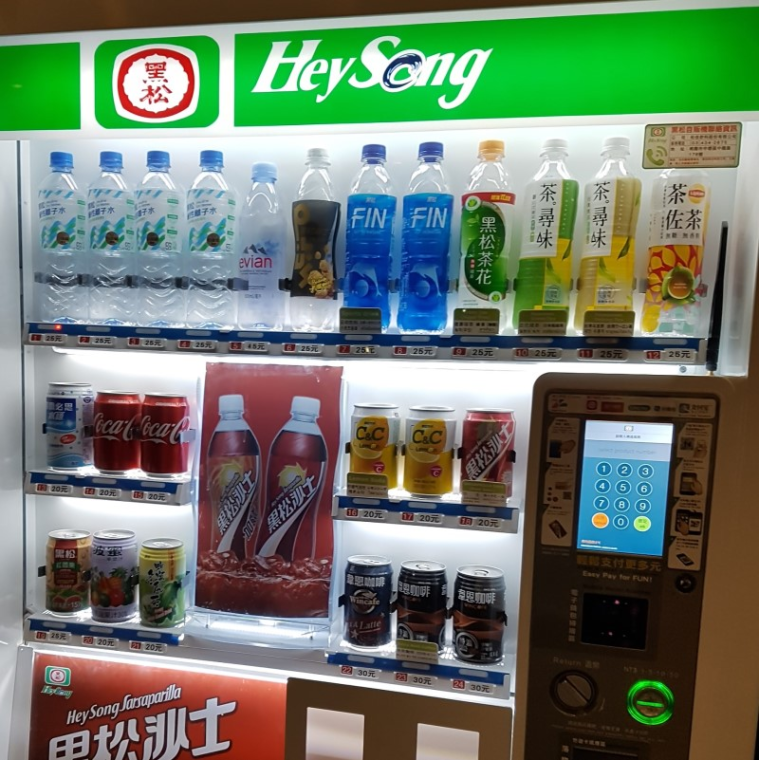

올해 기대를 품고 첫 대만 여행을 다녀왔습니다. 대만의 북부에 위치한 **타이베이**, 중부에 위치한 **타이중** 남부에 위치한 **타이난**, **가오슝** 중에 고민끝에 타이베이를 선택했습니다. 
한달간 알차게 준비하여 다녀왔지만 첫경험이라 놓치게 된 뼈아픈 실책들을 공유하려고 합니다.  
첫번째는 교통카드입니다.   

## 아이패스와 이지카드  
우리나라에도 **티머니**가 있고 **이비카드**가 있는것 처럼 대만의 대표적인 교통카드는 **아이패스**와 **이지카드**가 있습니다. 

| 명칭  | 아이패스                   | 이지카드                                    |
| --- | ---------------------- | --------------------------------------- |
| 현지어 | 이카통                    | 요요카                                     |
| 출생지 | 남부 가오슝                 | 북부 타이베이                                 |
| 로고  |  |  |

아이패스(i-pass)는 현지인들은 이카통이라고 부르고 이지카드는 요요카라고 부릅니다.  
아이패스는 남부인 가오슝에서 태어나 가오슝의 교통카드로 채택되면서 세력을 넓혀 왔고 이지카드는 북부인 타이베이에서 태어나 타이베이에서 세력을 넓혀온 카드입니다. 
원래는 각각의 지방에서 별도로 사용 되었으나 2015년도에 타이베이와 가오슝이 손을 잡으면서 2개의 카드 모두가 대만 전국에서 사용되게 되었습니다.    
저는 아주 쉽게 이 이야기만 듣고 그냥 아이패스를 구매하게되었습니다.  아주 큰 실수 였지요.....   

## 타이베이에서 아이패스 사용이 불편했던 점  
제가 타이베이에서 아이패스를 사용하면서 이지카드와 비교하여 불편했던 점을 위주로 기록하는 것이므로 주관적인 사항임을 먼저 밝힙니다.   

일단 기본 기능인 지하철과 버스는 두개의 카드 모두 문제 없이 사용이 가능했습니다. 만약 난 교통카드를 교통카드로만 사용 하겠어!! 라고 생각한다면 아무문제 없이 아이패스를 사용할 수 있습니다.  

그러나 아이패스는....   

### 마오콩곤돌라를 이용할 수 없습니다.   

마오콩곤돌돌라는 아이패스 사용이 불가능 합니다. 이지카드만 사용할 수 있습니다. 이지카드가 있었다면 따로 표를 구매할 필요도 없이 바로 버스 타 듯이 타고 올라갈 수 있었을 텐데....아쉬웠습니다.  

### 단수이에서 빠리로 넘어가는 배를 이용할 수 없습니다.    

단수이 여행을 할 때 꼭 들러야 하는 곳 중 하나가 패리선을 타고 바다 건너 단수이 빠리를 관광 하는 것입니다. 이때 이지카드는 패리선 교통카드로 사용이 가능하나 아이패스는 불가능 합니다. 표사는 곳에서 줄을 서서 표를 사고 배를 타기위해 또 줄을 서야 합니다. 불편합니다. 하지만 이지카드가 있다면 바로 배를 타기전 이지카드로 버스 타듯이 찍고 타면 됩니다. 

### 단수이역에 있는 코인락커를 이용할 수 없습니다.  
관광객이라면 공감하겠지만 쓸때없는 짐을 들고 다닐일이 많이 있습니다. 이렇때 코인락커는 한줄기 빛과도 같은 서비스 입니다. 이떄도 아이패스는 무용지물입니다. 당연히  이지카드는 사용이 가능하구요. 단수이역에 있는 코인락커뿐만 아니라 타오위안 공항에 있는 코인라커도 이지카드만 인식을 합니다.  

### 공항에서 잔돈 처리할 때 자판기를 이용할 수 없습니다.   

가장 짜증났던 것은 공항이였습니다. 이제 고국으로 돌아가기 전 내 아이패스에 있는 잔돈을 영혼까지 끌어모아 다 써버리고 비행기를 타야 하는데... 쓸곳이 없습니다. 하나도 없어요. 있으면 누가 댓글 좀 남겨줘 봐요.  
기차가 되었든 버스가 되었든 공항까지 오고 나면 나머지는 소비할 수가 없습니다.  
이지카드 같은 경우는 코인라커도 사용이 가능하고 편의점에서 사용이 가능하고 무인 음료나 과자 자판기도 사용이 가능해서 최대한 사용하고 갈 수 있는데 아이패스(이카통)는 불가능합니다.  

## 결론  
아이패스가 타이베이와 협약하여 대만 전국에서 사용할 수 있다고 하지만 이것은 매인 교통에 대한 부분인 것 같습니다. 
기타 사용처나 매인 교통이 아닌 소규모로 운영하는 배나 서비스, 교통편 같은 경우는 사용이 불가한 곳이 아직도 많이 있는것 같습니다.  

> 그래서 타이베이를 가려면 아이패스를 사지말고, 꼭!!! **이지카드(요요카)**를 사용하기를 강추 합니다. 
> 이지카드는 관광하기에 너무 편합니다. 
 

