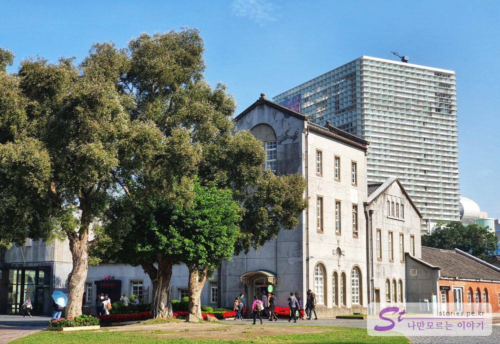
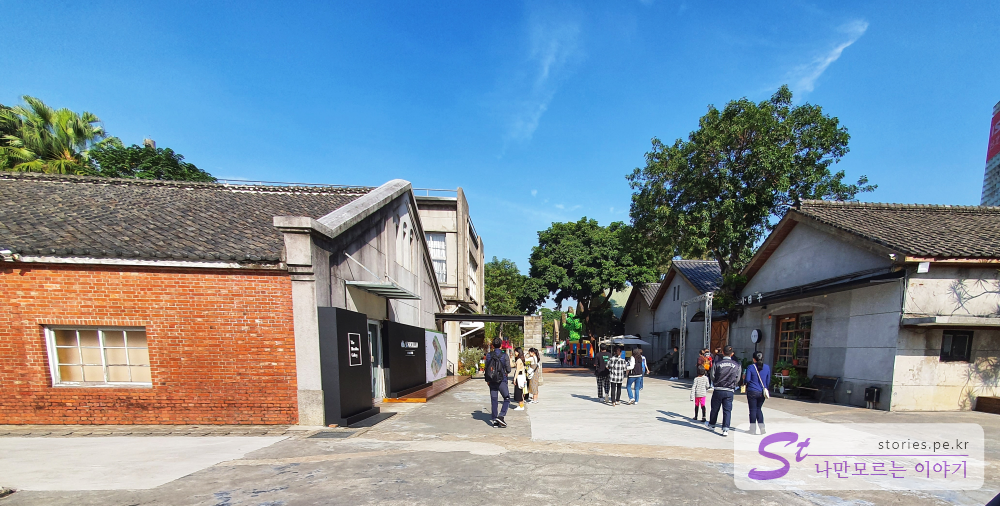
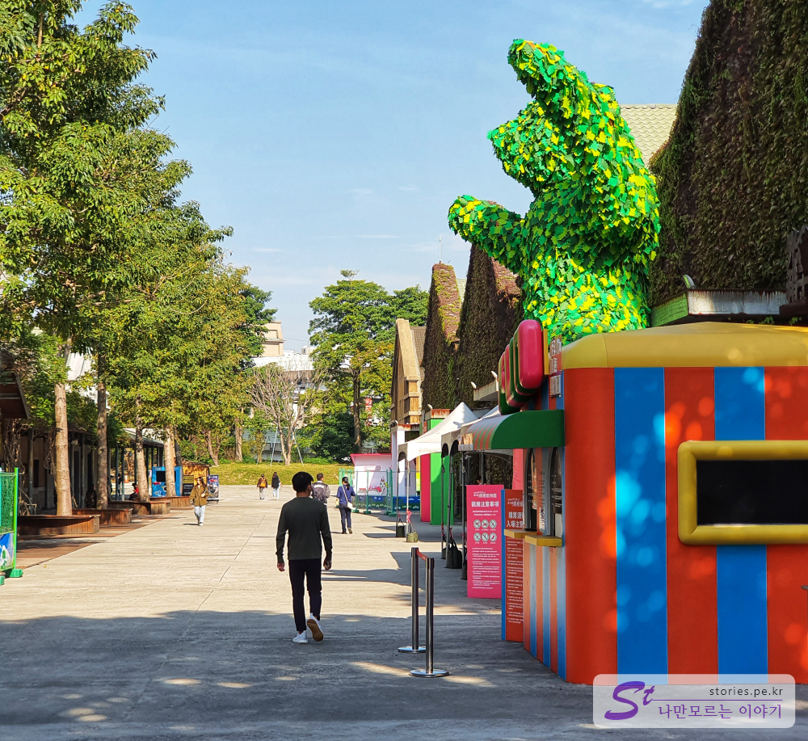
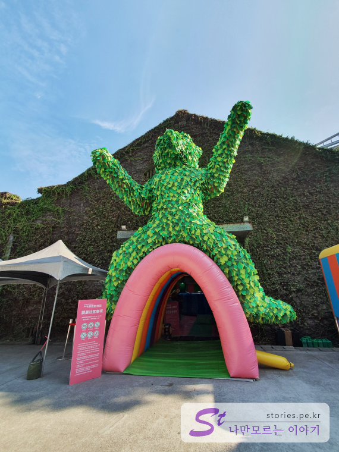
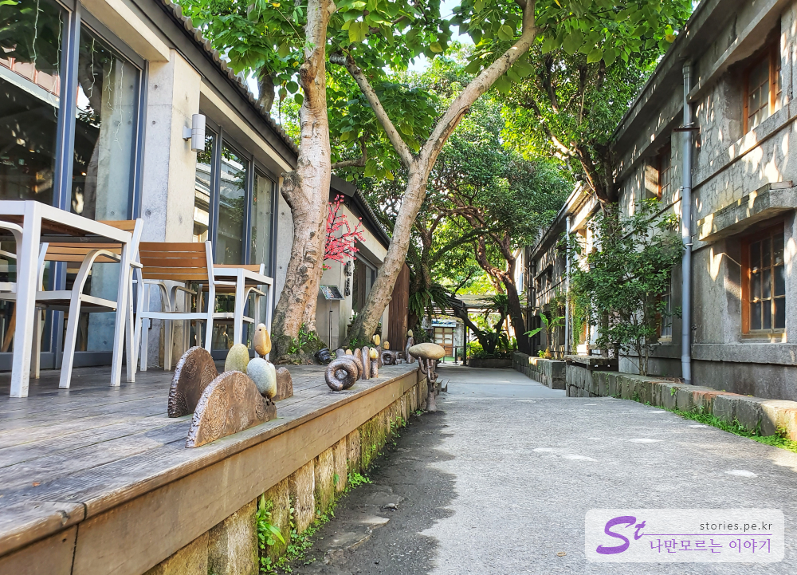
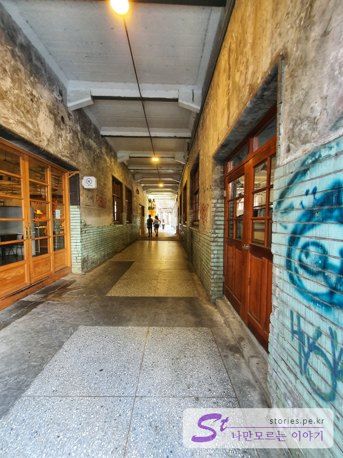
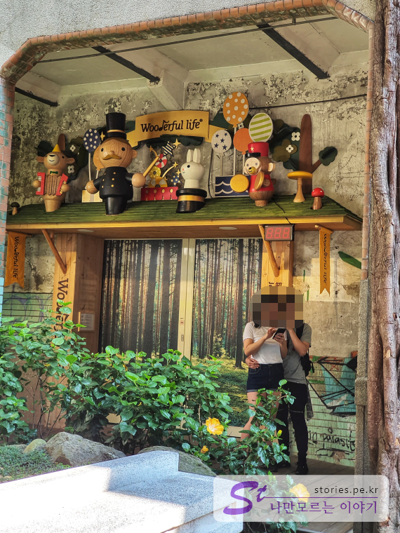
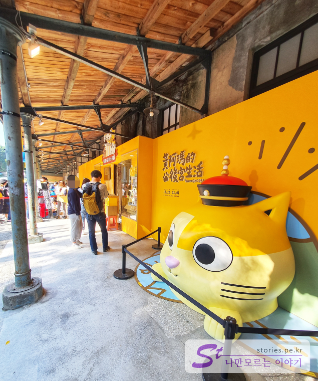
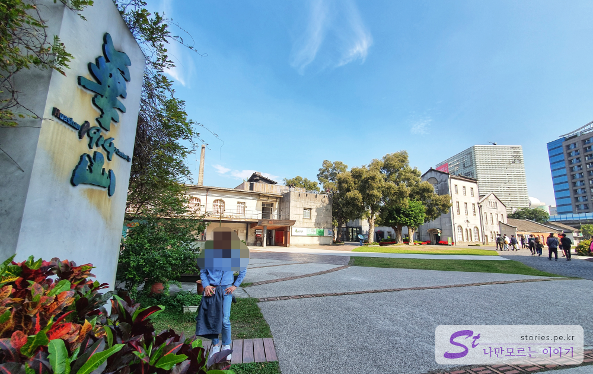

2020년 신년을 맞이해서 대만 타이베이를 다녀왔습니다. 저가항공을 타고 다녀왔기 때문에 새벽에 타오위안 공항에 떨어졌습니다. 다행히 24시간 운행하는 1819번 국광버스가 있어서 타이베이역으로 왔습니다. 그래서 타이베이 메인역에 도착한 시간이 새벽 5시였습니다. ㅎㅎㅎㅎ

보통 타이베이는 메인역 부근이나 시먼(서쪽)역 쪽에 숙박을 많이 할 텐데 새벽에 도착하는 사람들을 위해서 많은 숙소가 24시간 체크인을 받습니다. 저희가 묶었던 **비아호텔 타이베이 스테이션**도 24시간 체크인을 해 주었습니다.
체크인을 한다고 해서 새벽에 방에 들어갈 수 있는 것은 아니고 원래 체크인 시간인 오후2시 ~ 3시에나 들어갈 수 있습니다. 다만 짐은 그 시간에 호텔에서 맡아 주기 때문에 여행자는 짐을 맡겨놓고 아침부터 여행의 일정을 시작할 수 있습니다.  
저희도 새벽 5시에 체크인을 하고 비아호텔 지하에 있는 안마의자(2대 있음)에서 3시간 동안 안마를 받으면서 잠을 잤습니다.  
그렇게 약간의 충전을 하고 8시에 화산1914 창의문화원구를 첫 여행지로 다녀왔습니다.

## 아침에 방문한 화산1914 창의문화원구

여행 전부터 인터넷의 여러군데에서 추천받은 여행지 입니다. 여자들이 좋아하는 아기자기하고 다양한 볼꺼리와 살꺼리가 많다고 해서 방문하게 되었습니다. 집사람 좋으라고...

  
느낌은 강화도에 있는 **조양방직**같은 느낌이지만 구성은 조양방직보다는 좀 못한 편입니다. 여기도 옛날 양조장을 리모델링해서 문화지구로 개발을 한 곳이라고 합니다. 거리, 제품 등등 대만 레트로 느낌이 많이 나는 곳입니다.

  
너무 아침에 방문해서 그런지 아직 사람도 별로 없고 한산한 느낌이였습니다. 아직 문을 열지 않은 곳이 많았습니다. 대부분 가게가 **11시**쯤 오픈 하는 것 같았습니다.

  
한산헤서 그런지 사진찍기에는 좋았습니다. 사진찍을 만한 곳이 곳곳에 많이 있습니다. 대만의 날씨가 더워서 그런지 대부분의 건물에 식물들을 많이 키우는것 갔았습니다.

  
유료이긴 하지만 실내에 아주 넓고 큰 풍선 놀이터가 있습니다. 입구도 아이들이 좋아할 많안 캐릭터들도 많구요. 연결되어 있는 Gift샵도 퀄리티는 괜찬았습니다.

  
아주 커다란 녹색 곰돌이가 입구를 지키고 있습니다. 아이들이 너무 좋아할 것 같은데 아침이라 그런지 실내에는 아이들이 별로 없었습니다.

  
옆의 골목으로 들어서면 그늘이 드려져있어서 사진찍기에 분위기 좋은 골목이 보입니다. 길을 가다가 잠시 쉬어 갈 수 있는 의자도 있습니다.

  
조금만 더 지나가면 건물사이로 난 실내 골목길을 만날 수 있습니다. 아직 오픈 전이지만 양옆으로 소품가게와 찻집들이 있습니다.

  
그 골목 끝 부분에 아이들이 좋아할 만한 목각인형이 장식되어 있는 커다란 소품샵이 나옵니다. 배경으로 사진찍기도 너무 좋고 그 앞에 있는 조그만 공원에서 쉬기에도 너무 좋습니다.

  
골목을 바로 벗어나서 오른쪽으로 돌면 유명한 고양이카페가 있습니다. 아직 오픈전인데도 사람들이 많이 줄을 서서 오픈하기를 기다리고 있었습니다. 유명한가봐요.

  
이렇게 1시간 30분 정도 구경을 하고 도로변쪽에 있는 표지판을 보고난 다음 융캉제 쪽으로 이동했습니다.  
이곳에서 융캉제 까지는 걸어서 20분, 지하철로 10분정도 거리에 있습니다.

## 입장시간

- 시작시간 : 09:30 (보통 카페나 식당, 가게들이 11시부터 열어요)
- 마감시간 : 20:00

## 여행지 정보

- 주소 : No. 1, Section 1, Bade Road, Zhongzheng District, Taipei City, 대만 100
- 연락처 : +886 2 2358 1914
- URL : huashan1914.com

https://goo.gl/maps/mCE22feBdZWTMoKg8
