타이베이에서 조금 떨어져 있는 마오콩을 오르기 위해 타이베이 시립 동물원쪽으로 향했습니다. 동물원 바로 옆에 마오콩으로 오를 수 있는 곤돌라 탑승장이 있습니다.  
마오콩곤돌라는 첫 탑승장인 타이베이동물원역에서 마지막 마오콩역 도착 할 때까지 대략 30분정도 걸립니다.  
마오콩은 고지대로 차밭으로 유명해서 다양한 찾집들이 많이 있습니다. 

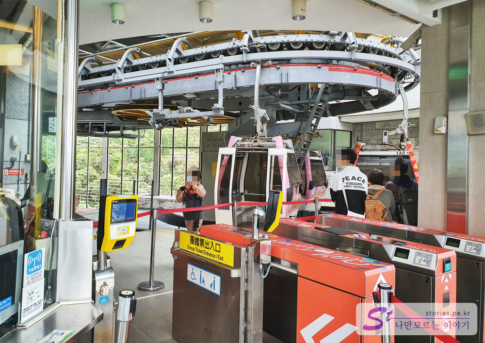  
곤돌라는 바닥이 유리로 된 크리스탈 곤돌라가 있고 그렇지 않은 보통의 곤돌라가 있습니다. 바닥이 유리로 된 크리스탈 곤돌라는 보통의 곤돌라가 5대~10대쯤 지나간 다음 오기 때문에 많이 기달려야 합니다. 보통의 곤돌라를 타는 줄과 바닥이 투명한 크리스탈곤돌라를 타는 줄이 따로 있습니다. 

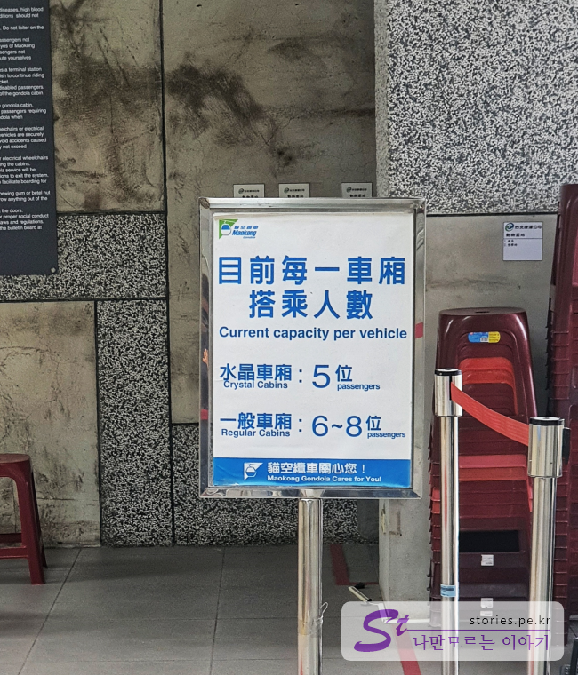  
일반 곤돌라는 정원이 6~8명이고 크리스탈 곤돌라는 정원이 5명이라고 합니다. 

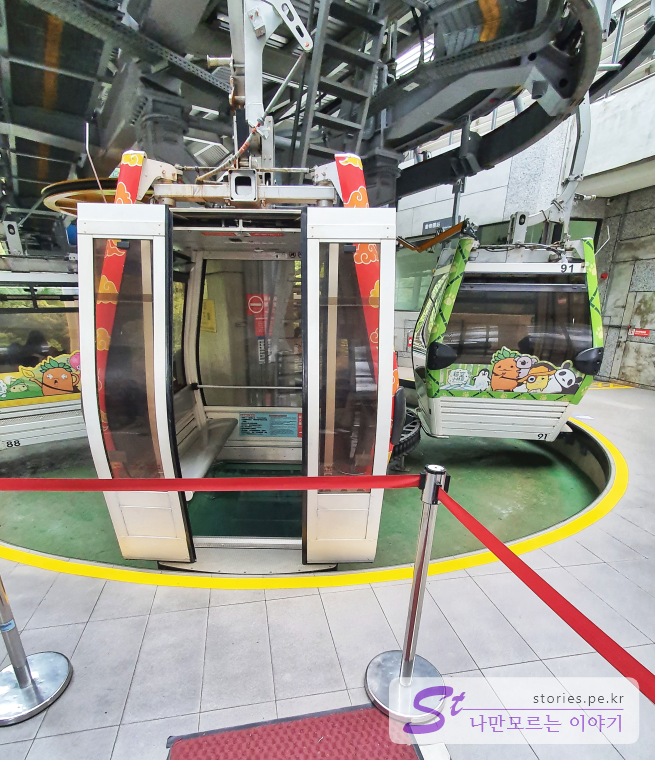  
저는 크리스탈 곤돌라를 탔는데 만약 줄이 길다면 그냥 보통 곤돌라를 타는 것이 좋습니다. 크리스탈곤돌라를 탔는데 바닥을 보는 것이 별 감흥이 없어요 무섭거나 설레지도 않고, 볼것도 없고, 잘 보게되지도 않아요. 왜냐하면 초록색 나무밖에는 없거든요.  그냥 보통의 곤돌라를 타는것과 별 차이 없습니다. 

  
마오콩돈돌라를 타면 총 4개의 역을 정차하게 되는데 보통 타이베이 동물원역에서 타면 마오콩역까지 가기 때문에 비용은 **120NTD**라고 보시면 됩니다. **이지카드**를 사용하면 평일에는 **20NTD**가 할인이 됩니다.  

> 참고로 **아이패스(이카통)은 사용할 수 없습니다.** 저는 아이패스를 사서 못써먹었습니다. ㅠㅠ

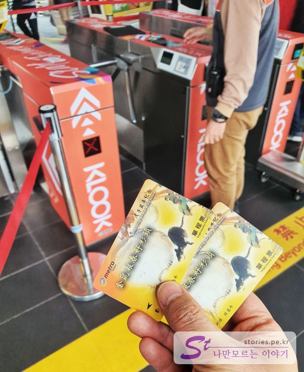  
저는 아이패스를 준비했었는데 사용을 못해서 1층에서 할인없이 **120NTD** 돈 다 주고 입장권을 구입했습니다. 이것도 왕복이 아니고 편도권입니다.  

인터넷에서 마오콩곤돌라 바우처를 구매하려고 알아봤는데 이상하게 왕복권이 없고 편도권 2개를 판매하는 것 밖에 없어서 구입을 하지 않았습니다. 이것에 대한 비밀은 후반부에 말씀드리겠습니다.

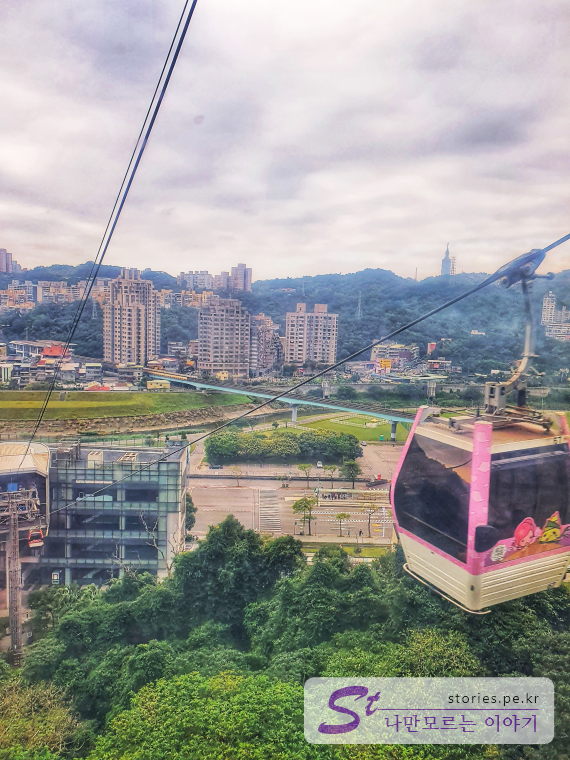  
이제 출발을 했습니다. 마오콩역까지 대략 30분정도 걸린다고 하니 상당히 오래 올라값니다. 불행히도 현지인 연인과 같이 타서 말도 안되는 어색한 손짓 발짓하면서 의사소통을 좀 했습니다. 

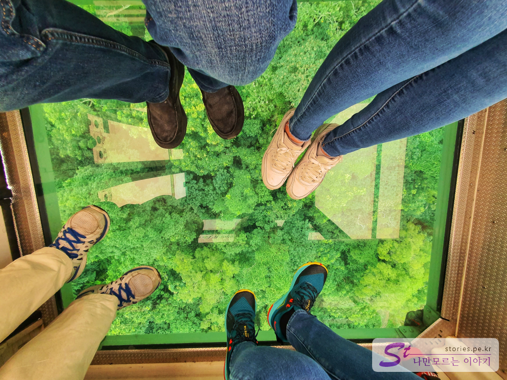  
크리스탈 곤돌라의 바닥유리입니다. 계속 이런 초록숲만 보이기 때문에 초반에 좀 보다가 흥미를 잃게됩니다. 저희 발 2짝과 대만 커플 발 2짝입니다.  

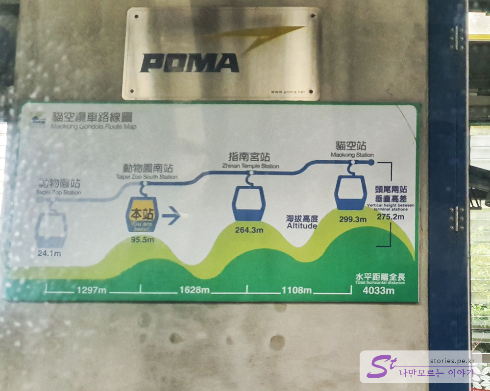  
4개의 정거장 중 첫번쨰 정거장인 타이베이동물원 남쪽 역입니다. 나머지 1개의 역을 지나야 마오콩역에 도착을 합니다.  

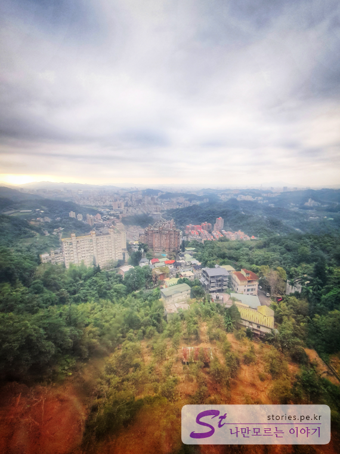  
경치가 너무 멋집니다. 바닥보다는 옆의 창문을 더 많이 보게 되는 풍경입니다.  

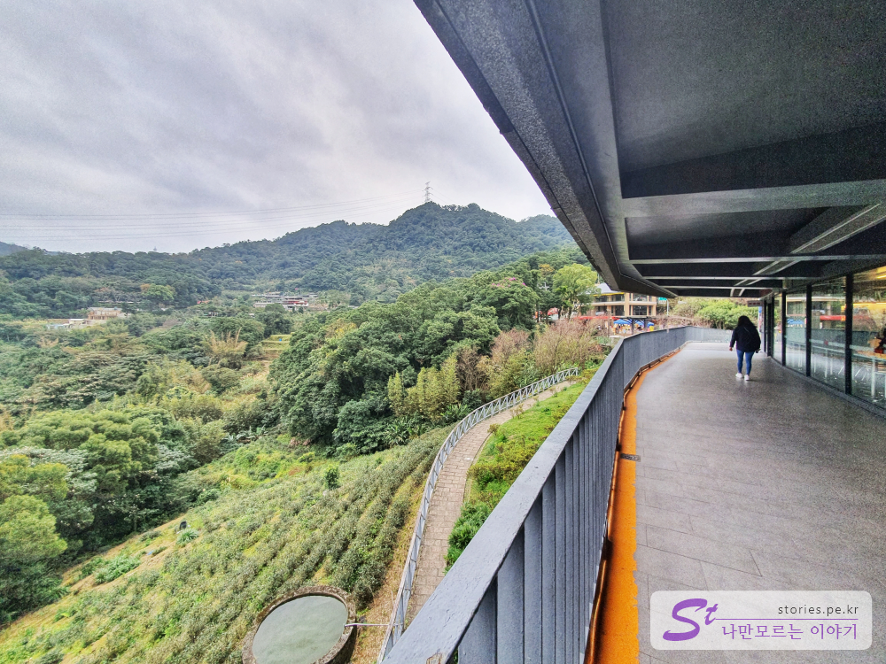   
드디어 마오콩역에 도착했습니다. 이런 길을 따라가다 보면 오른쪽에 편의점이 있습니다. 추워서 먼저 들리게 되더군요. 저희는 여기에서 신라면 사발면을 하나 사먹었습니다.  한국과 똑같은 브랜드인데 맛은 조금 현지화 한것 같았습니다. 덜 맵더라구요.  

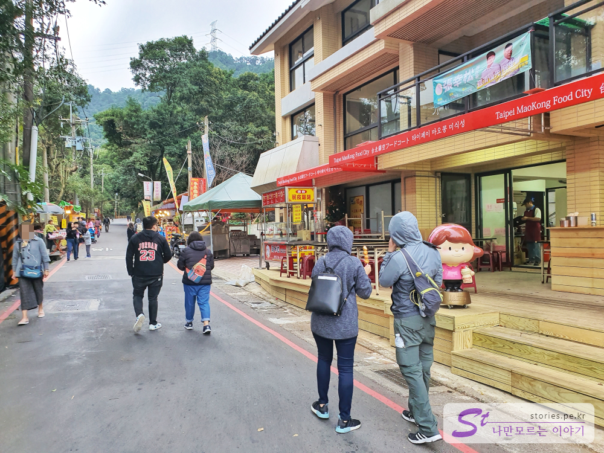  
마오콩역에서 위로 걸어 올라가는 길입니다. 저희는 역 앞쪽 방향으로만 가서 윗쪽은 요기까지만 가봤습니다. 여러가지 먹을 음식들을 판매하고 있습니다.   

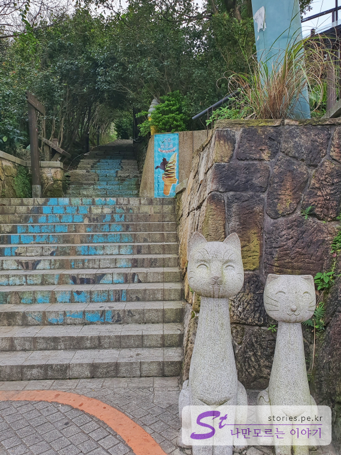  
고양이 동상이 있는 길입니다.  

 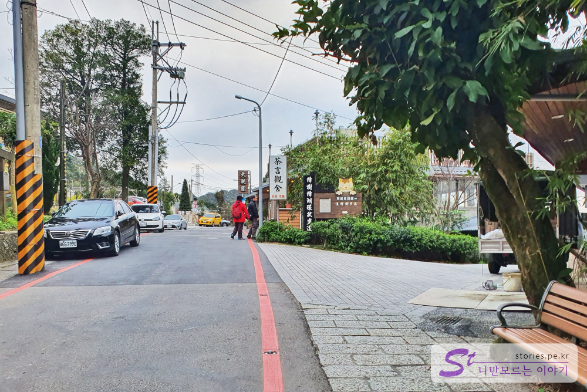  
 저희는 역 앞쪽으로 나 있는 길로 걸어갔습니다. 한적한 시골마을의 길과 절묘한 위치에 있는 카페들이 있습니다.  

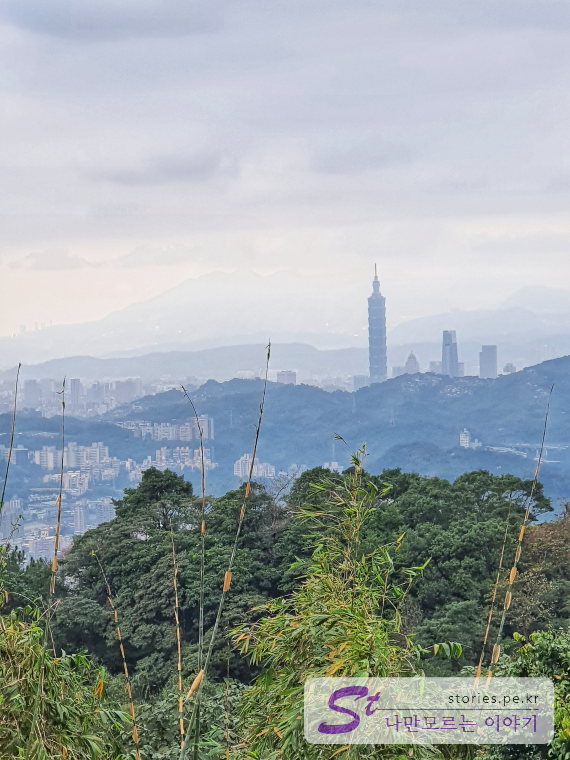  
역시나 높은 곳은 풍경이 멋집니다. 조그만 주차장에서 보는 풍경입니다. 저 멀리 타이베이 101이 보입니다.  

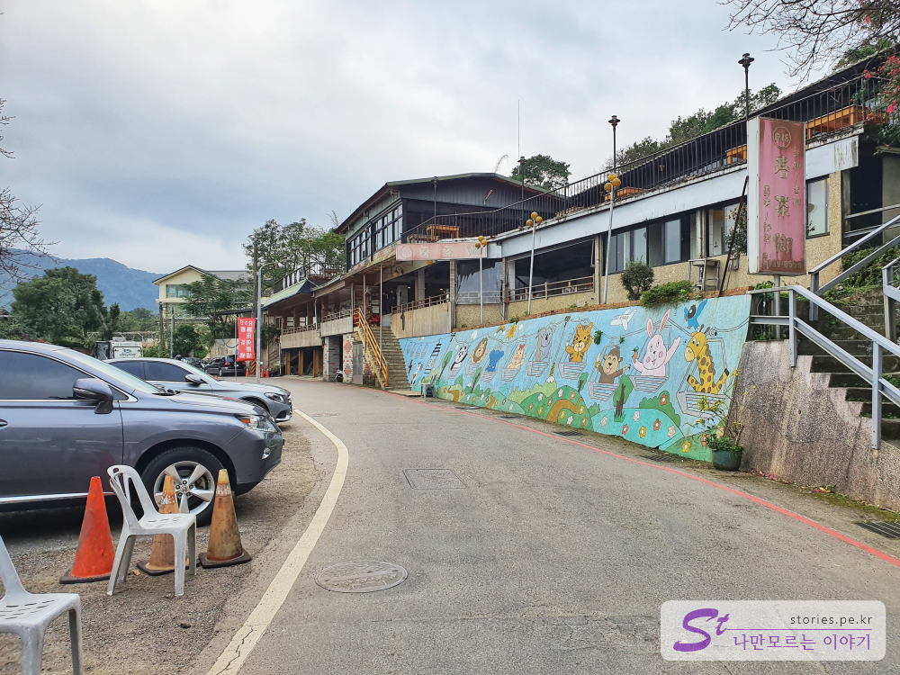   
저희는 들어가 보지는 안았지만 딱봐도 저기에 앉아서 풍경을 보며 녹차 한잔 마시면 좋을 것 같습니다.  

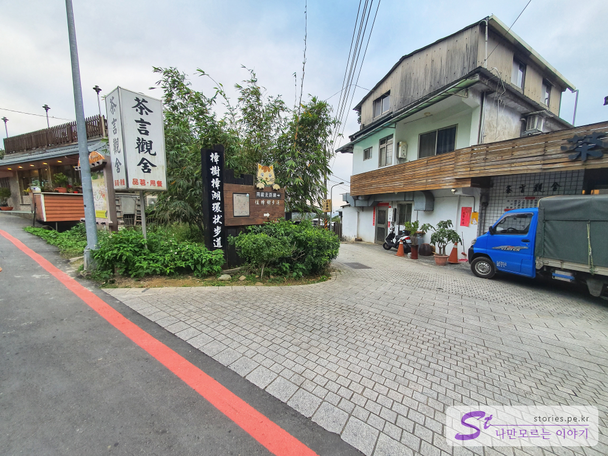  
위의 사진을 잘 기억하시고 이런 이정표가 나오면 오른쪽 길로 들어서세요. 또하나의 구경거리를 만나실 수 있습니다.  

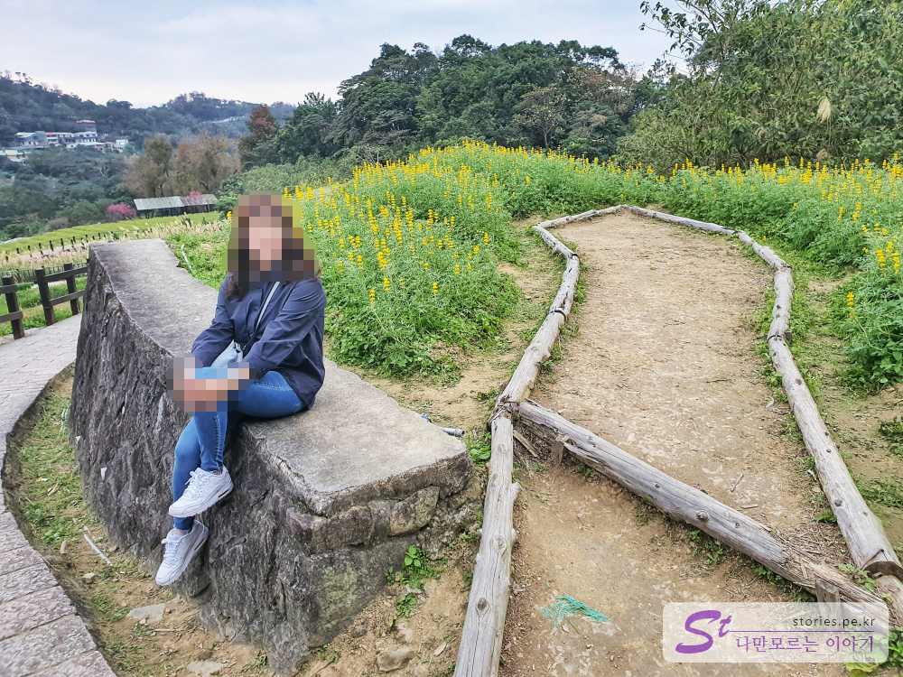  
대만도 겨울일텐데 날씨가 따듯해서 그런지 꽃이 피어 있습니다. 

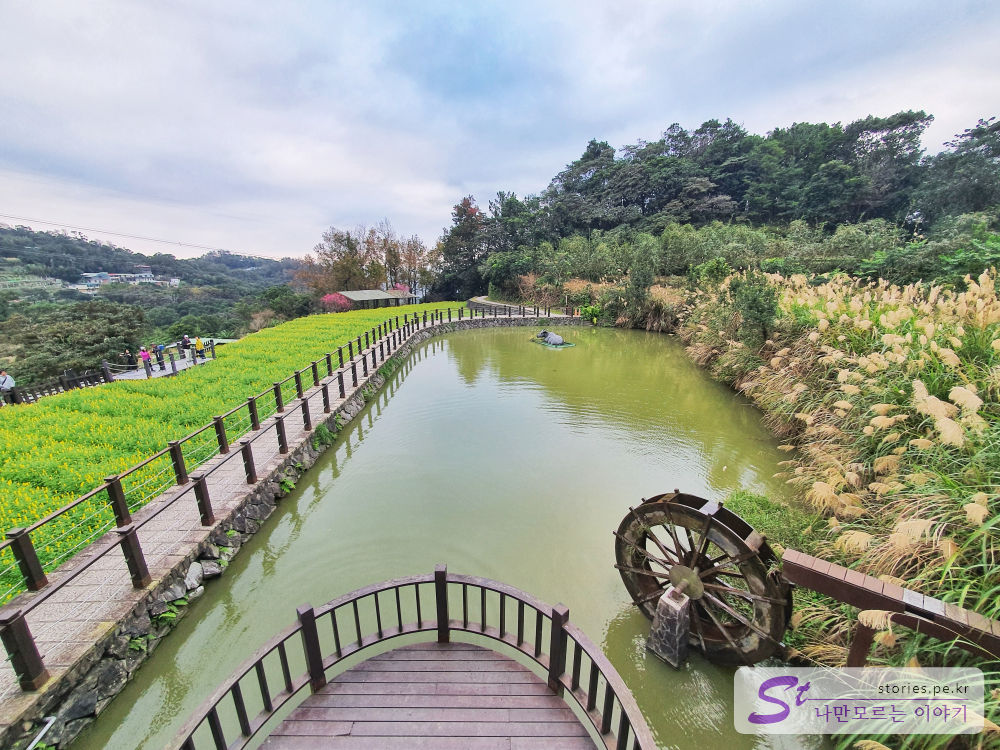   
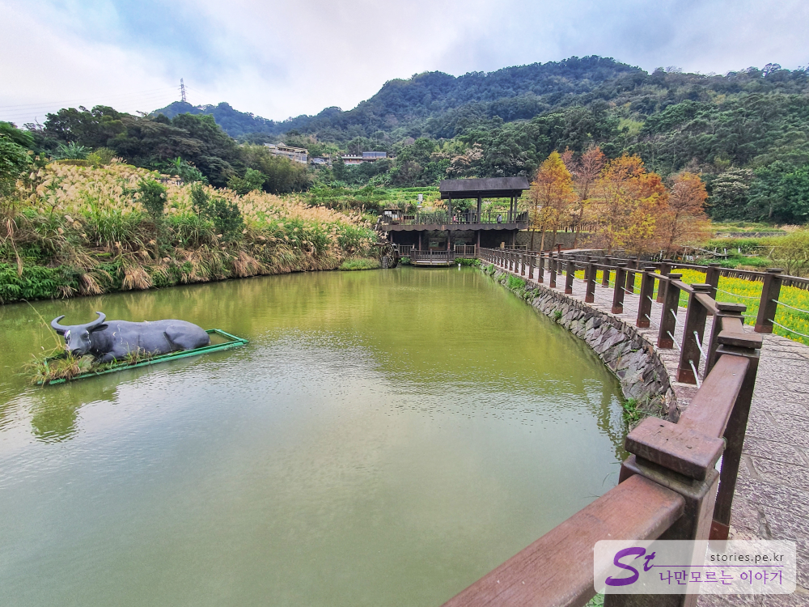    
쉴 수 있는 정자와 저수지를 만날 수 있습니다. 아마 차밭에 물을 대기 위한 저수지가 아닐까 합니다. 

이렇게 구경을 하고 다시 마오콩역으로 나왔습니다. 
이제 마오콩에서 다시 동물원역으로 나와야 하는데, 여기에는 몇가지 선택지가 있습니다. 

1. 다시 곤돌라를 타고 내려가기
2. 마을버스를 타고 내려가기
3. 택시를 타고 내려가기 

**곤돌라의 장점**은 가장 빨리 내려간다는 것이지만 단점은 일단 가격이 제일 비쌉니다. 
**마을버스의 장점**은 가격이 매우 저렴하다는 것이지만 단점은 많이 기달려야 합니다. 
**택시의 장점**은 빨리 내려가면서 가격도 적당하다는 것이지만 단점은 택시를 꽉채워야 하기 때문에 합승손님을 기달려야 합니다. 

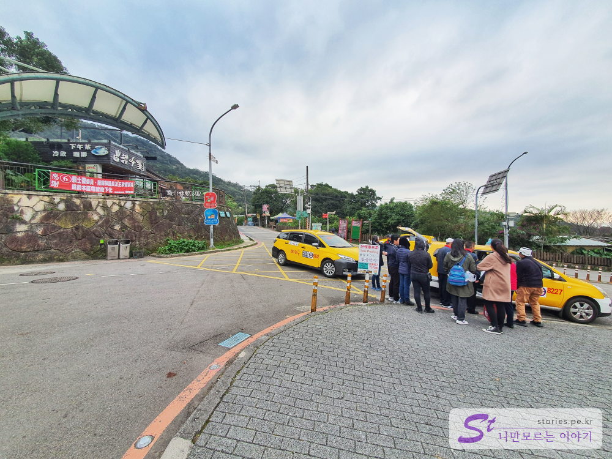
저희는 택시를 타고 내려갔습니다. 택시는 마오콩 역 바로 앞에 있습니다. 가격은 인당 **75NTD** 로 통일이 되어 있고 내리는 역은 케이블카를 탔던 타이베이 시립 동물원역입니다.  

## 입장시간  
- 시작시간 : 09:00 
- 마감시간 : 21:00  
- 휴무일 :  월요일

## 여행지 정보  
- 주소 : No. 8, Section 2, Xinguang Road, Wenshan District, Taipei City, 대만 116  
- 연락처 :   
- URL : https://english.gondola.taipei   
[지도] https://goo.gl/maps/Ua2qQ73BXfJcjWW8A 

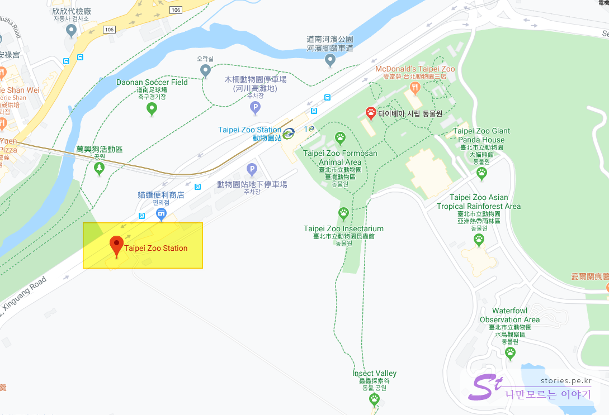  

## 기타사항  
12월~2월사이에 마오콩을 방문할 예정이라면 **경량패딩이나 바람막이는 꼭 챙겨가세요**. 저희는 추워서 얼마나 후회를 했던지...
