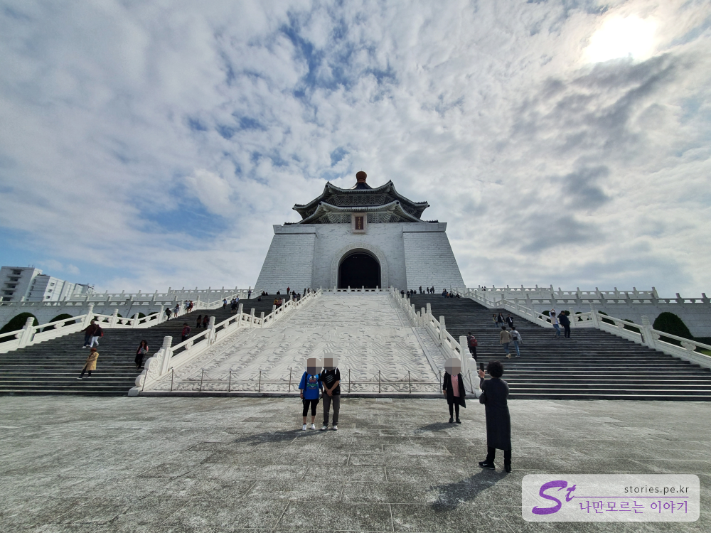
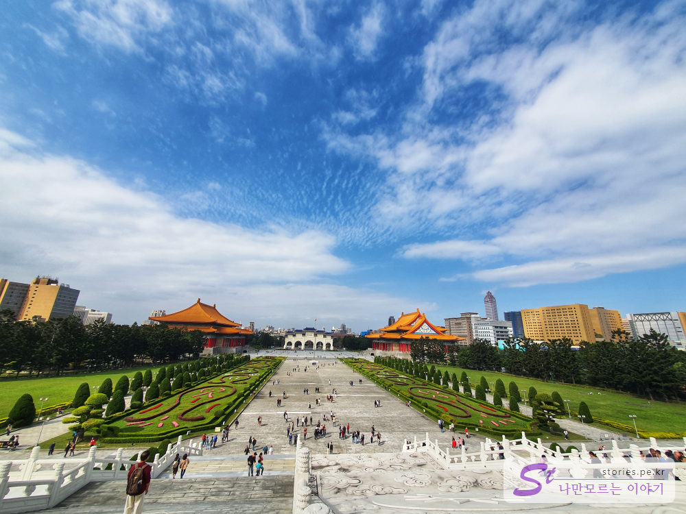
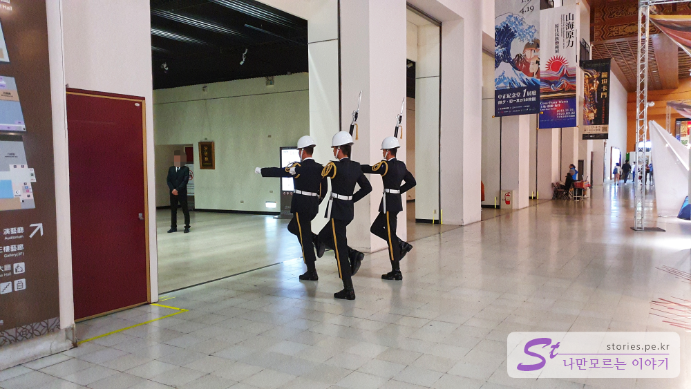
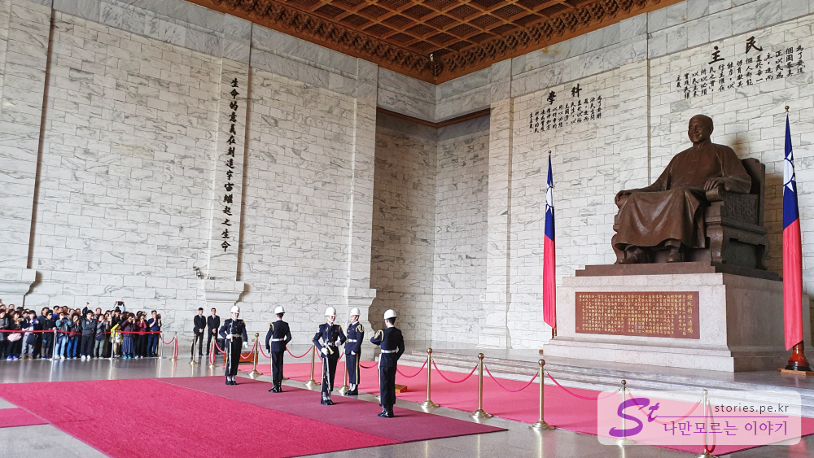
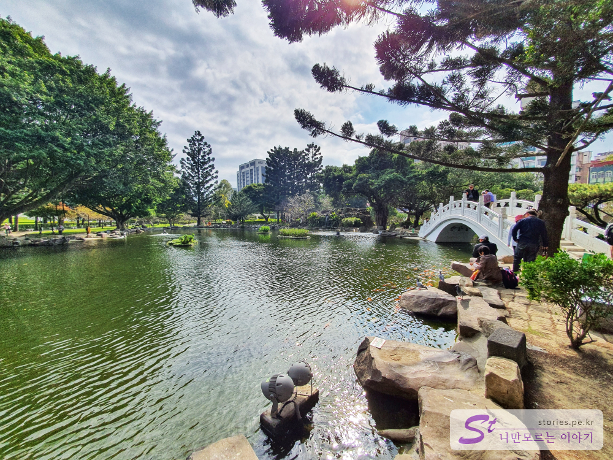
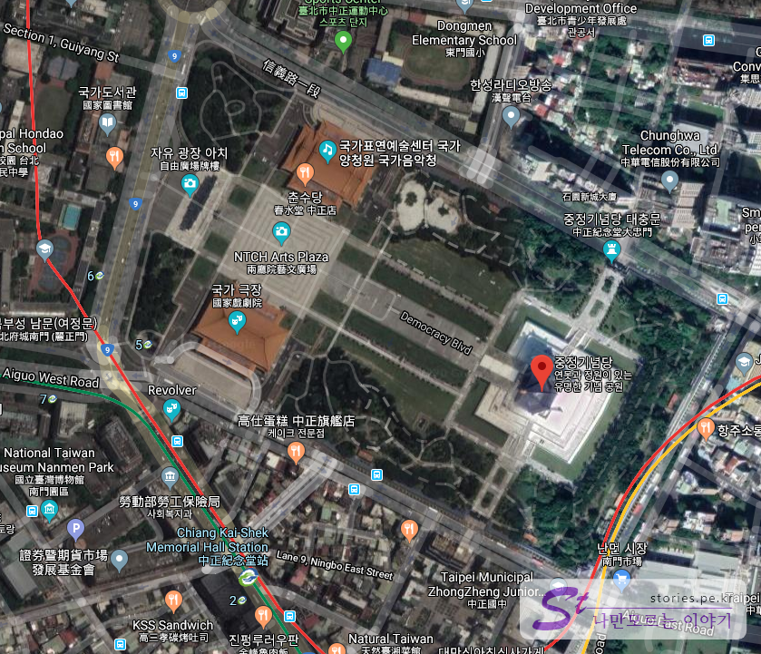

대만 3째날의 시작은 중정기념당부터 시작했습니다. 매시간 근위병 교대식이 이루어 지는데 한번쯤은 볼 만한 장면이 연출됩니다.  
**Chiang Kai-Shek Memorial Hall Station**에서 하차해서 10분정도 걸어서 올라가면 만날 수 있습니다. 처음 **중정기념당**을 본 다면 그 크기에 압도 당할 정도 입니다.   

> 중정기념당은 중화민국(대만)의 초대 통령인 **장개석(장제스)** 를 기념하기 위해 만든 기념당입니다. 장개석의 본명이 **장중정**이라 중정기념당이라 이름을 붙히게 되었습니다. 

  
중정기념당의 앞쪽에서 기념당을 보면 그 웅장함이 대단합니다. 많은 사람들이 사진을 찍기에 여념이 없습니다. 

   
중정기념당에 올라 정문을 바라 보면서 찍은 모습은 더욱 더 웅장합니다. 저멀리 양옆으로 국가극장이 보입니다. 
오늘은 평일이라 사람이 그렇게 많아 보이지는 않네요.  

  
근위병 교대식은 2층의 장개석 동상에서 이루어 지지만 교대 근위병은 1층에서 부터 시작을 합니다. 이때부터 천천히 걸어요. 속도가 답답하지만 절도가 있어서 멋있습니다. 1층에서 엘리베이터를 타고 2층으로 이동을 합니다.  

  
실제로 교대식이 이루어지는 2층 장개석 동상 앞입니다. 건물의 크기, 장개석 동상까지 크기가 정말 어마 어마 합니다.  

  
그렇게 교대식을 보고난 다음 시간을 가지고 주위를 둘러보면 다양한 볼거리와 쉴거리들이 있습니다. 저희는 기념당의 왼쪽에 있는 아름다운 호수와 정원들을 둘러 보았습니다. 산책하기에 정말 좋은 곳입니다.  

## 입장시간  
- 시작시간 : 09:00  
- 마감시간 : 18:00 

## 여행지 정보  
- 주소 : No. 21號, Zhongshan South Road, Zhongzheng District, Taipei City 
- 연락처 : +886 2 2343 1100  
[지도] : https://goo.gl/maps/56UiaFHfXVPcPubC8  

