3일차 마지막 스팟으로 **타이베이101**을 다녀왔습니다. 원래 계획은 먼저 택시를 타고 샹산에 올라가서 타이베이101이 보이는 야경을 보는 것이였으나 시간도 안맞고 힘도들고 해서 **샹산전망대**는 포기하고 바로 **타이베이 101**으로 이동했습니다.  
타이베이 101은 대만에서 가장 높은 빌딩으로 101층, 509미터를 자랑하고 있습니다. 정식 명칭은 **타이베이 세계금융센터**라고 합니다.

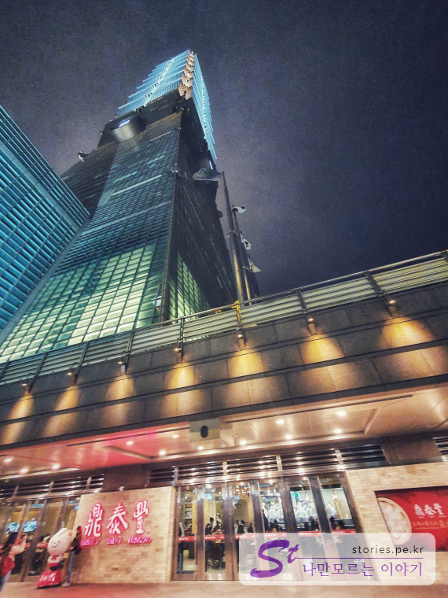
**지하철 빨간라인 4번 출구**와 연결되어 있는 통로를 통해서 타이베이101으로 이동할 수 있습니다.

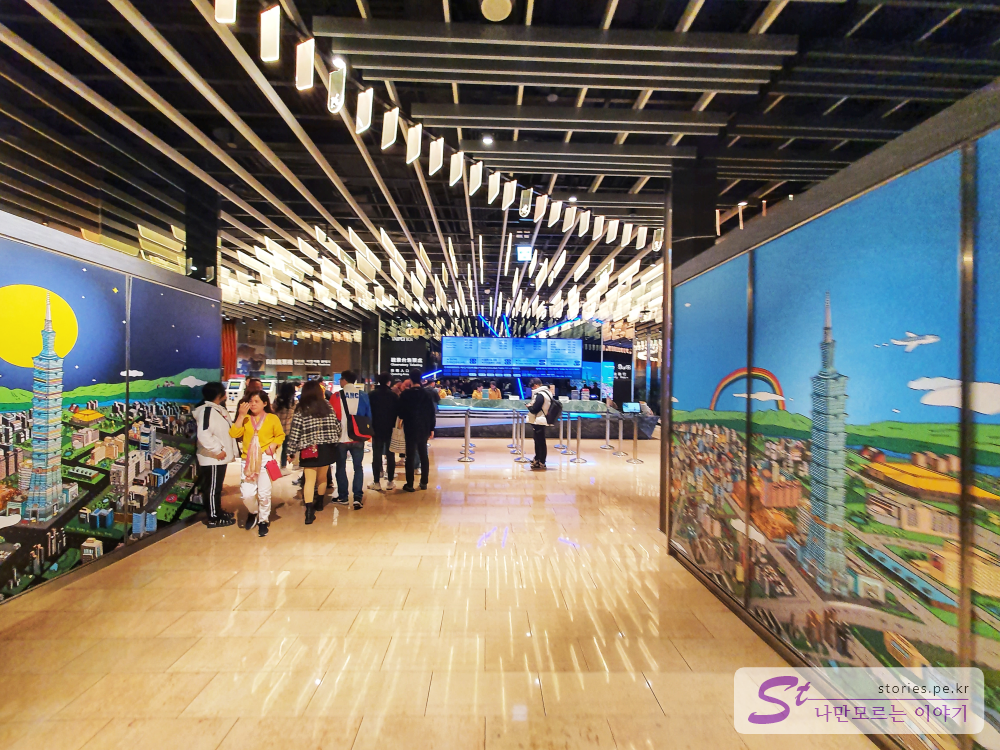  
전망대로 올라가는 곳은 5층 입니다. 현장에서 입장권을 구매하려면 구매 데스크에 줄을 서서 **600NTD**로 구매한 후 다시 입장하는 줄에 서야 합니다. 만약 한국에서 바우처를 구매할 때 시간을 지정해서 구매를 해 가면 매표 할 필요없이 바로 입장하는 곳에 줄을 서면 됩니다. 시간이 맞지 않거나 날짜를 변경해야 할 때는 다시 구매 데스크에서 줄을 서서 입장시간을 변경해야 합니다.

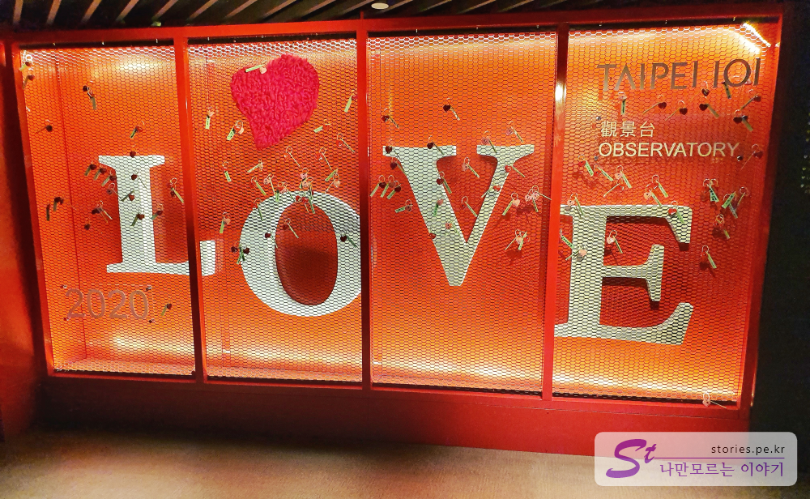  
세계에서 가장 빠른 엘리베이터를 타고 전망대 89층에 올라오면 이런 조형물을 볼 수 있습니다.

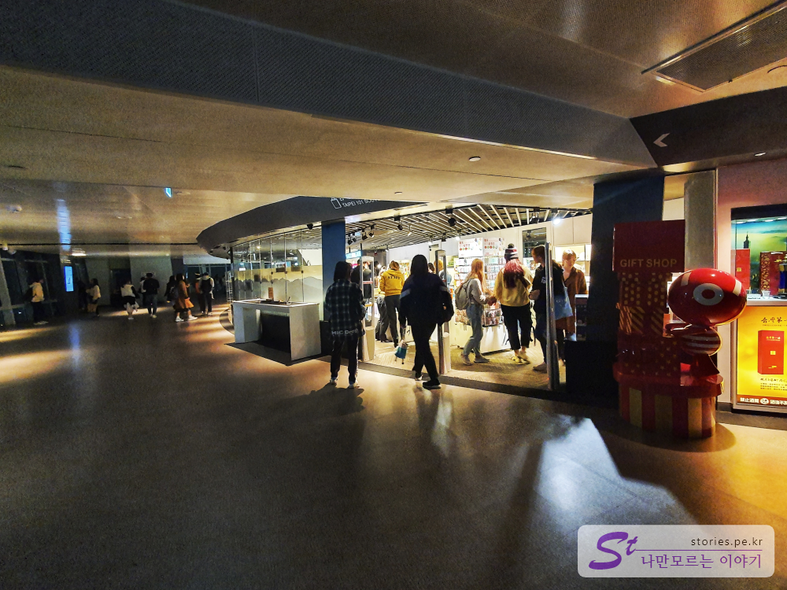  
전망대 내에 기념품을 파는 곳도 있습니다. 가격은 좀 비싼 편인데 혹시나 선물을 준비 못했으면 여기에서 기념품을 구매하시면 됩니다.

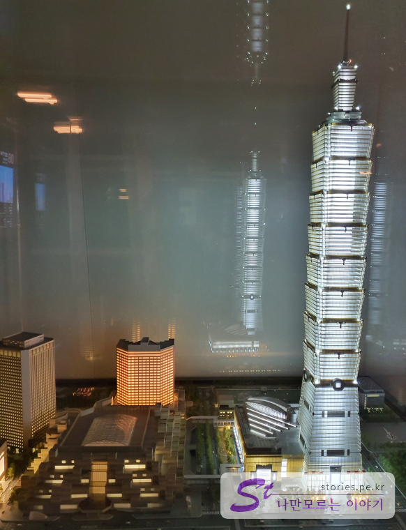  
타이베이101에 오면서 가장 아쉬웠던 점은 타이베이101 빌딩을 밖에서 정확히 보지 못한 것입니다. 샹산전망대를 갔어야 했는데.. 그냥 아쉬운데로 모형으로라도 한번 찍어 봤습니다. 밖에서 봤어야 하는데 아쉬웠어요~~

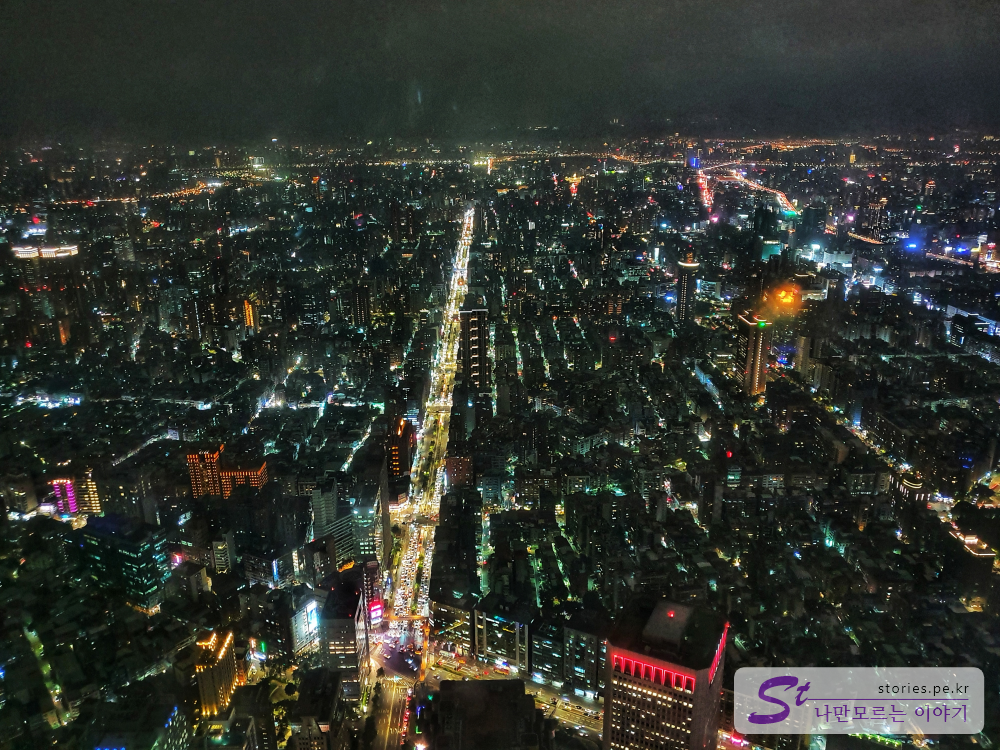

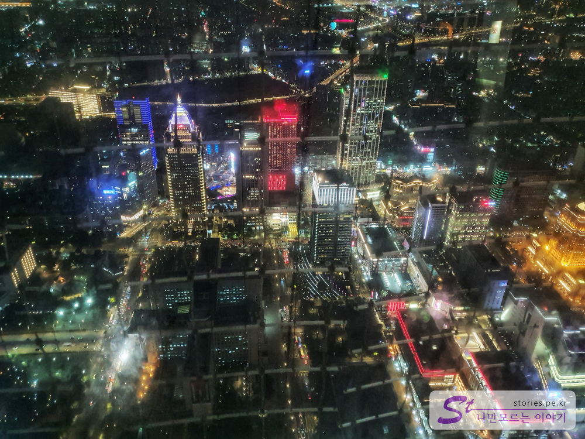

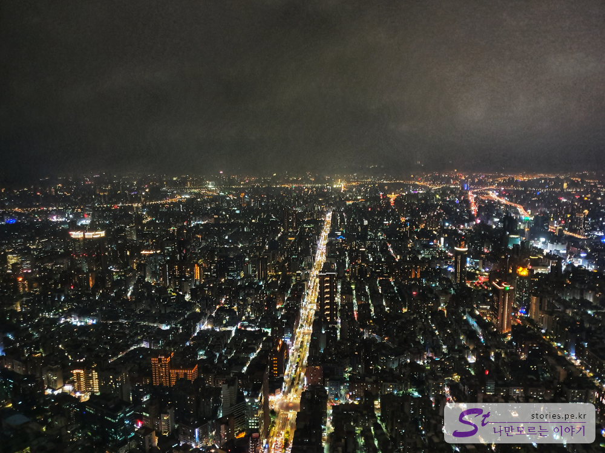  
타이베이 야경이 너무 멋집니다. 이걸 보러 올라온거지요. 역시 높은 곳은 전망은 좋습니다.

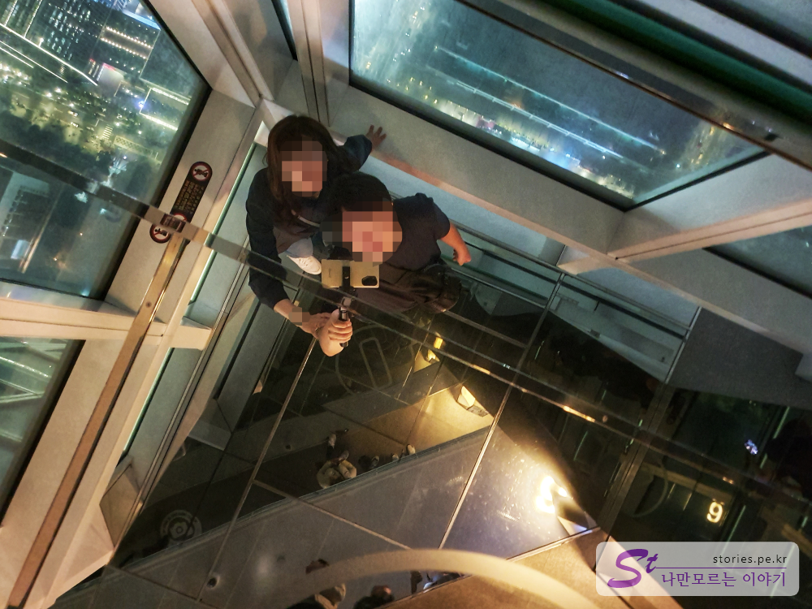
바닥이 유리라 위의 유리를 비추고 있어 마치 바닥이 투명한 것 같은 착시 현상이 있어서 한번 찍어 봤습니다.

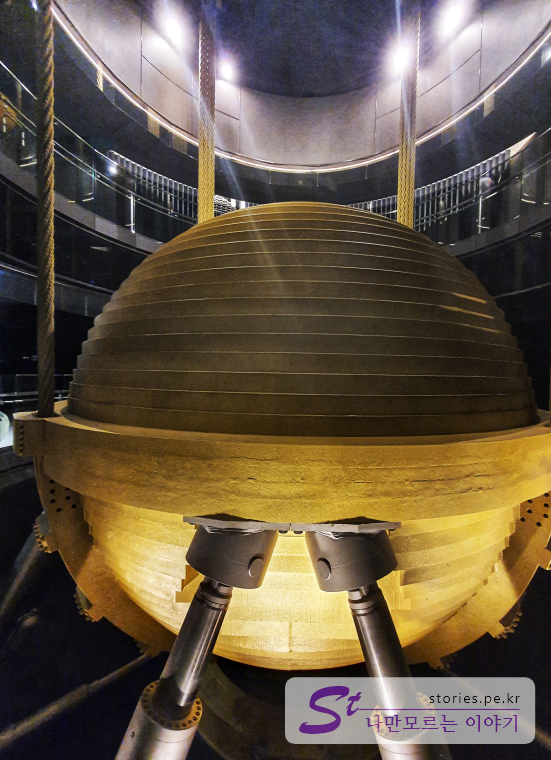  
윈드댐퍼로 건물을 바람으로 부터 중심을 잡아주는 중심 추라고 합니다. 무지막지하게 커요.

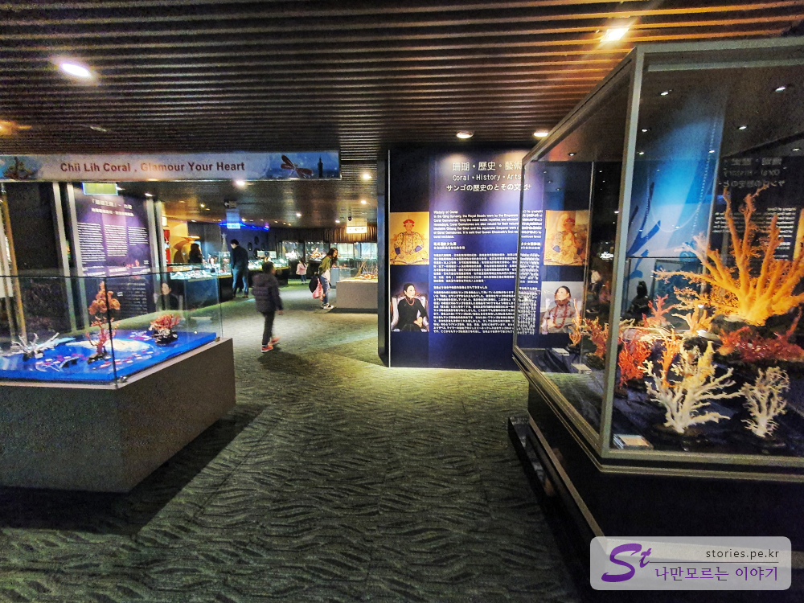  
전망하는 89층에서 구경을 마치고 내려 가려면 한층 아래인 88층으로 가서 엘레베이터를 타야합니다. 88층에는 고급산호로 만든 주얼리를 판매하는 층인데 전망대를 내려가려면 꼭 이 쥬얼리 판매대를 지나서 가야 합니다. 멋지긴 한데 이걸 누가살까? 라는 생각이 들었습니다.

## 비용

현지에서 구매하면 입장료는 **600NTD(23,000원 정도)**입니다.  
한국에서 바우처를 구매해가면 **480NTD(19,000원 정도)**합니다. 한가지 단점이라면 비가와도 날이 흐려도 그날에 가야한다는 것이지만 가격이 저렴합니다.

## 입장시간

- 시작시간 : 09:00
- 마감시간 : 22:00

## 여행지 정보

- 주소 : No. 7, Section 5, Xinyi Road, Xinyi District
- URL : https://www.taipei-101.com.tw/  
  [지도] https://goo.gl/maps/QwHe5UK54X3Cq7Do7

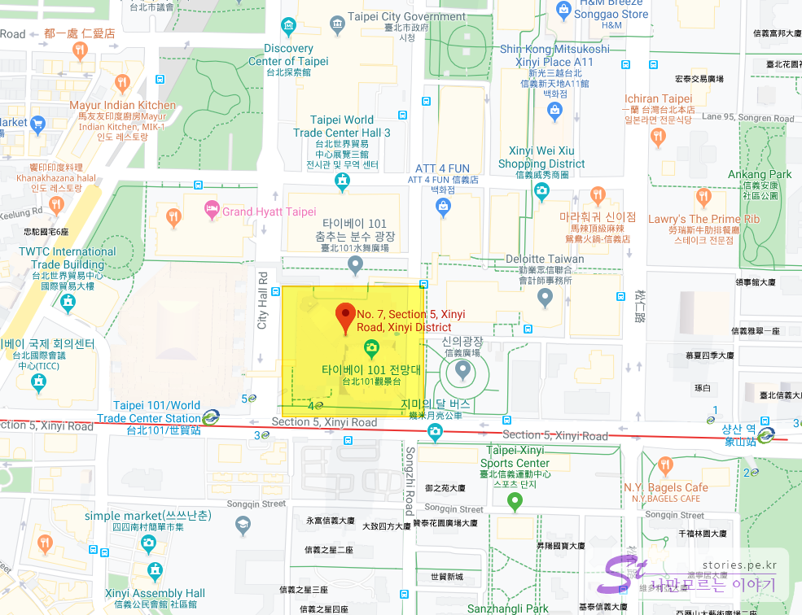

## 인근맛집

딘타이펑 타이베이101점
