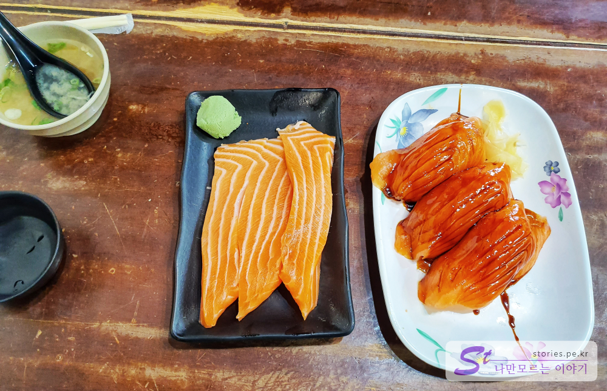
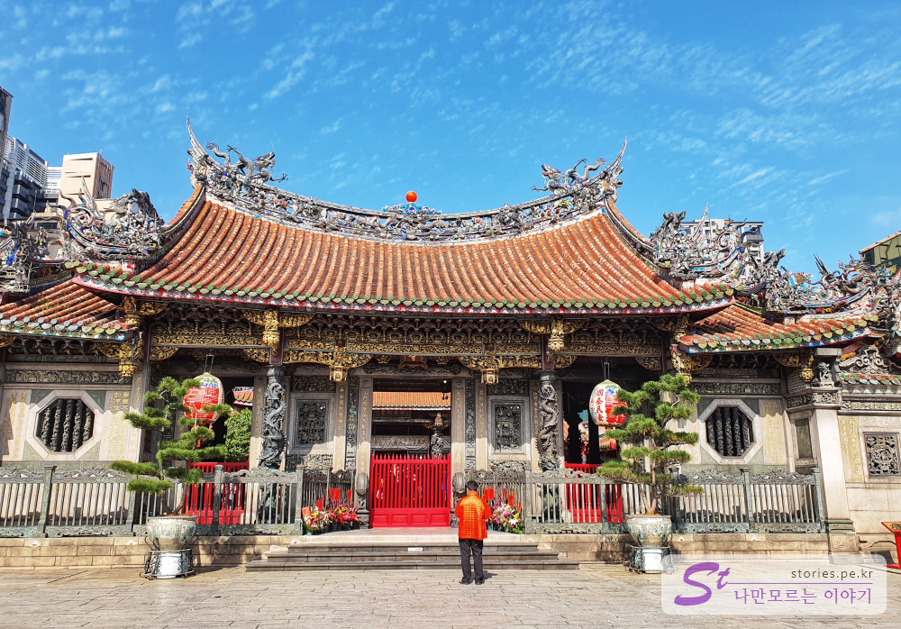
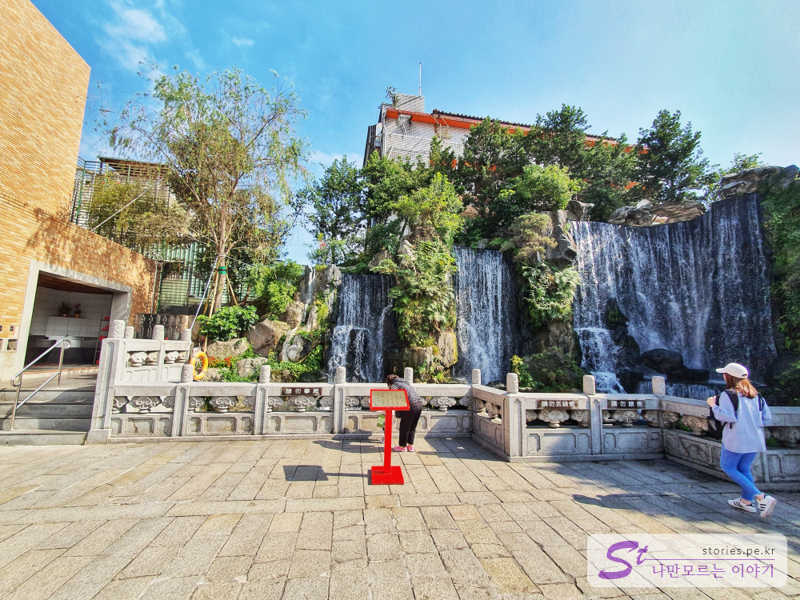
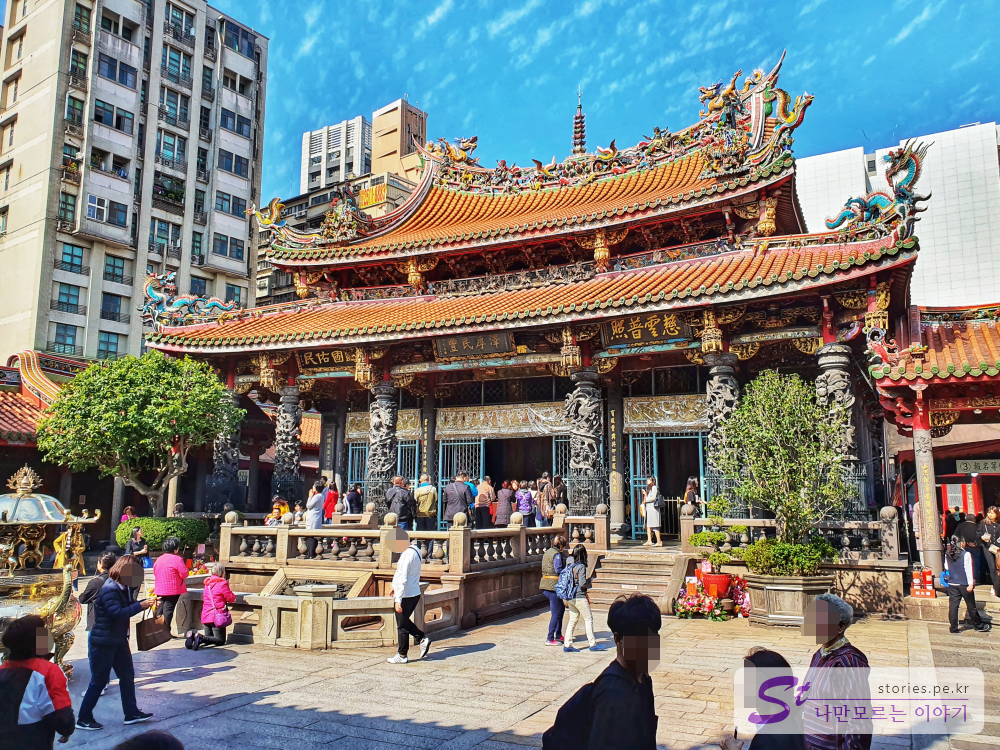
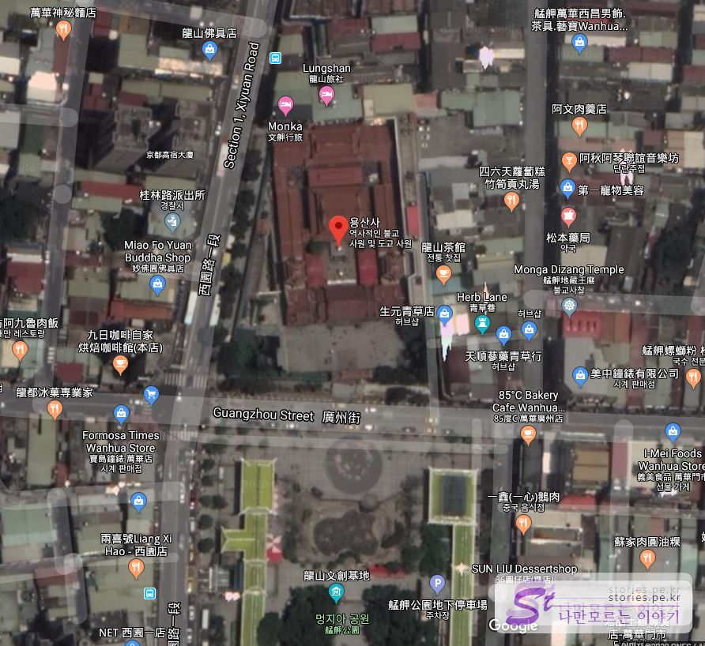

11시쯤에 [중정기념당](https://stories.pe.kr/364)을 나와서 점심을 먹기위해 대왕 연어초밥으로 유명한 [삼미식당](https://stories.pe.kr/366)으로 갔습니다. 인터넷에서 유명해서 그런지 역시나 많은 사람들이 대기를 하고 있었습니다. 대기표에 이름을 적으니 대략 1시간정도 후에 자리가 난다고 하더군요. 
> 팁을 드리면 포장 손님은 좀더 빨리 연어초밥을 받을 수 있습니다.  

> [삼미식당 포스팅 보기](https://stories.pe.kr/366)
> 
  
우리는 식당에서 먹어야 하므로 1시간정도 기다리기로 했습니다. 기다리는 동안 10분거리에 있는 용산사를 걸어서 찾아갔습니다. 
원래 용산사는 밤에 가야 조명 때문에 멋있다고 하는데 우리는 그냥 시간이 남아서 다녀오기로 했습니다. 조심해야 할 것은 원래 용산사 주위가 사창가로 발달이 되었었다고 합니다. 그래서 혹시 삼미식당에서 밤에 혼자 용산사로 갈 생각이라면 추천하지 않는 방법입니다. 그냥 지하철을 타고 용산사역으로 이동하는것이 좀 더 안전합니다. 용산사역 바로 앞에 용산사가 있어서 괜찮습니다. 

용산사는 타이베이에서 가장 오래된 전형적인 타이완 사찰로서 도교, 불교, 토속신을 섬기는 사찰이라고 합니다. 

  
용산사의 정문입니다. 빈곳없이 곳곳에 용들이 조각되어 있습니다. 여기도 용, 저기도 용, 용용용~

  
정문을 통과하면 작은 마당과 인공폭포가 있습니다.  

  
용산사 내부 입니다. 많은 현지인들과 관광객들이 섞여서 정신 없는 모습이였습니다. 현지인은 향을 피우며 기도하고 있고 관광객들은 여기저기 구경을 하며 돌아 다니고 있었습니다. 또한 수입을 올리기 위해 다양한 물건들을 판매하고 있습니다  
여기도 곳곳에 용들이 많이 있네요. 그래서 용산사 인가 봅니다. 

저는 낮에 방문했지만 밤에 방문하는 것이 볼거리가 좋다고 합니다. 

## 입장시간  
- 시작시간 : 06:00 
- 마감시간 : 22:00 

## 여행지 정보  
- 주소 : No. 211, Guangzhou Street, Wanhua District, Taipei City, 대만 10853 
- 연락처 :  +886 2 2302 5162 
- URL :   
[지도] https://goo.gl/maps/4j5EtnJJKF8qq6kU9  

