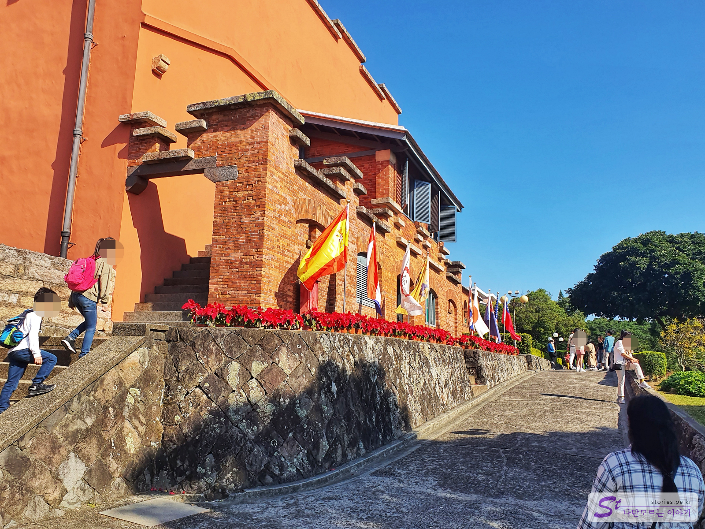
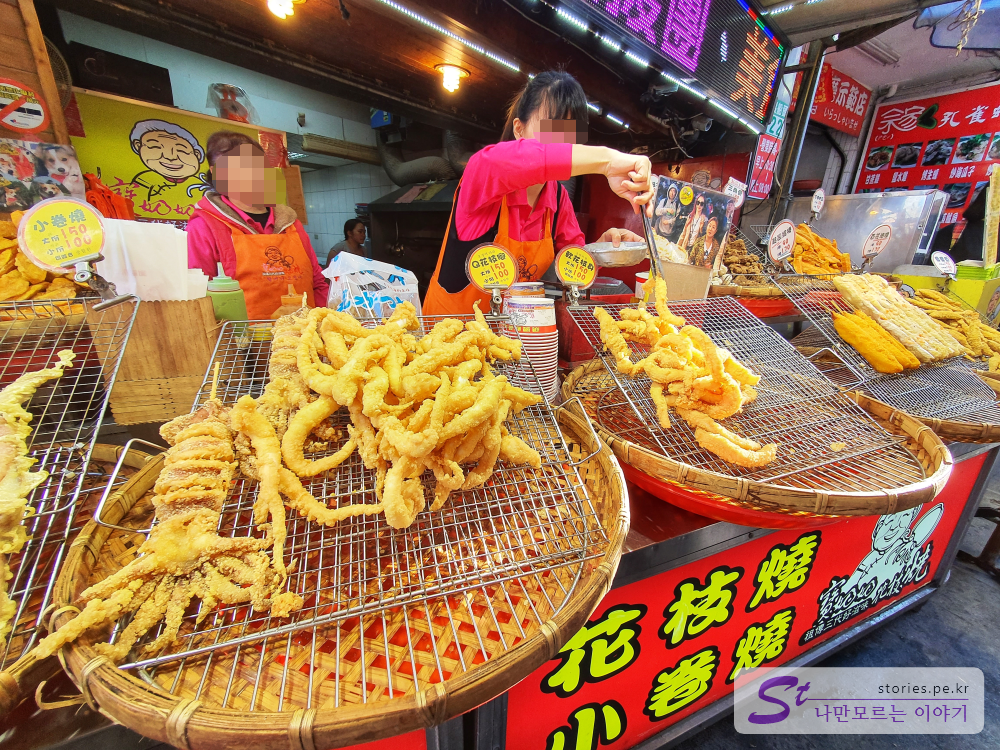

 

4쨰날에는 단수이에 다녀왔습니다. 단수이는 타이베이 시에서 조금 떨어져 있기 떄문에 근처의 여행 스팟을 하나로 묶어서 다녀오는 것이 좋습니다.  
일단 단수이 지역의 여행 스팟을 다녀온 뒤 저녁에 **베이터우에서 온천을** 즐기던지 아니면 저녁에 **스린야시장**에 가면 적당합니다. 

   
단수이의 여행 스팟이라면 **홍마오청**, **진리대학교**, **담강중학교**, **단수이 라오제**,**위런마터우**, **단수이 정인교**, **단수이 부투**, **발리**, 등등이 있고 먹거리로는 **대왕카스테라**, **단수이 스타벅스**, **발리 대왕오징어튀김** 등이 있습니다.  

타이베이역에서 빨간라인(Tamsui-Xinyi Line)을 타고 마지막 역인 단수이역까지 갑니다.   
단수이역에서 내리면 이제 바다가 보입니다. 

여행스팟은 여러군데가 있으나 반나절에 다녀올려면 모두 갈 수 는 없고 몇군데를 추려야 합니다.  

### 진리대학교  
  
먼저 진리대학교를 방문했습니다. 단수이역에서 R26번 버스를 타고 Fort San Domingo(Aletheia University)역에서 하차해도 되고 20분정도 걸어서 이동해도 됩니다.  

> 진리대학교는 캐나다 장로교의 선교사 설립한 대만 최초의 서양식 대학으로 옥스퍼드칼리지라는 명칭을 가지고 있었으나 1999년도에 진리대학이라고 이름을 바꾸었습니다.  
> 진리대학이 관광객으로 부터 유명해진 이유는 **말할 수 없는 비밀**이라는 영화의 찰영 장소가 되면서 부터라고 합니다. 

  
홍마오청과 진리대학교는 바로 옆에 붙어 있습니다. 홍마오청을 먼저 방문해도 되고 진리대학교를 먼저 방문해도 됩니다. 저희는 진리대학교를 먼저 방문을 했습니다. 홍마오청 입구 바로 옆 오르막 행길로 올라가면 됩니다.  

 
요런 건물이 보이면 잘 올라온 겁니다. 이 건물을 끼고 조금 더 위로 올라가면 됩니다. 

   
진리대학교는 교문 입구가 좁습니다. 그 입구로 들어서면 아주 멋진 정원을 만나게 됩니다.  
교문으로 들어가지 않고 앞으로 좀 더 올라가면 **담강 중학교**가 나옵니다.  

   
진리대학교의 볼거리는 교문 바로 앞에 있는 정원입니다. 정원 주위의 건물과 호수 나무, 벤치가 상당히 운치있고 멋있고 쉬기에도 좋게 꾸며져 있습니다. 호수에는 거북이 인지 자라인지가 일광욕을 하러 바위마다 삼삼오오 올라와 있습니다.    

  
진리대학교와 홍마오청은 뒷문 쪽으로도 연결이 되어 있습니다. 정문 뿐만이 아니고 이쪽으로도 홍마오청을 입장할 수 있습니다. 뒷문 쪽에도 입장권을 구입할 수 있습니다. 

### 홍마오청   
   
홍마오청은 유료로 입장하는 곳입니다. 인당 **80 NTD (3,100원)**을 지불하면 **홍마오청**과 **샤오바이궁**(작은 백악관), **후웨이 포대**도 입장이 가능합니다.  

> 홍마오청은 **붉은 머리카락의 사람들의 성**이라는 뜻으로 많은 역사적 아픔을 가지고 있는 곳이라고 합니다.  
> 1600년경 스페인에 의해 대만 지배를 목적으로 새워졌으나 전쟁에 의해 부쉈졌고 네덜란드에 의해 다시 재건되었다고 합니다. 그후에 영국정부의 대사관으로 사용되다가 2차 세계대전으로 인해 잠시 일본을 거쳐 전쟁 후에는 다시 영국의 손에 들어 갔다고 합니다. 
> 1980년에 최종 대만으로 돌아갔고 2005년에 보수를 하여 관광지로 대중들에게 공개 되었다고 하네요. 

  
서양사람들이 머물던 생활관이라는 표시가 있습니다. 

  
침실입니다. 상당히 넓고 고급스러워 보입니다. 

  
전쟁의 요충지인 만큼 포대도 있네요. 여기서 이 대포로 바다를 지켰을 것 같습니다.   

   
건물 밖에서 바라본 홍마오청 본관입니다. 머리카락이 붉을 뿐만 아니라 별돌도 붉은색으로 되어 있습니다. 

  
다른 각도에서 바라본 홍마오청 매인 건물입니다. 

  
창문을 통해 바라본 본관입니다.  

  
본관 외에 또다른 건물입니다.  

  
홍마오청으로 오르는 길에 있는 쉼터입니다. 

  
홍마오청 입구이지만 저희는 출구로 이쪽으로 나왔습니다. 저희가 꺼꾸로 돌긴 했지만 그래서 좀 덜 분비지 않았을까 합니다. ^^

### 단수이 부두 
홍마오청에서 단수이 부둣가쪽으로 걸어오늘 길입니다. 바다르 보면서 오기 떄문에 경치가 참 좋습니다.  

  
바닷가로 나 있는 해변길입니다. 1월달이라 날씨가 어느정도 적당했지만 여름에는 많이 더울것 같습니다. 

  
자연적으로 생성된 나무가 그늘을 만들어 주고 있어서 걸어가다 쉬기에 정말 좋게 되어 있습니다. 

  
저희는 뭐든 꺼꾸로 가네요. 다시 단수이 부둣가 쪽으로 오면서 만난 스타벅스입니다. 더울 때 잠깐 쉬기에 좋습니다. 하지만 냉방이 그렇게 시원하지 않고 햇빛이 창문으로 많이 들어와서 좀 덥습니다. 

## 발리 가는 길  
단수이의 또하나의 매력은 배를 타고 발리를 다녀올 수 있다는 것입니다. 발리는 단수이 바다 건너 편 육지인데 먹거리도 몇개 있어서 잠깐 구경하고 오기에 좋습니다.  

#### 배 이용하기  
단수이에서 빨리로 가는 배의 가격은 왕복 **68NTD**입니다. **이지카드**로는 탈 수 있고 아이패스(요요카)로는 탈 수 없습니다. 

  
배를 타고 약 10분정도 이동하면 빠리에 도착을 합니다. 

  
 
빠리의 선착장에 대리면 바로 앞에 여러 상가들이 있고 유명한 **빠리 보할머니 대왕오징어튀김**집을 만날 수 있습니다. 

   
  
다양한 튀김들이 있는데 대부분 오징어 튀김을 선택합니다. 오징어 튀김의 크기를 선택하는데 저희는 작은것을 주문해서 먹었습니다. 

   
주문을 하면 다시 한번 튀긴 다음 잘라서 담아 줍니다. 같이 넣어 준 와사비와 튀김을 같이 먹으면 정말 맛있습니다. 빠리 보 할머니 대왕 오징어 튀김이 왜 유명한지를 알 수 있는 맛입니다. 

  
튀김집 바로 앞에서 파는 도넛 가게입니다. 가게 이름은 뭔지 모르겠네요. 이 튀김도 맛이 좋습니다. 

   
  
빠리 조형물이 있는 곳으로 가는 해변 길입니다.  

  
포토스팟인 발리 조형물입니다. 사람들은 빠리라고 하네요.

## 신베이터우 온천  
단수이에서 오후 6시쯤 나와서 베이터우에 있는 온천을 가기 위해 다시 전철을 타고 베이터우로 이동을 했습니다.  

  
베이터우에서 내려서 옆쪽 노선으로 이동해서 신베이터우로 가는 전철을 탔습니다. 
신베이터우에 내려서 근처 맥도널드에서 햄버거를 하나씩 사 먹고 시간 맞춰 셔틀버스 타고 스프링 시티 리조트를 찾아 갔습니다. 

#### 스프링 시티 리조트 야외 온천  
온천이라 촬영이 되지 않아 사진을 찍지는 못했습니다. 처음에 기대를 많이 하고 갔는데 우리나라의 워터파크를 생각하면 많이 실망할 것이고 그냥 온천 탕이 여러 개 있다 라고 생각을 하고 가시는 것이 좋습니다. 많이 오래있기는 힘들고 사람마다 다르겠지만 2~3시간 정도면 질리기 시작 합니다. ^^; 여행의 마지막 날 피로회복을 하는 정도로 만족하시면 딱 좋습니다. 

온천 체크인을 할때 셔틀버스를 미리 예약하는데 아래의 시간표를 보여주고 선택하라고 합니다. 
  
저희는 22시 40분을 예약했다가 너무 지루해서 중간에 21시40분으로 변경했습니다.  
미리 예약을 하지 않으면 빈자리가 없는 경우 셔틀을 타지 못할 수도 있습니다.  

이렇게 하루의 일정을 마무리 했습니다. 
