여행의 마지막날 오후 비행기라 오전에 잠시 임가화원에 다녀왔습니다. 시먼역(시먼딩)에서 약 10분, 지하철에서 내려 걸어서 10분정도 이동하면 만날 수 있습니다. 가는길에 로컬시장이 있어서 약간의 구경거리도 있습니다. 

> 임가화원은 청나라 시절 쌀과 소금의 무역으로 부를 축적한 **임씨 가문**이 대만으로 이주한 후 고향인 청나라를 그리워하며 지은 청나라식 화원입니다. 누각과 인공호수가 어우러진 고즈넉한 정원은 도심 속 휴식을 취하며 힐링을 할 수 있는 정원 입니다. 

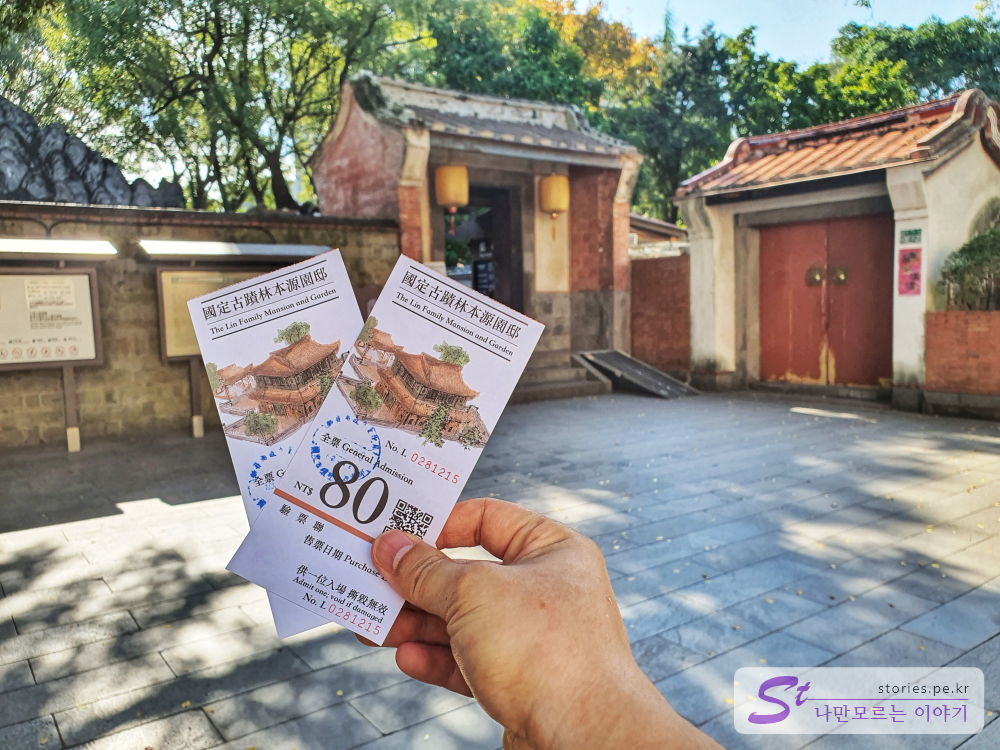  
임가화원은 인당 **80NTD(3,200원)** 의 입장료가 있습니다. 마지막 남은 대만달러를 사용했습니다. 

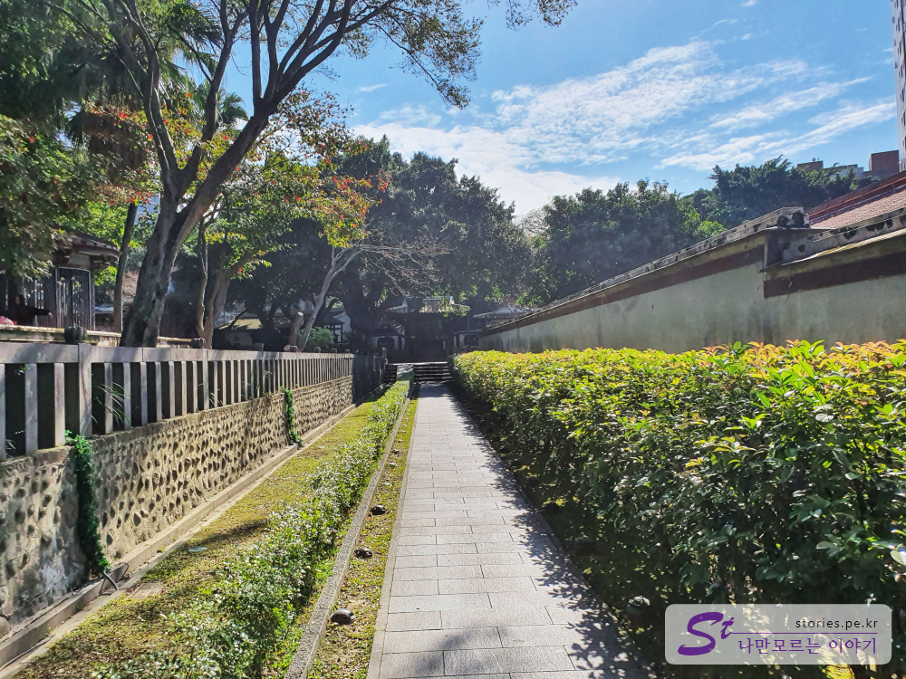  
매표소를 통과하여 정문을 들어서면 길게 뻗은 곧은 길이 있습니다. 이 길을 지나오는 손님을 확인하기 위해 장치가 아닐까 합니다.  

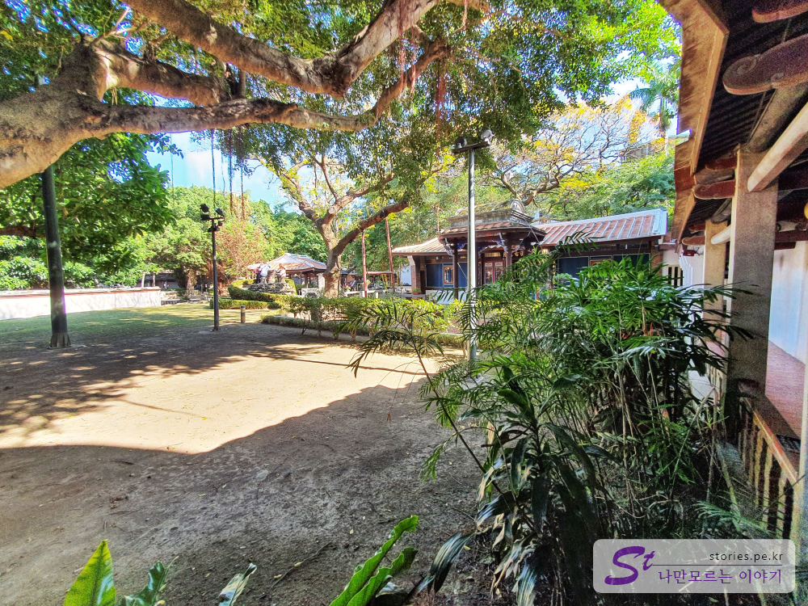  
드디어 정원다운 정원이 나옵니다. 마당과 나무와 건물이 너무 잘 어울려져 있습니다.  

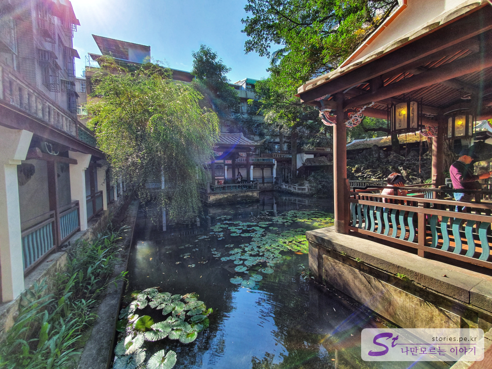  
내당 쪽에 있는 인공호수 입니다. 앞쪽과 뒤쪽으로 3면이 물과 닿아 있는 쉼터가 있습니다.  

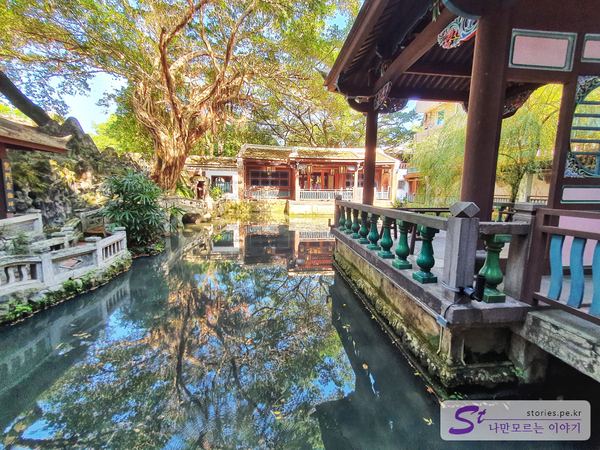  
반대쪽에서 바라 본 인공호수 있습니다.  

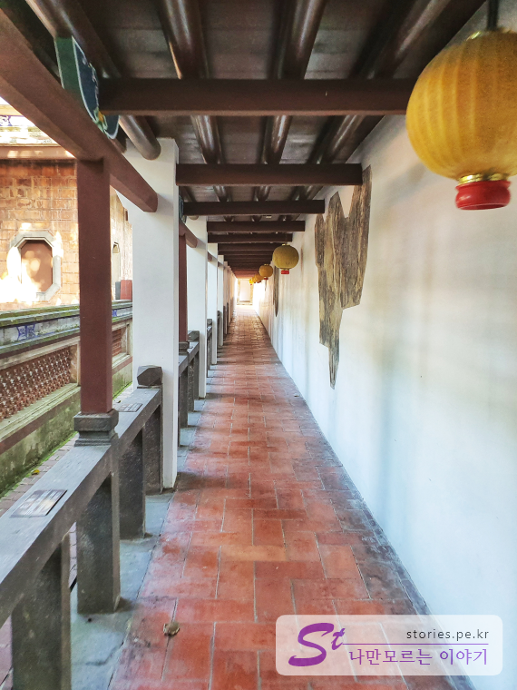  
호수를 따라 걸을 수 있는 야외로 노출되어 있는 길입니다. 만약 비가 온다면 정말 멋진 풍경이 펼쳐길것 같은 느낌이 듭니다.  

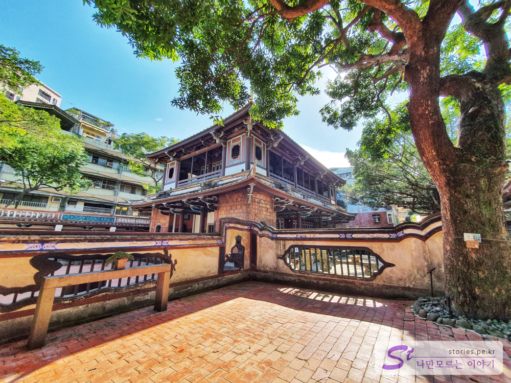  
임가화원에서 가장 큰 건물입니다. 무슨 용도로 사용했는지는 잘 모르겠네요.  

  

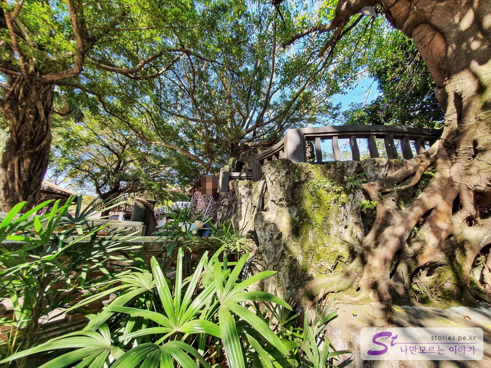  
자연과 어우러진 공간이 편안함을 줍니다. 천천히 산책하듯 걷기에 정말 좋습니다.  

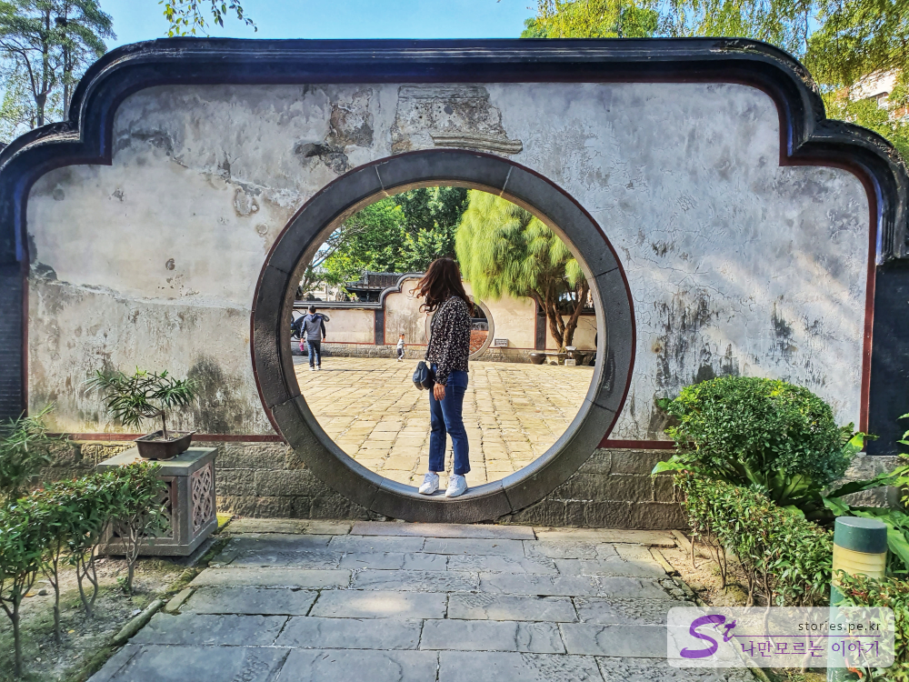  
임가화원의 입구 서쪽편에 있는 원형 아치 입구 입니다. 사진찍기에 정말 좋은 장소인것 같아요. 

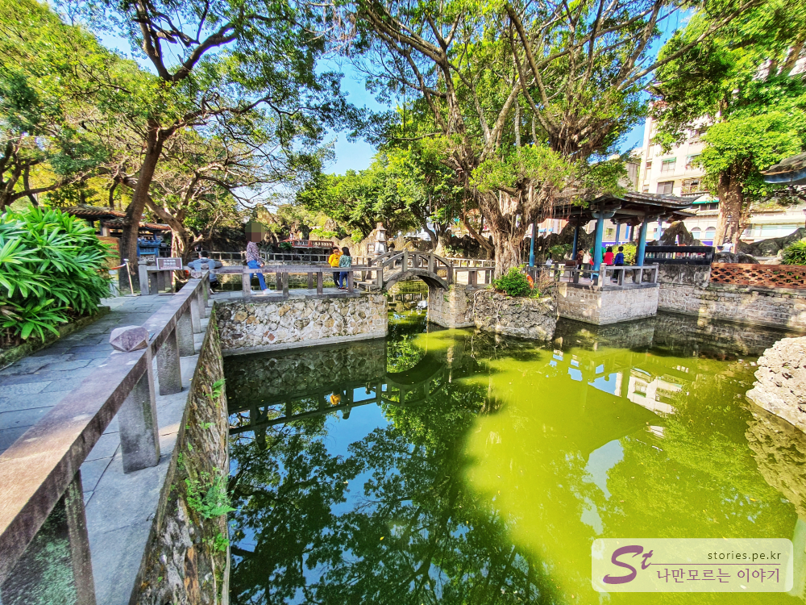  

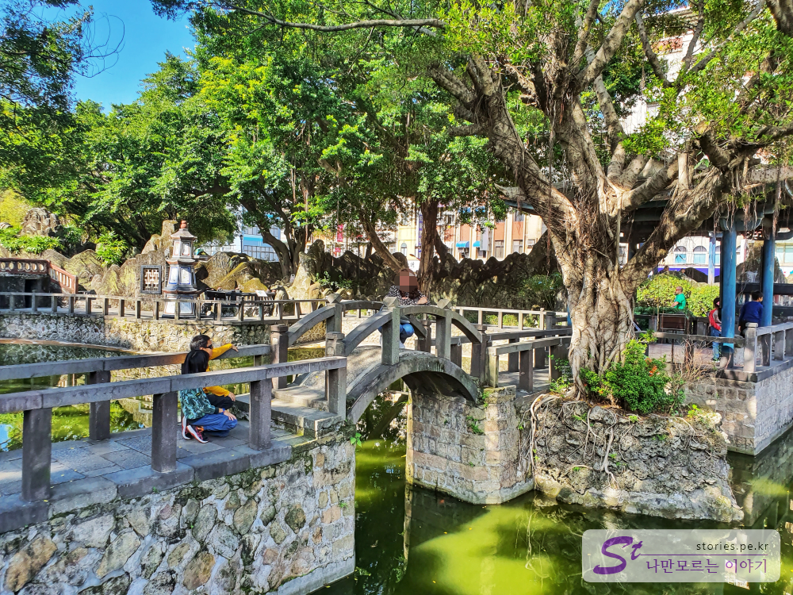  

임가화원의 서쪽에 있는 큰 인공호수 입니다. 다리며 정원이며 정자며 너무 잘 어울어지게 만들어 놨습니다. 정말 힐링이 되는 공간입니다.  

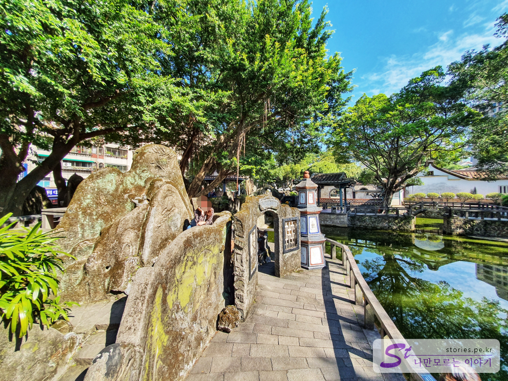  
인공호수의 동쪽으로 마치 병풍같이 돌로 아름답게 꾸며놓았습니다. 사진 잘나오네요.

  

이렇게 시간을 쪼개서 아침나절 임가화원에서 힐링하고 공항으로 이동하였습니다. 

## 비용  
입장료 : 인당 **80NTD(3,200원)**  
> **대만달러 X 40** 하면 대략 한국의 돈과 비슷한 금액입니다. ( 80 NTD X 40 = 약 3,200원 )

## 입장시간  
- 시작시간 : 09:00  
- 마감시간 : 17:00  
- 휴무일 : 매달 첫째 월요일 휴관，국경일 과 겹칠 경우 정상 개관하고 그 다음날 휴관 

## 여행지 정보  
- 주소 : No. 9號, Ximen Street, Banqiao District, New Taipei City, 대만 220  
- 연락처 : +886 2 2965 3061  
- URL : https://www.linfamily.ntpc.gov.tw/linfamily_kr  
[지도] https://goo.gl/maps/SkKQPZffU6KnBjxo7 

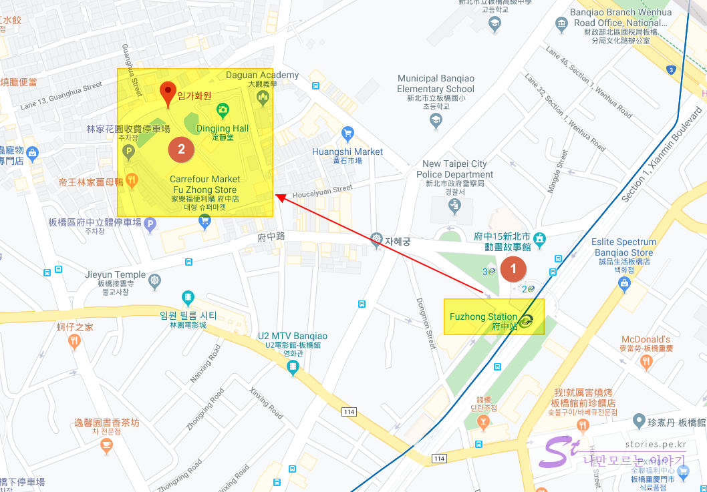

