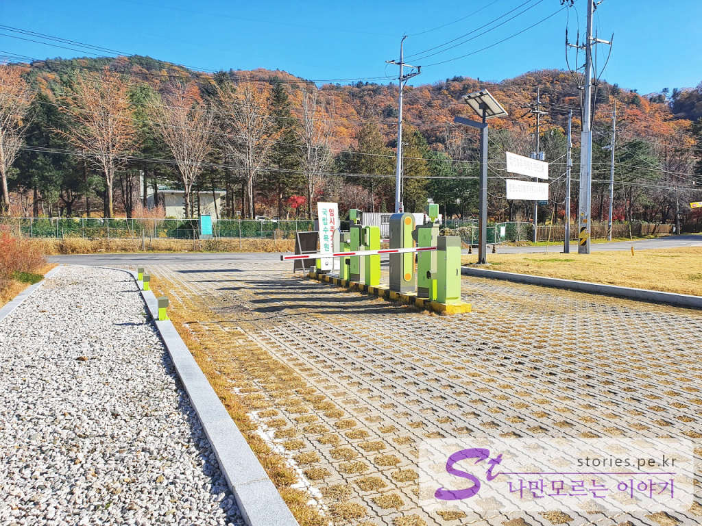
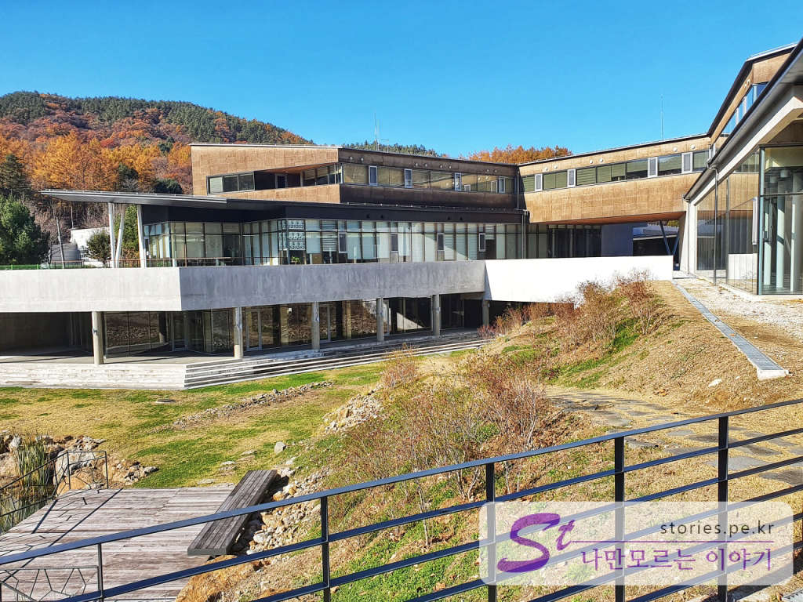
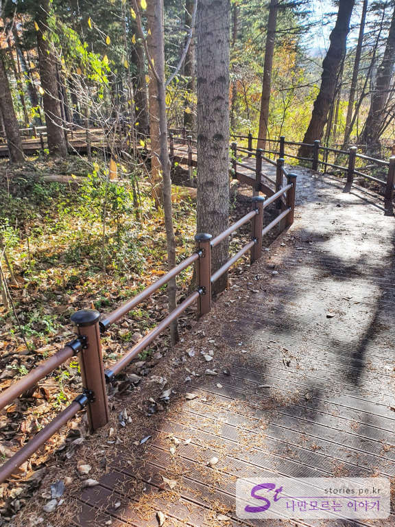
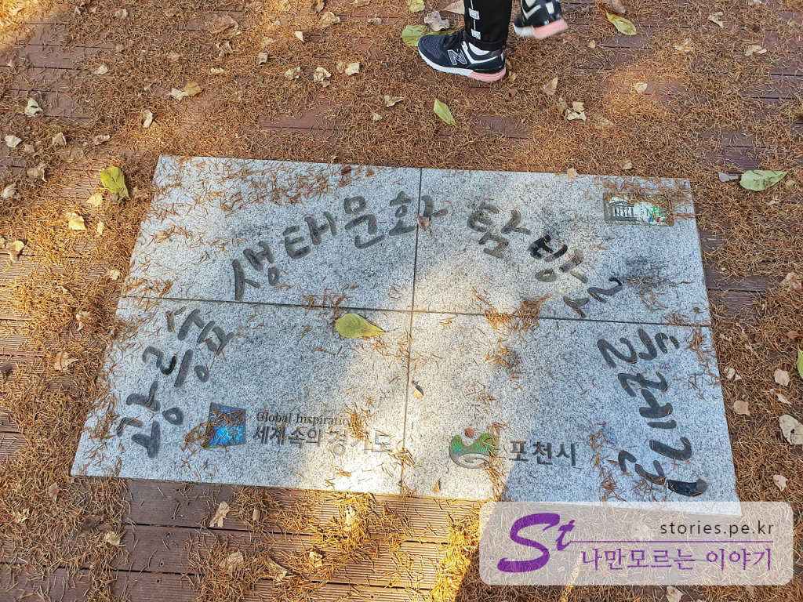
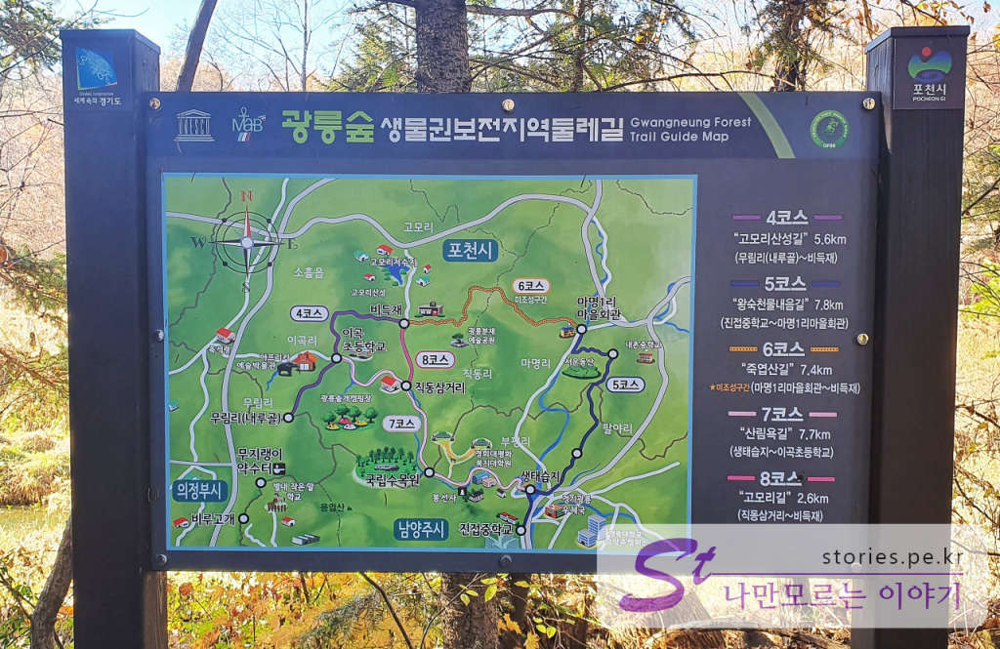
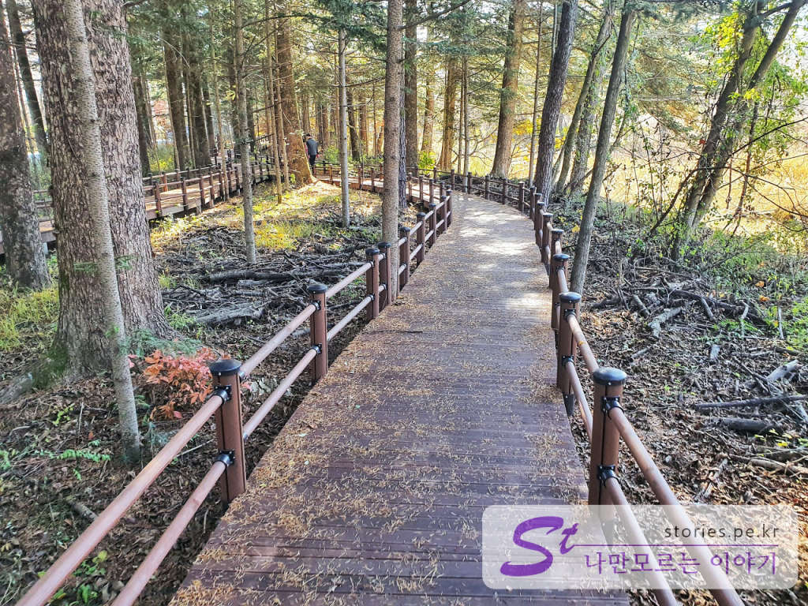
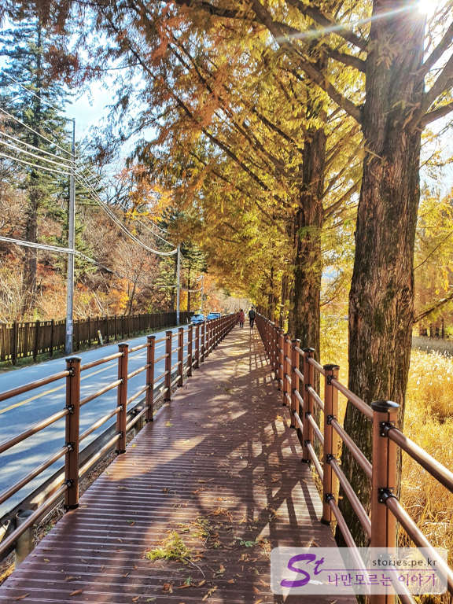
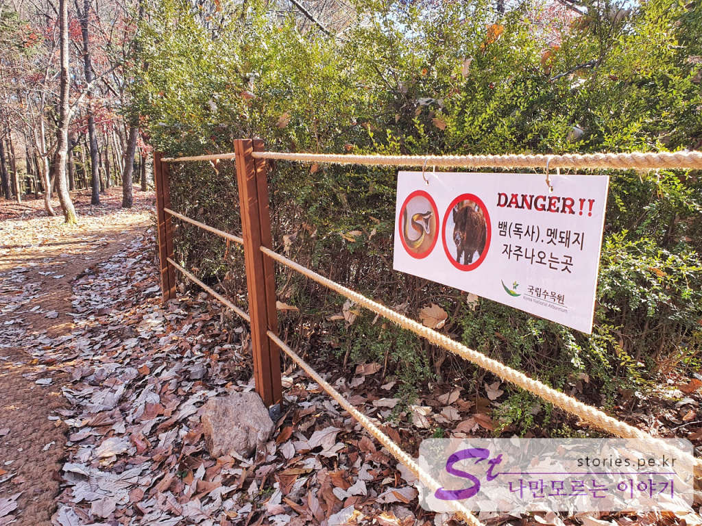
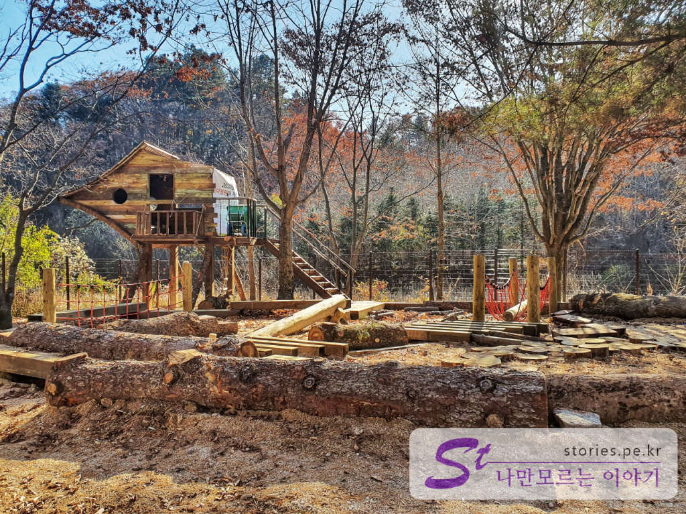
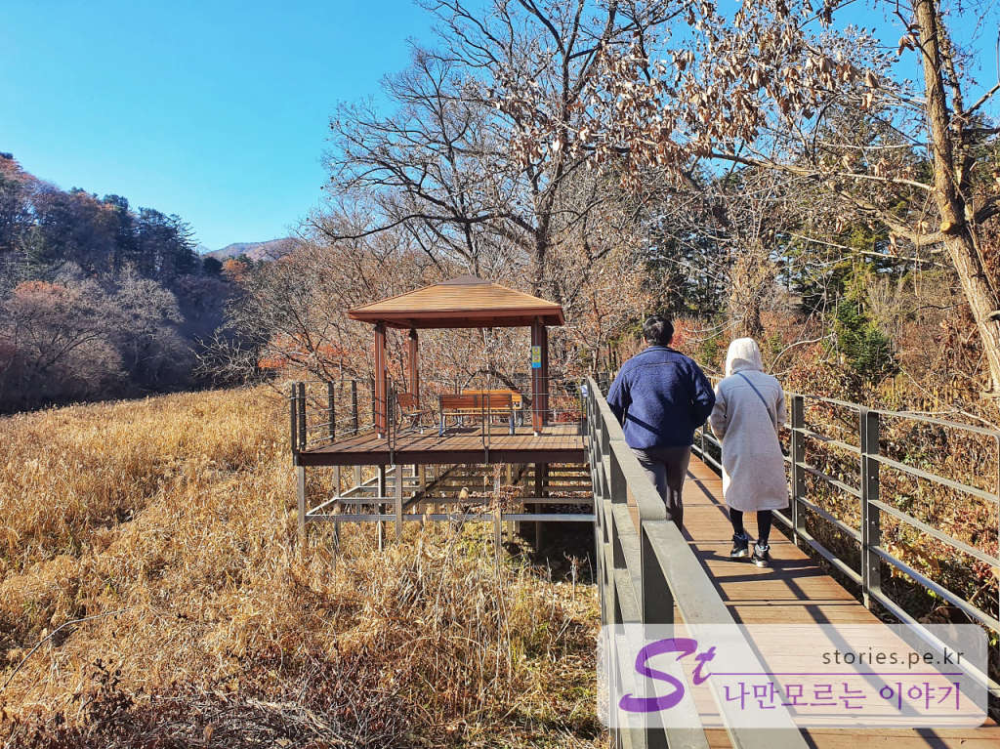

원래 **광릉수목원**은 자연을 보호하기 위해서 약간은 폐쇄적으로 운영했던 것이 사실입니다. 아직도 광릉수목원에 입장을 하기 위해서는 미리 정해져 있는 하루 입장 인원 안에서 [광릉수목원 홈페이지](http://www.forest.go.kr/newkfsweb/kfs/idx/SubIndex.do?orgId=kna&mn=KFS_15)에서 예약을 해야만 입장을 할 수 있습니다. 하지만 작년부터인지 재작년부터인지 예전과 다르게 좀 더 개방적인 정책과 실행을 하고 있습니다.  

새로 생긴 수목원의 출입구는 지금의 출입구와는 조금 먼 곳에 더 크고 더 멋지게 지어 놨습니다. 아직 사용하는 것 같진 않지만 새 건물도 지어놨고 주차장도 새로 지어놨습니다. 
산책로는 수목원의 한쪽 끝인 **새로 생긴 광릉수목원 입구**에서 다른쪽 끝인 **봉선사**까지 길게 구성해 놨습니다.  

   
포천 쪽에서 자가용을 타고 오다가 **캐미커피** 바로 전에 오른쪽으로 주차장이 하나 있습니다. 아직은 정식으로 운영을 하고 있지 않아서 요금없이 입장이 가능합니다. 

  
안으로 들어서면 주차장이 나옵니다. 생각보다는 크지만 주말이나 휴일에는 이 자리도 없지 않을까 합니다. 지금 위의 사진은 평일날 사람이 별로 없을 때 인데도 빈자리가 별로 없이 차들이 많이 있었습니다.    

  
사진이 엉망이네요 ㅠㅠ; 역광이라 사진이 너무 후지게 나왔네요. 
실제로 보면 멋진 광릉수목원 메인 입구입니다. 현재는 아직 한산하고 운영을 하고 있는것 같진 않지만 추후에는 훌륭한 입구의 역활을 하지 않을까 합니다.   

  
입구를 통과하여 수목원쪽 방향으로 들어서면 입구의 실체를 볼 수 있습니다. 다양한 건물과 실내공간을 가지고 있습니다. 실내는 아직 아무 것도 없는듯 하지만 앞으로 시민들과 아이들을 위해서 다양한 프로그램과 클래스를 운영하지 않을까 추측해 봅니다.  

  
봉선사의 반대쪽의 산책로는 **케미커피** 카페에서 시작을 합니다. 여기서 부터 **봉선사**까지 새로운 나무대크로 길게 길을 만들어 놨습니다.   

  
시작 지점에 산책로의 정식 명칭 표지석이 바닥에 깔려있습니다. **광릉숲 생태문화 탐방로 둘레길**이 정식 명칭인가 봅니다.  

  
4코스에서 8코스까지 광릉숲을 끼고 있는 포천의 둘레길을 안내하고 있는 안내판이 바로 옆에 있습니다. 

  
이제야 산책이 시작됩니다. 이런 데크로 잘 깔려있는 산책길을 따라 걸으며 맑은 공기를 마시는 것이 여기온 목적이겠지요. 천천히 걸어도 힐링이 됩니다.  

  
일부 구간은 찻길 옆으로도 나 있습니다. 매연이 조금 걱정되기는 하지만.. 그래도 길이 좁아서 차가 많지는 않습니다.  

  
역시 보호되고 있는 산이라서 그런지 뱀도나오고 맷돼지도 나오나 봅니다. 항상 조심해야 겠지요. 

  
옛날 광릉수목원 입구쪽 주차장 끝에 이렇게 자연의 나무로 만든 놀이터가 있습니다. 아이들이 보면 정말 좋아할 것 같습니다. 모두 나무를 재료로 만들어 놨습니다. 우리는 아이가 없으므로 패쓰~~

  
산책길에는 곳곳에 이렇게 쉴수있는 쉼터가 있습니다. 의자도 있구요. 사진을 찍을 수 있는 곳도 많이 있습니다.  

이런식의 길이 봉선사 까지 연결되어있습니다. 

케미커피에서 봉선사까지 걸어 갔다가 걸어 온다면 (왕복) **대략 1시간 30분에서 2시간정도** 예상하시면 될것 같습니다.   

## 방문시기    
2019년 11월달 늦가을 평일날 다녀왔습니다. 주말이나 휴일 때는 사람이 많이 온다고 보시면 됩니다. 여유로움을 즐기시려면 평일날 방문하시는 것을 강추합니다. 그리고 숲이라 해가 빨리 지니 저녁에 오시면 낭패를 당할 수도 있으니 가능하면 낮에 오셔야 합니다.  

## 비용  
산책길은 무료입니다.  
광릉수목원이나 동구릉에 들어가시려면 주차비와 입장료가 필요합니다. 

## 입장시간  
**산책로**는 따로 입장시간과 퇴장시간은 없으나 어두워지는 저녁은 조심해야 합니다.  
광릉수목원에 입장하시려면 먼저 [홈페이지](http://www.forest.go.kr/newkfsweb/kfs/idx/SubIndex.do?orgId=kna&mn=KFS_15)에서 예약을 해야 합니다. 
**월요일**과 **일요일**은 정기휴무입니다.  

## 여행지 정보  
- 주소 : 경기 포천시 소흘읍 광릉수목원로 415 
- 연락처 :  031-540-2000 
- URL : http://www.forest.go.kr/newkfsweb/kfs/idx/SubIndex.do?orgId=kna&mn=KFS_15   

    <iframe src='https://www.google.com/maps/embed?pb=!1m18!1m12!1m3!1d8922.469995737714!2d127.16575710111341!3d37.753242221827946!2m3!1f0!2f0!3f0!3m2!1i1024!2i768!4f13.1!3m3!1m2!1s0x357ccf289ac5d1d1%3A0x22d9fbb09a787eb8!2z7IKw66a87LKtIOq1reumveyImOuqqeybkCAo6rSR66aJIOyImOuqqeybkCk!5e0!3m2!1sko!2skr!4v1581175740275!5m2!1sko!2skr' class='embed-responsive-item' allowfullscreen></iframe>

## 주차정보  
평일날 주차는 문제 없습니다. 주말이나 휴일에는 모자랄 수 있습니다. 
주차장은 **봉선사**, **동구능**, **구 광릉수목원 입구 앞**, **신 광릉수목원 입구 앞**에 있습니다. 

## 인근맛집   
- [간판없는 맛집 광릉불고기 본점](https://stories.pe.kr/359)
- [동이 손만두](https://stories.pe.kr/193) 

