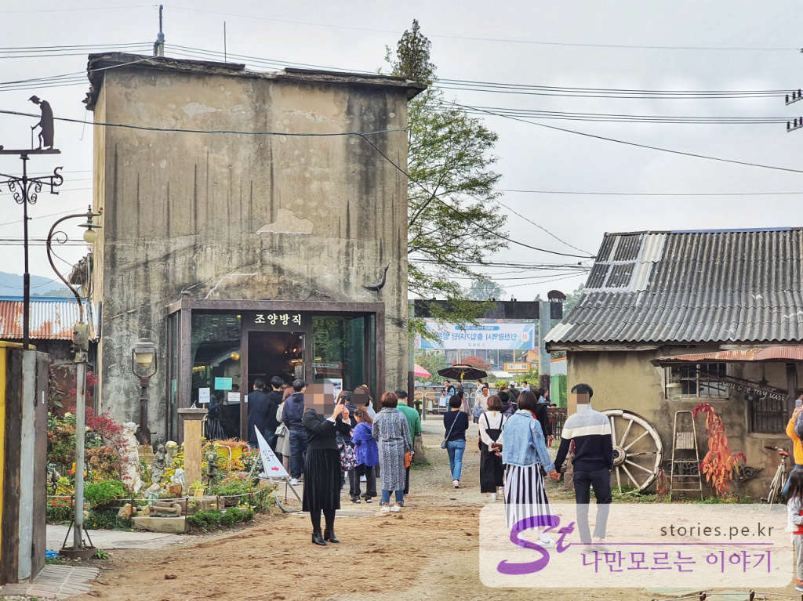
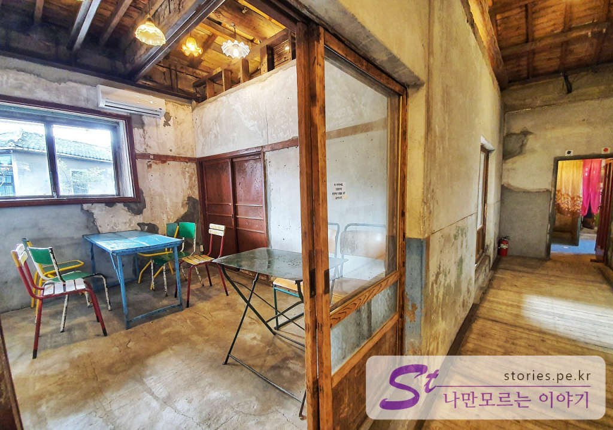

역사적인 아픔을 간직하고 있던 강화도에 이제는 더이상 역사를 탐방하기 위해서만 갈 필요가 없어 졌습니다. 강화도는 역사적인 의의도 깊지만 많은 방직공장으로도 유명했던 섬입니다. 그렇게 문을 닫은 방직공장을 그냥 버리지 않고 새롭고 트렌디한 카페로 다시 탈바꿈 시켜, 이제는 강화읍의 대표 관광방문지가 되었습니다.  

  
조양방직도 크기가 크지만 주차장도 상당히 큽니다. 웬만하면 주차장이 모자랄 일은 없을 것 같습니다.  

  
주차장은 조양방직의 행길 건너 편에 있습니다. 주차를 하고 횡단보도로 건너야 입장을 할 수 있습니다.  

  
조양방직의 입구에 들어서면 카페라는 푯말 보다는 미술관이라는 표지판이 먼저 보입니다. 실제로 카페도 카페지만 미술관으로서의 가치도 높습니다.  

  
옛날에 방직공장 직원들을 실어 나르던 버스입니다. 이제는 운행 하지 않지만 그때의 그 모습을 그대로 간직하고 있습니다.  

  
이제 실내로 들어가면 방직공장의 예전 모습을 볼 수 있습니다. 부서진 벽면은 사진찍기에 너무 좋은 장소가 되었습니다. 물론 깨끗하게 처리하여 더럽거나 냄새가 나지 않습니다.    

  
첫번째 건물을 통과해서 나오면 전화부스가 보입니다. 레트로한 느낌이 물씬풍깁니다. 많은 사람들이 여기서 사진을 찍으려고 줄을 섭니다.  

  
아이들이 좋아하는 말이 있습니다. 바로 앞에는 화장실이 있구요.  

  
금성 트렉터도 보이네요. 예전에는 비싼값하며 열심히 활동을 했을텐데 이제는 세월의 흔적이 물씬 묻어 있습니다. 여기도 느낌있는 사진을 찍을 수 있습니다.  

  
바로 옆에는 조양방직의 매인 카페가 보입니다. 매인카페와 별관이 같이 운영된다고 했었는데 저희가 갔을때는 별관은 운영하지 않고 매인카페만 운영을 하고 있었습니다.   

  
카페의 별관입니다. 현재는 운영을 하지 않는 것 같습니다. 세월의 흔적이 묻어 있는 실내의 공간만 구경하고 사진을 찍을 수 있습니다.   

  
세월의 흔적이 묻어 있는 공간입니다. 사진으로 세월을 담을 수 있습니다.   

  
커피를 마실 수 있는 공간이였던것 같은데 현재는 별관 운영을 하지 않아서 그냥 쉬어갈 수 있는 자리라고 보시면 됩니다.   

   
싱거 미싱이 상당히 오래된 브렌드였네요. 그때 사용하던 싱거 미싱인것 같습니다.   

  
3번째 건물로 들어서면 또다른 전시품의 실내를 만날 수 있습니다. 그곳에 이게 왜? 있는지 모르겠지만 프로펠러도 있습니다.  

  
딱 조명처럼 생겼습니다. 빛은 나오지 않지만 기분만 살려봤습니다.  느낌 나오네요. 

  
3번째 건물을 나오면 바로 앞쪽에 메인 카페 건물을 만날 수 있습니다.  
입장을 위해서는 건물을 돌아서 정문쪽으로 입장해야 합니다.   

  
메인카페의 실내 입니다. 실내에서 밖을 보는 모습도 운치있지만 밖에서 안을 보는 것도 운치가 있습니다.   

  
아까 봤던 메인카페 입구입니다. 사람들이 줄을 많이 서 있습니다. 커피의 가격도 일반 카페보다 비싼 편입니다.   

  
커피를 주문하는 카운터입니다. 장사가 너무 잘 되네요. 커피 외에도 다양한 음료가 있습니다. 가격은 좀 비싼 편입니다. 2명이상이라면 한사람은 주문을 하고 한사람은 자리를 맞아 놓는 것이 좋습니다.   

  
멋지고 웅장합니다. 이 모습을 보러 조양방직을 찾아오는 것이라 할 수 있습니다.   

  
예전에는 여기에서 사람들이 미싱을 돌렸을 텐데... 이제는 커피를 마시는 곳이 되었네요.  

  
아까 외부에서 보던 통유리의 카페 내부에서 바깥을 바라보는 풍경입니다. 대충 사진찍어도 잘 나오는 인테리어 입니다.   

   
옛날 소품들이 곳곳에 전시가 되어 있습니다. 전화기와 텔레비전, 라디오가 멋지네요.  

  
입구쪽을 바라보고 찍은 모습입니다. 너무 느낌있고 멋집니다. 커피가 비싸기는 하지만 충분히 그 값어치는 하는 가격이라고 할 수 있습니다.   

강화의 핫플레이스 입니다. 이번에 **더 짠내투어**에서도 다녀 간 것 같습니다. 한번 다녀와 보는 것도 좋습니다.  

## 입장시간  
- 시작시간 : 오전 11:00 
- 마감시간 : 오후 9:00 (목,금,토,일은 오후 10:00)

## 여행지 정보  
- 주소 :  인천광역시 강화군 강화읍 신문리 589-23   
- 연락처 : 032-933-2192    

    <iframe src='https://www.google.com/maps/embed?pb=!1m18!1m12!1m3!1d3154.845604561552!2d126.47808531559215!3d37.74676622154287!2m3!1f0!2f0!3f0!3m2!1i1024!2i768!4f13.1!3m3!1m2!1s0x357c7b128e05c4c5%3A0xb7c8a4e74ab9750e!2z7KGw7JaR67Cp7KeB!5e0!3m2!1sko!2skr!4v1581960463519!5m2!1sko!2skr' class='embed-responsive-item' allowfullscreen></iframe>

## 주차정보  

~~매우 넓은 주차장을 보유하고 있습니다.~~ 
**혁님**의 댓글 제보에 의하면 주차장은 넓으나 현재 미어 터지고 있다고 합니다. 

   
