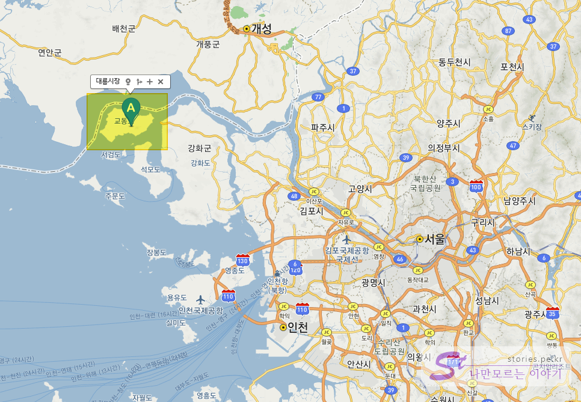

옛 추억의 시간이 멈춰있는 곳 교동도의 대룡시장입니다. 북한과 매우 가까운 곳으로 원래는 섬이였는데 교동대교가 개통되면서 왕래가 쉬워져서 관광객의 방문이 자유로워진 곳입니다. 원래는 민간인 출입 통제구역인데 교동대교에서 쉽게 통행증을 받아서 출입을 할 수 있습니다.  

  

> 대룡시장은 6.25때 황해도 연백군에서 교동도로 잠시 피난 온 주민들이 한강하구가 분단선이 되어 고향에 다시 돌아갈 수 없게 되자 생계를 유지하기 위해 고향에 있는 연백시장의 모습을 재현한 골목시장이다. 50여년간 교동도 경제발전의 중심지였으며 지금은 시장을 만든 실향민 어르신 대부분이 돌아가시고 인구가 급격히 줄어들면서 시장의 규모도 상당히 줄었다. 그러나 2014년 7월 교동대교 개통과 함께 1960년대 영화세트장 같은 모습의 대룡시장을 카메라에 담기 위한 관광객들의 필수코스가 되었다. 지난 3월 말부터 교동기가아일랜드(일명 "교동제비집")이 운영되고 있는데 교동제비집은 관광객들에게 IT 기반의 관광안내는 물론 자전거, 스마트워치 대여 서비스를 제공하며 ''VR 영상 체험'', ''교동신문 만들기'' 등 다양한 체험 프로그램을 마련되어 있다.  
> _[대한민국구석구석](https://korean.visitkorea.or.kr/) 발췌_

교동도 주민이 아니고 방문객인 경우 교동대교를 지나기 전에 검문을 하게 됩니다. 검문을 심하게 하는 것은 아니고 차량용 출입증을 발급해 줍니다.  출입증을 발급받아 차의 대쉬보드에 올려놓으면 됩니다.  
그렇게 교동대교를 지나 10분정도 달리다 보면 대룡시장을 만날 수 있습니다.  

  
대룡시장을 방문하는 사람은 대부분 제비집을 찾아서 옵니다. 이곳에 방문자를 위한 커다란 주차장도 있고 안내시설도 있어서 대룡시장 여행의 시작점으로 최적이기 때문입니다.    

  
제비집 앞의 커다란 주차장입니다.  

  
제비집에서는 자전거도 대여를 할 수 있습니다. 가격도 적당합니다. 다만 오후 5시정도에 방문을 했었는데 운영시간이 끝나서 저는 빌릴 수가 없었습니다.   

   
`1층`에서는 자전거대여와 관광안내소가 있고 `2층`은 전시관과 카페, 전망대가 있습니다.  

    
1층에는 교동도의 자연경관 사진과 버튼을 누르면 안내해 주는 안내 데스크가 있습니다.   

    
5,000원에 옛날 교복을 빌려 입고 사진을 찍을 수도 있고 4,000원 또는 8,000원에 자전거를 대여해서 탈 수 있습니다.   

  
2층에 올라서면 카페와 전시관 그리고 바깥을 볼 수 있는 전망대도 있습니다.   

   
전망대에서 망원경을 통해 저 멀리 보면 새들의 군무를 볼 수 있습니다. 이 곳이 자연환경이 좋다보니 새들의 도래지 인것 같습니다.  

  
이제 제비집을 나와서 대룡시장으로 향합니다. 주차장을 나와 사거리를 건너면 `대룡시장`이 나옵니다.    

   
대룡시장에 들어서면 골목과 골목에 시장이 형성되어 있습니다.  

   
처음 만나는 맛집은 핫도그집입니다. 명량 핫도그와 비슷한 모양세 입니다.  

  
한입 베어먹어봐습니다. 오랜만에 먹어서 그런지 맛있었습니다.  명랑핫도그와 비슷한 맛입니다. 

   
나름 이곳에서 유명한 먹거리인 **뚱이호떡**입니다. 1,500원이면 저럼하지는 않지만 그래도 추억의 맛이라 생각하면 그런대로 적당한 가격인것 같습니다.   

  
또하나의 먹거리는 찹쌀꽈배기 입니다. 보니 맛있다고 하는것들은 다 튀김류이네요. ^^  

   
또하나, 뻥튀기와 한과류를 판매하는 곳입니다. 많은 사람들이 하나씩 사서 들고다니면서 먹더라구요.  

   
방앗간이라고 써있고 김치와 빵을 판매하네요. 간판만 방앗간인가봐요..

   
커피콩 이발소인데 이발소는 아니고 커피집입니다.  

  
상점을 뒤로하면 이런 뒷골목도 있습니다. 나름 벽화로 꾸며놨습니다.  

   
시골의 풍경을 간직하고 있는 파전집입니다. 먹어보지않아서 맛있는지는 모르겠습니다.  

  
해질녘 교동다방이 있는 골목길의 풍경입니다.  

  
제비가 찾는 청정지역인 대룡시장의 마스코트가 제비인가 봅니다.   

## 비용  
별도의 비용은 없습니다. 다만 시장을 구경하면서 주전부리할 정도의 비용이면 됩니다. 

## 입장시간  
- 시작시간 : 오전 8:00  
- 마감시간 : 오후 10:00    

## 여행지 정보  
- 주소 : 인천광역시 강화군 교동면 대룡리 460-8    
- URL : [https://korean.visitkorea.or.kr](https://korean.visitkorea.or.kr/detail/ms_detail.do?cotid=2a54e990-951a-4203-82eb-592be2ba3c99&temp=)  

    <iframe src='https://www.google.com/maps/embed?pb=!1m18!1m12!1m3!1d5303.2636088296695!2d126.27796970813854!3d37.78263302620095!2m3!1f0!2f0!3f0!3m2!1i1024!2i768!4f13.1!3m3!1m2!1s0x357c734363d79fcf%3A0xe619b42a0c13b2ef!2z64yA66Oh7Iuc7J6l!5e0!3m2!1sko!2skr!4v1582038422969!5m2!1sko!2skr' class='embed-responsive-item' allowfullscreen></iframe>

## 주차정보   

기본적으로 제비집 건물 앞의 주차장에 주차를 많이들 하는데 우리는 잘 모르고 대룡시장에 들어온 바람에 농협주차장에 주차를 하게 되었습니다.  

   
토요일에 방문해서 마침 농협은 문을 닫은 상태이고 현지인이나 여기 주차장을 아는 사람만 주차를 해서 그런지 주차에 여유가 있었습니다.   

제비집 앞 주차장을 추천드리며 여유치 않을 경우는 여기도 괜찮은것 같습니다.  

