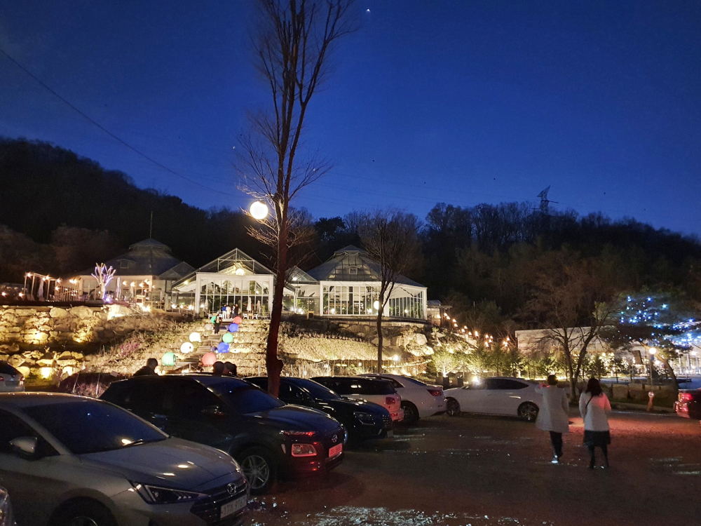
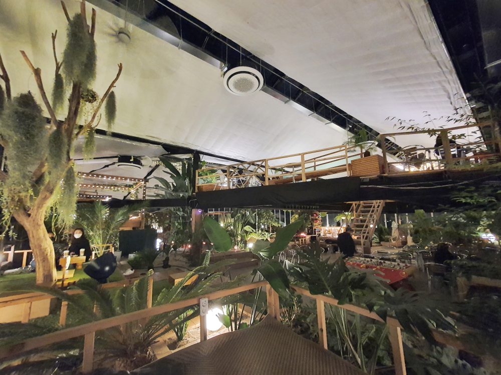
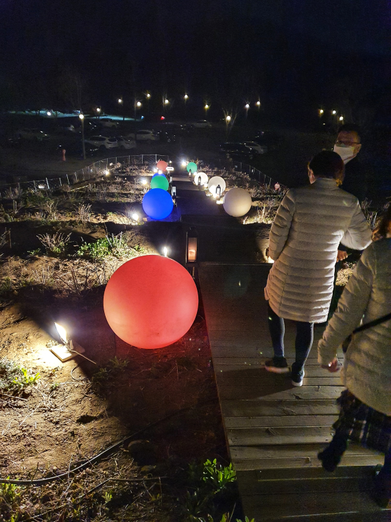

어제 지인과 함께 잠시 수다를 떨기 위해 요즘 남양주에서 핫 하다는 **비루개 식물원 카페**를 다녀왔습니다. 아무 준비없이 처음 가본 곳이였는데 상당히 분위기 있고 느낌있는 카페였습니다. 

  
남양주 청학리 방향으로 차를 몰고 가다가 용암리 셋길 쪽으로 구비구비 산길을 타고 올라갑니다. 여기가 맞나?? 싶을 때 쯤 조그만 푯말로 **비루개** 라고 써있는 나무  이정표를 만나게 됩니다. 그 이정표를 따라 조금만 더 올라가면 눈에만 담기에는 아까운 웅장한 비루개 카페가 모습을 드러냅니다. 저는 저녁에 도착을 했기 때문에 화려한 조명이 우리를 맞이해 주었습니다. 넓은 흙바닥 주차장에 차를 주차하고 오른쪽에 있는 **비루개 카페**로 먼저 향합니다. 
비루개는 카페 건물과 식물원 건물로 나누어져 있는데 먼저 오른쪽에 있는 비루개 카페에서 음료를 구매하여 들고 왼쪽에 있는 **허브 식물원**으로 가서 멋진 풍경을 안주삼아 커피를 마실 수 있게 되어 있습니다. 

   
허브식물원은 온풍기와 에어컨으로 적당한 온도를 유지하고 있고 다양한 허브식물과 나무로 공기를 정화하고 있습니다. 또한 다양한 방식의 의자와 탁자가 준비되어 있습니다. 바닥에 주저앉아서 커피를 마실 수 있는 좌식형 자리도 있고 탁자와 의자도 있습니다. 젊은 연인, 가족, 친구끼리 다양한 사람들이 와서 커피를 마십니다.  

   
그렇게 3시간동안 커피를 마시며 수다를 떨고 이제 수목원을 나와 내려가는 길입니다. 
지인과 같이 오는 바람에 사진을 많이 찍지 못한게 너무 아쉽습니다. 근처에 사신다면 꼭 한번 다녀오시라고 추천하고 싶은 장소입니다.  

## 비용  
비용은 따로 없고 음료수 값으로 이용할 수 있습니다. 

- 다방커피 : 5,000원
- 아메리카노 : 5,000원
- 핫초코 : 6,500원
- 아이스초코 : 7,500원 

## 입장시간  
- 시작시간 : 13:00    
- 마감시간 : 23:00   
- 휴무일 : 매주 화, 수요일 (공휴일 제외)  

## 여행지 정보  
- 주소 : 경기 남양주시 별내면 용암비루개길 219-88  
- 연락처 : 031-841-7612  

    <iframe src='https://www.google.com/maps/embed?pb=!1m18!1m12!1m3!1d891.8380535079281!2d127.12505689218898!3d37.73646070570851!2m3!1f0!2f0!3f0!3m2!1i1024!2i768!4f13.1!3m3!1m2!1s0x0%3A0xf834bb27c52275d5!2z67mE66Oo6rCc!5e0!3m2!1sko!2skr!4v1586875109530!5m2!1sko!2skr' class='embed-responsive-item' allowfullscreen></iframe>

## 주차정보  
주차장 넓어요
