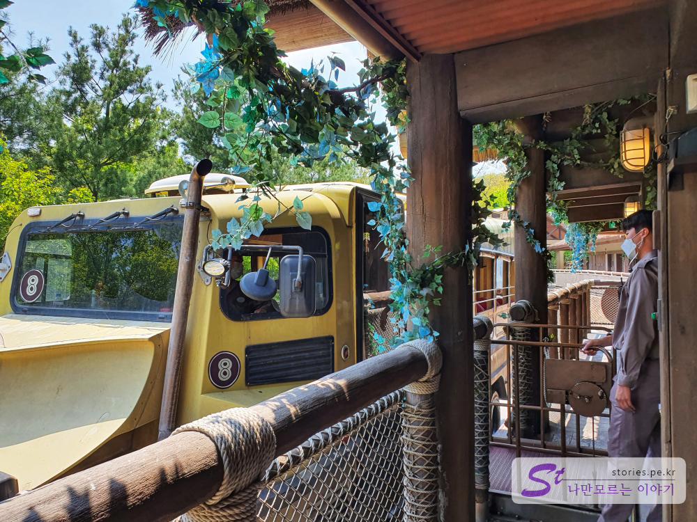

봄이 성큼 다가왔습니다. 코로나19가 어느정도 잠잠해진 이 때 봄을 즐기기 위해 실내보다는 왠지 좀 더 안전할 것만 같은 실외를 찾아봤습니다. 그 중에 원탑이라면 에버랜드를 손에 꼽을 수 있을 것입니다. 휴일을 맞이한 지금 에버랜드 분위기는 어떤지 알려드리겠습니다.  

  
에버랜드를 방문하면 항상 우리를 설레게 하는 매직트리를 볼 수 있습니다. **매직트리**는 할로윈이나 봄, 여름, 가을 등.. 그때 그때 시기에 맞게 옷을 갈아 입습니다. 오늘은 봄 향기가 물씬나는 옷을 입고 있네요.   

### 주토피아    
   
우리는 어트렉션보다는 산책을 위해 주토피아로 먼저 향했습니다. 처음 만난 곳은  **판다월드**입니다. 덩치에 맞지 않게 귀여운 판다가 대나무를 먹는데 여념이 없습니다. 

  
반대편에서도 팬더가 있네요. 정말 귀엽게 생겼습니다. 

   
판다를 모두 구경하고 나오면 여지없이 자본주의의 꽃 쇼핑샵을 만날 수 있습니다. 우리들은 아무런 유혹도 없이 빠져 나올 수 있었지만 만약 아이들이라도 같이 갔다면 맨손으로 쉽게 빠져나올 수 없게 되어 있습니다. 

   
조금 아래로 내려오다보면 자칫 그냥 지나치기 쉬운 장소에 버드 파라다이스로 들어가는 입구가 있습니다. 새들의 좀 보고 나오면 타이거 밸리가 나옵니다.   

   
예전의 타이거 밸리는 깊은 도랑이 있고 도랑 넘어 저~~ 멀리에 호랑이가 콩알만하게 보였었는데.. 지금은 도랑을 없애서 아주 가까이서 호랑이 코딱지까지도 볼 수 있습니다. 호랑이에게 훈련을 시킨 것인지 30분마다 모든 사람이 다 볼 수 있게 유리벽을 한바퀴 돌더라구요.
실제로 보면 무시무시합니다. 유리 창이 있어서 망정이지....

### 로스트밸리    
   
조금만 더 내려오면 로스트밸리를 만날 수 있습니다. 오기 전에 로스트밸리를 엄청 기대하며 왔는데.. 기대감으로 1시간 30분을 기다렸는데.. 체험하면서 엄청 실망해 버렸습니다.  

  
로스트밸리의 시그니쳐와 같은 수륙양용차를 타고 갔으면 최소한 구정물이라도 밟아야 하는데 무슨 이유에서 인지 물길을 비켜서 지나 가더군요. 열받어... 
같이 간 사람들한테 물로 들어간다고 엄청 아는체 했는데...  

  
  
그래도 로스트밸리의 백미인 기린을 가까이서 보는 것은 경험해 봤습니다. 호수같이 커다란 눈과 마주쳤을 때는 정말 빨려 들어가는줄 알았어요 정말 커요.

   
낯이라 치타부부는 그늘막 아래에서 쉬고 있었습니다. 
마치 내가 집사람에게 당하고 있는 대우를 받는 것 같아서 안타까운 마음에 찍어 봤습니다. 치타 부인이 다리 한쪽을 치타 남편에게 올려놓고 자네요.

### 아마존 익스프레스   
  
일찌감치 애버랜드앱에 입장권을 등록해놔서 **레니의 러키찬스**를 활용하여 편하고 빠르게 입장을 하려고 했습니다만....예약 정시에 딱 기다려서 예약을 광클했으나.. 예약시작 0.1초만에 모두 예약마감이 되어버렸습니다. **레니의 러키찬스**로 이득을 보는 사람도 있겠으나 나이들어 클릭 속도가 떨어지면 뭐.. 그냥 그림의 떡이 더라구요. 바로 포기했습니다. 그냥 줄서서 들어갔습니다. 

아마존 익스프레스는 방송 때문에 상당히 유명해 졌습니다. 이 어트렉션도 꽤 긴 줄을 형성하고 있었는데, 워낙 회전율이 좋아서 30~40분정도 기다리면 탑승을 할 수 있었습니다.  일정 시간이 되면 직원들이 아주 재미있는 단체 쇼를 보여줍니다. 보고 있으면 내가 정말 놀이동산에 온 느낌이 물씬 납니다.  

  
탑승하는 한척의 배는 총 10명이 탑승할 수 있 수 있습니다. 물에 떠다니며 즐기는 어트랙션이기 때문에 어느정도 옷이 젖을 것은 각오해야 합니다. 
물이 옆으로도 많이 들이치기 때문에 방수막으로 옆면도 신경써서 잘 붙혀야 합니다.  

### 스낵버스터  
   
5분 타기위해 2시간 줄서서 기다렸더니 이제 허기가 지기 시작했습니다. 아마존 익스프레스에 가까운 스낵버스터로 갔습니다. **스낵버스터**는 분식 위주의 음식을 아주 비싼가격에 판매를 하고있는 음식점입니다. 스낵버스터에서 떡볶이와 어묵, 치킨으로 간단히 점심을 먹고 나왔더니 우연하게 일정이 맞아 카니발을 구경하였습니다. 
코로나19로 사람이 많지 않을 줄 알았는데 다들 답답했는지 상당히 많은 사람들이 애버랜드를 찾아 온 것 같습니다.   

  
무서버라.. 기둥 꼭대기에 사람이 매달려 있네요. 이사람들 생명수당은 줄라나요?

  
화려한 카니발이 이제 막바지에 다달았습니다. 색감이 너무 이쁘네요.

### 포시즌스 가든
 
우리에게는 에버랜드의 하이라이트라 할 수 있는 **포시즌스 가든**입니다.   

  
지금은 튤립과 같은 봄 꽃 들로 화려하게 장식되어 있습니다. 어디에서 사진을 찍든 멋진 사진을 담을 수 있습니다.   

  
이건 뭐야.. 뭔지 모르지만 솜뭉치같기도 하고...

  
포시즌스가든에서 장미원으로 가는 길에 시원하게 물줄기를 뿜어내고 있는 분수와 트리를 만날 수 있습니다. 잘만 찍으면 인생샷을 건질 수 있는 장소 입니다. 

  
장미성에서 장미원을 바라보고 사진을 찍으면 멋진 사진을 얻을 수 있습니다. 아직 장미가 만개하지는 않았지만 **"니가 장미야~~"** 라는 오글멘트를 던지면 그날은 사랑받을 수 있을 겁니다.  

  
이제 마지막으로 스카이웨이를 타고 매직트리로 올라가면 얼추 하루가 마무리됩니다.  

## 비용   
예전에는 입장권과 자유이용권이 나누어져 있어서 매번 어트렉션을 이용하기 위해서는 손목태그를 보여주거나 목에 걸려있는 자유이용권을 보여줘야 했었는데 이제는 모두 자유이용권으로 통일을 해서 어트렉션을 이용하기 위해 손목태그나 목걸이를 보여줄 필요가 없게 되었습니다.  이용 편의성 면에서는 좋아 졌으나 어트렉션을 이용하지 않아도 자유이용권을 구매해야 하니 비용 면에서는 손님 손해라고 할 수 있겠습니다.  

### 종일 이용권  
- 주간이용권(1일) (대인) : 56,000원
- 주간이용권(1일) (청소년) : 47,000원
- 주간이용권(1일) (소인/경로) : 44,000원

### 야간 이용권  
- 야간권(16시이후) (대인) : 46,000원
- 야간권(16시이후) (청소년) : 40,000원
- 야간권(16시이후) (소인/경로) : 37,000원

가격은 위와 같으나 **카드할인이나 네이버쇼핑**에서 구매를 하면 **30 ~ 60**%정도 할인된 가격에 이용할 수 있습니다.  
가장 많이 할인이 되는 방법은 **에버랜드 제휴카드로 스마트예약**입니다. **61**%을 할인 해 줍니다. 
> 스마트예약이란 스마트폰 에버랜드앱을 설치하고 거기서 예약을 하는 것을 말해요.  

## 입장시간  
- 시작시간 : 10:00 
- 마감시간 : 21:00
- 휴무일 : 연중휴무

## 여행지 정보  
- 주소 : 경기 용인시 처인구 포곡읍 에버랜드로 199  
- 연락처 : 031-320-5000    
- URL : http://www.everland.com/web/everland/main.html 

    <iframe src='https://www.google.com/maps/embed?pb=!1m18!1m12!1m3!1d1413.8794826227454!2d127.20242547690822!3d37.29390683182507!2m3!1f0!2f0!3f0!3m2!1i1024!2i768!4f13.1!3m3!1m2!1s0x357b5403ce34d773%3A0x1fa18ab619238098!2z7JeQ67KE656c65Oc!5e0!3m2!1sko!2skr!4v1589124870021!5m2!1sko!2skr' class='embed-responsive-item' allowfullscreen></iframe>

 
## 주차정보  
에버랜드의 주차장은 매우 크기로 유명합니다. 넓은 대지에 여러 군데로 나누어져 있어서 무료주차가 충분히 가능합니다. 다만 애버랜드 입구 쪽에 있는 MA, MB, MC 주차장은 아주 일찍 방문하지 않는 이상 주차하기가 하늘에 별따기 이니 그냥 멀리 있는 주차장에 주차를 하고 셔틀버스를 타고 오는 것이 속편합니다. 

## 기타사항  
에버랜드를 이용할 것이면 일행 중 한명 이상은 에버랜드 앱을 설치하고 일행의 모든 자유이용권을 모두 등록을 하는 것이 좋습니다. 등록을 하면 **30분마다 하나의 레니의 러키찬스를 줍니다**. 럭키찬스 5개를 모으면(2시간 30분 소요) 원하는 어트렉션 하나를 기다리지 않고 바로 탈 수 있습니다. 그러나 인기있는 어트렉션을 예약 성공하려면 엄청난 광클이 필요합니다.  
