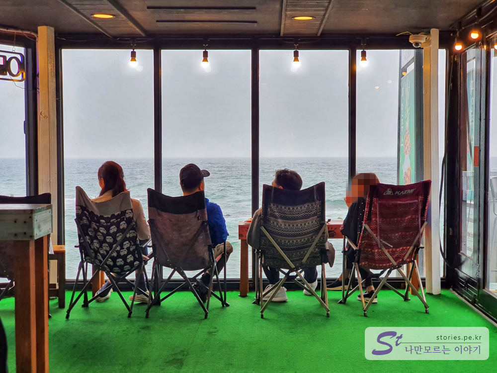
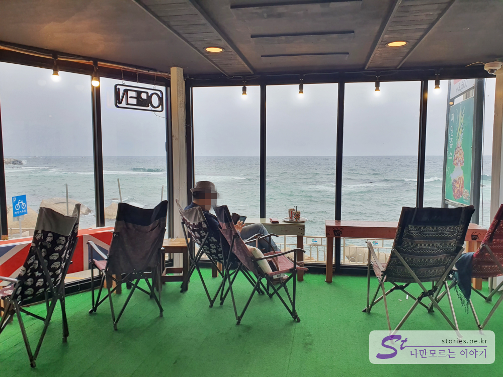

양양과 속초를 여행하면서 우연히 알게된 전망 좋은 카페가 있습니다. 카페라고 하기 보다는 커피집이라고 하는게 더 어울릴것 같은 이름이지만 2층에서 바라보는 풍경은 마치 디저트와 같은 곳입니다. 
원래는 유명한 **바다정원**을 가려고 했으나 너무나 많은 사람들 때문에 쉼을 얻기에는 어려울것 같아 영금정 쪽으로 차를 돌렸습니다. 속초에 대해서 잘 아시는 분이 추천해서 만나게 된 **새마을 커피**집입니다. 

  
사진을 보니 어떤가요? 모르고 보면 그냥지나치기 쉬운 별거 없어 보이는 그저그런 커피집입니다.  
이 커피집의 테마는 **추억**입니다. 입구에서 부터 2층에 올라서도 어릴 때 경험하던 추억의 물건과 음식, 불량식품같은 것들이 먼저 반깁니다. 음료의 가격은 대략 4000원 ~ 6000원대로 형성이 되어 있습니다. 

   
이 커피집의 강점은 바로 2층에 있는 바다전망 테이블 입니다. 

  
의자도 편안한 캠핑의자를 비치해 놔서 딱 분위기가 좋습니다. 여기에서 무엇을 마시는지는 중요하지 않습니다. 평온하게 바다를 보며 마시면 그 무엇도 명품커피가 됩니다. 

해변을 바라보며 커피를 마시는 카페는 수도 없이 많겠지만 여기는 여기 나름대로의 분위기를 가지고 있는 아지트와 같은 곳입니다. 아무에게도 말하지 말고 딱 님만 아시기 바랍니다. ^^

## 여행지 정보  
- 주소 : 강원도 속초시 영랑해안길 91     

    <iframe src='https://www.google.com/maps/embed?pb=!1m18!1m12!1m3!1d783.7005145138577!2d128.59770982920392!3d38.21449199873013!2m3!1f0!2f0!3f0!3m2!1i1024!2i768!4f13.1!3m3!1m2!1s0x0%3A0x0!2zMzjCsDEyJzUyLjIiTiAxMjjCsDM1JzUzLjciRQ!5e0!3m2!1sko!2skr!4v1589472421306!5m2!1sko!2skr' class='embed-responsive-item' allowfullscreen></iframe>

## 주차정보  
주차는 해안도로에 주차를 하면 됩니다. 
