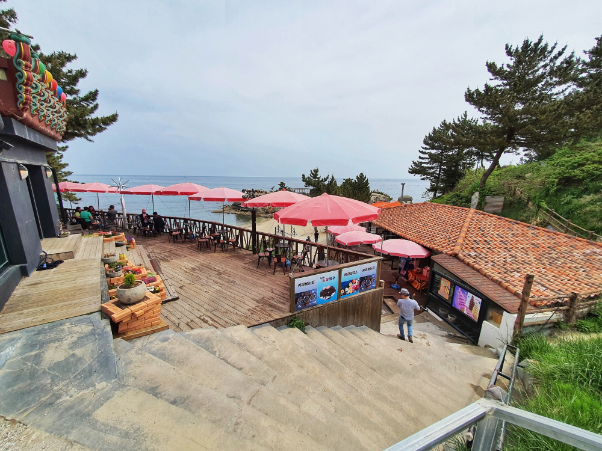
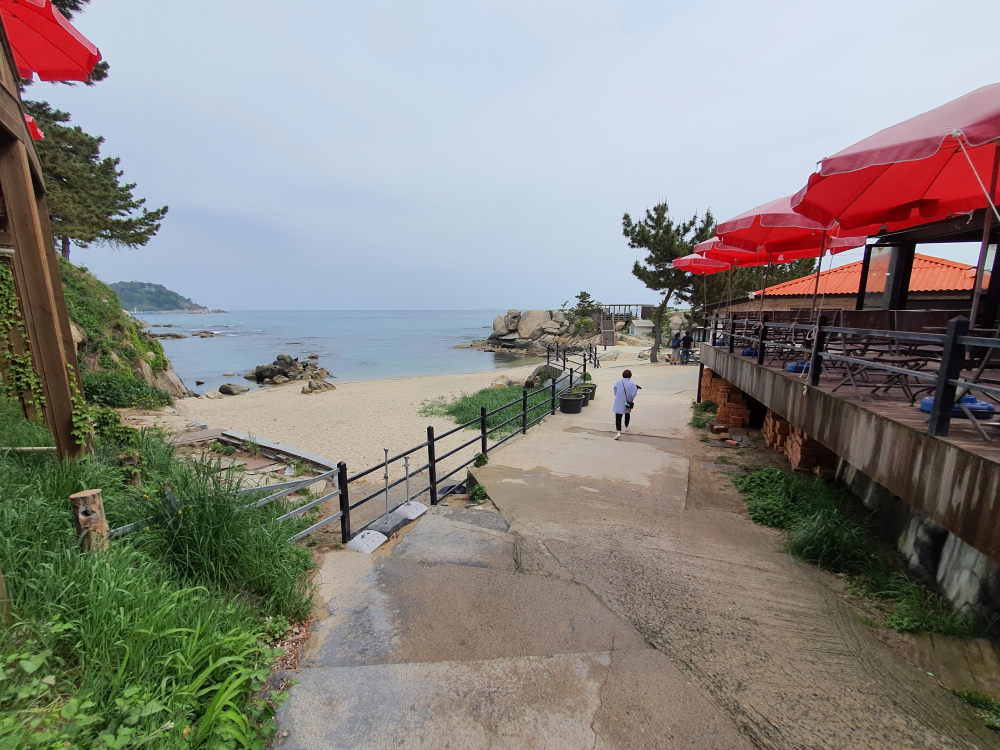
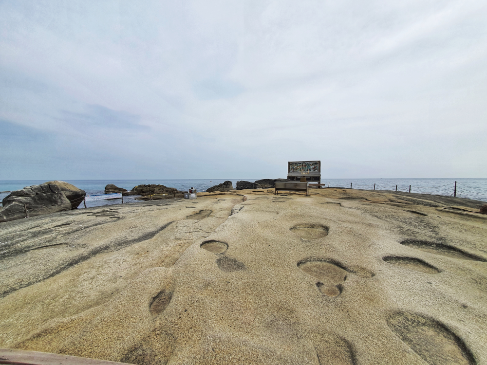
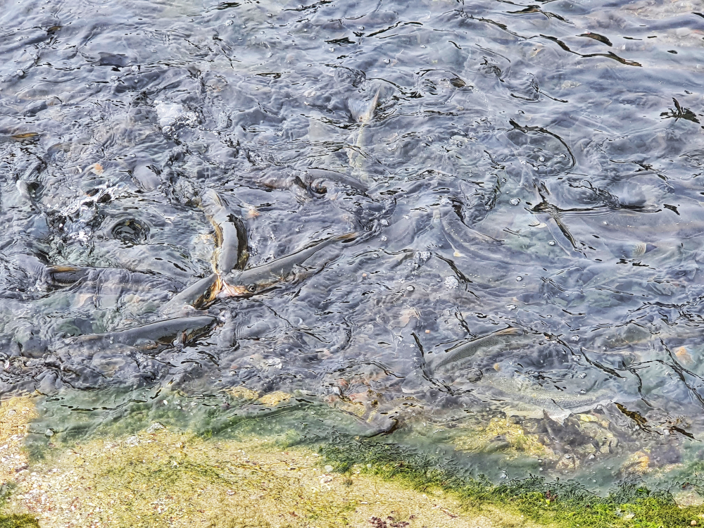
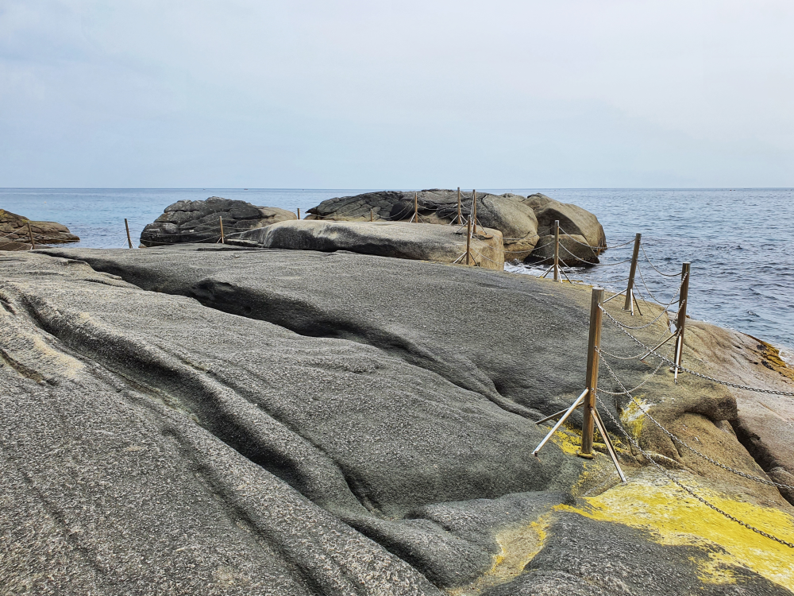
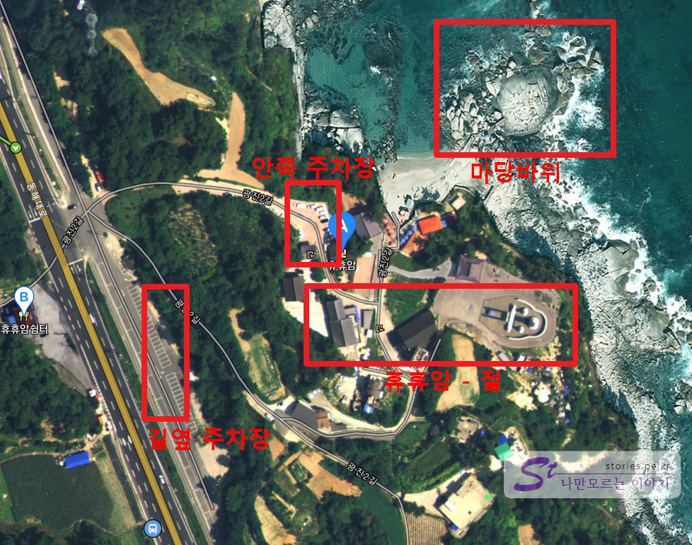

코로나19로 너무 답답하여 서울에서 새벽 6시30분에 출발하여 **서울양양고속도로**를 타고 양양으로 내 달렸습니다. 홍천휴게소에 한번 쉬고 약 2시간 30분만에 양양에 도착했습니다. 첫번째로 도착한 곳이 휴휴암입니다. 바다를 내려다 볼 수 있는 절이 있고 그 앞 바다에 넓은 바위가 있는 곳입니다. 

  
휴휴암의 주차장에 주차를 하고 길을 따라 내려 갑니다. 내려가는 길에 절에서 운영하는 카페를 만날 수 있습니다.  

   
조금만 더 내려가면 바다위에 있는 마당바위를 볼 수 있습니다.  

  
아주 넓게 펼쳐져있는 바위 위에 절에서 세워놓은 모금함이 아쉽기는 했지만 잠시 쉬어가기에는 좋았습니다.  

  
바위에는 물고기 먹이를 유료로 판매하는 곳이 있습니다. 항상 물고기 먹이를 주어서 그런지 엄청난 물고기들이 모여있어 장관을 이루고 있습니다.  

   
잠시 바위에 걸터앉아 바다를 보며 휴식을 취하고 올라오면 딱 좋습니다. 

## 비용  
비용은 전혀 없습니다. 가는 길에 찾집이 있으니 음료를 먹을 비용과 물고기 밥을 주려면 물고기밥 비용정도만 듭니다.  

## 여행지 정보  
- 주소 : 강원 양양군 현남면 광진2길 3-16   
- 연락처 : 033-671-0093 
- URL : https://www.gangwon.to/tour/gangwondo_trip/tourist_spot?control=AG0036_T&tourCode=TOSIGK00    

    <iframe src='https://www.google.com/maps/embed?pb=!1m18!1m12!1m3!1d3145.698157339816!2d128.7658669151799!3d37.96083327972601!2m3!1f0!2f0!3f0!3m2!1i1024!2i768!4f13.1!3m3!1m2!1s0x5fdf56132ecb9da9%3A0xdd668a093c7f5347!2z7Zy07Zy07JWU!5e0!3m2!1sko!2skr!4v1589210058273!5m2!1sko!2skr' class='embed-responsive-item' allowfullscreen></iframe>

## 주차정보   
안쪽에 있는 주차는 절에서 운영하는 조그만 주차장이 있습니다. 방문객이 많지않다면 이곳에 주차를 할 수 있지만 휴일이나 성수기에는 길 바로 옆에 있는 주차장에 주차를 하고 걸어 들어가야 합니다.  
  

