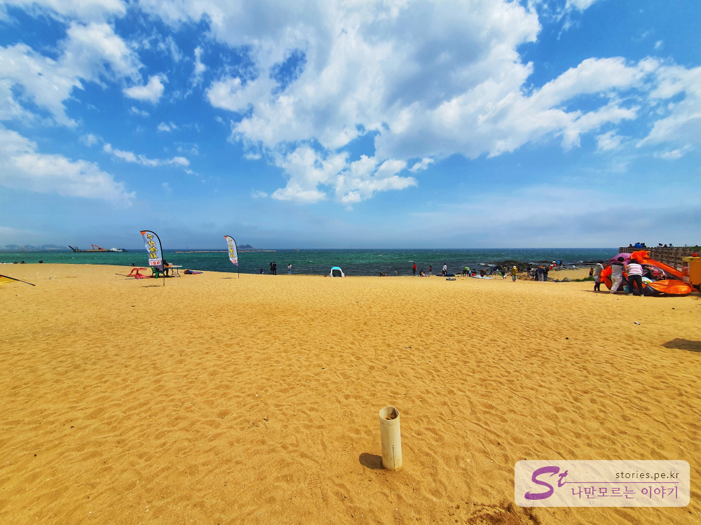
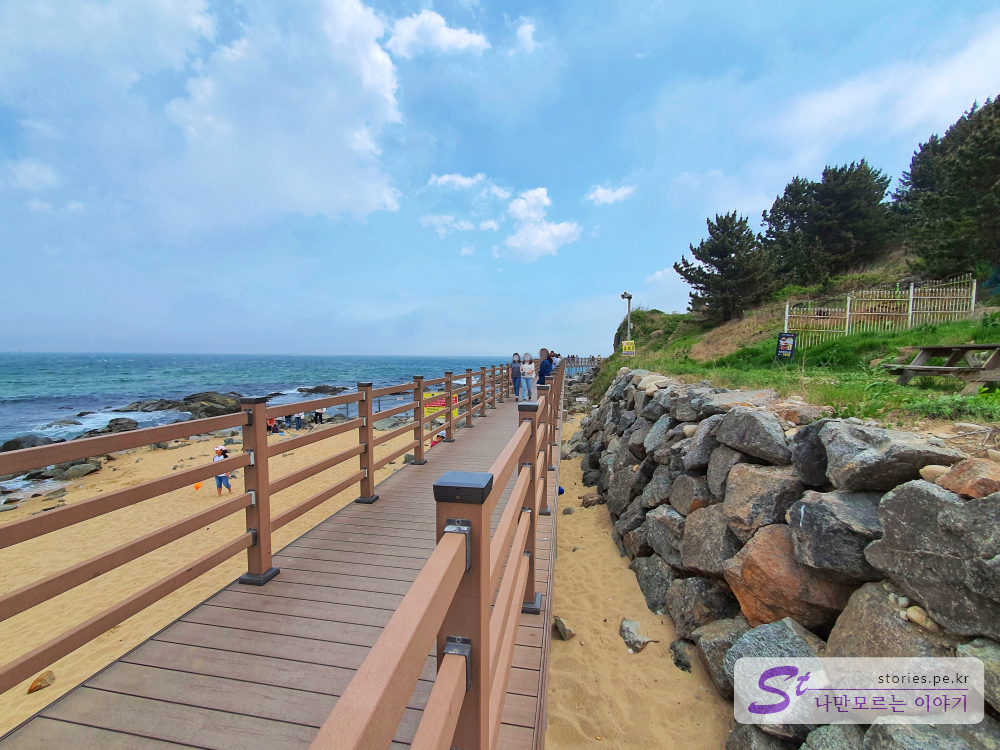
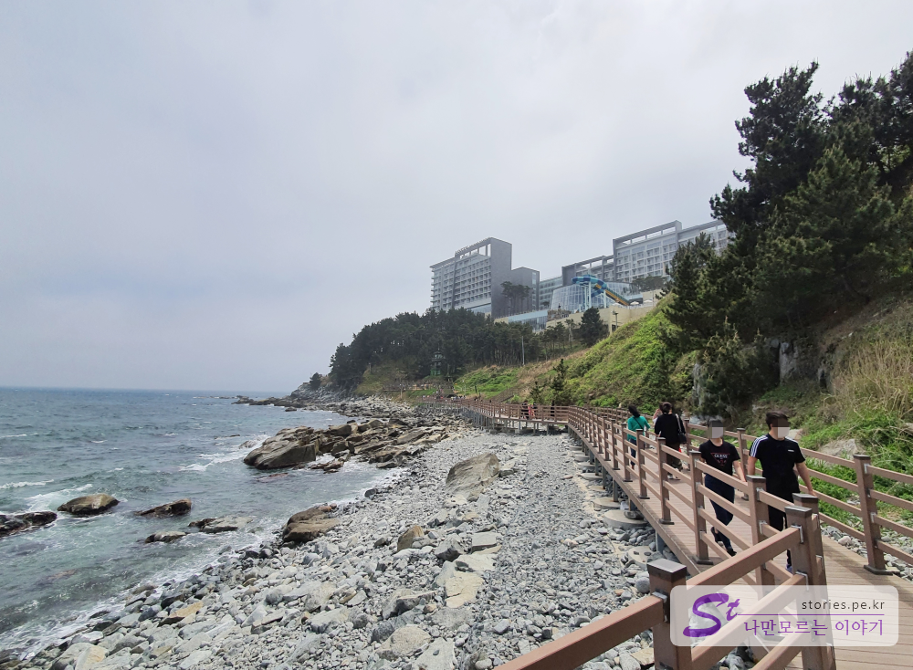
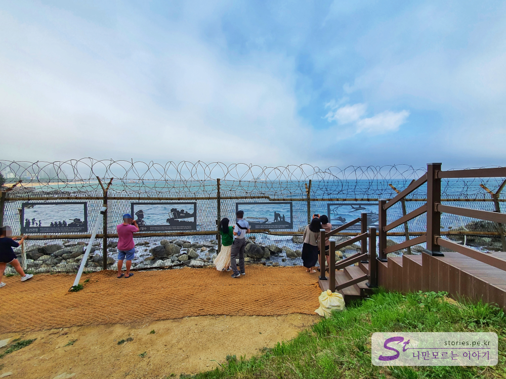
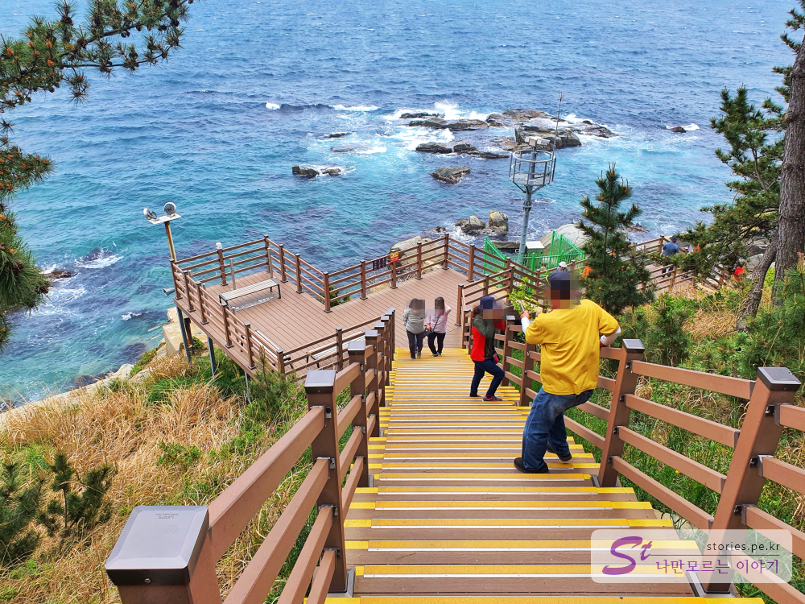
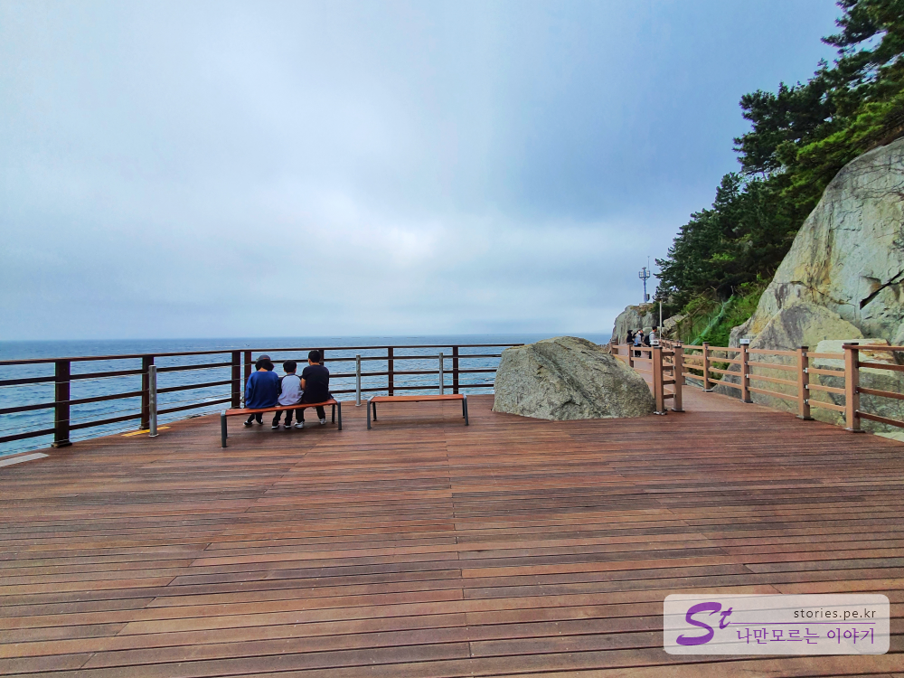

당일치기로 새벽을 달려 양양 [휴휴암에 도착하여 물고기 떼 좀 보고](https://blog.stories.pe.kr/454) [하조대에 들러 바다를 동경하는 노송을 본 다음](https://blog.stories.pe.kr/455) 바로 속초로 넘어와서 외옹치항으로 달렸습니다. 작년에 오픈한 **외옹치항 둘레길**인 이름도 이쁜 **바다향기로**를 걸어보고 싶었습니다.   

  
외옹치해변 주차장에 주차를 하고 모래가 펼쳐져있는 바다를 향해 걸어오다보면 오른쪽에 길게 뻗어 있는 나무 데크를 만날 수 있습니다.   

  
롯데리조트를 끼고 도는 약 1Km의 걷기 좋은 **바다향기로**를 걷다보면 길 이름마냥 바다의 향기를 맡을 수 있습니다.  

   
외옹치해변을 돌아서면 바로 눈앞에 롯데리조트가 보입니다. 바다향기로를 조성하는데 롯데리조트의 입김이 상당히 들어갔을 것 같은 앞마당 위치입니다.  

  
롯데리조트 바로 아래에 6.25에 대한 사람들의 염원을 담은 태그를 붙히는 행사를 하고 있었습니다. 바다향기로에 대한 홍보도 겸하고 있는 느낌이였습니다.  

  
가는 곳곳이 **정말 절경이네요 정말 장관이고요 정말 신이주신 선물이네요**라는 말이 절로 나옵니다. 

   
이런 쉬어갈 수 있는 광장도 만날 수 있습니다. 사람이 없다면 모든 곳이 포토 스팟입니다.  

이렇게 걸어서 외옹치항 흙길을 만나면 공식적인 둘레길이 끝납니다. 물론 끝난다고 해서 못가는 것은 아니고 흙길을 따라 걸으면 외옹치항을 지나 대포항까지 걸어 갈 수 있습니다.  

너무 외지인의 손을 많이 탄 관광지가 되어 버려서 굳이 방문할 필요없는 대포항에서 회 한접시를 먹고 돌아오던지 아니면 계속 해변을 따라 걸어서 라마다 호텔을 지나 방파제를 찍고 되돌아와도 됩니다.  

## 비용  
외옹치항 둘레길을 걷는데 비용은 필요없습니다. 

## 여행지 정보  
- 주소 : 강원 속초시 해오름로 83 (외옹치해변)  
- 연락처 : 033-639-2544  
  

    <iframe src='https://www.google.com/maps/embed?pb=!1m18!1m12!1m3!1d3136.2181725538844!2d128.60852621518686!3d38.181605979687454!2m3!1f0!2f0!3f0!3m2!1i1024!2i768!4f13.1!3m3!1m2!1s0x5fd8bb044dd1482f%3A0xdf5b2f353cb213b0!2z7Jm47Ji57LmYIOuwlOuLpO2Wpeq4sOuhnCDrkZjroIjquLg!5e0!3m2!1sko!2skr!4v1589469275976!5m2!1sko!2skr' class='embed-responsive-item' allowfullscreen></iframe>

 
## 주차정보  
주차는 **외옹치 해변에 있는 주차장**을 이용할 수도 있고 둘레길 반대쪽에 있는 **외옹치항에 주차**를 해도 됩니다. 좀 많이 걷고자 한다면 **대포항에 주차**를 하고 바다향기로쪽으로 걸어와도 됩니다. 물론 많이 걷기는 하겠지만요.
