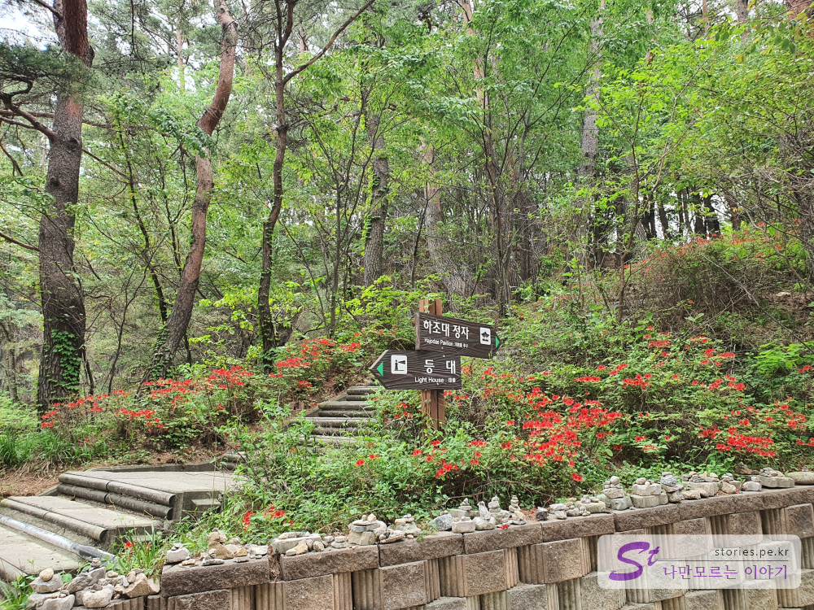
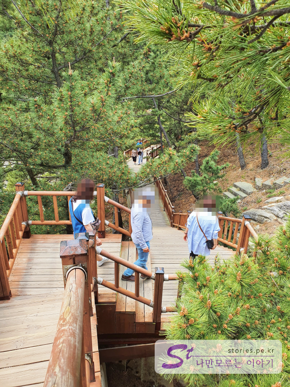
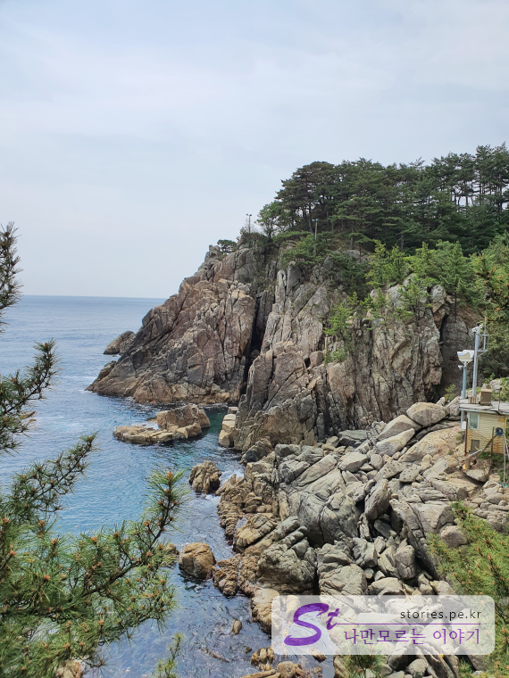
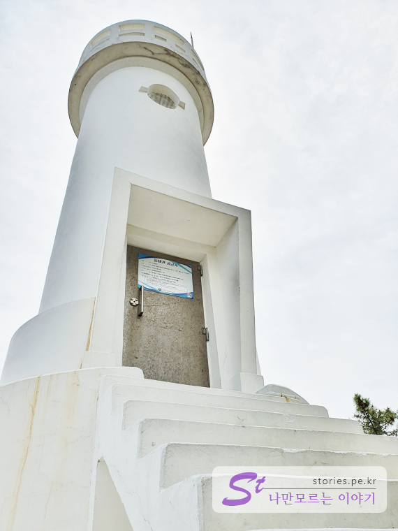
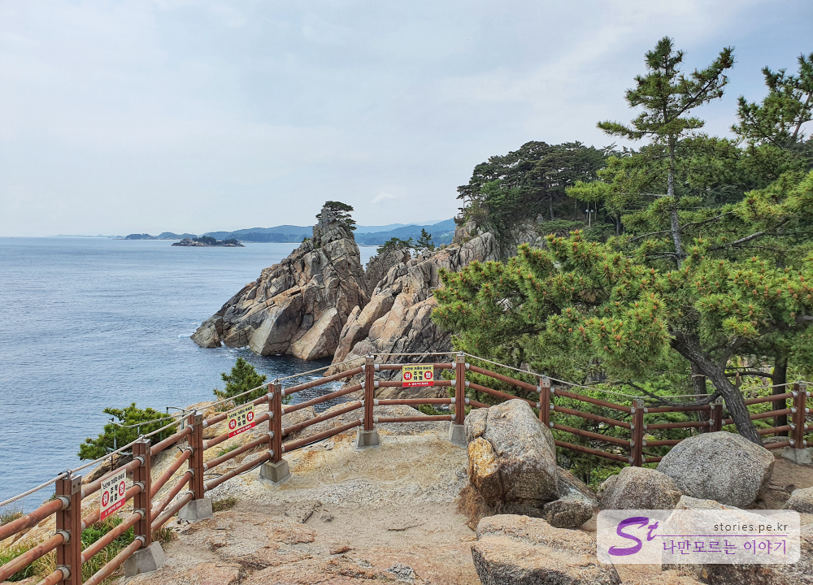
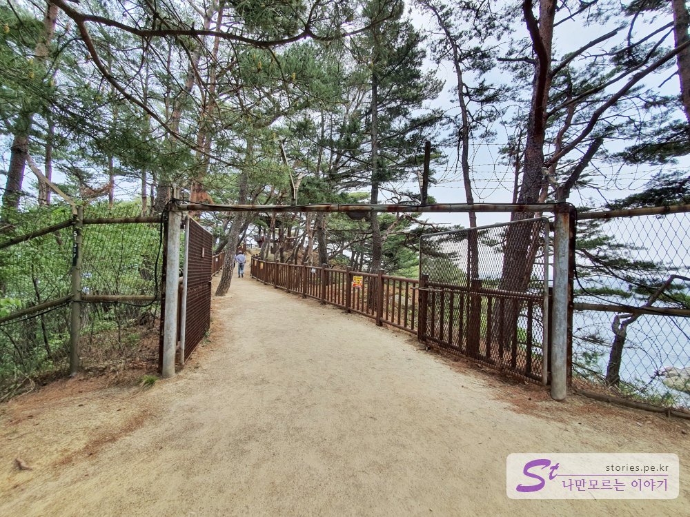
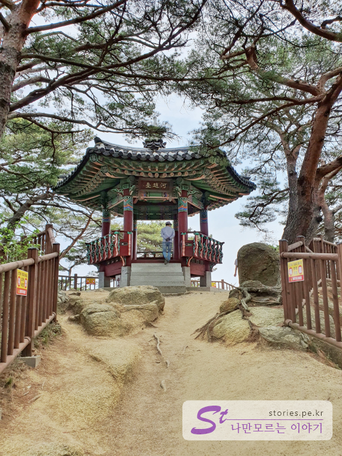
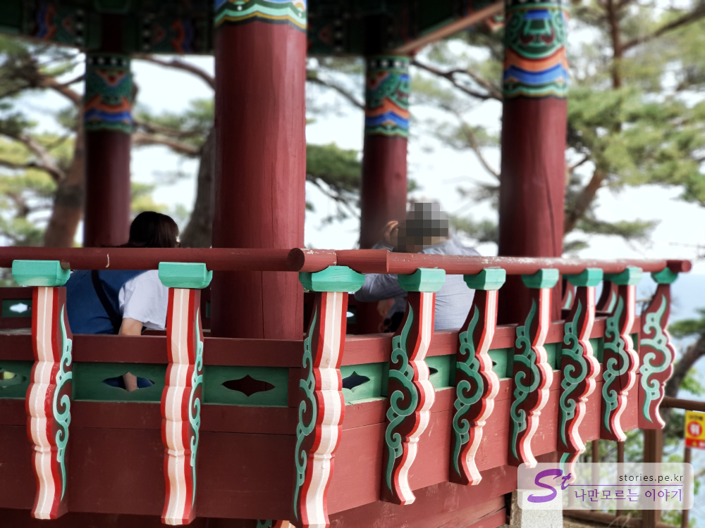
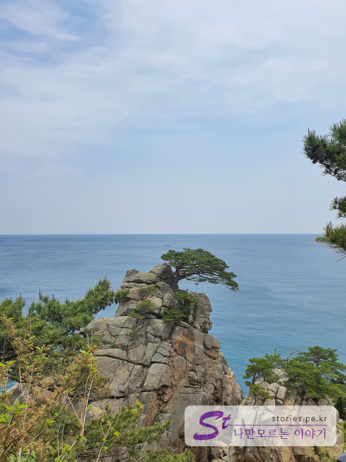
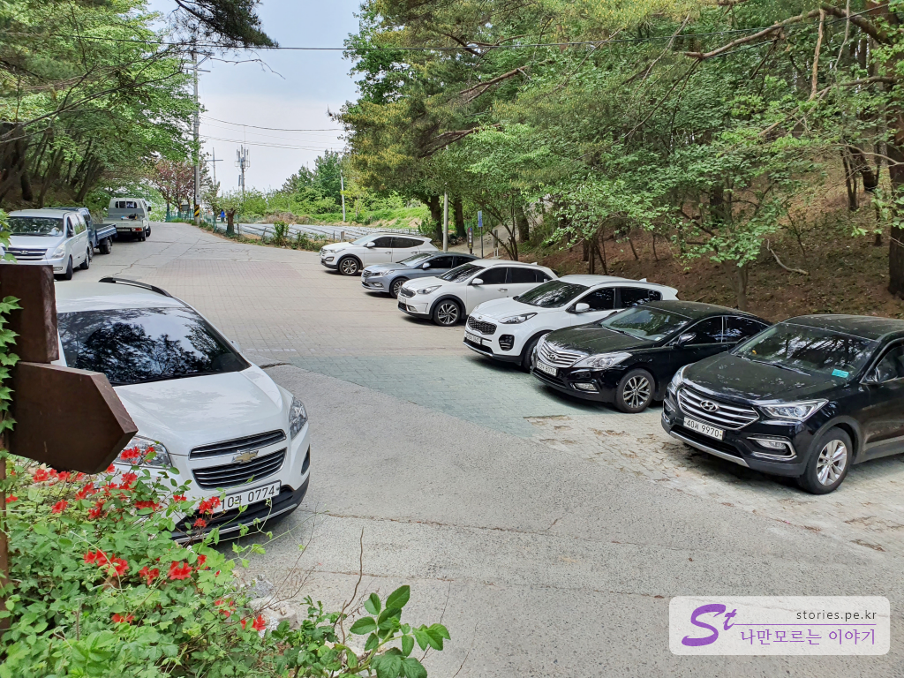

하조대는 양양의 8경에 속할 정도로 아름다운 풍광을 자랑합니다. 주차를 하고 하조대의 등대와 정자를 다녀오기에 멀지 않은 거리이기 떄문에 산책하듯 슬슬 다녀오기에 좋습니다.  

> 하조대라는 이름은 이곳에서 휴양한 조선의 개국 공신, 하륜과 조준의 앞 글자를 따서 지어졌다고 전해집니다. 2009년 명승 제68호로 지정되었습니다. 

  
하조대는 **등대 방향**과 **정자 방향**으로 나누어져 있는데 각각 방향은 슬슬 걸어서 5분~10분이면 도착할 수 있는 짧은 거리입니다. 보통은 등대쪽을 먼저 보고 다시 내려와 정자에 올라가서 잠깐 쉬고 내려오는 코스가 적당합니다.  

  
등대방향으로 갈 때는 잘 꾸며져있는 나무 데크를 따라 올라갈 수 있습니다. 

  
가는 길에 보이는 기암괴석이 정말 압권입니다. 너무 아름답습니다. 

   
**기사문등대**에 올라서면 하얀색의 사진 찍기 좋은 등대가 보입니다. 여친을 계단에 앉아있게 하고 사진을 찍으면 롱다리 여친을 만들 수 있는 포토 스팟입니다.   

  
등대 뒤로 살짝 돌아가면 바다와 맞다아 있는 하조대의 노송을 볼 수 있습니다.  

등대를 모두 구경하였다면 다시 주차장으로 내려와서 반대 방향의 **정자 쪽**으로 향합니다. 

   
이 곳은 군사보호 지역이라 늦은 시간에는 철조망을 닫아 논다고 하네요.  

   
뜨거운 햇빛도 피할 수 있는 정자가 있습니다. 바람도 살살 불어서 쉬기에 정말 좋습니다.  

  
정자에 앉아서 바다를 바라보며 멍때리기에 정말 좋습니다.   

  
정자에서도 바위 위에 서있는 노송을 볼 수 있습니다.  

## 비용  
입장료는 무료 입니다. 

## 입장시간  
- 휴무일 :  연중무휴

## 여행지 정보  
- 주소 : 강원 양양군 현북면 조준길 99  
- 연락처 : 033-670-2207  
 

     <iframe src='https://www.google.com/maps/embed?pb=!1m18!1m12!1m3!1d12573.539637632075!2d128.7235583796813!3d38.01480520782919!2m3!1f0!2f0!3f0!3m2!1i1024!2i768!4f13.1!3m3!1m2!1s0x0%3A0xa437d17cf824fe51!2z7ZWY7KGw64yA!5e0!3m2!1sko!2skr!4v1589382306055!5m2!1sko!2skr' class='embed-responsive-item' allowfullscreen></iframe>
 

## 주차정보  

무료로 주차할 수 있는 주차장이 있습니다. 그러나 주차장이 크지 않아서 휴일이나 성수기에는 주차가 어려울 수 있습니다. 주차장과 입구가 좁아서 차라리 입구 전에 주차를 해 놓고 걸어 가는 것이 좋을 수도 있습니다. 

  
