여름 초입의 주말을 맞이해서 요즘 핫하다는 포천의 관광지인 비둘기낭과 하늘다리에 다녀왔습니다. 한탄강을 끼고 있는 비둘기낭 폭포가 사실 이전부터 관광지였기는 했는데 이번에 한탄강이 유네스코에서 국내 4번째로 **세계지질공원**으로 선정되면서 포천시에서 본격적으로 드라이브를 걸고 있는 것 같습니다. 아직 비둘기낭 폭포와 하늘다리 근처의 많은 땅이 공사를 준비하고 있는듯 보였는데 포천시가 비용을 잘 사용해서 세계적인 관광지로 만들기를 바랍니다. 

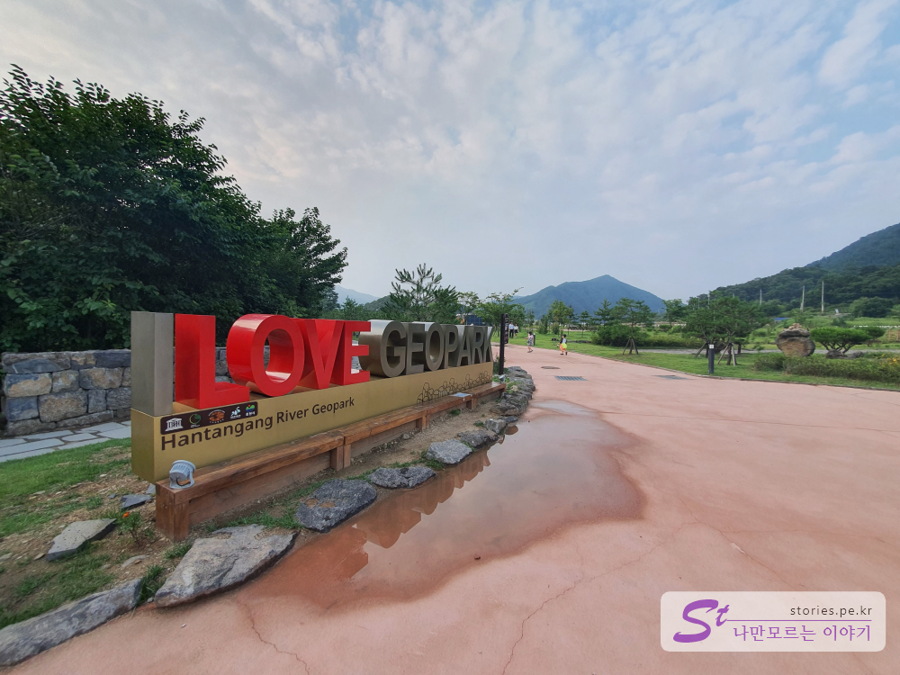  
주차를 하고 조금 올라가면 사랑해요 지오파크! **I LOVE GEOPARK**라는 표지판을 볼 수 있습니다. 

## 비둘기낭 폭포   

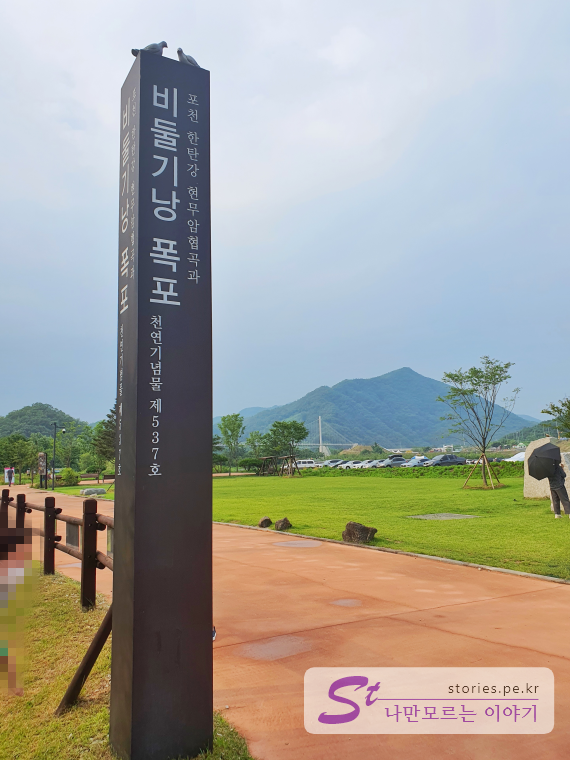  
표지판에서 100m정도 슬슬 걸어서 올라가면 천연 기념물 제537호라고 적혀있는 비둘기낭 폭포 이정표를 만날 수 있습니다. 

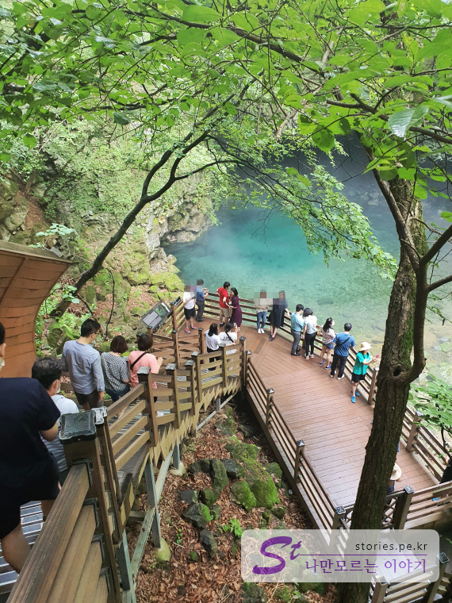  
그 길을 따라 나무데크를 잠깐 내려가면 정말 멋진 풍경이 눈앞에 펼쳐 집니다. 좀 더 내려가면 바로 비둘기낭 폭포를 만날 수 있습니다.   

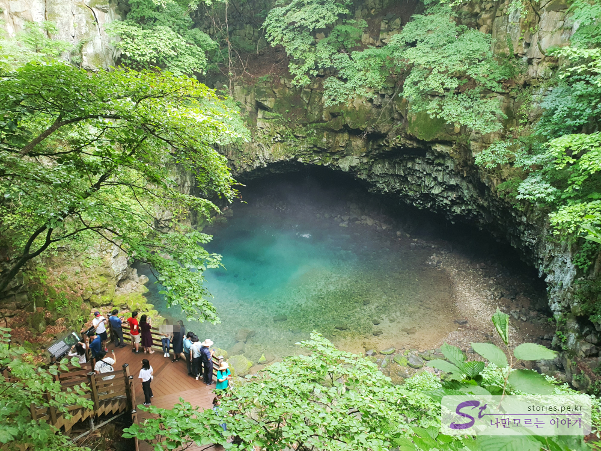  
위에서 전체적인 모습을 보면 **이래서 비둘기낭~ 비둘기낭~ 하는구나** 라는 생각이 절로 듭니다.  

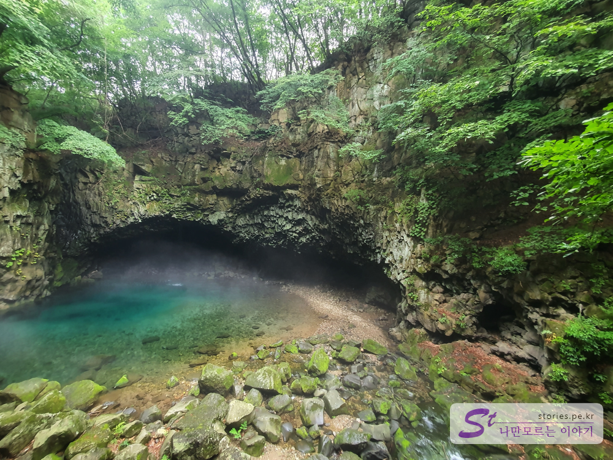  
유네스코에 등재된 이런 자연친화적인 환경은 사람이 없을 때 더 빛을 발하기 때문에 한참을 기달려 굳이 사람이 없을 때 한장 찍어 봤습니다.  

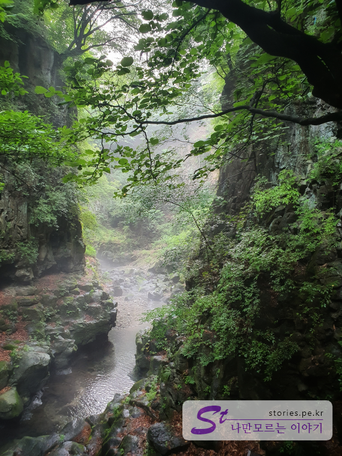   
비둘기낭에서 바로 뒤로 돌아서면 또하나의 비경을 만날 수 있습니다. 비둘기낭 폭포에서 떨어진 물이 한탄강으로 흘러들어가는 방향으로 보이는 풍경입니다.  

## 하늘다리  
비둘기낭을 나와서 다시 앞쪽으로 200m정도 걸어오면 하늘다리를 만날 수 있습니다. 하늘다리는 포천시가 40억원을 들여 만든 다리로 바닥의 한탄강에서 약 50m 높이에 위치해 있다고 합니다. 다리가 흔들리기는 하지만 성인 1500명이 동시에 이용할 수 있게 설계되었다고 합니다. 다리 중간 중간에 설치되어 있는 유리바닥을 통해 발밑의 아찔한 한탄강을 볼 수 있습니다.  

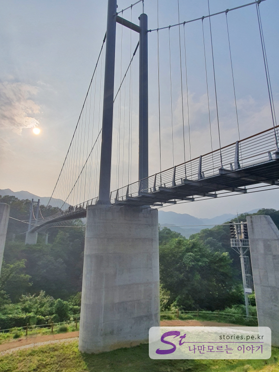  
아래에서 바라본 다리는 끝도 없이 길게만 보여집니다.  

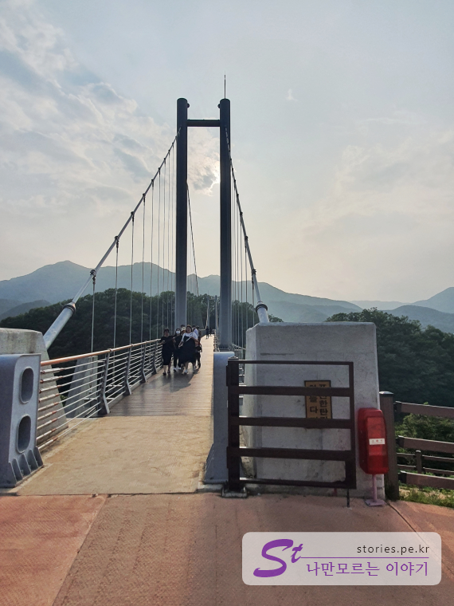  
하늘다리는 폭이 약 2M정도 되어 있고 튼튼해 보이지만 다리가 출렁출렁 거림을 느낄 수 있습니다.  

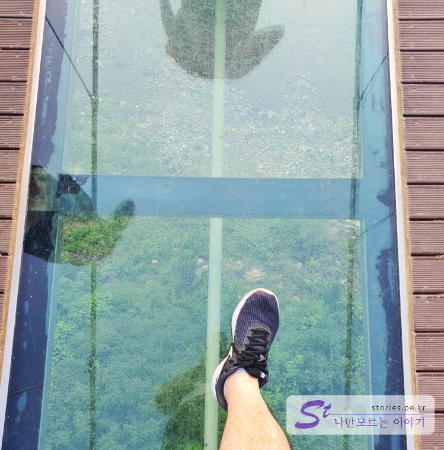   
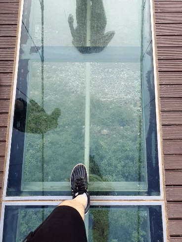
다리 중 3군데에 통유리를 설치해 놔서 다리아래 있는 아찔한 한탄강을 볼 수 있습니다.  

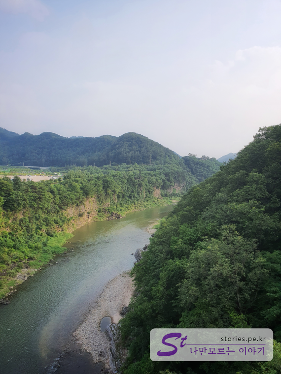  
다리의 중간쯤 왔을 때 눈을 돌려 강을 바라보면 현무암 협곡으로 이루어진 한탄강의 장관을 볼 수 있습니다. 

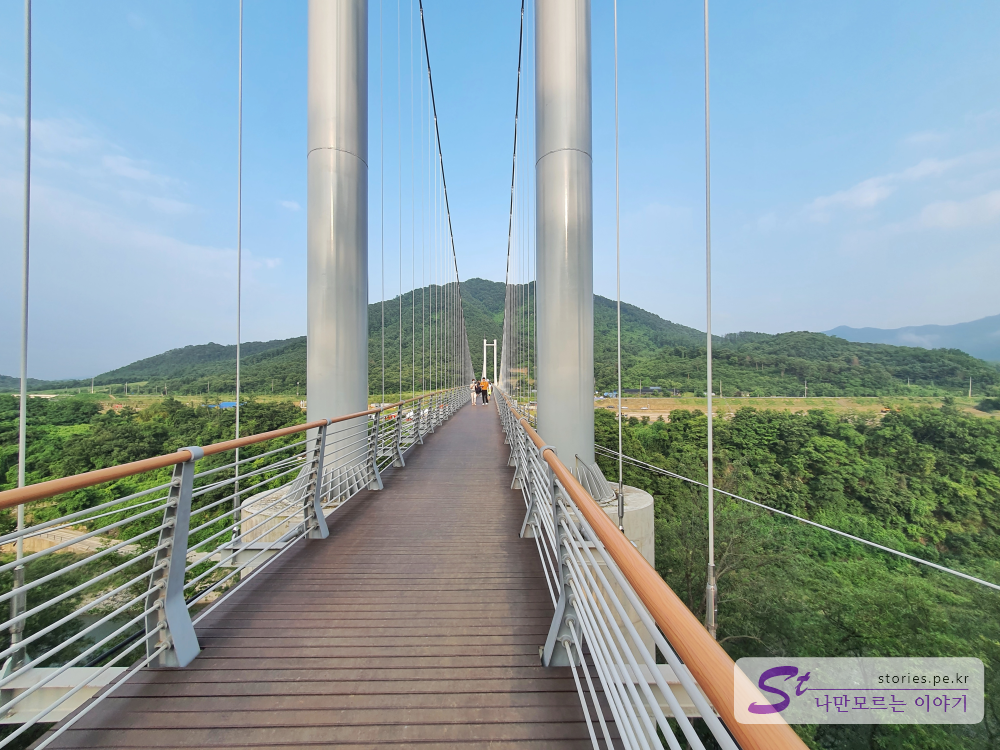  
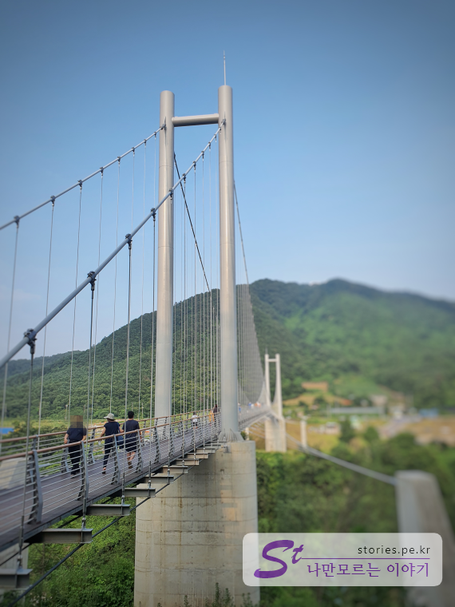  
다리의 끝 부분에 이르렀을 때에 반대 방향 사진을 찍으면 까마득한 다리의 끝부분을 볼 수 있습니다. 

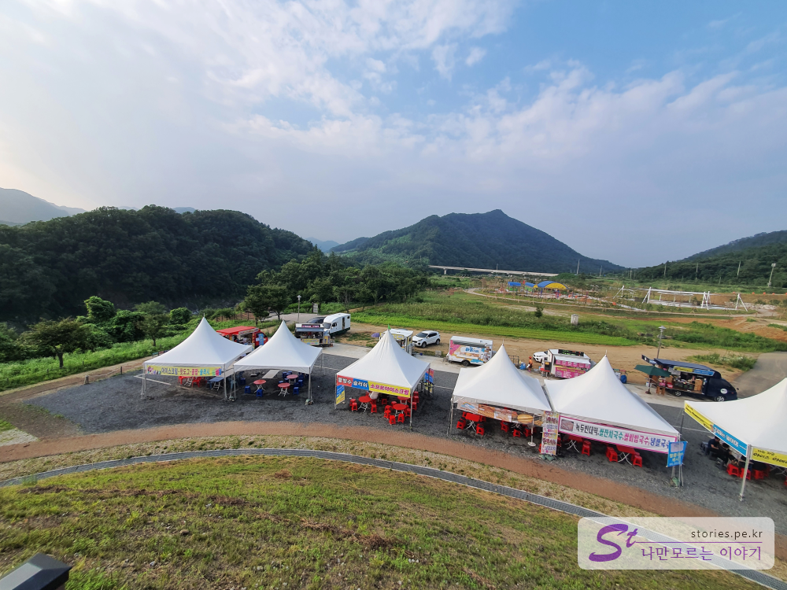  
다리를 찍고 다시 돌아와서 입구쪽을 보면 푸드트럭들이 모여 장사를 하고 있습니다. 출출하고 덥고 해서 하나 사먹어 봤는데, 가격은 시중가보다 좀 비싼 편이였습니다. 아이스크림이 3500원, 핫도그가 2500원 정도 했습니다. 
 
아직 저~~ 뒤쪽으로는 개발이 진행중인지 흙바닥과 건설장비가 몇대 보이고 있었습니다. 주차장을 지을지, 건물을 지을지는 모르겠지만 많은 예산을 들여 더 확장하려고 한다는 것을 알 수 있었습니다.  

## 입장시간  
- 시작시간 :  09:00
- 마감시간 :  18:00 (오후 6시가되면 화장실의 문이 모두 잠겨버립니다. 조심하세요 ㅎ) 
- 휴무일 : 연중무휴  

## 여행지 정보  
- 주소 :  경기 포천시 영북면 대회산리 410-3 
- URL : http://www.hantangeopark.kr  

    <iframe src='https://www.google.com/maps/embed?pb=!1m18!1m12!1m3!1d3140.619457610687!2d127.21503871518372!3d38.079242579705195!2m3!1f0!2f0!3f0!3m2!1i1024!2i768!4f13.1!3m3!1m2!1s0x357d2de40555e0d7%3A0x145da909f862d98d!2z67mE65GY6riw64KtIO2Pre2PrA!5e0!3m2!1sko!2skr!4v1595313970900!5m2!1sko!2skr' class='embed-responsive-item' allowfullscreen></iframe>

 
## 주차정보  
주차는 무료 주차입니다. 

 