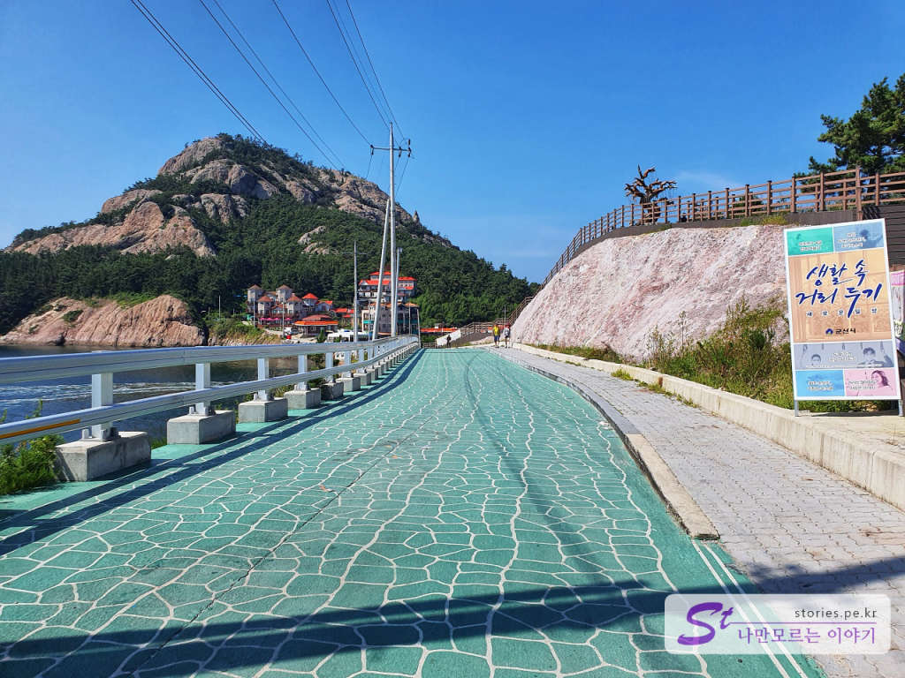
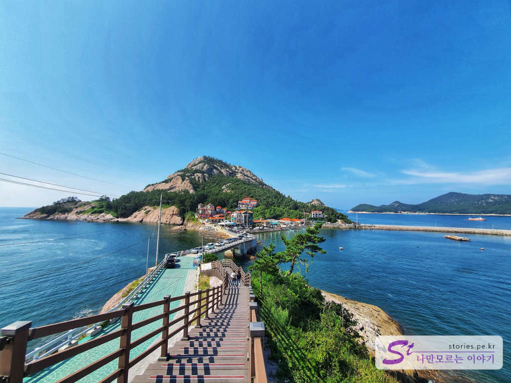
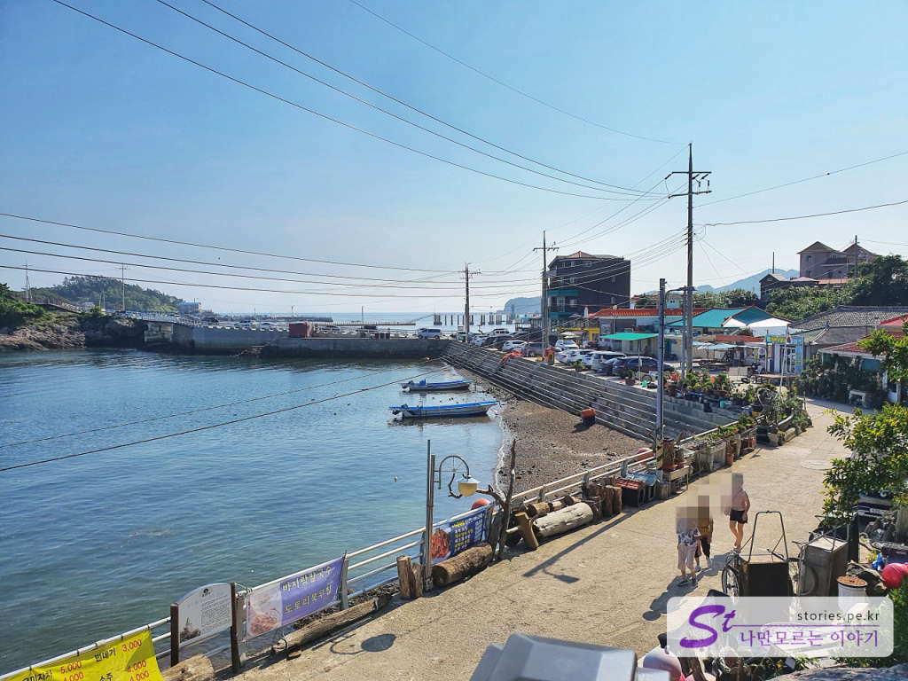

> [[군산여행] 군산 근대 문화유산 거리에서 선유도 대장봉까지](https://blog.stories.pe.kr/479)  

오전에 **군산 근대 문화 유산 거리**를 구경하고 오후에는 새만금방조제를 지나 **선유도 대장봉**으로 향했습니다. 군산에서 선유도까지는 대략 40분~1시간정도 소요가 됩니다. 

  
군산과 변산반도를 이어주는 새만금방조제의 중간쯤에 섬들이 모여있는 **고군산군도**로 빠지는 길을 따라 올라가다 보면 신시도를 지나 무녀도를 지나 선유도에 다다르게 됩니다. 우리는 조금 더 들어가서 **장자도**까지 이르러 먼저 대장봉에 올라 멋진 경치를 구경하고 선유해수욕장에서 집라인을 타볼 계획이였습니다. 
결론부터 말하자면 대장봉에 오르면서 거의 초죽음이 되서 선유해수욕장은 밟아보지도 못하고 여행을 마치게 되었습니다. (참고로 선유해수욕장으로 향하는 차들이 많아서 막혀서 오도가도 못 힐까봐 들어가 보지를 못했습니다.)

## 대장봉을 오르기 위한 주차와 쉬운방법   

대장봉에 오르는 것을 쉽게 생각하지 마시길 바랍니다. 경사가 심해서 정말 힘든 여정입니다. 노약자는 시도하지 마시기를 추천합니다. 하지만 정상에 올랐을 때는 정말 멋진 풍경을 볼 수 있습니다. 

먼저 지도로 위치를 설명해 볼까 합니다. 
  

1. 대부분 대장도로 가기 위해서는 회전 교차로가 있는 1번지점인 장자도에 주차를 합니다.  
2. 차량이 아주 없을 경우는 자동차 한대만 다닐 수 있는 길을 따라 2번지점에 주차를 할 수 있습니다. 
3. 정말 차량이 없는 경우나 안쪽의 펜션을 이용하는 사람은 3번지점까지 차량을 가져갈 수 있으나 운전실력이 좋아야 합니다. 
4. 보통 1번지점에 주차를 하고 걸어서 대장도로 들어가서 4번지점이나 6번지점으로 등반을 합니다. 
5. 5번지점은 대장봉 정상입니다. 뷰 맛집입니다. 
6. 하산할 때는 6번지점 쪽으로 하는 것이 좋습니다. 다리가 후덜덜해서 잡고 내려갈 데크가 필요합니다. 

  
2번지점과 3번지점 사이의 길로 대장도로 지나가는 길입니다. 저 멀리 대장봉이 보이네요.

  
2번지점과 3번지점 사이의 길 중 오른쪽 위쪽에 있는 전망대 쪽의 길에 올라서 대장봉을 본 풍경입니다. 이렇게만 봐도 멋지네요.

   
오른쪽으로 선유해수욕장이 보입니다. 가운데 높이 솟은 건물이 짚라인을 타는 건물입니다. 

  
장자 할매바위에 대한 유래가 써있습니다. 대단할 건 없는데.. 읽어보고 바위를 보면 좀 남다른 느낌이 나긴 합니다.   

  
대장봉을 오르기 위해서는 4번지점 길과 6번지점 길이 있습니다. **4번지점 길은 자연의 길**이고 6번지점 길은 나무데크로 오르고 내리게 되어 있는 길입니다. 나무데크로 되어 있다고 쉬운길은 아닙니다. 나무데크의 경사로가 엄청나서 그곳으로 오르기도 쉽지 않습니다.

보통은 6번지점 길로 많이들 올라 갑니다. 6번지점 길로 올라갔다가 6번지점 길로 내려와도 되지만 한번 오른길을 두번 지나기 싫다면 4번지점으로 올라갔다가 6번지점으로 내려오는 것을 추천합니다. 

4번지점 길은 위험한 바위 코스도 있으므로 조심해야 합니다. 슬리퍼를 신고는 절대 못올라 갑니다. 떨어져 죽을 수도 있어요.

  
오르는 길에 이 **구불길**이라는 표지판을 본다면 잘 올라가고 있다고 생각하면 됩니다. 제주도의 올레길처럼 여기는 구불길이라고 하는것 같습니다.   

  
이 풍경 한번 보겠다고 그 개고생을 하며 올라 왔네요. 실제로 보면 멋지긴 정말 멋집니다. 

  
하산은 6번지점 길 쪽으로 했습니다. 오르느라 힘이들어 다리가 풀려서 후덜덜하는데 겨우 데크 손잡이 잡고 내려왔습니다. 만약 내려갈때도 4번지점 길로 내려갔다면 잡을게 없어서 떨어져 죽었을 겁니다. ㅎ
사진으로 보기에는 경사가 심해 보이지 않지만 매우 심한 편입니다. 

  
6번지점 길을 따라 내려오면 이렇게 바닷가를 만나게 됩니다. 여기까지 내려오면 안도의 한숨이 쉬어 집니다. 

## 여행지 정보  
- 주소 : 전북 군산시 옥도면 대장도리 산 1 
   

    <iframe src='https://www.google.com/maps/embed?pb=!1m18!1m12!1m3!1d3235.4086725189622!2d126.39344054290176!3d35.814447671778225!2m3!1f0!2f0!3f0!3m2!1i1024!2i768!4f13.1!3m3!1m2!1s0x35711cffbd54c501%3A0xd5f409f427fcbdd5!2z64yA7J6l67SJKOyepeyekOu0iSk!5e0!3m2!1sko!2skr!4v1597987966080!5m2!1sko!2skr' class='embed-responsive-item' allowfullscreen></iframe>

 
