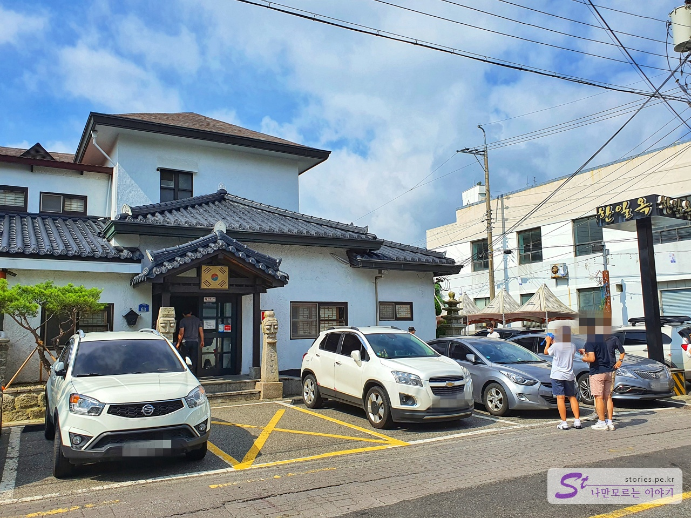
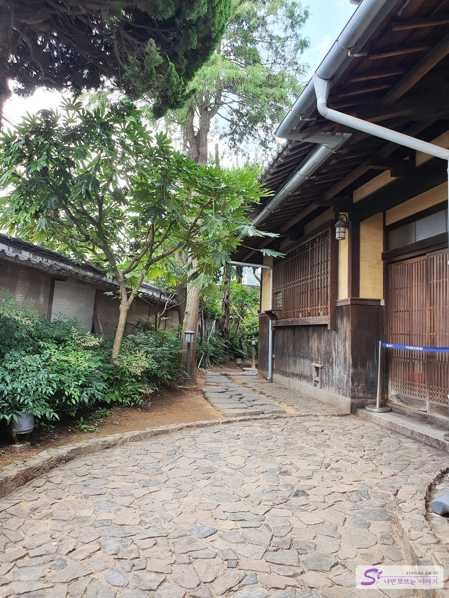
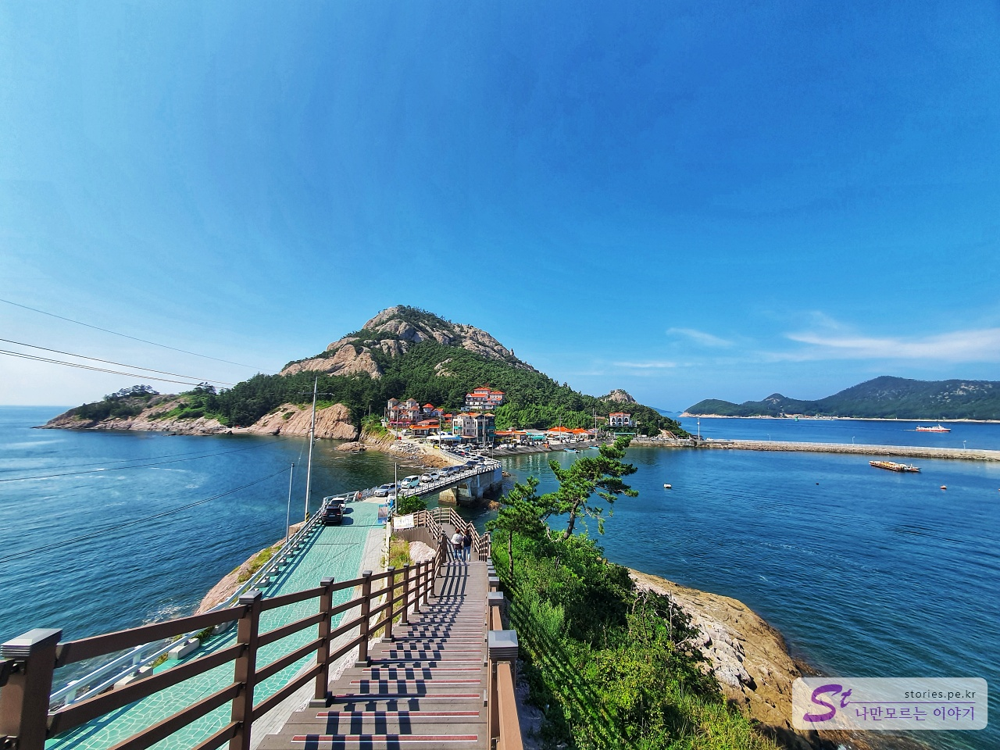

뜨거운 여름에는 여행을 자제하는 편이기는 한데 어찌어찌 상황이되어 1박2일로 군산여행을 다녀오게 되었습니다. 1박2일이라고 하지만 첫째날은 그냥 밤에 서울에서 출발해서 군산에 도착하여 모텔에서 잠만 자고 다음날 9시 30분 부터 일정을 시작했으니 군산여행은 순수하게 하루의 일정이라고 보시면 됩니다.   
군산의 여행지는 이성당이 있는 **군산 근대 문화 유산 거리**와 새만금방조제를 지나 **선유도가 있는 고군산군도**가 일반적인 코스 입니다. 

저희는 오전에 군산 근대 문화 유산 거리를 구경하고 오후에 선유도가 있는 고군산군도를 다녀오는 코스로 잡았습니다. 

군산여행에 팝플렛이 많이 도움이되서 공유합니다.  
    

## 초원사진관  
[09:40~10:00]
처음 방문한 곳은 초원사진관입니다. 

   

한석규, 심은하 주연의 **8월의 크리스마스**를 본 세대라면 조금이라도 감동이 있을텐데 그렇지 않은 세대에게는 별로 깊은 감동을 주기 어려운 장소 입니다. 영화세트장으로 지었다가 현재도 실제 사진관으로는 사용되지 않고 관광용으로만 사용되고 있습니다. 내부로 들어가면 8월의 크리스마스에 대한 컨텐츠들이 많이 있습니다. 

## 브런치는 소고기 무국으로 유명한 한일옥에서..   
[10:00~10:50]
초원사진관 바로 앞에 **소고기 뭇국**으로 유명한 **한일옥**이 있습니다. 한일옥에서 아침을 해결할 수 있습니다. 

  

군산이 중식음식이 유명하긴 하지만 아침에는 짜장면보다는 역시 소고기 뭇국이죠.. 정말 맛있습니다. 군산여행에서 가장 맛있게 먹었던 음식입니다.  

> [[군산맛집] 소고기무국으로 유명한 한일옥](https://blog.stories.pe.kr/480)

## 신흥동 일본식가옥  
[11:00~11:10] 
한일옥에서 식사를 마치고 걸어서 신흥동 **일본식가옥**으로 이동했습니다. 날씨가 더워서 좀 힘들었지만 걸어갈 수 있는 거리입니다. 

  

일제시대에 군산이 식량과 물자를 약탈하여 반출하거나 일본의 군수물자가 들어오는 항구였던 터라 일본관료들이 많이 살았던 지역이라고 합니다. 그래서 군산에는 유난히 일본식가옥이 많이 있고 그중에서도 **신흥동 일본식가옥**이 원형이 잘 보존되어 있다고 해서 갔습니다. 

  

월요일이라고 문이 닫혀있네요.ㅋ 이래서 제가 일본을 싫어하는가 봅니다.  

  
굳게 닫힌 문에 구멍을 뚫어나서 안의 일부를 볼 수 있게 해놔서 찍어 봤습니다. 

## 고우당(여미랑)쉼터   
[11:10~11:30] 
걸어갈 수 있는 거리에 **고우당 쉼터**가 있습니다. 

  

 지금은 **여미랑**이라고 부르는데 일본식 정원과 가옥을 체험할 수 있는 게스트하우스와 카페로 운영되어 지고 있습니다. 여기에서 잠시 쉬면서 커피를 마셨습니다. 

> [[군산여행] 일본식 정원이 있는 게스트하우스 고우당(여미랑) 쉼터](https://blog.stories.pe.kr/481)

## 고우당에서 이성당으로 가는 길
[11:40~11:50] 
고우당에서 커피를 마시고 여기도 월요일이라 문을 닫고 있는 항쟁관쪽을 지나 이성당으로 이동하였습니다. 

  
여전히 일본의 느낌이 나는 가옥들이 많이 있습니다.  

  
이쁘게 꾸며져 있는 정원들도 많이 있었구요.  

## 한국에서 가장 오래된 빵집 이성당 
[12:00~12:30] 
고우당에서 군산항쪽으로 걸어오다 보면 한국에서 가장 오래됬다고 하는 이성당 빵집을 만날 수 있습니다. 군산에 오면 한번쯤 들러보면 좋을 빵집입니다.

  

 정작 이성당에서는 사진은 찍지 못했네요. 이성당 홈페이지에 있는 이미지를 참고사진으로 올려봅니다. 현재 이성당은 군산에 본점이 있고 서울 잠실과 서초, 용인, 김포, 천안, 인천에 지점을 운영하고 있습니다. **이성당은 단팥빵과 야채빵이 유명**하며 구입을 하기 위해서는 주말이나 휴일일 경우 10~30분 웨이팅은 기본입니다.   

## 해망굴  
[12:40~13:00] 
이 더운 날씨에 이성당에서 해망굴까지 걷기에는 좀 애매하여 차를 타고 이동하였습니다. 
  

월명산의 해망령을 관통하는 터널이라고해서 **해망굴**이라고 이름 붙혀졌으며 바닷가 쪽에 있는 해망동과 군산 시내를 연결하는 곳이기도 합니다. 해망동은 바닷가 쪽이라 수산업이 발달되어 현재도 수산물 도매시장이 위치해 있습니다. 해망굴은 차는 이동할 수 없고 사람만 왕래할 수 있도록 되어 있습니다.  

## 호남관세박물관  
[13:00~13:10] 
해망굴에서 사진을 좀 찍고 다시 차를 타고 군산항 쪽에 있는 **호남관세박물관**으로 이동하였습니다. 

  

현재도 계속 군산세관으로 사용하고 있습니다. 다만 군산세관은 새로 지은 건물에서 운영을 하고 있고 관광객들은 예전 건물인 **호남관세박물관**을 구경할 수 있습니다. 

## 호남관세박물관안에 있는 인문학 창고 정담    
[13:10~13:30] 
호남관세박물관 옆에는 인문학 창고인 **정담**이 있습니다. 정담은 오래동안 닫혀있던 세관창고를 개조하여 카페형태로 꾸며놓은 곳입니다.  

  

카페에서 음료를 사서 책을 읽으며 쉴 수 있도록 되어 있습니다. 사진도 많이 찍고 쉴 수도 있습니다. 하지만 개인이 운영하는 곳이라 그런지 몰라도 사진만 찍고 앉아있는 손님을 보면 사장님께서 음료를 시키라고 종용을 하고 다니십니다.  이해 합니다. 운영해야 하닌까요.

> [[군산여행] 군산 세관창고를 개조해 만든 인문학 창고 카페 정담](https://blog.stories.pe.kr/482)

## 이제는 상업적인 냄새가 더 강한 경암동 철길마을   
[13:30~14:10] 
경암동 철길마을은 1944년에 신문의 원료를 나르기 위해 페이퍼 코리아 공장과 군산역을 연결하는 철로 주변에 사람들이 모여 살게 되면서 형성된 마을 이름이라고 합니다. 

  

지금은 "남자가 사랑할 때"라는 영화로 인해 관광지가 된 상태로 철길을 따라 옛날  추억의 물건이나 음식들을 파는 가게들이 즐비하게 있습니다.   

> [[군산여행] 이제는 상업적인 냄새가 더 강한 경암동 철길마을](https://stories.tistory.com/483)

## 선유도(대장도)  
[15:00~17:00] 
오전에 군산시내의 관광을 마치고 오후에는 1시간 정도 떨어져 있는 선유도를 방문하였습니다. 시원한 **새만금방조제**를 따라 고군산도를 지나면서 보이는 차창 밖 섬들의 풍경은 너무나 멋집니다. 

  

이제는 선유도를 지나 장자도까지 다리가 연결되어 있어서 차량으로 쉽게 들어가 볼 수 있습니다. 원래는 대장봉에 올라 멋진 풍경을 스마트폰에 담고 선유도 해수욕장에서 짚라인도 타보고 돌아오는 일정이였는데... 

  

대장봉에 한번 오른다음 모든 체력이 방전되어 선유도 해수욕장은 가지도 못하고 여행을 마무리 하였습니다. 

## 기타사항  
각 관광지의 사진은 별도로 포스팅해서 올리겠습니다.  
