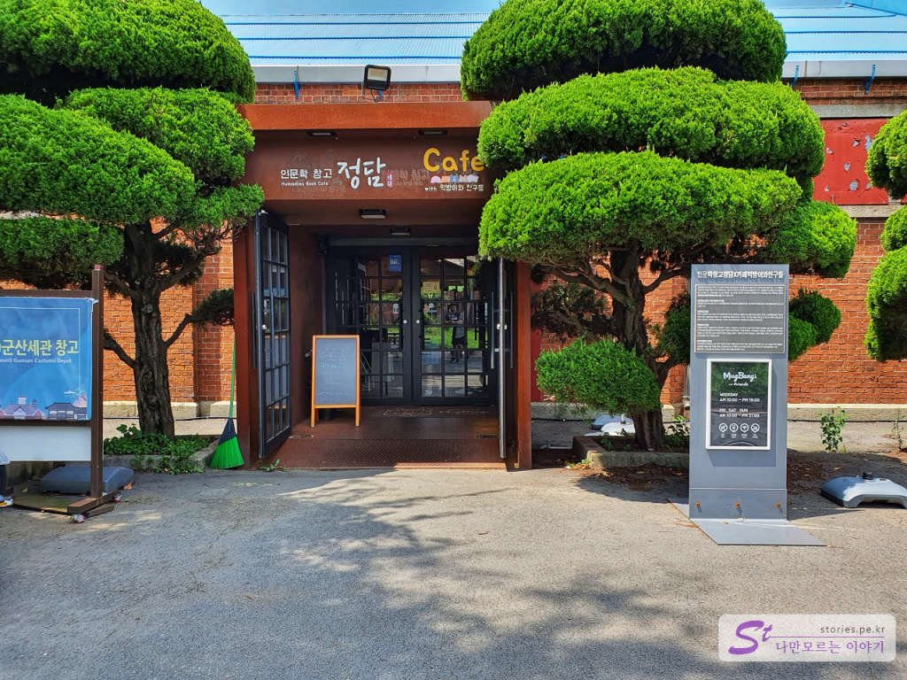
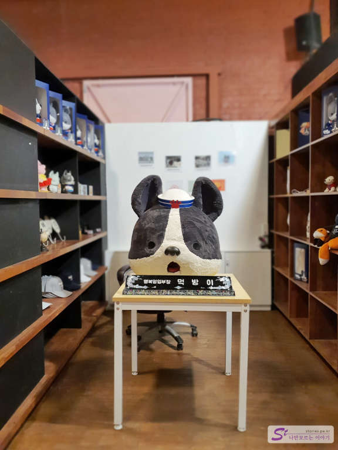

 

> [[군산여행] 군산 근대 문화유산 거리에서 선유도 대장봉까지](https://blog.stories.pe.kr/479)  

군산 관광의 목적으로 군산세관을 들릴 예정이라면 카페 정담을 들렸다가 가는 것이 좋습니다. 사실 군산세관에 있는 **호남관세박물관**은 그다지 볼거리는 없습니다. 

  

대신에 그 안쪽에 세관창고를 개조해서 만든  **인문학 창고 카페 정담**은 쉬면서 차한잔 할 수 있어서 좋습니다. 

  

인문학 창고 카페 정담은 찾아보니 군산대학교 산학협력단이 위탁운영 받아 로컬아이와 함께 운영하는 곳이라고 합니다. 말하자면 상업시설이라는 뜻입니다.  

  
실내에 들어서면 책읽고 커피 마시기에 좋게 되어 있습니다. 

  
천정도 나무로 되어 있어서 상당히 운치있고 책도 많아서 쉬기에 정말 좋습니다. 

   
한쪽에는 카페가 있습니다. 먹방이와 친구들이라는 캐릭터를 활용하고 있습니다. 

   
가격은 아이스아메리카노가 **5000원**입니다. 상당히 비싼편입니다. 2잔만 마셔도 2만원이네요. 커피값이라기 보다는 장소값이라고 생각해야 할 것 같습니다. 

   
매인 캐릭터인 먹방이 입니다. 강아지겠죠??  

## 입장시간  
- 시작시간 : 10:00   
- 마감시간 : 19:00 (주말 : 21:00)   

## 여행지 정보  
- 주소 : 전북 군산시 해망로 244-7 인문학창고정담  
- 연락처 : 063-461-1908  
- URL : https://www.mugbangiandfriends.com    

    <iframe src='https://www.google.com/maps/embed?pb=!1m18!1m12!1m3!1d807.0459694437136!2d126.71027832921574!3d35.991373498757724!2m3!1f0!2f0!3f0!3m2!1i1024!2i768!4f13.1!3m3!1m2!1s0x35705d2a2e0033a3%3A0x65adb25227b5cc59!2z7KCV64u0!5e0!3m2!1sko!2skr!4v1597934721925!5m2!1sko!2skr' class='embed-responsive-item' allowfullscreen></iframe>

## 주차정보  
군산세관의 주차장을 이용할 수 있습니다. 

 
