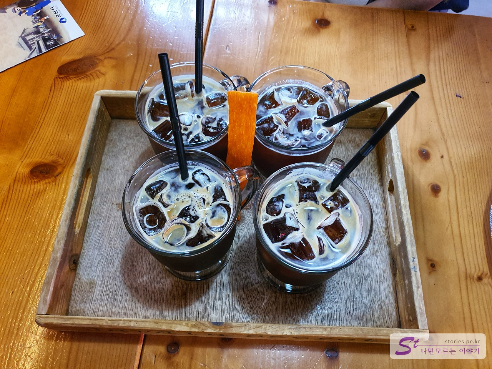

> [[군산여행] 군산 근대 문화유산 거리에서 선유도 대장봉까지](https://blog.stories.pe.kr/479)

지금은 **여미랑**이라는 이름으로 사용되고 있는 **고우당쉼터**는 일본식 정원을 가지고 있는 적산가옥(적군이였던 일본에게 압수한 가옥)으로 1930년대 근대 군산의 생활모습을 복원하여 다다미방을 체험할 수 있는 일본식 가옥 숙박을 할 수 있는 게스트하우스와 카페, 음식점등으로 운영하고 있는 곳입니다.  

게스트 하우스의 비용은 시기마다 다르겠지만 대략 3만원에서 15만원선으로 형성되어 있는 것 같습니다. 

  
여미랑에는 멋진 일본식 정원이 펼쳐저 있습니다. 사진을 찍을 만한곳이 많이 있습니다. 

  
뒷편으로 아파트가 있는 것이 좀 이질 적이긴 하지만 나름 풍광이 좋습니다. 적산가옥으로 일본관료들이 살던 곳일 텐데.. 한국사람들이 못 먹고 못 살때 일본인들은 이렇게 잘 먹고 잘 살아겠구나 하는 생각에 한편으론 씁쓸하기도 합니다.  

  
정원의 한쪽 편에는 콩볶는 고우당이라고 찻집이 있습니다. 고우당은 게스트하우스도 운영을하고 음식점들도 같이 운영하고 있는 개인 상업시설입니다. 누군가가 적산가옥을 매입하여 운영하는 곳이라고 보시면 됩니다. 

### 콩볶는 고우당  
날씨가 너무 더워서 잠시 카페에 들어가서 땀을 좀 식혔습니다. 

  
가격은 대형 프렌차이즈 카페와 비슷한 수준의 가격대를 형성하고 있습니다. 

  
날씨가 더워서 우리는 모두 아아를 시켜서 에어컨 밑으로 자리를 잡고 잠시 커피를 마시며 쉬어갔습니다. 아아(아이스아메리카노)가 2,900원이면 적당한  가격인것 같습니다. 

## 여행지 정보  
- 주소 : 전라북도 군산시 구영6길 13    
- 연락처 : 063-442-1027    
- URL : http://yeomirang.com/?act=main    

    <iframe src='https://www.google.com/maps/embed?pb=!1m18!1m12!1m3!1d3228.4442548834086!2d126.70610651512031!3d35.985010280124676!2m3!1f0!2f0!3f0!3m2!1i1024!2i768!4f13.1!3m3!1m2!1s0x35705c105e553f4b%3A0xa08b43ad5607e6a6!2z7Jes66-4656RKOq1rCDqs6DsmrDri7kp!5e0!3m2!1sko!2skr!4v1597915690733!5m2!1sko!2skr' class='embed-responsive-item' allowfullscreen></iframe>

 
 
