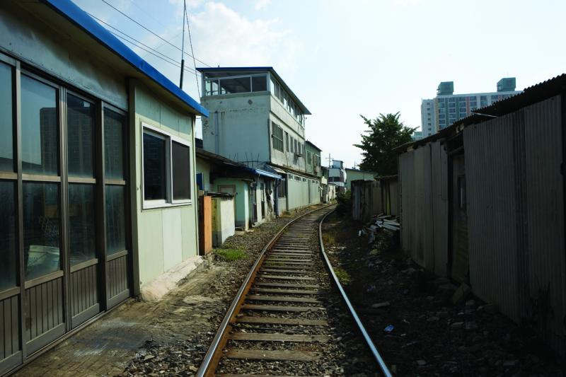
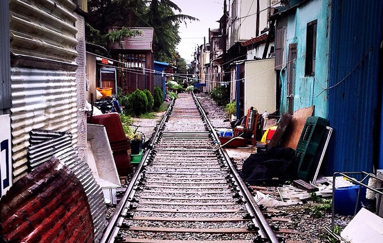
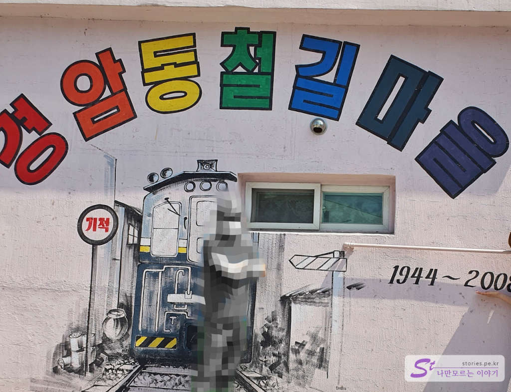
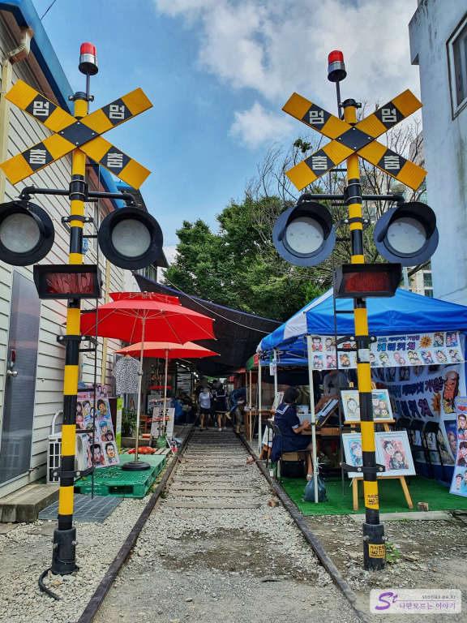
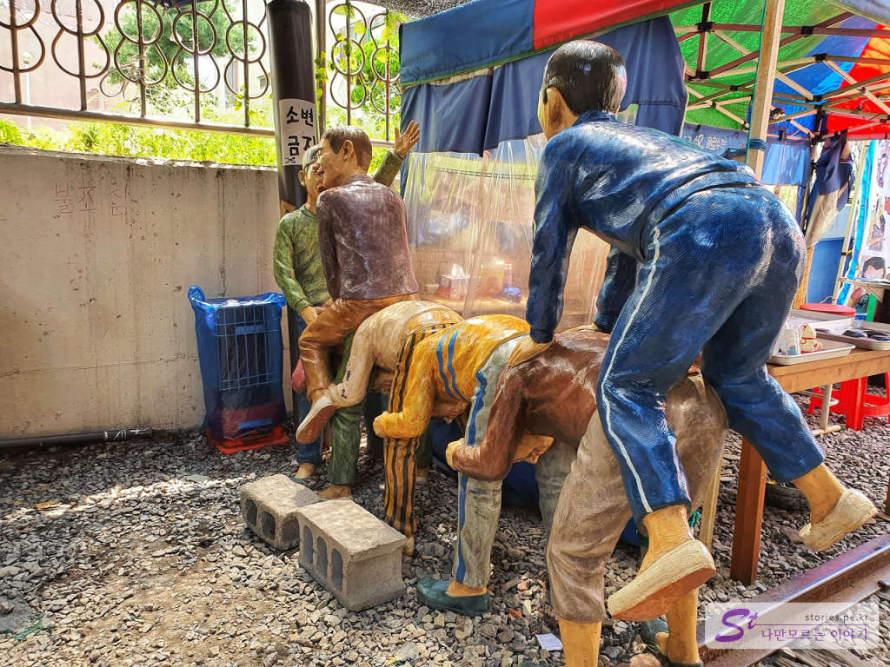
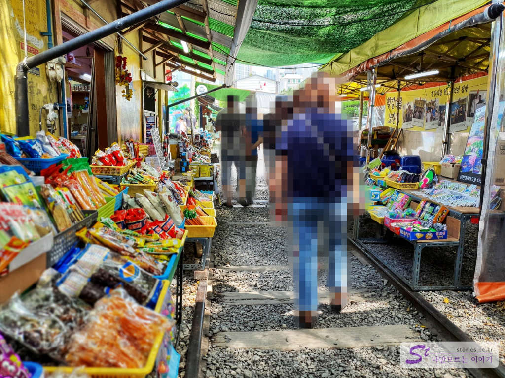
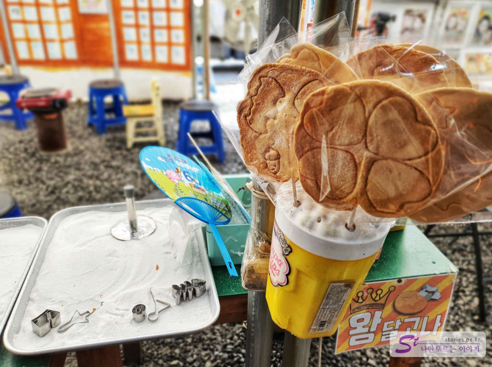
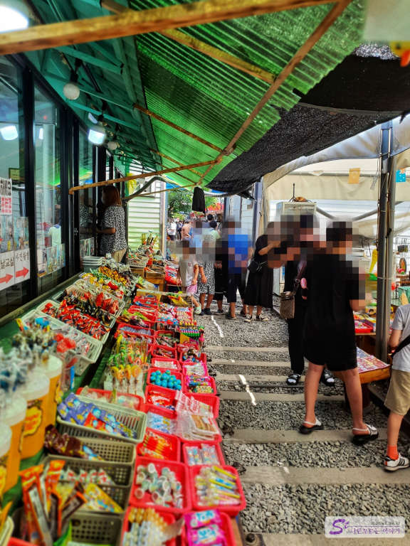
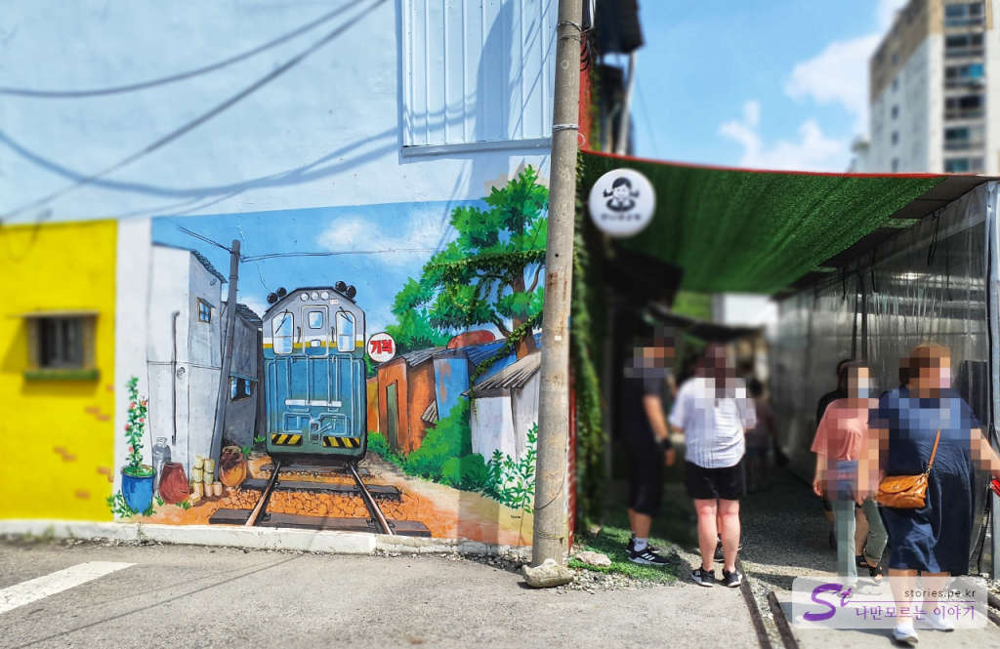
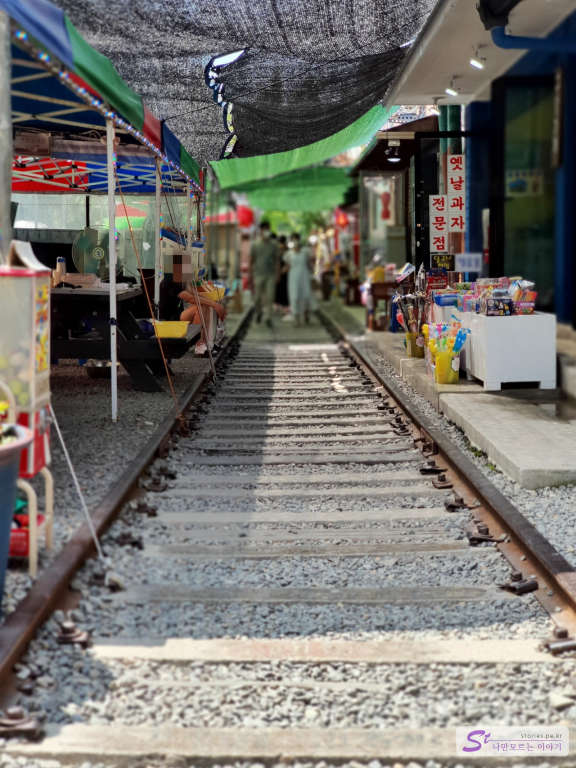

> [[군산여행] 군산 근대 문화유산 거리에서 선유도 대장봉까지](https://blog.stories.pe.kr/479)

처음엔 추억의 장소였다가 어느순간 상업적인 냄새가 너무 심해져서 실망한 경우가 많습니다. 군산의 경암동 철길마을도 그렇게 되는 것은 아닌지 아쉽기만 합니다. 풍등을 날리는 것은 아니지만 마치 [대만의 철길에서 풍등을 날리는 스펀](https://stories.tistory.com/363?category=744212)과 비슷한 모습을 보이고 있는것 같습니다. 

어찌되었든 경암동 철길마을이 군산여행의 1순위로 꼽히고 있으므로 한번 방문 해 봤습니다.  

  

이런 모습을 기대하며 찾아가 봤으나...
이런모습은 온데 간데 없고 이제는 관광지가 되어 버렸습니다. 

  

경암동 철길마을의 유래에 대해서 군산 시청의 정보를 찾아봤습니다. 

> **유래**
> 경암동 철길마을은 1944년 전라북도 군산시 경암동에 준공하여 페이퍼 코리아 공장과 군산역을 연결하는 총 연장 2.5km  철로 주변의 마을을 총괄하여 붙인 이름이다.
명칭의 유래는 마을이 위치한 행정 구역 명칭에 따라 철로 주변에 형성된 마을을 경암동 철길 마을이라 불렀다.
1944년 일제 강점기 개설된 철도 주변에 사람들이 모여 살기 시작하면서 동네를 이루었고 1970년대 들어 본젹적으로 마을이 형성되었다.
경암동 철길은 일제 강점기인 1944년에 신문 용지 재료를 실어 나르기 위해 최초로 개설되었다. 1950년대 중반까지는 “북선 제지 철도”로 불렸으며 1970년대 초까지는 “고려 제지 철도”, 그 이후에는 “세대 제지선” 혹은 “세풍 철도”로 불리다 세풍 그룹이 부도나면서 새로 인수한 업체 이름을 따서 현재는 “페이퍼 코리아선”으로 불리고 있다.
> [군산시청 홈페이지 참조]

군산 이마트 바로 앞에 위치해 있기 때문에 찾기에 어렵지는 않습니다. 주차도 이마트 주차장이나 근처 골목길에 해도 문제가 없을 듯 합니다.  

  
경암동 철길마을의 시작점에 들어서면 기차 신호등을 볼 수 있는데 여기서 부터 약 2~300미터 정도까지 철길을 따라 올라 가면서 추억을 소환해 볼 수 있습니다. 옛날 교복을 대여하여 사진도 찍을 수 있고 캐리커쳐도 그려볼 수 있습니다. 

  
스마트폰이 없던 시절 옛날 아이들이 놀던 놀이 중 하나인 말뚝박기를 묘사해 놨네요. 단단하게 만들어 놔서 올라가 사진을 찍기에 좋습니다.  

   
추억의 불량식품인 쫀득이, 과자, 장난감들이 즐비합니다. 어렸을 때는 이런것을 가지고 놀았었나 봅니다. (난 아닌척~~ ㅎ)

  
누구는 **달고나**라고 하고 누구는 **뽑기**, 누구는 **찍어먹기**라고도 하고.. 다양한 단어를 가지고 있는 설탕덩어리 입니다. 설탕을 불에 녹인 다음에 소다를 약간 넣어서 휘~ 휘~ 저으면 맛있게 부풀어 오릅니다. 이것을 바닥에 탁! 하고 떨어 뜨리고 꾸욱~ 눌러서 틀을 찍어내면 완성입니다. 찍어 낸 틀대로 잘 뜯어내면 서비스로 하나 더 만들어 먹었던 기억이 있네요. 

  
그리고 계속 추억의 불량식품과 장난감.... 다양성이 부족한건지..

  
중간쯤에 다다르면 몇개의 벽화도 볼 수 가 있어서 사진을 찍기에 좋은 장소도 있습니다. 

  
옛날에는 철길 바로 옆에 집이 붙어 있어서 생활했을 텐데.. 그 소음을 어찌 견뎠을까 하는 안쓰러운 마음을 가지고 철길마을을 마무리 했습니다. 

## 여행지 정보  
- 주소 : 전라북도 군산시 경촌4길 14(경암동)  
- URL : https://www.gunsan.go.kr/tour/m2099/view/433883

    <iframe src='https://www.google.com/maps/embed?pb=!1m18!1m12!1m3!1d2170.473449440323!2d126.73503982896207!3d35.98023440391674!2m3!1f0!2f0!3f0!3m2!1i1024!2i768!4f13.1!3m3!1m2!1s0x35705c6060a73f81%3A0x5b346d564d7839a!2z6rK97JWU64-Z7LKg6ri466eI7J2EIOyLnOyekeygkA!5e0!3m2!1sko!2skr!4v1597977083173!5m2!1sko!2skr' class='embed-responsive-item' allowfullscreen></iframe>

## 주차정보  
주차는 철길마을 인근의 골목이나 도로에 잠간 해도 됩니다. 주차위반으로 불안하시면 바로 길 건너에 있는 이마트의 야외 주차장을 이용하시는 것을 추천합니다. 

