코로나19가 창궐한 이때 어디를 돌아다닌다는 것이 민폐이긴 하지만, 감옥도 아니고 어찌 계속 집에만 있을 수 있겠습니까. 그래서 주로 차안에서 드라이브 하면서 잠깐 다녀오기 좋은 곳을 하나 소개하려고 합니다. 연천이면 서울이나 수도권에서 대략 1~2시간정도 소요되는 거리에 있고 관광도시가 아니라서 사람들이 그렇게 많이 북적되지 않은 곳이라 할 수 있습니다. 그런 연천에 재인폭포라고 하는 곳이 있습니다.   

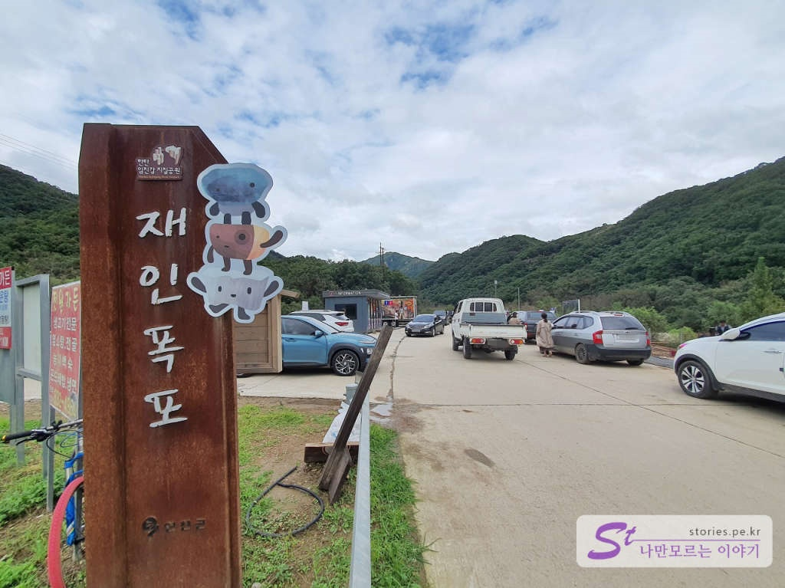    
재인폭포는 원래 예전부터 사람들이 자주 찾던 관광지이긴했는데 올해 연천군이 재정비를 하려고 했던 것 같습니다. 그런데 이번 기나긴 장마로 인해 폭포의 꼭대기까지 잠기면서 공사기간이 늘어난것 갔더라구요.

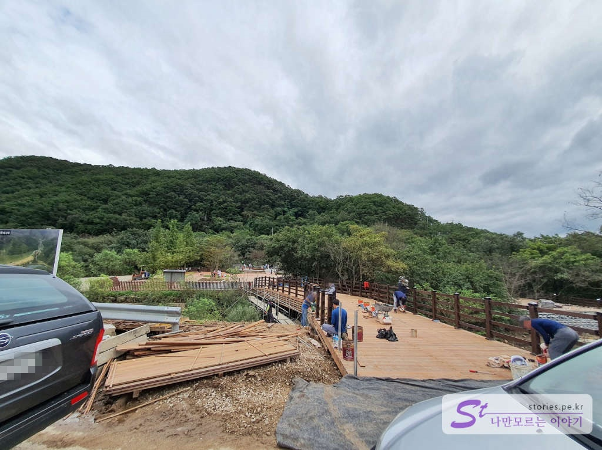  
가는 길에 오른쪽 재인폭포 방향으로 공사가 한창인 모습을 볼 수 있습니다. 원래는 8월 중을 목표로 했다고 하는데 아무래도 좀 더 길어 질것 같은 모양새 입니다.  

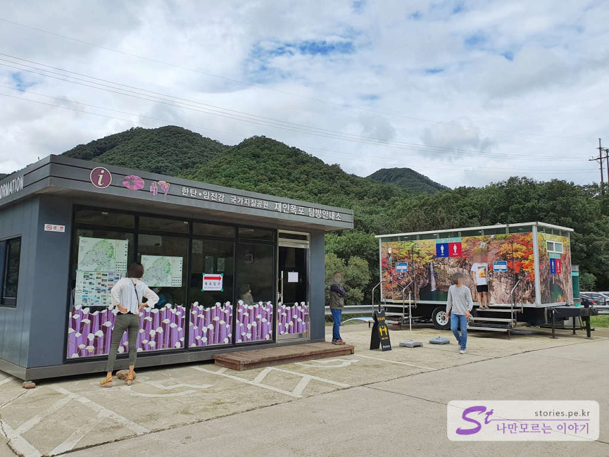   
재인폭포에 대한 안내데스크와 화장실이 있습니다.  

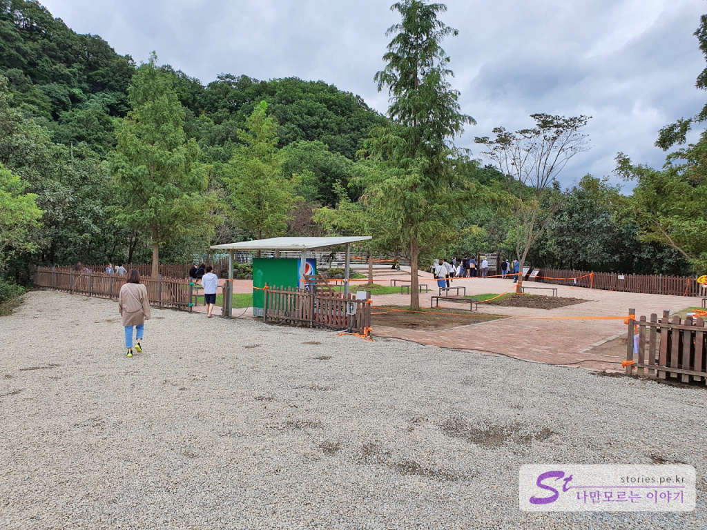   
주차장에 주차를 하고 길을 건너면 재인폭포로 가는 입구가 있습니다. 입구가 대단히 화려하지는 않습니다. 공사가 완공이 된다고 해도 그럴것 같네요.  

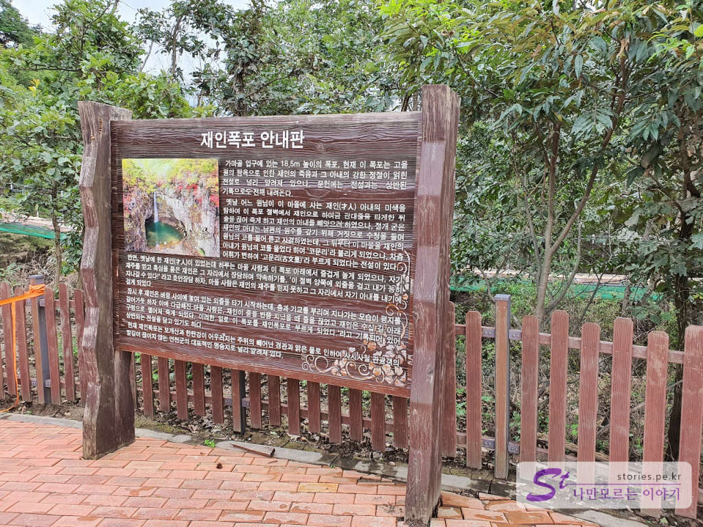  
재인폭포의 유래에 대한 설명이 있습니다. 재인폭포의 재인은 才人으로 **재주가 있는 사람**이라는 뜻이더라구요. 2개의 상반된 전설이 내려오고 있다는데, 어째튼 팩트는 재인이 이 폭포의 양끝에 외줄을 매달아 놓고 줄을 타다 떨어져 죽었다는 것이고... 2개의 상반된 전설 중 하나는 마을의 원님이 재인의 부인을 탐하여 줄을 잘라 떨더뜨려 죽였다는 내용과 하나는 재인과 내기를 한 마을사람이 내기에 질것 같아 줄을 잘라 떨어뜨렸다는 내용이네요.

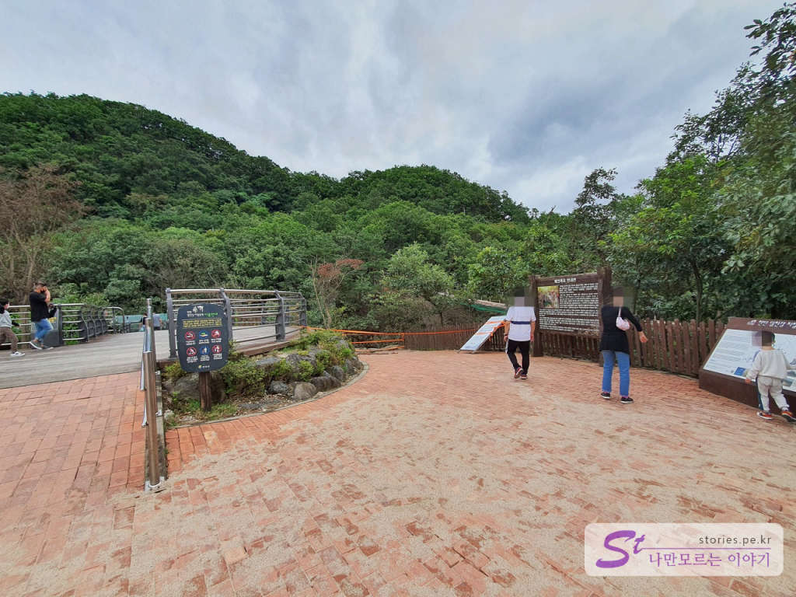   
공사하기 전 원래의 길은 이 안내판이 있는 길을 따라 재인폭포로 내려가는 길이였다고 하는데 현재는 막아놓고 윗쪽에서 관람할 수 있는 바닥이 투명한 스카이워크를 만들어놨습니다. 

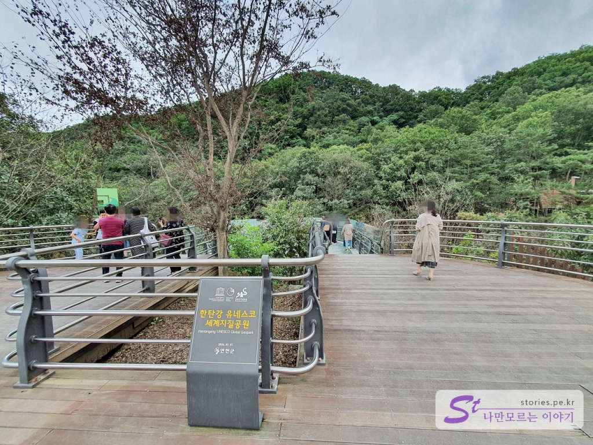  
재인폭포를 위에서 관람할 수 있는 스카이워크의 입구와 출구입니다. 상당히 작네요.  

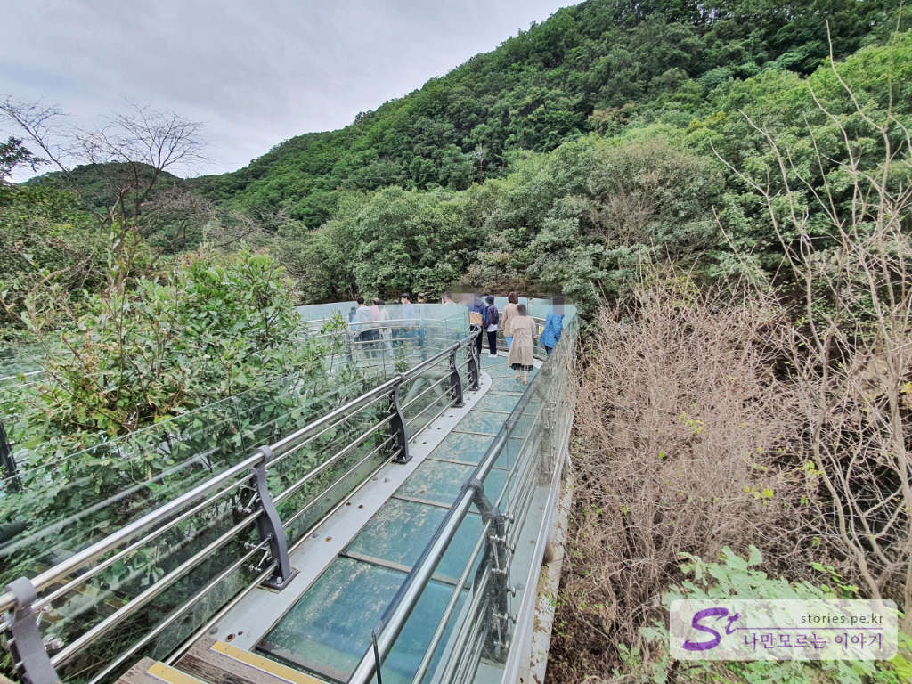  
아직 완공이 되지 않은 상태라 바닥도 긁혀서 엉망이고 길이도 짧고 하네요. 정비가 완료되면 좀 나아진 모습을 갖추겠지요. 

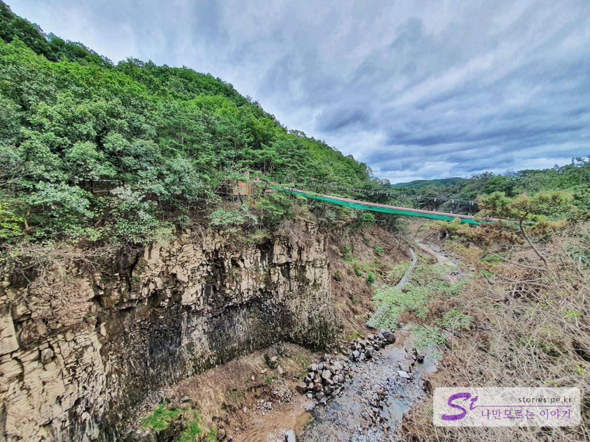  
스카이워크에서 재인폭포의 반대쪽을 봐도 멋진 모습을 볼 수 있습니다. 저 멀리에 출렁다리도 같이 만들고 있네요. 관광지의 패턴이 포천의 비둘기낭과 모습이 흡사한 것을 보니 그곳을 벤치마킹한 것 같습니다. 출렁다리를 건너면 재인폭포 아래로 내려갈 수 있는 길을 만들고 있는 것 같습니다. 

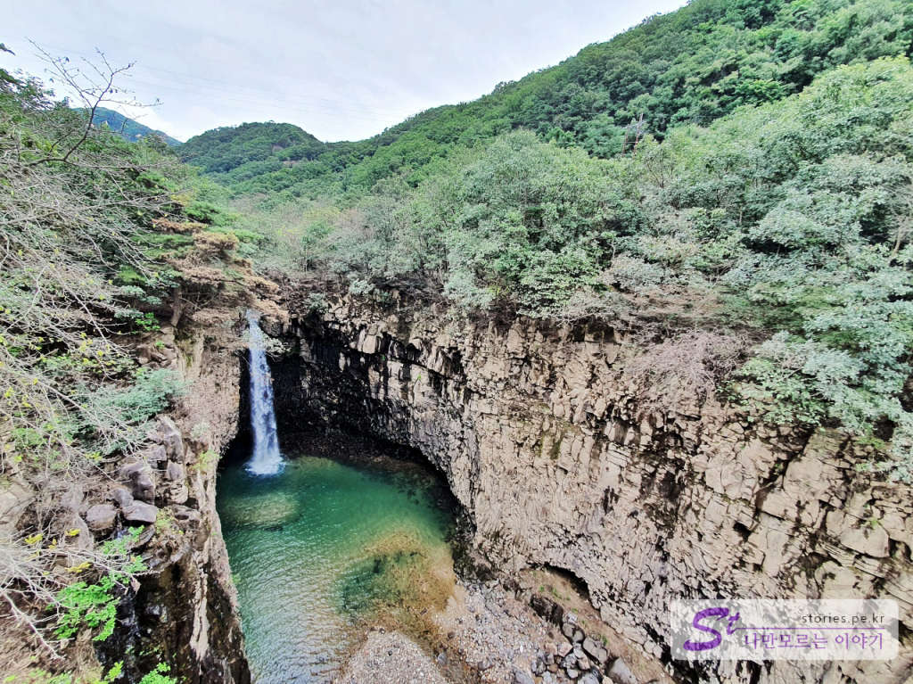  
재인폭포입니다. 비둘기낭과 아주 비슷한 모습을 하고 있습니다. 다만 폭포의 규모는 재인폭포가 더 큰것 같고 관광지의 모습은 비둘기낭이 더 큰것 같네요.  
긴 장마로 인해 재인폭포의 가장 꼭데기까지 물이 찼다고 하는데 폭포를 둘러싸고 있는 절벽에 흙이 묻어있는 모습으로 그때의 모습을 짐작할 수 있습니다.  

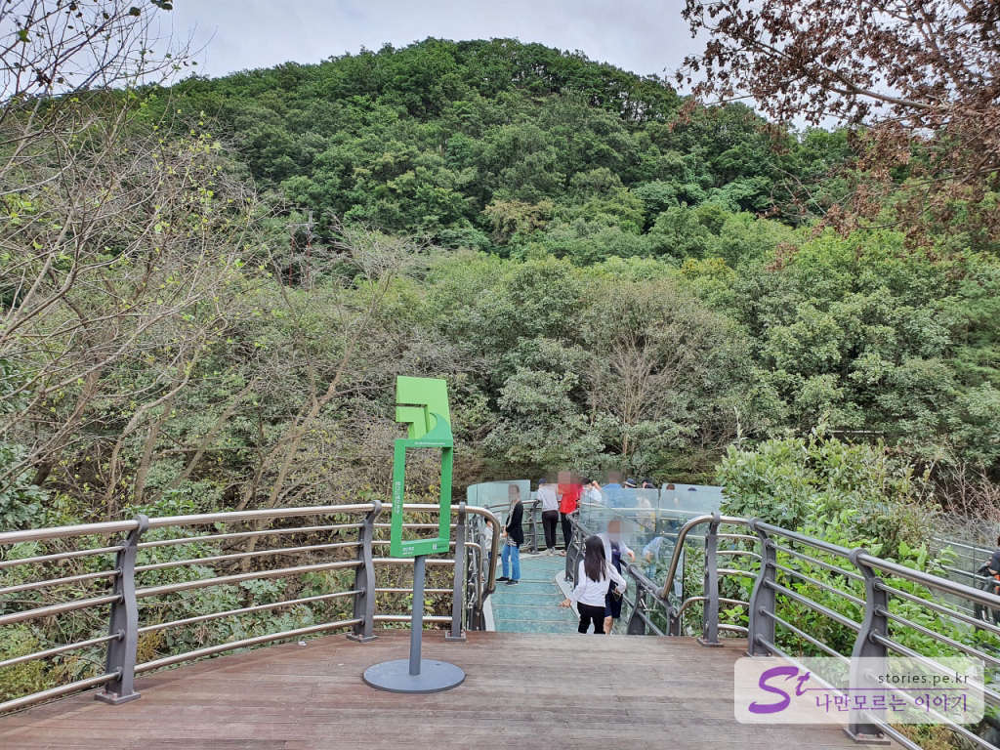  
그렇게 구경을 하고 스카이워크를 나오면 관광이 끝납니다. ^^ 간단하죠? 

## 방문시기   
방문은 2020년 9월달에 방문했습니다. 장마가 아주 길었던 여름을 바로 지나고 다녀왔습니다. 

## 비용  
입장료는 없습니다. 앞으로도 없지 않을까 합니다. 

## 입장시간  
- 시작시간 : 일출 시     
- 마감시간 : 일몰 시 

## 여행지 정보  
- 주소 : 경기도 연천군 연천읍 부곡리 193     
- 연락처 : 031-839-2061, 2147   
- URL :  https://tour.yeoncheon.go.kr:8443/web/cms/?MENUMST_ID=10048  

    <iframe src='https://www.google.com/maps/embed?pb=!1m18!1m12!1m3!1d7310.3608240505455!2d127.1399582311563!3d38.07197095098585!2m3!1f0!2f0!3f0!3m2!1i1024!2i768!4f13.1!3m3!1m2!1s0x357d2f2336ecc4c5%3A0x13bed7a4b219826a!2z7J6s7J247Y-t7Y-s!5e0!3m2!1sko!2skr!4v1600002769346!5m2!1sko!2skr' class='embed-responsive-item' allowfullscreen></iframe>

## 주차정보  
약 15대~20대 정도 주차를 할 수 있는 공간이 있습니다.

## 인근맛집  
저희는 불탄소식당에서 메기매운탕을 먹었는데 상당히 만족스러웠습니다. **민물매운탕**을 좋아하신다면 적극 추천할 만한 식당입니다. 

[[연천맛집]_재인폭포 근처 메기매운탕이 너무 맛있는 불탄소가든 바로가기](https://stories.tistory.com/489)

 