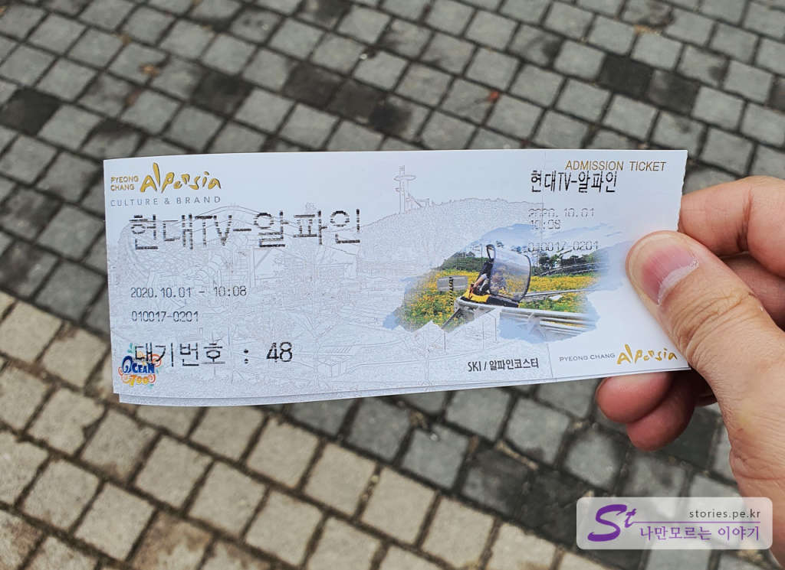

2018년 평창 동계 올림픽을 끝으로 평창의 분위기도 많이 가라앉은 것 같습니다. 더욱이 겨울에는 그나마 즐길거리가 많지만 그 외의 계절에는 여러 가지 다양한 프로모션으로 버텨내고 있지 않나 싶습니다. 저희도 이번에 홈쇼핑으로 많이 저렴하게 알펜시아리조트에 다녀왔습니다. 4인이 이용할 수 있는 하루 숙박, 워터파트인 오션700, 사우나, 조식, 알파인코스터 1회 탑승권이 묶여있는 상품이었습니다.(가격이 정확히 기억이 나지 않네요 -,.-) 숙소는 방 2개, 화장실 2개, 거실 1개로 2 가정이 이용해도 불편하지 않았습니다. 리조트라 깨끗하기도 했고요. 아침에 먹은 조식도 인터컨티넨탈 호텔에서 운영하는 곳이라 고급스럽고 맛있었습니다. 추천합니다. 워터파크인 오션700은 여행 일정 때문에 이용하지 못했습니다.  

## 짜릿한 알파인코스터

제가 포스팅하려고 하는것은 **알파인코스터**입니다. ^^ 첫날은 비가와서 운행을 하지 않아서 체험에 실패했지만 일주일 뒤에 다시 방문해서 이용을 했습니다. 

   
알파인코스터는 알펜시아 거리에서 가깝습니다. 알펜시아 거리에서 코끼리열차 탑승장이 있는 곳에서 매표소가 있습니다. 

  
매표소에서 매표를 합니다. 저는 홈쇼핑에서 이미 구매한 바코드가 있어서 이 바코드를 제출하고 티켓으로 교환했습니다. 우리가 거의 10시 20분쯤에 도착했는데 대기번호가 48번이네요. 우리 앞에 벌써 50명 가까이 구매를 했나 봅니다. 이 정도면 대략 40분 정도 대기를 해야 한다고 합니다. 

  
매표를 하고 산 위로 올라가기 위해 리프트를 타야 합니다.

  
 겨울에는 스키 리프트로 사용하고 그 외의 계절에는 알파인코스터나 바이크를 타기 위해 사용되어집니다.  

  
한참을 올라가면 산꼭대기인 종착점에 도착합니다.  

  
정상에 도착하면 산장이 보입니다. 카페베네와 분식을 파는 곳이 있는데 분식을 파는 곳은 겨울에만 운영이 되는 것 같습니다. 우리가 갔을 때는 커피만 팔고 있더라고요.
알파인코스터를 타기 위해 약 40분을 기다려야 하기 때문에 카페에서 커피를 마시며 기다리기에 좋습니다. 다만 가격이 상당히 비싼 편입니다. 

  
리프트에서 내려서 왼쪽으로 가면 동물농장이 있습니다. 토끼나 염소에게 먹이를 주는 체험을 할 수 있습니다. 어린아이들에게는 체험하기 좋은 곳 일 듯하나 우리는 어린이가 없으므로 잠깐만 보고 왔습니다. 

  
여기가 알파인코스터 탑승장입니다.   

  
알파인코스터가 사람과 사람 사이의 탑승 시간이 있기 때문에 대기번호 기준으로 10명 단위로 탑승을 하게 되어 있습니다. 그 이상의 대기번호를 가진 사람들은 다른 곳에 있다가 방송이 나왔을 때 탑승장으로 오면 됩니다.   

  
탑승장에서 바라본 풍경입니다. 너무 멋지네요.  

  
알파인코스터 탑승장이 있는 곳에서 **산악바이크**도 탈 수 있습니다. 자전거는 본인의 자전거를 타도 되고 알펜시아에서 대여를 할 수도 있습니다. 리프트에 자전거를 싣고 올라와서 이곳에서 자전거를 타고 내려가게 되어 있습니다. 

  
우리가 탈  알파인 코스터입니다.   

  
탑승요령과 기준에 대한 내용입니다.  

  
탑승할 때는 사진을 찍을 수가 없어서 마지막에 내렸을 때 찍어봤네요. 
대략 탑승 시간은 5~7분 정도 내려오는 것 같습니다. 

## 주의사항  
의자의 충격을 완화해줄 장치가 없어서 허리가 좋지 않은 분이나 연세가 많으신 분은 타시면 안 될 것 같습니다. 허리 나가요.  

## 비용  
   
※ https://www.alpensia.com/lc/cost-info.do  

## 입장시간  
    
※ https://www.alpensia.com/lc/cost-info.do 

## 여행지 정보  
- 주소 : 강원 평창군 대관령면 솔봉로 325    
- 연락처 : 033-339-0000   
- URL : www.alpensiaresort.co.kr  

    <iframe src='https://www.google.com/maps/embed?pb=!1m18!1m12!1m3!1d6889.116507506962!2d128.6684245943235!3d37.656865125881744!2m3!1f0!2f0!3f0!3m2!1i1024!2i768!4f13.1!3m3!1m2!1s0x35618a8a824a04bd%3A0x73d3f697fded26e7!2z7JWM7Y6c7Iuc7JWE66as7KGw7Yq47Iqk7YKk7J6lJuyVjO2MjOyduOy9lOyKpO2EsA!5e0!3m2!1sko!2skr!4v1601886088876!5m2!1sko!2skr' class='embed-responsive-item' allowfullscreen></iframe>

 
