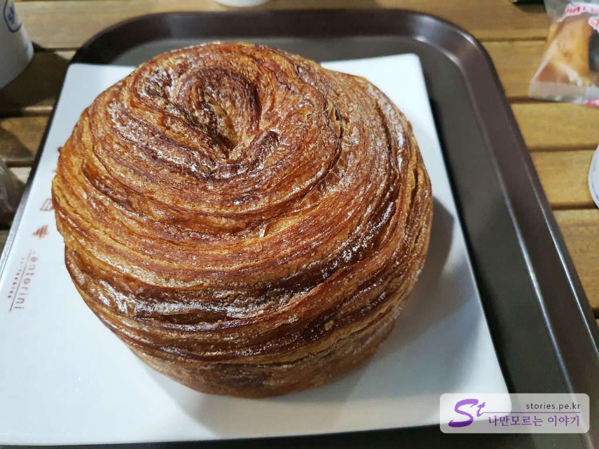

영동고속도로를 타고 강릉으로 내려갔습니다. 점심쯤이 되서 강릉의 유명한 맛집인 초당순두부를 먹고 안목해변으로 갔습니다. **안목해변**은 동해의 바닷가를 천편일률적인 횟집에서 카페 천지로 바꾸게 한 일등공신이라 할 수 있는 곳입니다. 
그 중심에는 2011년 테이크아웃점으로 시작한 **산토리니 카페**가 있습니다. 

  
밤에 방문한 안목해변입니다. 안목해변은 여러 곳에 무료로 주차할 수 있는 공영 주차장이 있고 차박을 하는 사람들도 곳곳에 많이 있습니다.  그 주차장 앞에는 이곳이 안목해변이다.라고 알리는 표지판이 있습니다. 

  
그리고 이름에 걸맞게 아주 많은 카페들이 해변길을 따라 줄지어 서 있습니다. 딱 봐도 통 유리창에 매우 고급스러운 인테리어를 하고 있습니다.  

  
그중에 안목해변 카페거리의 1세대라 할 수 있는 산토리니도 있습니다. 자세한 포스팅은 뒤에 하도록 하겠습니다.  

  
강릉 커피거리 표지판이 보이네요.  

   
   
불야성입니다. 이곳의 대부분이 카페라고 보시면 됩니다.   

  
낮에도 방문을 해 봤습니다. 저 멀리 산토리니 카페가 보이네요. 산토리니 카페 맞은편으로는 방파제가 있습니다. 방파제가 넓어서 걷기 좋고 날씨가 좋으면 등대까지도 가 볼 수 있습니다. 

  
방파제를 따라 등대로 가는 길입니다. 낚시를 하지 말라고 하는 것 같긴 한데 양 옆의 바닷가에서 많은 분들이 낚시를 하고 계시네요. 우리가 갔을 때 어떤 낚시꾼이 커다란 숭어를 잡는 것도 봤습니다. 

  
가는 길에 보이는 선착장과 안목 해안 주차장입니다. 휴일이라서 그런지 차들이 많네요.

  
어느 정도 가다 보면 철망이 보입니다. 날씨가 좋지 않거나 너울성 파도가 있을 것 같으면 출입통제를 하는 것 같습니다. 우리가 갔을 때는 문이 개방되어 있어서 등대까지 갈 수 있었습니다.   

  
방파제의 끝에 다다르면 이렇게 눈에 잘 띄는 빨간 등대가 하나 있습니다. 
이곳에서 바닷바람도 맞고 사진도 찍고 고기 잡는 것도 보면서 여유를 즐기다가 산토리니 카페로 이동했습니다. 

## 안목해변 1세대 카페 산토리니  

  
산토리니도 밤에 한번, 낮에 한번 방문했습니다. 지중해 그리스의 에게해에 있는 이아마을을 모티브로 인테리어를 한 카페입니다.  

  
기성의 커피도 판매하고 왼쪽의 카운터에서는 핸드드립 커피도 판매를 하고 있었습니다. 

  
오른쪽 베이커리 코너에서는 다양한 빵도 판매를 하고 있습니다. 
1층에서 커피나 빵을 구해해서 2~4층으로 올라가서 커피를 마실 수 있습니다. 

   
  
3층에 올라가면 커다란 로스팅 기계를 볼 수 있습니다. 

  
  
반대편으로는 커피를 마실 수 있는 테이블이 있고 야외로 나가서 바닷바람을 맞으며 마실 수 있는 테라스도 있습니다. 

  
커피와 빵, 초당 커피 빵을 구매해서 3층 야외 테라스로 나왔습니다.  

  
커피 빵입니다. 별 특이한 건 없습니다. 그냥 커피 향이 조금 나는 한입 빵입니다. 커피거리다 보니 지역특색에 맞게 누가 개발한 빵이지 않나 싶습니다.  

  
어디에서 먹어도 항상 맛있는 몽블랑입니다. 발효로 부풀린 빵이 아니라 버터로 부풀린 페스츄리 빵입니다. 

  
그리고 내가 제일 좋아하는 아메리카노.....

  
그리고 이것은 낮에 방문해서 먹은 버블티 라테입니다. 비싸요.. 6000원이네요.
제가 커피의 전문가가 아니라 커피가 얼마나 맛있는지는 모르겠지만 풍경은 정말 좋습니다. 한 번쯤 방문해 보시는 것도 좋습니다. 

## 비용  
비용은 스페셜티 커피 기준이라면 싼 편이고 일반적인 커피 기준이라면 약간씩 비싼 편입니다. 

  
  
아메리카노가 4000원대네요. 스타벅스와 비슷해요. 핸드드립은 좀 더 비싸고요.

## 입장시간  
- 영업시간 : 매일 09:00 ~ 01:00  

## 여행지 정보  
- 주소 : 강원 강릉시 경강로 2667   
- 연락처 : 033-653-0931   
- URL : www.santorinicoffee.co.kr  

    <iframe src='https://www.google.com/maps/embed?pb=!1m18!1m12!1m3!1d1576.910912554818!2d128.94934385057167!3d37.7707757975063!2m3!1f0!2f0!3f0!3m2!1i1024!2i768!4f13.1!3m3!1m2!1s0x3561e70372123663%3A0x7664fe30b450fc9e!2z7IKw7Yag66as64uI7Luk7ZS8!5e0!3m2!1sko!2skr!4v1601954497690!5m2!1sko!2skr' class='embed-responsive-item' allowfullscreen></iframe>

## 주차정보  
공영주차장과 해변을 따라 무료 주차를 할 수 있습니다. 다만 주말이나 공휴일에는 빈자리를 찾기가 쉽지는 않습니다. 운이 좋으면 주차를 할 수 있습니다. 

## 인근맛집  
초당 순두부, 장칼국수
 
