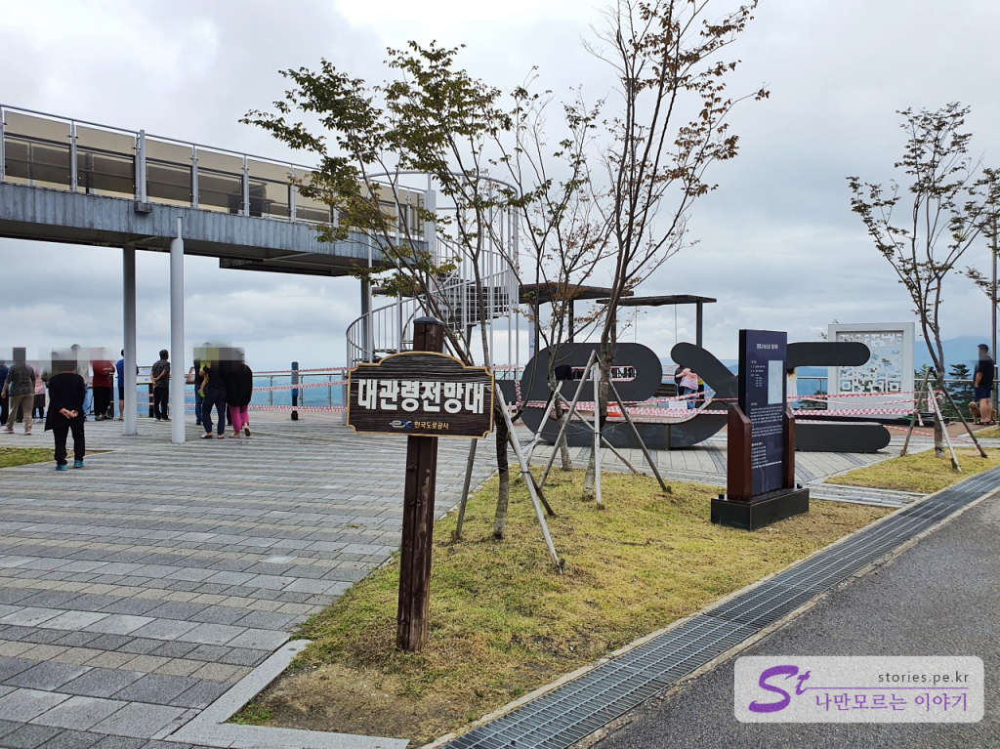

알펜시아에서 알파인코스터를 타고 강릉으로 이동을 했습니다. 이동하는 도중 아는 사람만 안다는 힐링 전망대가 하나 있습니다. 고속도로에서 바로 전망대로 들어갈 수 있는데 입구가 좁아서 모르면 있는지도 모르는 곳입니다. 물론 이전부터 이정표로 몇 번 전망대가 있다고 표시가 되어 있으나 아무 생각 없이 달리다 보면 그냥 지나치기 쉬운 곳입니다. 영동고속도로를 타고 대관령 7 터널을 지나면 바로 전망대로 들어갈 수 있습니다. 

> [[강원도여행] 알펜시아리조트에서 즐길만한 놀이 알파인코스터](https://blog.stories.pe.kr/492)

  
   

전망대로 들어서면 바로 대관령 전망대 표지판을 볼 수 있습니다. 주차는 대략 20~30대 정도를 주차할 수 있습니다. 

  
   
전망대에서 강릉 방향을 바라볼 수 있게 되어 있습니다. 강릉 시내와 저 멀리 바다도 볼 수 있습니다. 밤에 보면 오징어배의 밝은 불빛도 볼 수 있습니다.  

  
  
낮에는 코로나 19로 인해 나무데크와 2층으로 올라가는 곳을 막아놨으나 밤에는 운 좋게 입장 금지 라인이 없어서 2층에도 올라가 봤습니다. 

  
2층에서 바라보면 저 멀리까지 볼 수 있습니다. 코로나 19가 끝나면 낮에도 2층에 올라가 볼 수 있을 겁니다.  

  
낮에 바라본 강릉시내의 풍경입니다.  

  
영동고속도로의 발자취를 정리해 놨네요. 

## 비용  
무료입니다. 

## 입장시간  
연중무휴

## 여행지 정보  
- 주소 : 강원 강릉시 성산면 어흘리 803

    <iframe src='https://www.google.com/maps/embed?pb=!1m18!1m12!1m3!1d3271.813223522082!2d128.77843725600627!3d37.724315999588605!2m3!1f0!2f0!3f0!3m2!1i1024!2i768!4f13.1!3m3!1m2!1s0x3561f14b612e51b9%3A0x5e4962334c6a613c!2z64yA6rSA66C5IO2ekOungSDsoITrp53rjIA!5e0!3m2!1sko!2skr!4v1601909675636!5m2!1sko!2skr' class='embed-responsive-item' allowfullscreen></iframe>

## 주차정보  
약 20~30대 정도 주차를 할 수 있습니다. 
