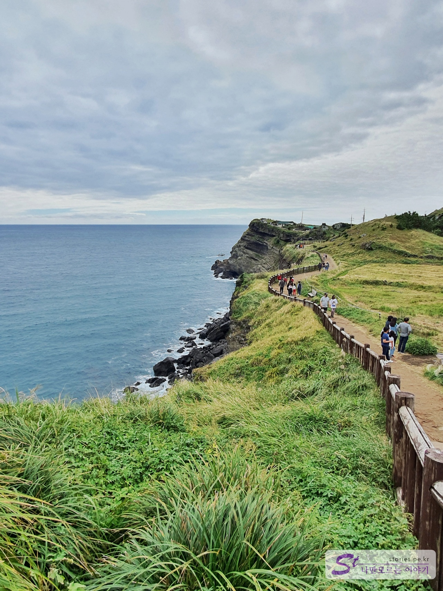

10월 한글날을 전후해서 마스크를 단디 쓰고 제주도 여행을 다녀왔습니다.  이번 포스팅에는 3박 4일 전체 일정에 대해서 기록해 보려고 합니다 각 여행지에 대한 포스팅은 계속하도록 하겠습니다. 

   

# 첫째 날  
좀 여유있게 출발하여 제주공항에 오후 1시에 도착을 했습니다. 렌터카도 도착시간에 맞춰서 1시부터 예약을 했습니다. 

### 렌터카 인수하기      
예전에는 제주공항에서 렌터카를 바로 인수하여 여행을 시작 할 수 있었는데 언제부턴가 공항에서 렌터카를 빌릴 수 없게 정책이 변경되었습니다. 그래서 제주공항에서 각 렌터카 업체의 셔틀버스를 타고 렌터카 지점으로 이동하여 거기에서 렌터카를 인수하는 방식으로 변경이 되었습니다. 그렇기 때문에 여행이 끝나고 렌터카를 반납할 때 시간 계산을 잘해야 비행기를 놓치는 불상사를 면할  수 있습니다. 
저희는 할인 해텍이 있어서 SK렌터카를 이용했습니다. SK렌터카는 공항에서 이호테우 방면으로 약 10~15분 정도 버스를 타고 이동해야 했습니다. 미리 인터넷으로 예약을 해서 편리하게 비대면으로 차량을 인수하고 마지막에 나갈 때만 직원을 통해 중요사항만 확인했습니다. 

> 제주공항에서 SK렌터가 이용하기 (포스팅예정)

### 점심식사 (돼지구이연구소)  
   
공항에 1시에 도착했으므로 점심을 먼저 먹고 여행을 시작하기로 했습니다. 참고로 저희는 럭셔리를 추구하기보다는 가성비를 추구하는 스타일입니다. 

> [[제주맛집] 제주공항 현지 가성비 맛집 돼지구이연구소 바로가기](https://blog.stories.pe.kr/498) 

### 도두동 무지개 해안도로   
   
첫 번째 여행지로 공항의 해안 쪽에 있는 도두동 무지개 해안도로로 향했습니다. 사진 찍기에도 좋고 드라이브하기에도 정말 좋은 곳입니다.  

> [[제주여행] 제주공항과 가까운 포토 스팟 도두동 무지개 해안도로 바로가기](https://blog.stories.pe.kr/499)

### 이호태우 등대   
   
이호태우 해변에 가기전에 이호태우 등대가 있습니다. 등대의 모양이 흰색말과 붉은말로 되어 있어 젊은 사람들이 많이 찾아오는 포토스팟입니다. 

> [[제주여행] 제주공항과 가까운 아름다운 등대 이호태우에서 사진 찍기 바로가기](https://blog.stories.pe.kr/500) 

### 한담 해안산책로   
   
한담 해안 산책로는 걷기에 좋은 곳입니다. 천천히 걸어서 대략 왕복 30 ~ 40분 정도 소요됩니다. 주차는 한담 해변 쪽에 댈 수 도 있고 한담공원 쪽에 댈 수도 있습니다. 주차하는 위치에 따라 산책의 방향이 조금 달라지는데 저희는 **한담공원 쪽에서 시작**해서 비탈길을 따라 산책로로 내려가서 곽지해수욕장 전까지 걸은 다음 되돌아와 한담 해변까지 가서 다시 한담공원으로 걸어왔습니다. 위치상 석양이 지는 모습이 너무 매력적인 곳입니다.  

> [[제주여행] 제주도에 왔다면 꼭 가봐야 할 한담해안산책로 바로가기](https://blog.stories.pe.kr/501)  

### 제주 동문시장   
  
동문시장에는 총 12개의 출입구가 있습니다. 그중에 **동문재래시장공영주차장**이 있는 **8번 Gate**와 **동문공설시장공영주차장**이 있는 **11번 Gate**가 가장 활성화되어 있습니다. 8번 Gate는 저녁에 오면 야시장처럼 좌우에 청년 포장마차들이 줄지어 있어 길거리 음식들을 먹어 볼 수 있습니다. 맛없고 비싸기는 하지만 시장 같은 분위기를 느끼려면 한 번쯤 가볼 만합니다. 저희는 랍스터 구이와 전복 김밥을 사 먹었는데.. 비싸고 맛이 없어서 실망하고 돌아왔습니다. 

> [[제주여행] 관광객을 위한 제주시 동문시장 탐방기](https://blog.stories.pe.kr/502)

### 코업시티 성산 호텔  
   
첫날은 공항 근처의 제주시를 여행했다면 둘째 날은 우도를 들어가기 위해 성산 쪽에 숙소를 잡았습니다. 제주시 공항 근처에서 성산일출봉까지 대략 40분~1시간 정도 이동 시간이 필요합니다. 숙소는 비즈니스호텔인 코업시티 성산입니다. 비수기 가격은 대략 4만 원~6만 원선에서 형성되어있습니다. 

> [[제주여행] 코업시티호텔 성산 방문기 바로가기](https://blog.stories.pe.kr/503)

# 둘째 날   

아침 일찍 일어나서 성산항을 통해 우도를 들어가려 했으나 아쉽게도 바람이 너무 거세서 당일 우도행 배가 뜨지 않는다고.. ㅠㅠ 부랴부랴 플랜 B의 계획을 세워서 제주의 동쪽을 여행하였습니다.  

### 아침식사 (맛나식당)  
  
일단 이렇게 된 거.. 밥부터 먹자 하고 근처에 가성비 좋은 갈치조림 맛집인 **맛나식당**으로 향했습니다. 여기는 비수기에도 항상 웨이팅이 있는 곳이라 의도치 않게 아침 겸 점심으로 먹게 되었습니다. 9시쯤 맛나식당에 방문하여 예약을 하니 2시간 후인 11시쯤에 오라고 합니다. 보통 2시간의 웨이팅이 필요합니다. 저희는 그동안 차를 타고 광치기해변을 다녀왔습니다. 

> [[제주맛집] 성산에 위치한 인생 가성비 맛집 맛나식당](https://blog.stories.pe.kr/505)

### 광치기 해변  
  
광치기 해변은 제주도와 성산일출봉을 연결하는 길목에 위치해 있습니다. 맛나식당과는 5분 정도 거리에 있으므로 잠시 다녀오기에 좋습니다. 광치기 해변에서 바라보는 성산일출봉은 또하나의 장관입니다. 또한 해변에 말이 있어 유료로 말타기를 할 수 있습니다. 

> [[제주여행] 성산일출봉을 가장 잘 볼 수 있는 광치기 해변](https://blog.stories.pe.kr/504)  

### 성산일출봉  
  
예약시간 동안 광치기 해변 대신에 성산일출봉을 다녀와도 됩니다. 광치기 해변과 성산일출봉 모두를 다녀오기에는 무리가 있지만 2곳 중 한 곳은 다녀올 수 있습니다. 성산일출봉은 제주의 동쪽에 있는 대표적인 관광지로 꼭 한 번은 다녀와야 하는 관광지입니다. 일출봉에 올라서 내려다보는 풍경은 더할 나위 없이 멋이 있습니다. 

> [[제주여행] 제주에서 꼭 가봐야 할 여행지 성산일출봉](https://blog.stories.pe.kr/508)

### 카페 오르다  

성산일출봉은 멋진 뷰를 자랑하지만 오르는 것은 역시나 힘든 일입니다. 성산일출봉을 오른 다음에 잠시 휴식을 취하기 위해 근처에 있는 멋진 **카페 오르다**를 방문했습니다. 국내 몇 안 되는 **천국의계단**을 보유하고 있어서 사진 찍기에 너무 좋습니다. 

> [[제주맛집] 성산일출봉을 올랐다면 잠시 쉬어가기 좋은 카페 오르다](https://blog.stories.pe.kr/509)

### 섭지코지  
제주에 왔다면 꼭 와봐야 할 섭지코지 입니다. 섭지코지의 비경과 자연에서 길러지는 말들을 봐야 합니다. 

> [[제주여행] 제주도 동쪽 성산일출봉을 바라볼 수 있는 바람의 언덕 섭지코지 탐방기](https://blog.stories.pe.kr/506)

### 비자림  
  
카페에서 충분히 쉰다음 이번엔 요즘 제주에서 핫하다는 비자림을 다녀왔습니다. 비자나무가 군락지를 이루고 있어 마치 원시림을 산책하는 듯한 느낌이 듭니다. 

> [[제주여행] 천년의 비자나무가 우거진 피톤치드가 쏟아지는 공기 좋은 비자림](https://blog.stories.pe.kr/510)

# 셋째 날   

### 아침식사 (맛나식당)   
둘째 날도 코업시티 호텔 성산에서 숙박을 했습니다. 셋째 날에는 아침식사를 가시아방 고기국수집에 가려고 했으나 갈치조림이 또 먹고 싶어서 셋째 날도 맛나식당을 찾아갔습니다. 

> [[제주맛집] 성산에 위치한 인생 가성비 맛집 맛나식당](https://blog.stories.pe.kr/505)

### 카페 호랑호랑  
  
카페 호랑호랑은 광치기 해변의 끝쪽에 있는 카페로 카페 앞 해변에서 성산일출봉을 볼 수 있는 장소입니다. 호랑호랑의 시그니처인 하얀 배가 느낌적인 느낌을 더하고 있습니다. 음료 맛집이라기보다는 뷰 맛집입니다. 

### 사려니 숲길   

커피를 마시고 사려니 숲길로 갔습니다. 사려니 숲길은 가능하면 **붉은오름입구**쪽으로 가는 것이 좋습니다. 사려니 숲 속에 나무데크로 길을 만들어놔서 편하게 다녀올 수 있습니다.  

> [[제주여행] 아이유도 찾는 제주의 숨은 산책길 사려니숲길](https://blog.stories.pe.kr/507)

### 베니스 랜드
  
베니스랜드는 방송을 봤을 때는 정말 다녀오고 싶은 곳이었습니다. 하지만 입장료에 비해 너무 관리가 되어 있지 않아서 대단히 실망한 장소입니다. 웬만하면 추천하지 않아요. 

> [[제주여행] 뭔가 많이 아쉬운 베니스랜드](https://blog.stories.pe.kr/511) 

### 중문 부영리조트  
  
이제 제주의 동쪽 여행을 마치고 서쪽의 관광중심지인 중문 부영리조트로 향했습니다. 이동시간이 거의 1시간에서 1시간 30분 정도 소요가 됩니다. 중간에 서귀포에서 올레시장을 구경해 볼까 했지만 그냥 바로 중문으로 넘어와서 먼저 숙소인 중문 부영리조트에 체크인을 먼저 했습니다. 부영리조트의 정식 명칭은 **제주 부영호텔앤리조트**로 호텔과 리조트를 같이 운영하고 있는 관리 잘되고 있는 5성급 호텔입니다.  

> [[제주여행] 중문 부영호텔&리조트 중 리조트(프리미엄스위트 바다전망)](https://blog.stories.pe.kr/515)

### 중문 색달해변  
  
석양을 보기 위해 중문 색달해변으로 향했습니다. 색달해변은 부영리조트에서 차로 3분 거리에 있고 걸어가기에도 부담 없는 거리에 있습니다. 석양이 정말 멋진 해변입니다.

> [[제주여행] 낙조가 아름다운 중문 색달 해수욕장](https://blog.stories.pe.kr/512)

### 저녁식사 (큰돈가)   
  
마지막 날이기 때문에 큰맘 먹고 **큰돈가**에서 제주 흑돼지 근고기를 먹었습니다. 중문의 식당이 비교적 가격이 비싼데 이곳은 적당한 가격에 맛있게 먹을 수 있어서 좋았습니다. 

> [[제주맛집] 중문에서 먹은 로컬 맛집 큰돈가](https://blog.stories.pe.kr/513)

### 마노 커피하우스    
  
식사를 마치고 유명하다는 마노 커피하우스를 다녀왔습니다. 이곳의 주인장님이 커피에 대한 애착과 지식이 매우 높았습니다. 하지만 무엇보다도 인상적인 음료는 커피가 아니라 녹차라테입니다. 제가 녹차라테를 별로 좋아하지 않는데 이곳의 녹차라테는 맛있었습니다. 정말 추천합니다.   

> [[제주맛집] 중문에서 만난 인생커피 마노 커피 하우스(난 녹차라떼가 좋아)](https://blog.stories.pe.kr/514)

# 넷째 날  

### 대포 주상절리대  
  
아침에 산책 겸 부영리조트와 가까이 있는 대포 주상절리대를 다녀왔습니다. 자연이 만든 아름다은 절경을 볼 수 있습니다.  

### 점심식사 (한라전복)  
부영리조트를 체크아웃하고 점심식사를 하기 위해 모슬포항 근처에 있는 한라전복으로 갔습니다. 전복양식장에서 직접 운영을 하는 곳이라 가격이 저렴하고 맛이 있습니다. **전복돌솥밥**을 추천합니다.  

### 송악산 둘레길   
  
점심식사를 하고 가까이에 있는 송악산 둘레길을 다녀왔습니다. 절경이 펼쳐져 있는 둘레길을 약 40분 ~ 1시간 정도 걸어야 하는 거리입니다. 조금 힘들기는 하지만 그만한 가치가 있는 길입니다.  

### 수월봉 전망대   
  
제주의 서쪽에 있는 수월봉 전망대로 갔습니다. 이곳은 차로 어느 정도 가까이 갈 수 있으므로 그렇게 힘들지 않게 다녀올 수 있는 코스이고 멀리 가파도와 풍차를 볼 수 있는 멋진 뷰가 있습니다.  

### 새별오름  
   
그다음 새별오름으로 향했습니다. 10월의 가을이라면 꼭 방문해 봐야 하는 억새 명소입니다. 새별오름 맞은편에 있는 **새빌 카페**에는 **핑크뮬리**가 만개해 있으므로 같이 다녀오는 것이 좋습니다.   

### 용두암과 용연  
이제 떠나야 할 시간입니다. 비행기 시간에 맞추기 위해 공항 근처에 있는 용두암과 용연을 다녀왔습니다.  

### 렌터카 반납      
여행이 끝나고 렌터카를 반납할 때 시간 계산을 잘해야 비행기를 놓치는 불상사를 면할  수 있습니다. 렌터카를 반납하고 기다렸다가 셔틀버스를 타고 공항으로 가야 하므로 보통 비행기 출발 1시간 30분에서 2시간 정도 전에 반납하는 것이 좋습니다. 
