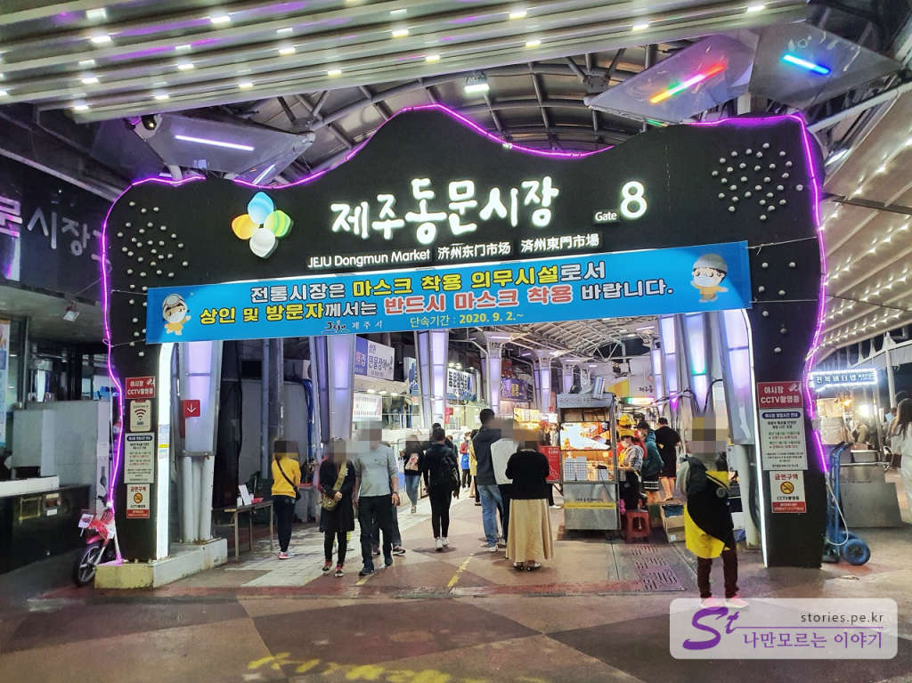
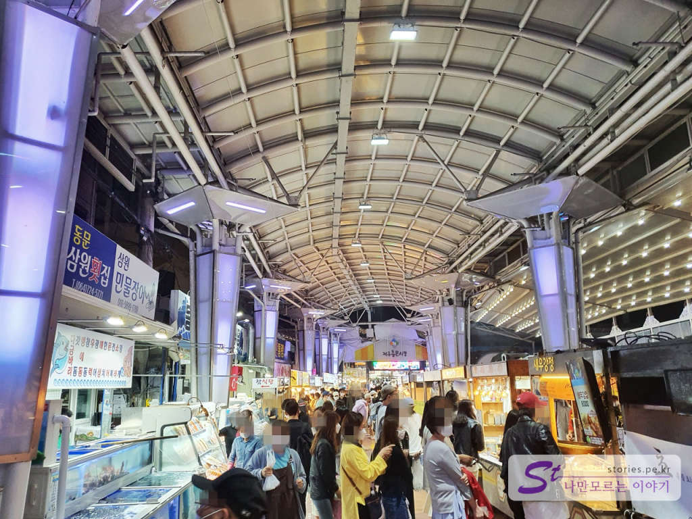
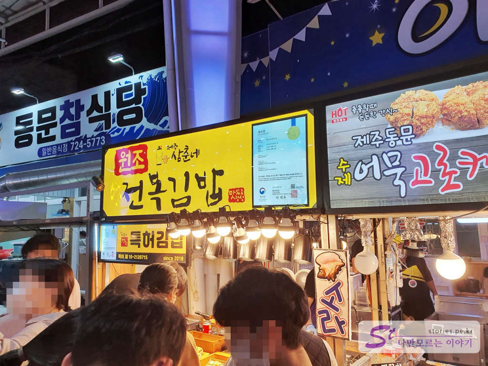
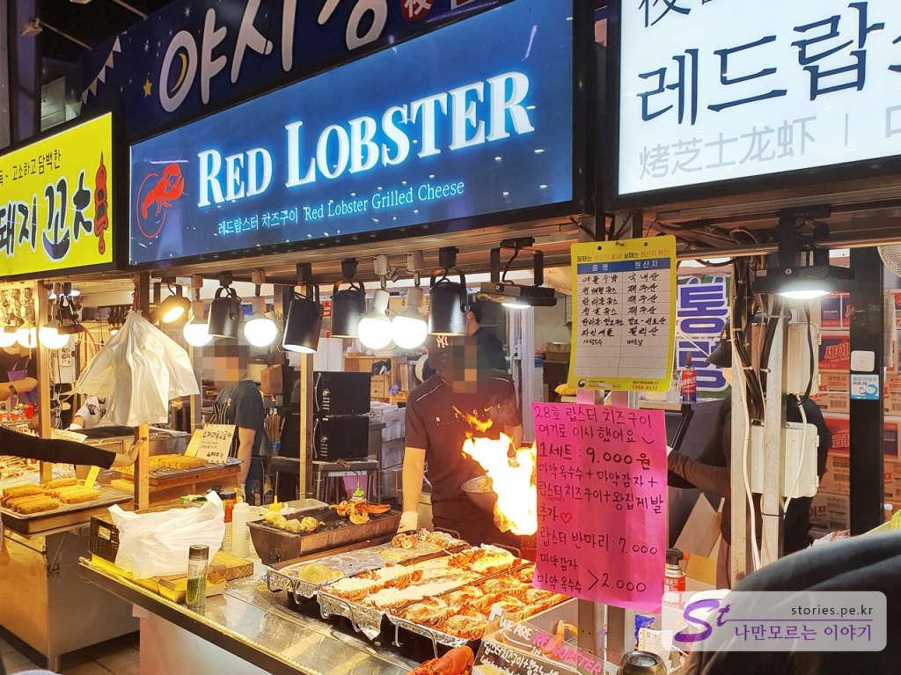
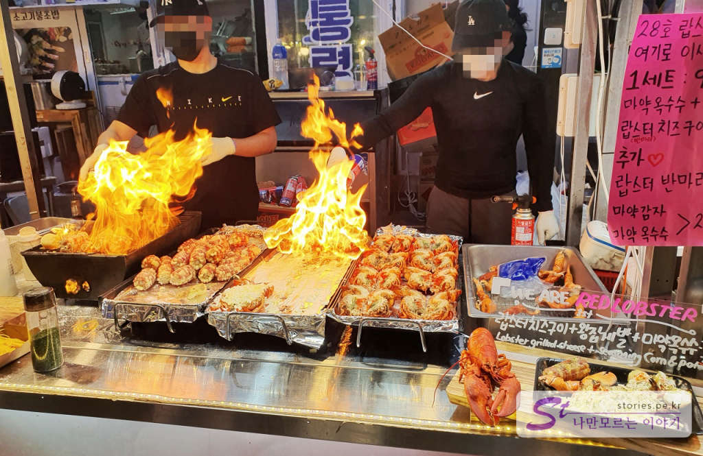
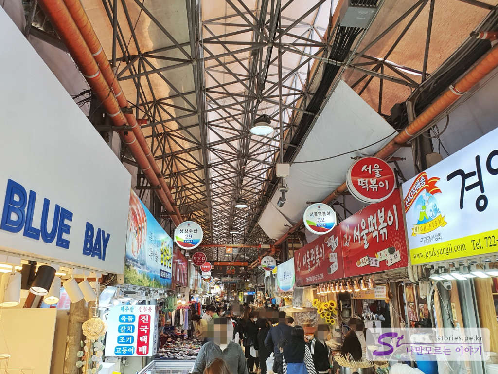
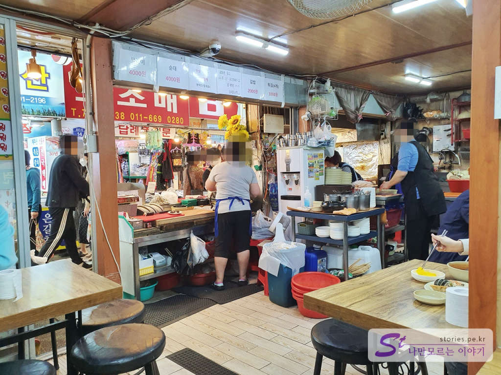
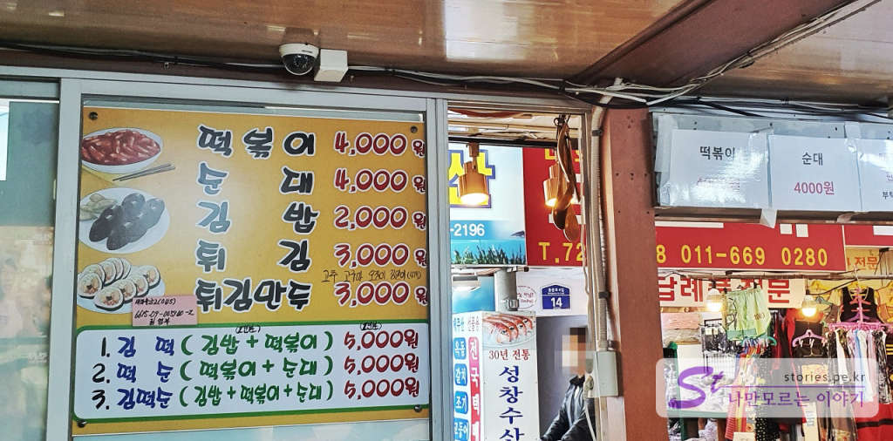
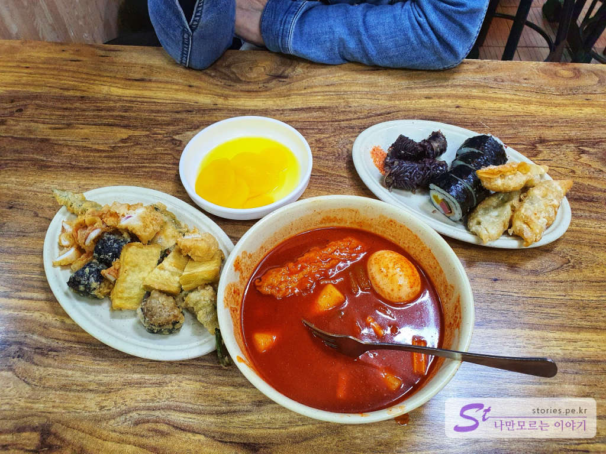
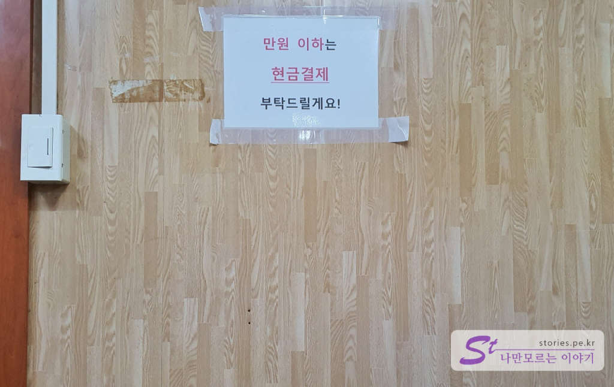

제주도의 대표적인 재래시장이라고 하면 공항 쪽에 있는 제주시 동문시장과 서귀포 쪽에 있는 올레시장이라고 할 수 있습니다. 말이 전통 재래시장이지 관광객을 위한 시장이 된 지 오래되었다고 볼 수 있습니다. 이번 여행에서는 올레시장에는 가보지 못했고 동문시장만 밤에 한번 낮에 한번 가봤습니다. 

   
동문시장에는 총 12개의 출입구가 있습니다. 그중에 **동문재래시장공영주차장**이 있는 **8번 Gate**와 **동문공설시장공영주차장**이 있는 **11번 Gate**가 가장 활성화되어 있습니다. 8번 Gate는 저녁에 오면 야시장처럼 좌우에 청년 포장마차들이 줄지어 있어 길거리 음식들을 먹어 볼 수 있습니다. 맛없고 비싸기는 하지만 시장 같은 분위기를 느끼려면 한 번쯤 가볼 만합니다. 

  
저녁에 오면 주위가 너무 한산하여 동문시장 문 닫은 거 아녀??라고 의심을 하게 되지만 8번 Gate에 들어서면 많은 사람들이 북적이는 모습에 왠지 모를 설렘을 가지게 됩니다. 

  
어떤 포장마차는 사람들이 정말 끝이 보이지 않을 정도로 줄을 서있기도 하고 어떤 포장마차는 파리를 날리고 있는 곳도 있고 합니다. 저희는 적당한 곳에 줄을 서봤습니다. **원조 삼춘네 전복김밥**.... 

### 삼춘네 전복김밥  
일단 줄을 서면 직원 한 명이 다가와 먼저 결제를 합니다. 손님이 도망갈 마음을 먹지 못하게 카운터를 먹이는 느낌이 들었습니다.(여기 줄 서는 포장마차는 모두 이런 결제를 하네요)
전복 씹는 맛을 느끼기 위해 김밥위에 전복이 하나 매달려있는 것을 먹어보려 했으나 가격이 생각했던 예산을 벗어나서 포기하고 그냥 김밥을 구매해서 먹었습니다. 그런데 도대체 전복이 어디에 있는 것인지 씹히는 맛이 없습니다. 내가 전복 간 물로 밥 지은 김밥을 먹고 싶어서 사 먹었겠냐고요. 오독오독 씹히는 식감을 느끼기 위해서 사 먹은 것이지... 정말 실망했습니다. 비싸고 맛없어.....!!!!!

### 레드 랍스터  

  
이번엔 랍스터를 먹고 싶다고 레드랍스터를 찾아갔습니다. 여기도 선결제이고 웨이팅 줄이 길지는 않았습니다. 랍스터를 반으로 쪼겐 반쪽 위에 치즈를 올려 불과 토치로 구워서 주는 음식입니다. 마치 불나방 처럼 불쇼에 이끌리어 줄을 서게 되었습니다. 

  
화려한 불쇼가 나를 감싸고..... 저렇게 하는데 맛이 없다면 거짓말일 거야..
기다림 끝에 랍스터 반쪽을 들고 차 안으로 돌아와서 먹어봤습니다. 
제 잘못입니다. ㅠㅠ 그 가격에 랍스터라니요. 믿지 말았어야 했습니다. 랍스터를 반으로 쪼겐지가 언제인지.. 딱딱하고 비립니다. 불맛으로 감추려고 한 것 같은데 안 가려져요. 딱 꼬리부분만 반건조 오징어처럼 씹는 맛이 나고 나머지는 쓰레기입니다. 

김밥과 랍스터 두 개 모두 실패를 했습니다. 

그다음 날은 낮에 방문을 했고 이번엔 11번 게이트로 입장을 했습니다. 차라리 저는 여기가 더 시장 같은 느낌이었습니다.  

  
시장길 양 옆으로 먹거리와 선물 거리들이 줄지어 서 있습니다. 상점의 종류로 보아 현지인을 위한 시장은 아니고 여행객을 위한 시장입니다. 

### 서울떡볶이  
아이러니하게도 서울에서 제주로 내려와 **서울떡볶이**를 먹어봅니다. 인터넷에서 맛있다고들 하는데..

   
일단 일반 분식점입니다. 많은 사람들이 쉽게 들어와 먹고 갑니다. 회전율이 좋습니다. 

  
가격도 이 정도면 준수합니다. 저희는 김떡순 1개와 튀김 1개를 주문했습니다. 제주 하면 모닥치기가 유명한데.. 여기는 따로 모닥치기라는 명칭을 사용하지는 않습니다.  

  
나왔습니다. 떡볶이는 국물 떡볶이이고 길쭉한 어묵이 2개 들어 있습니다. 김밥 4개와 순대 4개 만두 3개가 김떡순 1인분인 5000원입니다. 그리고 그 옆에 별도로 시킨 튀김입니다. 여려가지 튀김을 잘라서 줍니다. 보통은 한번 뎁펴서 주는데.. 여기는 그냥 잘라만 주네요.  

  
만원 이하는 현금결제를 요청합니다. 이거 이거 불법이긴 한데... 신고할까???
이러다가 말았습니다.ㅋㅋㅋ 그냥 우리도 현금 내고 왔어요
동문시장에서 기념품도 몇 개 사고 아이들 줄 과자도 몇개 사고 왔습니다. 

여행 중 한번 방문해 볼 만한 곳이긴 한데, 크게 기대할 수준은 아닙니다. 로컬 시장 느낌은 전혀 없습니다. 

## 입장시간  
- 시작시간 : 08:00 
- 마감시간 : 21:00    

## 여행지 정보  
- 주소 : 제주 제주시 관덕로14길 20  
- 연락처 : 064-752-3001    
- URL : https://jejudongmun.modoo.at/?link=av2k8geq   

    <iframe src='https://www.google.com/maps/embed?pb=!1m18!1m12!1m3!1d940.2647898021821!2d126.52576417950928!3d33.511351227217375!2m3!1f0!2f0!3f0!3m2!1i1024!2i768!4f13.1!3m3!1m2!1s0x350ce353ff30d105%3A0x3c9a585a805f7cf5!2z64-Z66y47J6s656Y7Iuc7J6l!5e0!3m2!1sko!2skr!4v1602749858713!5m2!1sko!2skr' class='embed-responsive-item' allowfullscreen></iframe>

## 주차정보  
주차는 8번 게이트에 있는 **동문재래시장공영주차장**이 있고
11번 게이트에 있는 **동문공설시장공영주차장**이 있습니다. 
비용은 대략 1시간에 1,000원, 15분당 500원이 추가됩니다. 
