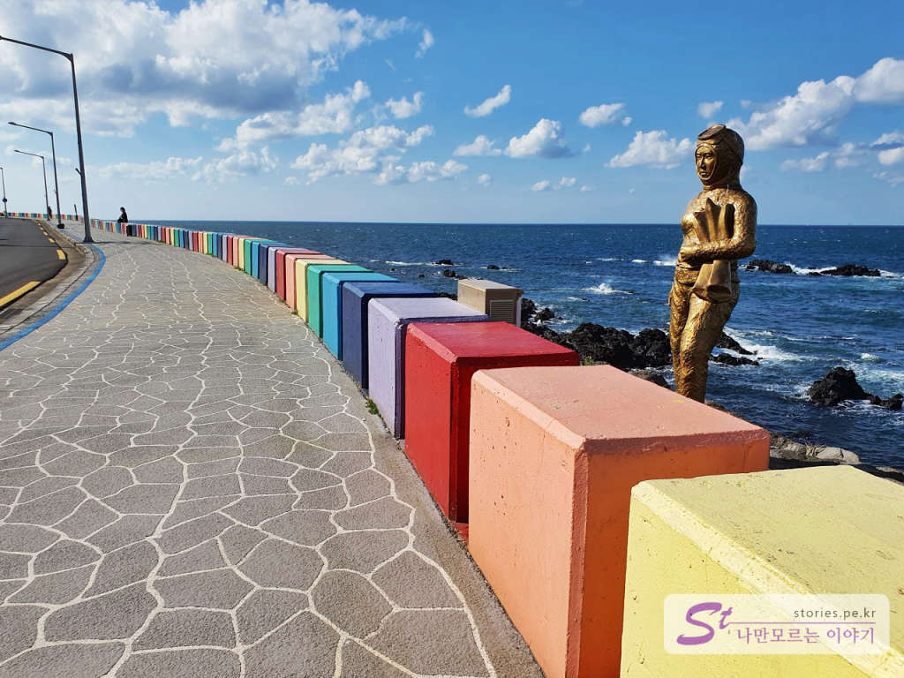
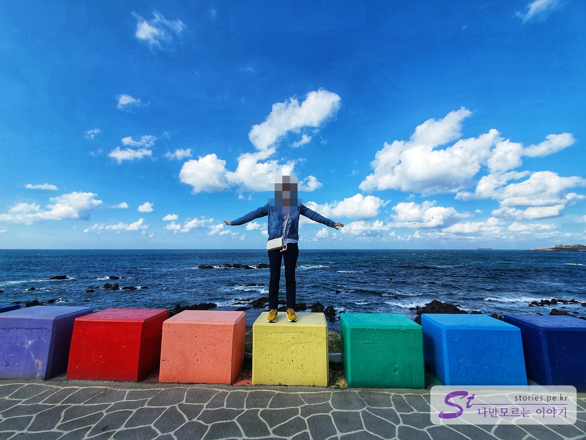
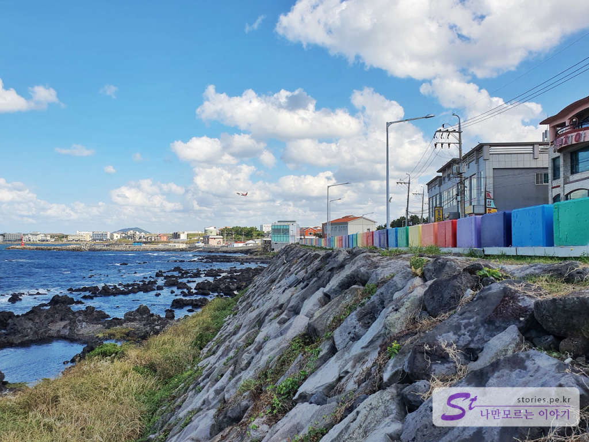

> [[제주 여행] 가을에 떠나는 3박 4일 제주도 여행 전체 일정 ](https://blog.stories.pe.kr/497)

제주여행의 첫째 날 간단히 점심식사를 마치고 제주공항의 해변에 있는 도두동 무지개 해안도로로 갔습니다. 해안도로라 중간에 풍경을 감상하기에 좋고 사진 찍기에도 좋습니다. 

  
도두동 무지개 해안도로는 해변가 인도를 따라 방호벽이 줄지어 서있는데 각각 다른 색으로 칠해져 있어 사진을 찍을 때 예상보다 상당히 이쁘게 나오는 장점이 있습니다.

  
 실제로 보면 "이게 뭐야~~"라고 실망을 할 수 있을지 몰라도 사진을 찍으면 이쁘게 나옵니다. ㅎㅎ  

  
공항과 가까이 있어서 운만 좋으면 빨간색 비행기와 같이 인생 사진을 찍을 수 있습니다. 좀 아쉬운 점이지만 실제로 보면 큰 비행기가 사진을 찍으면 엄청 작게 보이는 단점은 있습니다. 
인물사진을 엄청찍긴 했지만 개인정보 보호를 위해 사진 3장밖에 못 올리네요..
가볍게 한번 지나 갈만 합니다. 애월, 협재 쪽으로 가실 때 시간 여유가 있다면 **도두동 무지개해안도로**를 지나서 가시면 좋습니다.

## 여행지 정보  
- 주소 : 제주 제주시 도두일동  1734   

    <iframe src='https://www.google.com/maps/embed?pb=!1m18!1m12!1m3!1d3326.6981996253726!2d126.47002681504948!3d33.509228380757044!2m3!1f0!2f0!3f0!3m2!1i1024!2i768!4f13.1!3m3!1m2!1s0x350cfba397f0daf7%3A0xa8f44e41b204e772!2z64-E65GQIOustOyngOqwnCDtlbTslYjrj4TroZw!5e0!3m2!1sko!2skr!4v1602649617764!5m2!1sko!2skr' class='embed-responsive-item' allowfullscreen></iframe>

## 주차정보  
공항에서 애월 방향으로 지나간다면 무지개 방호벽의 끝쪽에 주차장이 있습니다. 이곳에 주차를 하고 해안도로도 보고 산책길을 따라 산책도 가능합니다.  

 
