> [[제주 여행] 가을에 떠나는 3박 4일 제주도 여행 전체 일정 ](https://blog.stories.pe.kr/497)

제주도에 왔다면 꼭 한번 들러보길 추천하는 곳입니다. 이곳은 일출보다는 낙조 때 가보는 것을 추천하는 곳입니다. 숙소가 많은 애월, 한림 근처에 있으므로 쉽게 가볼 수 있지않나 싶습니다. 

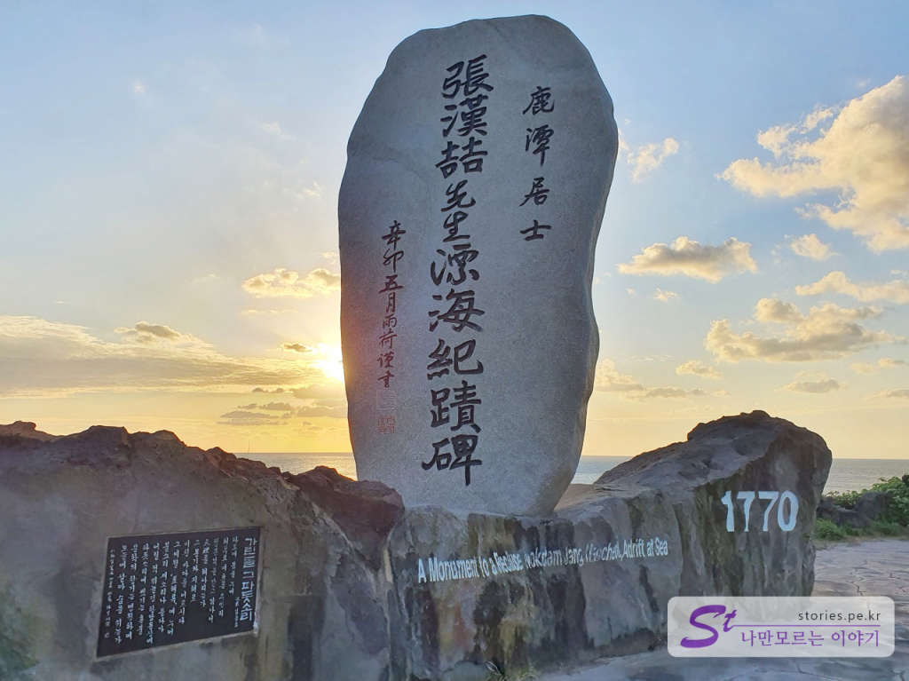  
한담해안산책로를 가기 위해서는 3 군대의 입구가 있습니다. 

1. 제주 올레길 15-B 코스 처럼 곽지해수욕장에서 출발하여 한담해변까지 가는 방법입니다. 이 길은 보통 남들과 거꾸로 가는 코스라고 보시면 됩니다. 
2. 한담해변에서 시작하여 곽지해수욕장 전까지 갔다 오는 방법입니다.
3. 중간쯤에 위치한 한담공원에서 시작하여 중간에 진입해서 곽지해수욕장까지 갔다가 되돌아와 한담해변까지 찍고 돌아오는 방법입니다. 

저희는 3번째인 한담공원에 주차를 하고 다녀오는 방법으로 갔다왔습니다. 아무래도 이 코스가 가장 많은 길을 느낄 수 있는 방법인 것 같아 추천드립니다. 

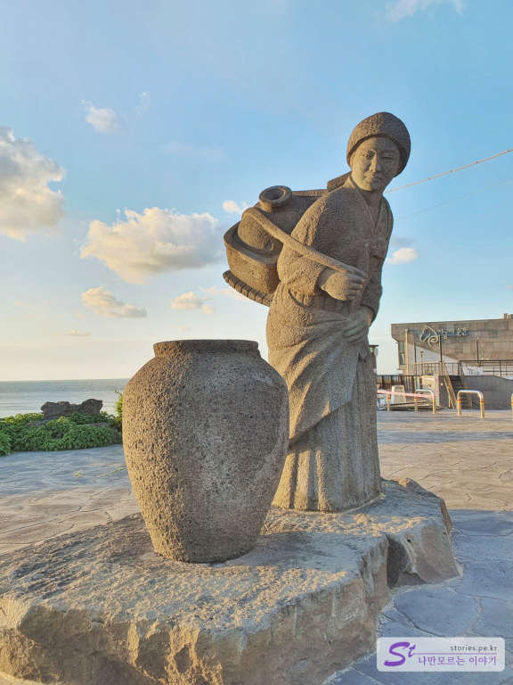   
물허벅을 매고 있는 여인의 동상을 지나 골목길로 내려가면 해안산책로로 진입할 수 있습니다. 

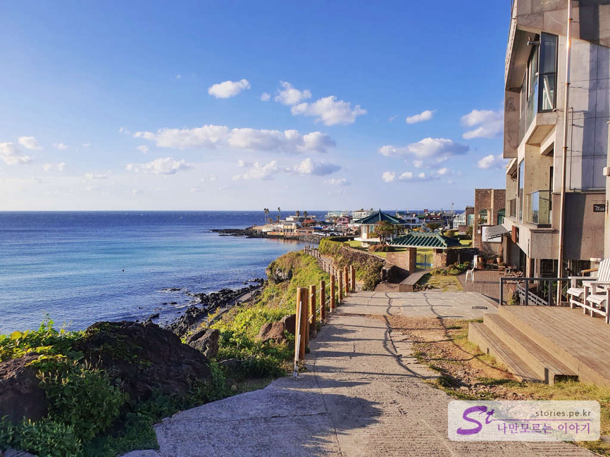  
골목길을 지나면 왼쪽에 멋진 바다와 오른쪽에 오픈 창을 하고 있는 몇몇 카페를 만날 수 있습니다.  

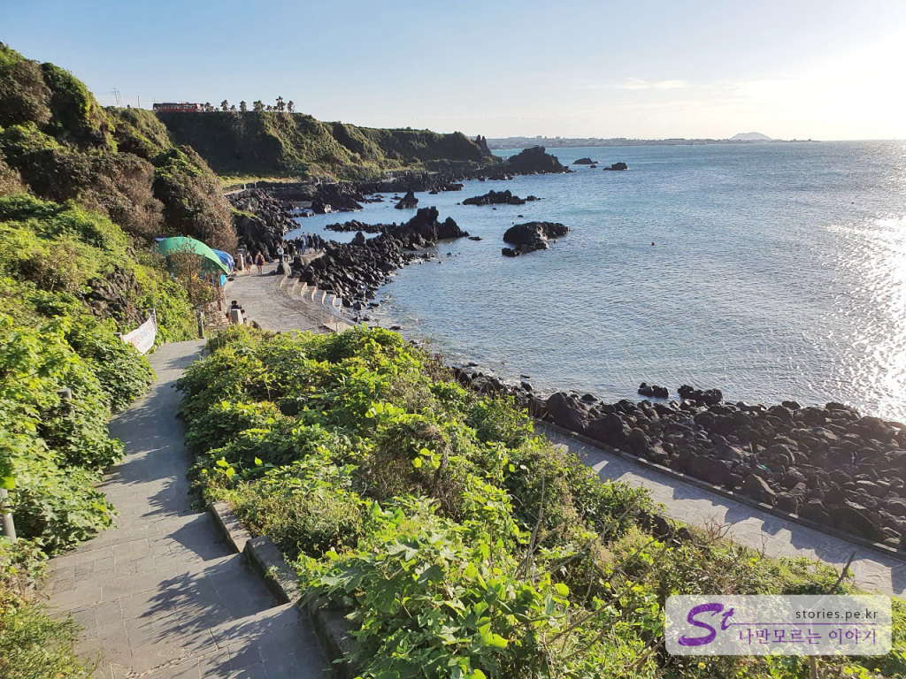  
조금만 더 가면 이렇게 산책로 아래로 내려갈 수 있는 진입로를 만날 수 있습니다. 내려가시면 됩니다. 

  
이제 곽지해수욕장 방향으로 걸으면서 멋진 풍광을 보시면 됩니다. 연인과 같이 간다면 이런저런 이야기를 나누며 걷기에 좋습니다.  

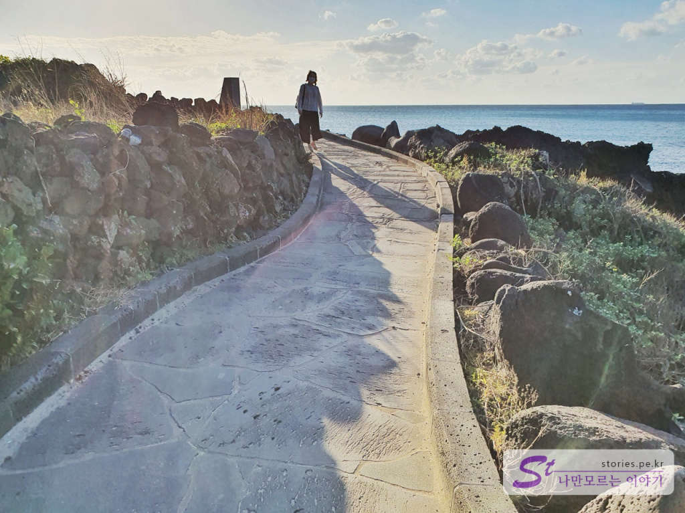  
그림과 같은 멋진 바닷가 오솔길입니다. 

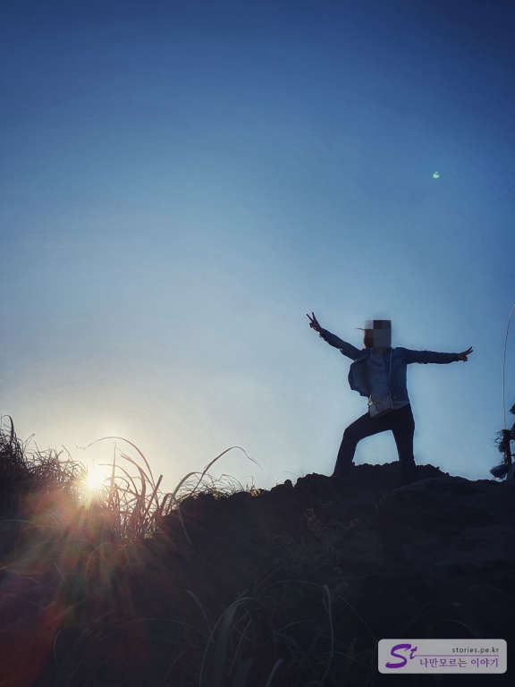    
저녁에 가면 역광으로 멋진 실루엣 사진도 찍을 수 있습니다.  

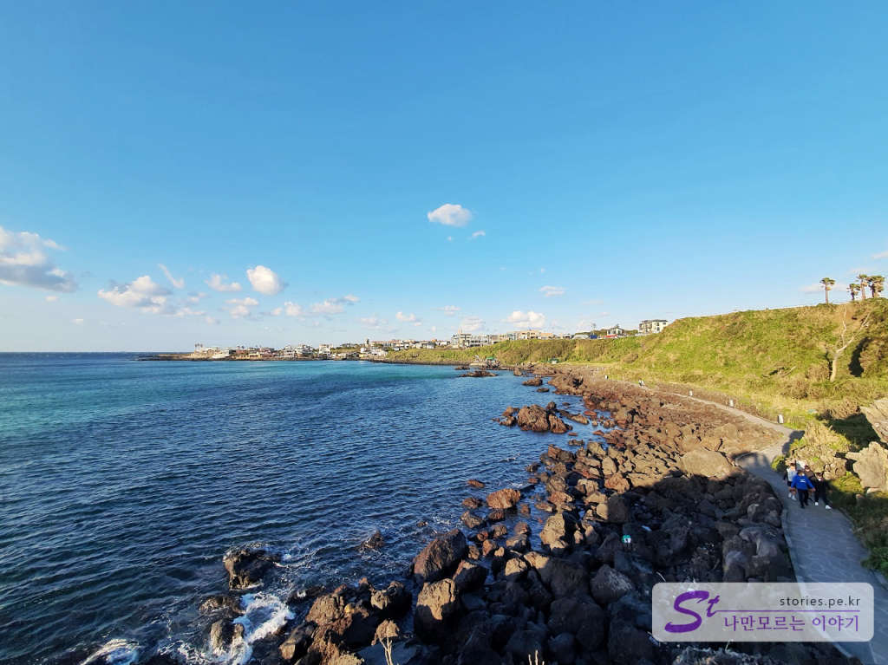  
곽지해수욕장 앞까지 찍고 다시 되돌아오면 또 다른 모습의 풍광을 볼 수 있습니다. 

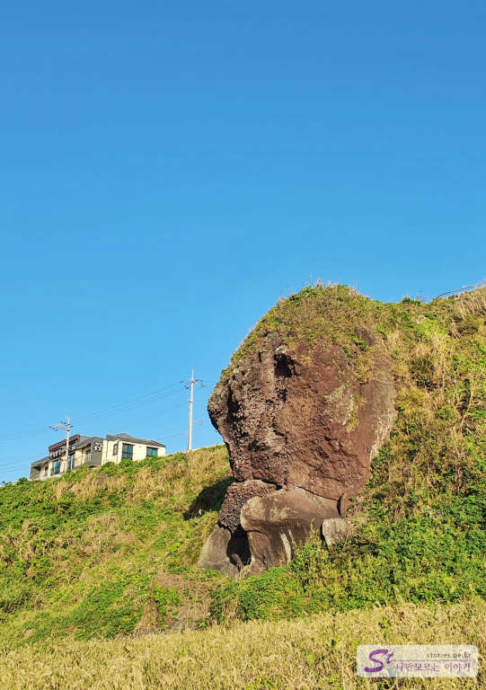  
오면서 보는 절벽의 바위가 꼭 거인의 얼굴처럼 생겨서 찍어봤습니다. 내가 먼저 발견한 것이 맞다면 **거인바위**라고 이름 붙여보렵니다. 

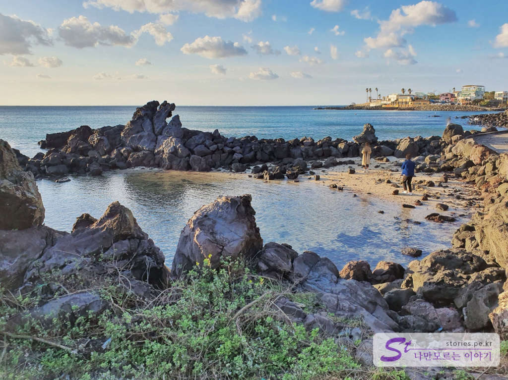  
해변의 축소판인 미니 해변의 느낌이 납니다. 

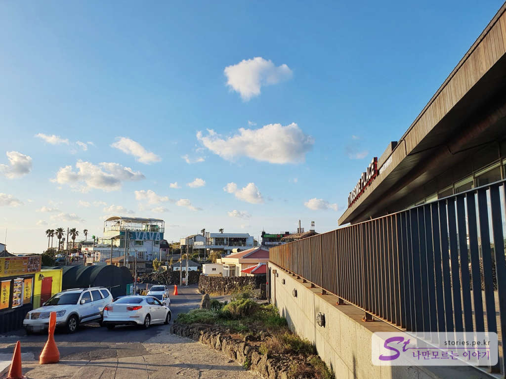  
중간에 진입했던 내려오는 길을 지나 이번에는 한담 해변 쪽으로 조금만 더 걸어가 봅니다. 그곳은 좀 더 번화한 상점들과 커피점들이 들어서 있습니다. 투썸플레이스도 있네요. 
거기에서 되돌아서서 이번에 언덕 위쪽길로 걸어서 한담공원 쪽으로 이동을 하면 됩니다.  

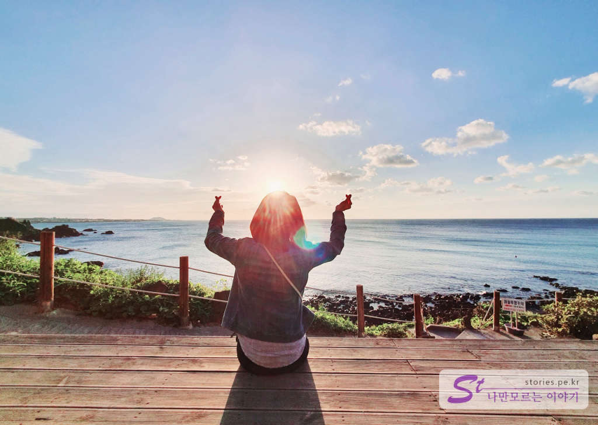  
되돌아오는 길이 낙조를 배경으로 멋진 사진도 찍어봤습니다.  
**카페 지금이순간** 에서 바다를 보며 찍은 사진입니다. 사실 여기에서 커피를 마시지는 않았어요.. 그냥 사진만 찍고 왔네요. 감사합니다. ^^

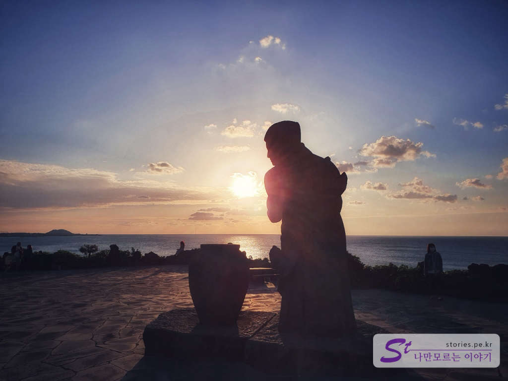  
돌아오니 물허벅을 들고 있는 여인도 낙조에 걸려있네요. 멋있어요.
이렇게 한 바퀴 돌면 1시간에서 1시간 30분 정도 소요됩니다. 

## 여행지 정보  
- 주소 : 제주특별자치도 제주시 애월읍 애월리 2459-1  

    <iframe src='https://www.google.com/maps/embed?pb=!1m18!1m12!1m3!1d1126.9502850596878!2d126.31071091538506!3d33.459227468312406!2m3!1f0!2f0!3f0!3m2!1i1024!2i768!4f13.1!3m3!1m2!1s0x0%3A0x7ba6a5d6a5caa2f5!2z7ZWc64u06rO17JuQ!5e0!3m2!1sko!2skr!4v1602654018415!5m2!1sko!2skr' class='embed-responsive-item' allowfullscreen></iframe>

## 주차정보  
한담공원 주차장, 한담 해변 주차장, 그 길 주변에 주차를 할 수 있습니다. 
