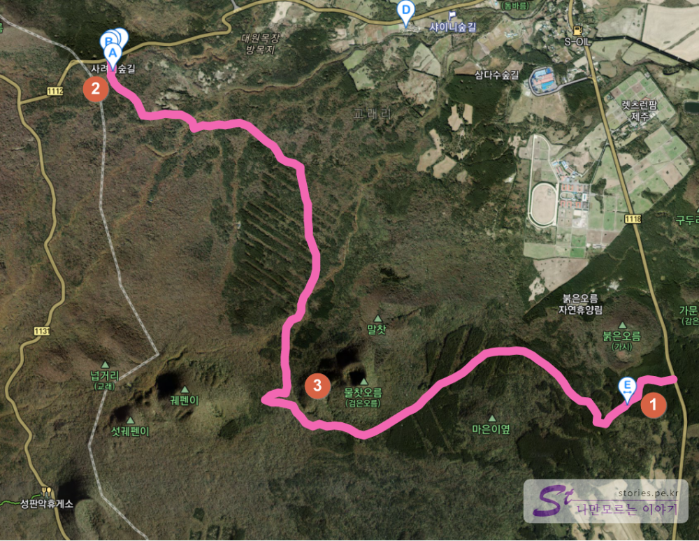

제주도의 바다는 더할 나위 없이 멋진 풍경을 가지고 있습니다만 한라산과 가까이 있는 내륙 쪽에도 또한 울창한 원시림을 가지고 있어 산책하기 좋은 길들이 많이 있습니다. 그중에서도 사려니 숲길은 삼나무와 여러 다양한 나무들이 울창하게 자라고 있어 손꼽히는 좋은 산책길이라 할 수 있습니다. 사려니는 신성한 숲이라는 뜻으로 **사려니 오름**까지 가는 길목이기 때문에 사려니 숲길이라고 부른다고 하네요. 

사려니숲길로 들어서기 위해서는 몇 가지 길이 있는데 그중에서 가장 추천하는 길이 **1번 붉은오름 입구**에서 **3번 물찻오름**까지 갔다가 다시 내려오는 길입니다. 여기에는 붉은 화산송이 길도 있고 울창한 삼나무 숲길도 있어서 여기만 보고 돌아가도 좋은 산책 경험을 할 수 있습니다.   

  
숲길 입구로 가면 **여기가 바로 입구입니다** 라는 푯말이 붙어 있습니다. 이 숲길로 들어서면 산책로를 즐길 수 있습니다.  

  
입구에 표지판으로 전체적인 약도와 여정이 그려져 있습니다. 여기에는 2번을 **제주시 사려니숲 입출구**로 1번을 **서귀포 사려니숲 입출구**로 표시하고 있네요. 

  
숲길에 들어서자마자 길게 뻗어 있는 삼나무 숲을 만나게 됩니다.   

  
나무데크를 따라 천천히 걸으면서 자연의 향기를 맡으면 스트레스가 절로 해소가 되는 기분입니다.  

  
사진 찍기에 좋은 인공조형물도 몇 개 있습니다. **난 여기 다녀왔어~~** 라는 한국형 맞춤 포토존도 있습니다.   

  
  
조금만 더 올라가면 이런 숲길도 만날 수 있습니다. 어디 광고에서 보던 모습 같기도 합니다. 
뭐.. 설명은 안되어 있지만 아마도 바닥에 깔린 빨간 흙이 **화산송이**가 아닐까 합니다. 

  
**아이유가 삼다수 광고에서 "화산송이, 너 삼다수랑 무슨 사이야?"라고 추궁했던** 그 흙이지 않을까 추측해 봅니다. ㅎㅎ  (찾아보니 사려니숲길에서 아이유가 삼다수광고를 찍었다고 하네요~~)

  
삼나무로 이어진 길이 멋진 풍경을 하고 있습니다. 

  
많은 사람들이 이 길을 따라 산책을 하고 있습니다.  

## 방문시기  
10월 가을 대략 오후 2~3시 정도에 방문했습니다. 
입구에서 물찻오름 전까지 다녀오는데 천천히 걷는 걸음으로 대략 1시간에서 1시간 30분 정도 걸립니다. 

## 비용  
비용은 없습니다. 무료예요. 주차비도 무료, 입장료도 무료입니다. 

## 입장시간  
- 시작시간 : 09:00
- 마감시간 : 17:00 (17:00까지 퇴장) 
- 우천 및 폭설 시 통행 제한 있을 수 있다고 합니다. 

## 여행지 정보  
- 주소 : 제주특별자치도 서귀포시 표선면 가시리 산 158-4  
- 연락처 : 064-900-8800  
- URL : https://www.visitjeju.net/kr/detail/view?contentsid=CONT_000000000500281#tsummary 

    <iframe src='https://www.google.com/maps/embed?pb=!1m18!1m12!1m3!1d53297.13313512155!2d126.64959267910157!3d33.3953165!2m3!1f0!2f0!3f0!3m2!1i1024!2i768!4f13.1!3m3!1m2!1s0x350d03ed5e7e2821%3A0x8e927e259f3173b!2z67aJ7J2A7Jik66aEIOyCrOugpOuLiOyIsuq4uA!5e0!3m2!1sko!2skr!4v1603161796784!5m2!1sko!2skr' class='embed-responsive-item' allowfullscreen></iframe>

## 주차정보  
  
도로 갓길에 기본 주차장이 있으며 주차장이 꽉 찼을 경우는 갓길의 연장 구역에 줄지어 주차를 하면 됩니다. 
기본 주차장은 입구의 양 옆으로 50대가량 주차를 할 수 있으나 기본 주차장을 넘어서 이어진 갖길에도 그냥 주차를 할 수 있습니다.  
