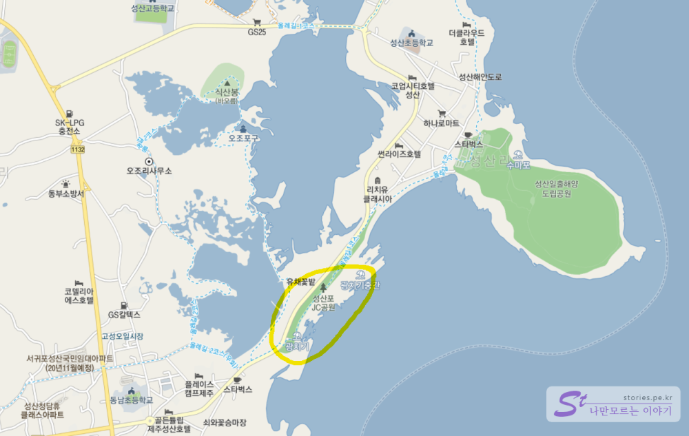
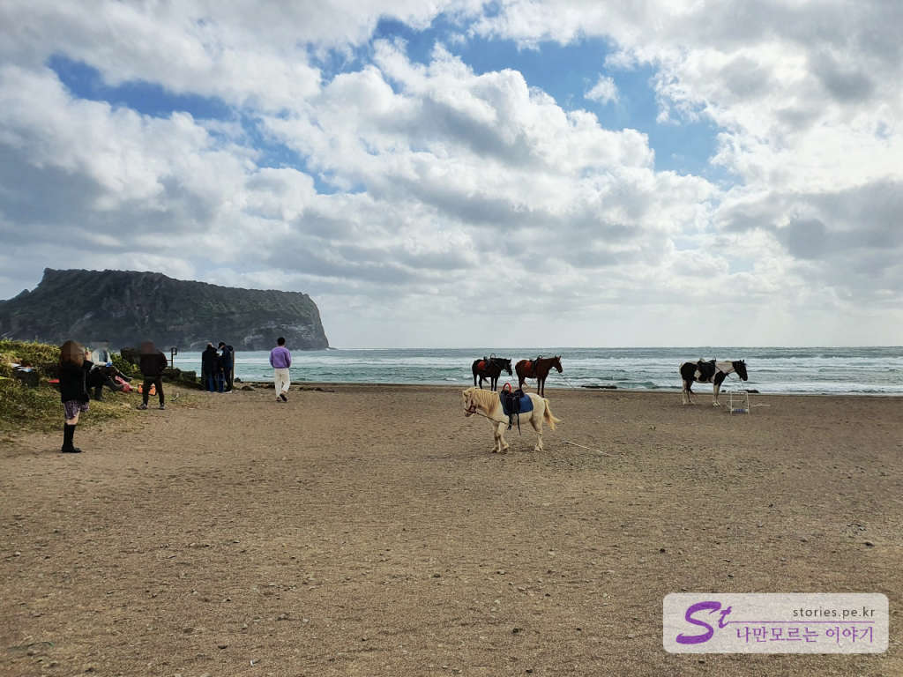
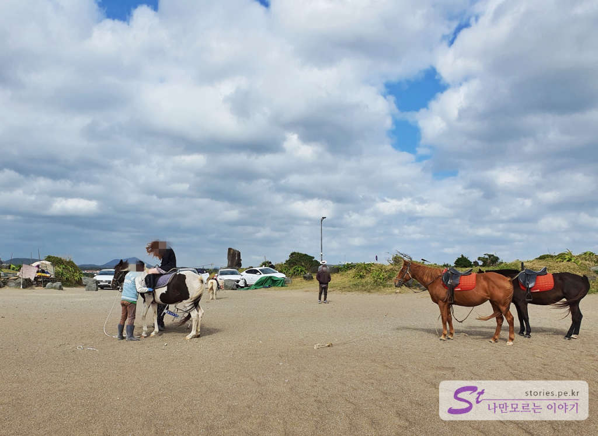
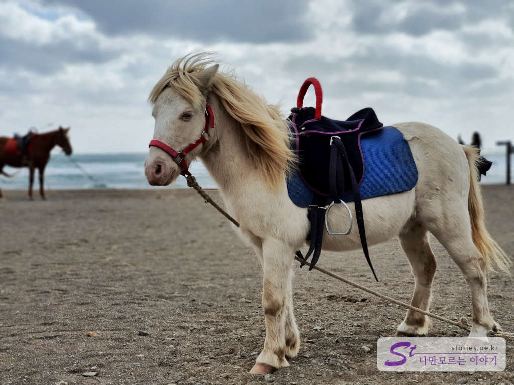
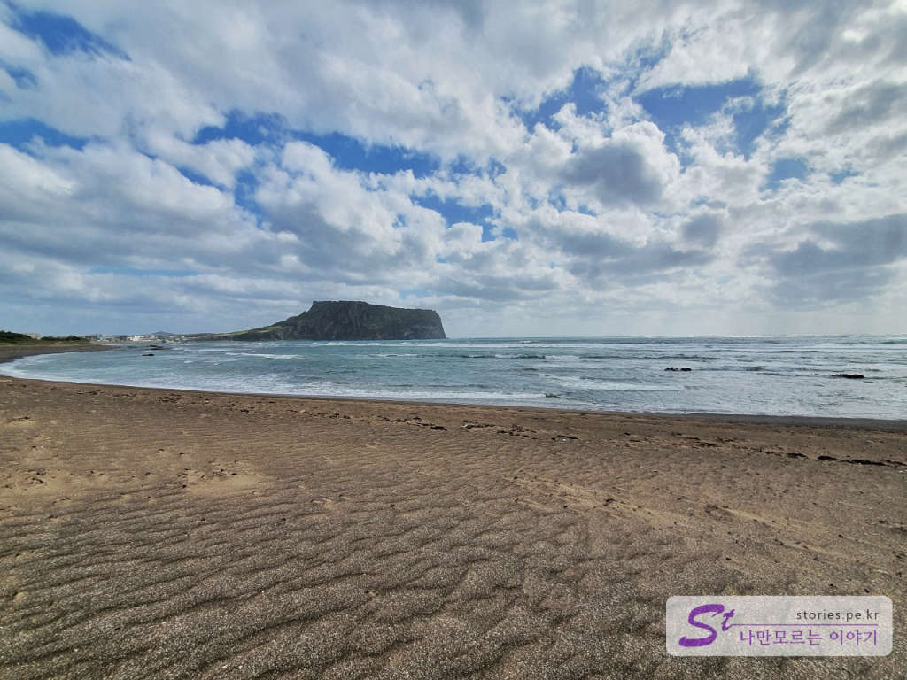
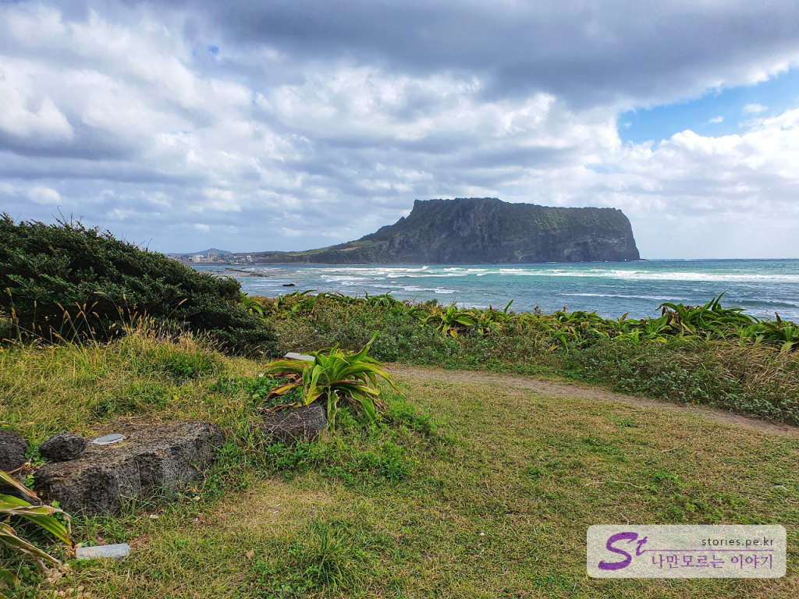

제주에서 성산일출봉으로 들어가는 길목에 광치기 해변이 있습니다. 성산일출봉을 잘 보기 위한 또 하나의 장소인데요. 바다를 끼고 보는 성산일출봉의 단순한 형태를 느낄 수 있는 곳입니다. 

  
광치기 해변의 길 반대편에는 유채꽃밭이 있어서 3월~4월에는 유채꽃을 보기에도 좋습니다. 

  
광치기 해변에 들어서면 이렇게 조랑말들을 볼 수 있습니다. 자유롭게 보고 구경할 수 있습니다. 다만 말에 올라타고 잠시 걷고 사진을 찍는다면 7500원 정도의 비용을 지불해야 합니다. 

  
말을 타시는 분이 계시네요. 마주 분들이 심하게 호객행위를 하지는 않으십니다. 적당히 한번 정도 권유하시는 정도이니 부담은 없습니다. 입구 쪽에 계시는 귤 파시는 할머니들이 호객행위가 더 심하네요.. ㅎㅎ

  
작은 조랑말입니다. 아이들이 있으면 태워주고 싶을 정도로 작고 아담하네요. 

  
광치기 해변에서 바라본 성산일출봉입니다. 매우 심플하고 이쁘지요? 매력적입니다. 

  
해변에 약간의 풀들이 자라 있는 곳이 있습니다. 이곳에서 찍은 사진도 정말 멋집니다. 

왔다 갔다 할 때 잠시 쉬었다가 가기에 정말 좋습니다. 

## 방문시기  
10월 초에 다녀왔습니다. 

## 비용  
말 타고 잠깐 걷기, 사진 찍기 정도에 7500원입니다. 말을 타지 않는다면 그냥 따로 돈이 들지는 않습니다.

## 여행지 정보  
- 주소 : 제주특별자치도 서귀포시 성산읍 오조리  

    <iframe src='https://www.google.com/maps/embed?pb=!1m18!1m12!1m3!1d3763.621823241145!2d126.92330670724445!3d33.4523484821235!2m3!1f0!2f0!3f0!3m2!1i1024!2i768!4f13.1!3m3!1m2!1s0x350d149c57a5dab7%3A0xb8ac97b214efdc07!2z6rSR7LmY6riw7ZW067OA!5e0!3m2!1sko!2skr!4v1602834364714!5m2!1sko!2skr' class='embed-responsive-item' allowfullscreen></iframe>

## 주차정보  
3대 정도 주차할 수 있는 공식 주차장이 있습니다. 여기 말고도 앞쪽으로 6~8대 정도 주차할 수 있는 곳도 있고요. 

## 인근 맛집  

> [[제주맛집] 성산에 위치한 인생 가성비 맛집 맛나식당 바로가기](https://blog.stories.pe.kr/505)  
