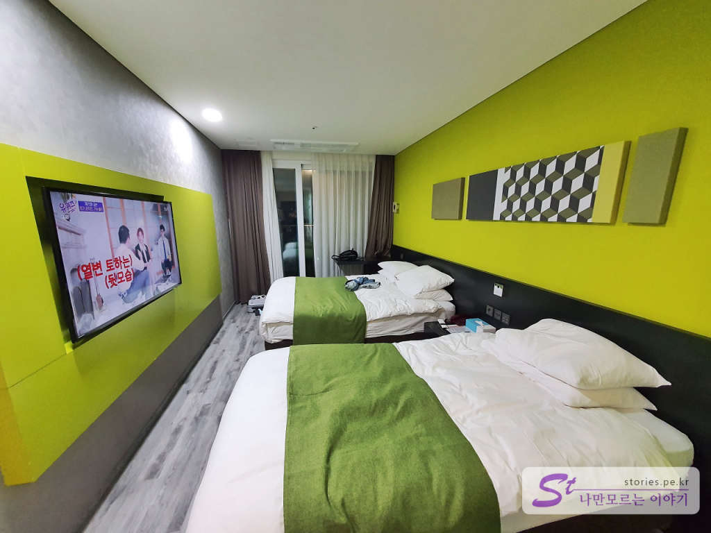
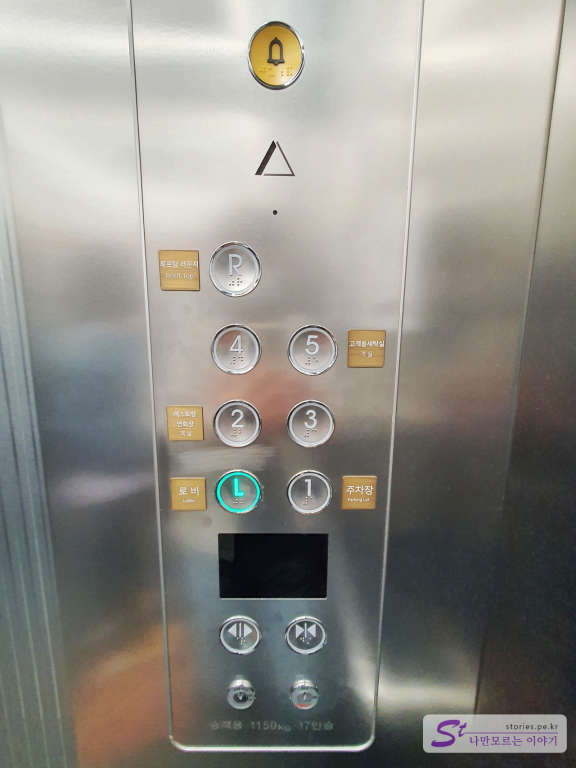

제주 여행의 둘째 날은 우도로 들어가기 위해 성산 쪽에 잡았습니다. 제주공항에서 성산까지는 대략 1시간 정도 소요되기는 하지만 제주의 우도와 동쪽을 관광하기 위해서는 최적의 장소가 아닌가 생각됩니다. 
성산 쪽에 숙소가 꽤 많이 있는데 그중에 인기가 많은 **코업시티 호텔 성산**에 묵게 되어 소개해 보려고 합니다. 

## 코업시티호텔 성산   
제주도에는 코업시티호텔이 2개가 있습니다. 하나는 코업시티 호텔 하버뷰이고 하나는 성산입니다. 하버뷰는 서귀포 인근에 있고 성산은 성산에 있으므로 예약할 때 잘 확인을 해야 합니다. 
룸은 홈페이지상으로 Deluxe Twin, Deluxe Double, Korean Ondol,Executive Double, Panoramic suite가 있습니다. 제가 구매한 방은 **스탠더드 트윈룸**이였는데 그런 방은 홈페이지에 없네요 ㅎㅎㅎ 사실 호텔에서 체크인할 때 업그레이드 명목으로 **Deluxe Twin**으로 바꿔주긴 했습니다. 그냥 그놈이 그놈인가 봅니다. 대신 창문을 열면 바다나 성산이 아닌 마을이 보입니다. ^^

  
일단 로비는 그럴듯해 보입니다. 로비에 세븐일레븐도 있어 간단히 물건을 사기에도 좋습니다. 

  
체크인을 하며 간단히 투숙 정보를 작성합니다. 체크인은 오후 3시이고 체크아웃은 오전 11시까지 입니다. 

   
방은 디럭스 트윈룸 마운틴뷰입니다. 씨뷰는 좀 더 비쌉니다. 2인용 침대 하나와 1인용 침대 1개가 있습니다. 기본 인원은 2명이고 추가 1인이 더 투숙할 수 있으며 1인 추가 비용이 있습니다. 

  
사진이 좀 지저분하지만 입구 쪽입니다. 입구 왼쪽에 화장실과 샤워실이 있고 오른쪽에 세면대, 화장대와 냉장고가 있습니다.  

  
화장실 앞에 샤워실 부스가 있습니다. 한 사람이 이용할 정도의 크기입니다. 

  
작은 냉장고가 있고 매일 물을 2개 넣어 줍니다. 그냥 무료로 이용하면 됩니다.  
제가 개인적으로 신발신고 다니는 호텔보다는 맨발로 다니는 펜션이나 리조트를 좋아해서 그런지 내 집 같은 편안함은 없습니다. 그래도 룸 관리가 비교적 잘되어 있어서 기분 나쁘지 않게 사용했습니다. 

  
창문을 열었을 때 광활한 바다가 펼쳐지길 기대했지만... ㅋㅋㅋ
밭도 있고 타워크래인도있고.. 이것이 시티뷰(마운틴뷰)입니다. 멋진 뷰를 보시려면 오션뷰를 구매하거나 일출봉 뷰를 구매해야 합니다. 당연히 가격이 더 비싸겠지요  

## 코업시티호텔 성산의 숙소 종류  
코업시티 호텔 성산의 창문을 열었을 때 보이는 뷰는 총 3가지입니다. 마운틴뷰, 씨뷰, 일출봉 뷰입니다. 

  
마운틴뷰와 씨뷰는 방이 많은 편이고 일출봉 뷰는 방이 많지 않습니다. 구매할 때 확인하고 구매하던가 체크인 시 빈방이 있을 경우 추가 비용을 지불하고 오션뷰나 일출봉 뷰로 바꿀 수 있는 것으로 알고 있습니다.

- **오션뷰** : 디럭스, 이그제큐티브, 파노라믹, 패밀리 중에서 선택
- **일출봉뷰(선라이즈뷰)** : 디럭스, 파노라믹 중에서 선택
- **시티뷰(마운틴뷰)** : 스탠더드, 디럭스, 온돌 중에서 선택

  
조식은 먹어 보지 않았지만 할인전은 15,000원이나 비수기 때는 할인가인 10,000원으로 제공하는 것 같습니다. 

## 코업시티 호텔 성산을 정말 잘 이용하는 팁!!
코업시티의 장점은 성산일출봉을 아주 잘 볼 수 있다는 데 있습니다. 가장 저렴한 스탠더드룸을 구매했다고 해도 실망하지 마세요. 아침산책 때 잠시 짬을 내서 옥상 루프탑으로 올라가 보시면 아주 멋진 뷰를 누구나 감상할 수 있습니다. 

   
엘리베이터에서 **R**을 눌러보세요.

  
이런 멋진 뷰를 볼 수 있습니다. 다행히 제가 올라갔을 때는 아무도 없어서 사진도 열심히 찍어 봤습니다.  

  
베드도 몇 개 있어서 편하게 누워서 볼 수 있습니다. 여름에는 타 죽을 수도 있지만 봄가을에는 딱 좋습니다.  

  
역시!!! 숙소의 신분을 초월하여 스탠더드룸의 신분이라도 멋진 성산일출봉 뷰를 맞이할 수 있습니다. 

  
여기는 코업시티 호텔 성산의 루프탑입니다.   

  
살짝 방향을 돌리면 저~~~ 멀리 우도의 모습도 볼 수 있습니다. 우도에 들어갈라고 여기 호텔을 잡은 건데.... 불행하게도 당일은 바람이 너무 불어서 우도행 배가 뜨지 않았습니다. 제가 우도에 입도하는 것을 바라지 않는가 봅니다. 

## 방문 시기  
여름 성수기가 지난 10월 초에 다녀왔습니다. 비수기라 한적하고 좋습니다. 추천해요.

## 비용   
비용은 네이버에서 검색해 보면 가장 저렴한 4만 원대서부터 시작하므로 만족합니다. 비용 대비 호텔의 상태가 좋아 가성비로 최고입니다. 매우 만족한 편입니다. 추천드려요.

## 입장시간  
- 체크인 시간 : 오후 3시부터 (너무 늦으면 프런트에 늦는다고 알려주는 센스가 필요함)
- 체크아웃 시간 : 오전 11시 

## 여행지 정보  
- 주소 : 제주특별자치도 서귀포시 성산읍 성산등용로 28  
- 연락처 : 064-780-9800  
- URL : https://www.coopcityhotel-seongsan.co.kr/  

    <iframe src='https://www.google.com/maps/embed?pb=!1m18!1m12!1m3!1d3328.3660759554996!2d126.92986151504837!3d33.46581868076943!2m3!1f0!2f0!3f0!3m2!1i1024!2i768!4f13.1!3m3!1m2!1s0x350d149550458861%3A0xf933896cb481e766!2z7L2U7JeF7Iuc7Yuw7Zi47YWUIOyEseyCsA!5e0!3m2!1sko!2skr!4v1602825276247!5m2!1sko!2skr' class='embed-responsive-item' allowfullscreen></iframe>

## 주차정보  
호텔 주차장은 3군데 있습니다. 다만 주차장이 빨리 만차가 됩니다. 그래서 추가로 2군데의 식당 주차장을 활용하고 있습니다. 
너무 많이 늦지 않으면 주차요원이 주차 안내를 해 줍니다. 

자세한 주차 정보는 아래 링크를 참고하세요. 
https://www.coopcityhotel-seongsan.co.kr/view/noticeView.do?f_idx=859 

## 인근 맛집  
인근에 맛나식당이라고 가성비 갈치조림 잘하는 집이 있습니다. 웨이팅이 기본 약 2시간 정도 돼서 인내가 필요합니다.
전화예약은 안되고 당일 방문예약만 가능합니다. 가면 있겠지라고 안일하게 생각하고 가면 못 먹습니다. 운영시간도 아침 6시부터 준비해서 오후 2시까지만 운영을 합니다.

여기서 맛있는 갈치조림을 먹기 위한 팁을 드리면...  
아침에 일찍이 6시나 7시쯤에 일어나 눈곱만 띄고 차를 타고 5분 정도 달려 맛나 식당에 가서 예약을 합니다. 그러면 언제까지 오라고 알려줍니다. 보통 9시 ~ 10시쯤 오라고 할 것입니다. 그러면 다시 숙소로 가서 씻고 나오면 됩니다. 만약 너무 일찍이다 싶으면 오는 길목에 광치기 해변이 있는데 잠시 들러서 구경을 하고 시간 맞춰서 가면 됩니다. 
 
> [[제주맛집] 성산에 위치한 인생 가성비 맛집 맛나식당 바로가기](https://blog.stories.pe.kr/505)  
