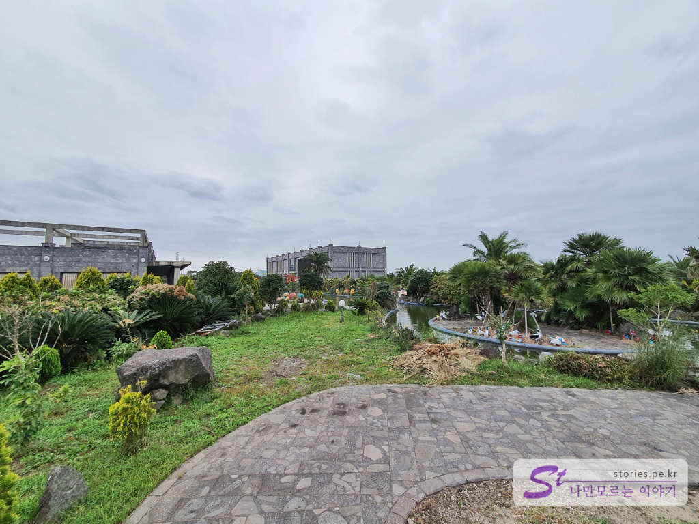

 

제주를 여행하면서 가장 마음 아픈 곳을 꼽으라고 하면 베니스랜드라고 할 수 있습니다. 2014년도에 처음 야심 차게 개장을 했을 텐데.. 시간이 흐른 지금은 거의 관리가 되지 않고 있는 듯한 모습입니다. 최소한의 운영인력으로 문 닫지 않고 버티고 있는 모습이 안쓰럽게 느껴집니다. 홈페이지도 이제 웬만한 브라우저에서는 열리지도 않는 올 플래시를 사용하고 있구요.

  
전체적인 구성은 좋은 것 같습니다. 매인 건물 주위로 수로를 따라 곤돌라를 타며 즐기는 콘셉트는 좋으나 그러려면 수질과 내리쬐는 태양, 재미의 요소 등.. 막대한 관리가 필요한데 그 부분을 간과하지 않았나 싶습니다. 

  
주차를 하고 정문을 통과하면 이런 소로를 따라 걸어서 메인 건물로 들어가도록 되어 있습니다. 주위에는 키 작은 나무들이 많이 있습니다. 이놈들이 빨리 커서 햇빛을 가려줘야 땡볕에도 운영이 될 텐데 말이지요. 아쉽습니다.  

  
매인 건물까지 가는 길에 수로를 만날 수 있습니다. 적절히 물이 흘러줘야 하는데.. 고여있는 물 같은 느낌입니다. 

  
요런 재미있는 포인트들이 곳곳에 있으나 손님을 끌어들이기에는 다소 부족해 보입니다.  

  
수로에서 곤돌라를 타는 사람을 만났습니다. 10월이라 땡볕이 아니라서 다행이긴 하나 노 젓는 게 힘들다고 하네요.. 차라리 곤돌라의 반은 가벼운 모터를 달아주는 것이 더 낮지 않을까 하는 생각을 합니다.  

  
매인 건물로 들어가는 수로입니다. 녹조에 의해 물이 맑지가 않습니다. 태양이 바로 쬐이고 있어 녹조를 방지하는 것이 매우 어려울 듯해 보입니다. 

  
여러 곳에 사진을 찍기에 좋은 포토존이 있습니다. 한적하게 사진을 찍기에는 좋으나 더 이상을 기대하면 매우 실망을 할 것 같습니다. 

  
멀리서 바라본 매인 건물입니다. 
도저히 저 건물 안에 들어갈 용기가 나지 않아 외곽으로 한 바퀴 뺑~ 돌고 나와 버렸습니다. 많이 아쉬운 여행지네요. 

## 비용  
  
입장료가 성인은 12,000원, 청소년은 10,000원, 어린이는 8,000원입니다. 
곤돌라 비용은 따로 있으며 성인, 청소년은 10,000원, 어린이는 5,000원입니다.
패키지는 좀 더 할인된 가격에 구매할 수 있습니다. 

## 입장시간  
- 시작시간 : 09:00  
- 마감시간 : 18:00    

## 여행지 정보  
- 주소 : 제주 서귀포시 성산읍 난산리 2575    
- 연락처 : 064-784-6565  
- URL : http://theveniceland.com   

    <iframe src='https://www.google.com/maps/embed?pb=!1m18!1m12!1m3!1d3330.2703990878545!2d126.83871741504709!3d33.416194080783846!2m3!1f0!2f0!3f0!3m2!1i1024!2i768!4f13.1!3m3!1m2!1s0x350d11c6b2348b0b%3A0x4f07341721750adf!2z642U67Kg64uI7Iqk656c65Oc!5e0!3m2!1sko!2skr!4v1603269785872!5m2!1sko!2skr' class='embed-responsive-item' allowfullscreen></iframe>

## 주차정보  
주차는 무료이고 널널합니다. 
