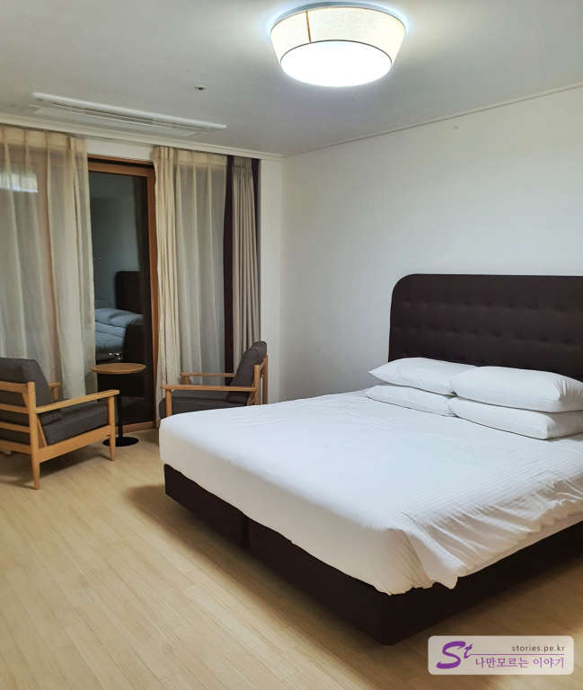

제주도의 마지막 날은 중문 관광단지에 있는 부영호텔&리조트 중 리조트에서 숙박을 했습니다. 특별한 할인 기회가 있어 금액은 별도로 작성은 하지 않겠으나 중문에서 가성비가 좋은 숙소라고 할 수 있습니다. 
부영그룹에서 운영하는 리조트로 5성급 호텔과 같이 운영하고 있습니다. 전망 또한 매우 훌륭합니다. 

  
숙소에 짐을 풀고 아래 산책로에서 찍어봤습니다. 한적하니 걷기에 너무 좋습니다. 

  
5층에 위치한 방에서 야경을 찍어 봤습니다. 왼쪽의 컴컴한 부분이 바다입니다. 

  
아침에 일어나 낮에도 한번 찍어봤습니다. 저 멀리 바다 끝쪽에 보이는 산이 송악산입니다. 

  
왼쪽에 있는 건물이 호텔로 사용하는 건물인 것 같고 오른쪽이 리조트로 운영하는 건물인 것 같습니다. 

  
저희는 리조트 **프리미엄 스위트 바다전망**에서 숙박을 했습니다. 원래는 전망이 없는 1층이었으나 바다전망 숙소로 몇만원 더 주고 업그레이드를 했습니다. 
45평으로 기준인원이 6명, 최대인원이 8명이라 숙소는 매우 넓고 좋았습니다. 거실을 기준으로 왼쪽은 싱글 침대 2개, 오른쪽에는 킹사이즈 침대 1개가 있었습니다. 각 방도 충분히 넓고요. 2가정이 같이 숙소를 사용해도 충분히 프라이버시를 지킬 수 있는 구조입니다. 

  
킹사이즈 침대가 있는 안방입니다. 안방에는 샤워실과 화장실이 별도로 딸려있습니다. 
창문 앞에 있는 의자에 앉아서 창밖 바다를 보며 멍 때릴 수 있습니다. 

  
낮에는 이런 모습입니다. 멋지지요?

  
반대편에 있는 싱글 사이즈 침대 2개가 있는 방입니다. 여기도 충분히 넓습니다만 샤워실과 화장실은 거실에 딸려있는 곳을 이용해야 합니다. 

  
여기 안쪽은 주방입니다. 주방도 아주 크게 되어 있습니다. 간단한 조리를 할 수 있습니다. 

  
부영리조트의 시그니쳐와도 같은 베란다입니다. 베란다가 무지하게 넓습니다. 많은 사람들이 테이블에 않아서 차도 마시고 담소하기에 매우 좋습니다. 
어찌 되었는 가격 대비 매우 만족한 곳이었습니다. 

## 입장시간  
- 체크인시간 : 15:00 
- 체크아웃시간 : 12:00  

## 여행지 정보  
- 주소 : 제주 서귀포시 중문관광로 222  
- 연락처 : 064-731-5500   
- URL : https://www.booyoungjejuhotel.com  

    <iframe src='https://www.google.com/maps/embed?pb=!1m18!1m12!1m3!1d3336.9143203988247!2d126.42116191504218!3d33.242547980833926!2m3!1f0!2f0!3f0!3m2!1i1024!2i768!4f13.1!3m3!1m2!1s0x350c5aba8473fccd%3A0xddadf85ef2a9e39c!2z7KCc7KO8IOu2gOyYge2YuO2FlCbrpqzsobDtirg!5e0!3m2!1sko!2skr!4v1603353084535!5m2!1sko!2skr' class='embed-responsive-item' allowfullscreen></iframe>

## 인근맛집  
- [[제주맛집] 중문에서 먹은 로컬 맛집 큰돈가 바로가기](https://blog.stories.pe.kr/513)  
- [[제주맛집] 중문에서 만난 인생커피 마노 커피 하우스(난 녹차라떼가 좋아)](https://blog.stories.pe.kr/514)
