사려니숲길과 함께 제주 내륙 쪽의 피톤치드가 쏟아지는 공기 좋은 비자림을 소개합니다. 약 500년 ~ 1000년의 비자나무들이 군락을 이루고 있어서 마치 원시림을 걷는 듯한 느낌이 드는 곳입니다. 
제주의 대표적인 관광명소로 입구에 주차장, 화장실, 문화시설 등 부대시설들이 잘 갖추어져 있습니다. 

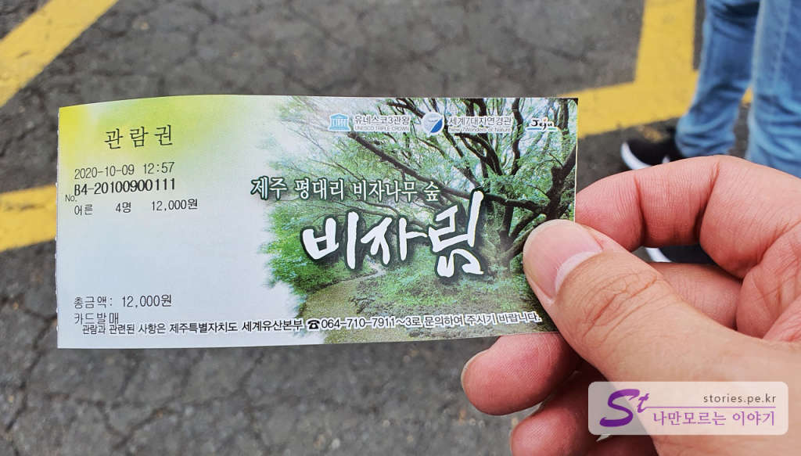  
주차료는 무료이지만 입장을 하기 위해서는 비용을 지불해야 합니다. 어른 기준으로 3,000원입니다. 

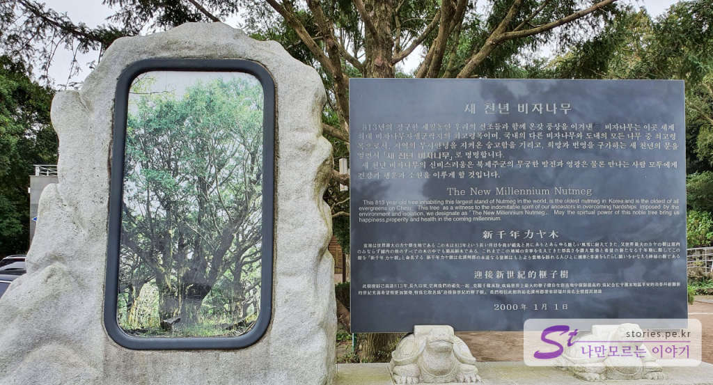  
비자림 끝쪽으로 가면 천년 가까이 된 비자나무가 있다고 소개하네요.  

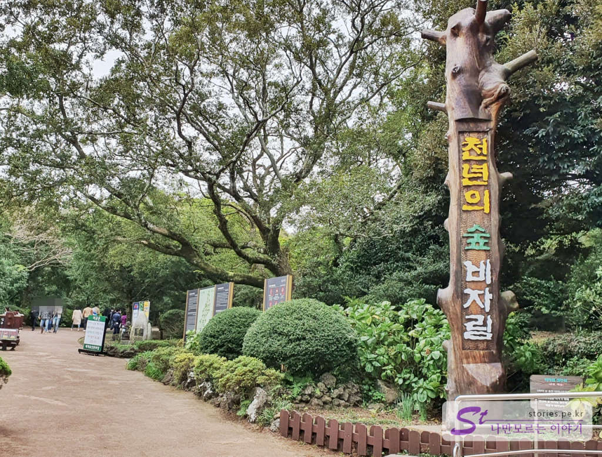  
입구에 비자림이라고 푯말이 붙어 있습니다. 

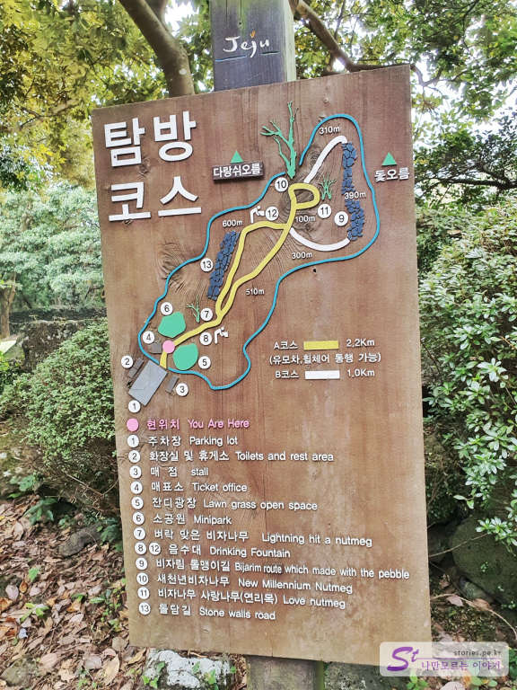  
탐방코스가 나와 있는데 특별한 경우가 아니라면 B코스로 다녀와도 힘들지 않습니다. 

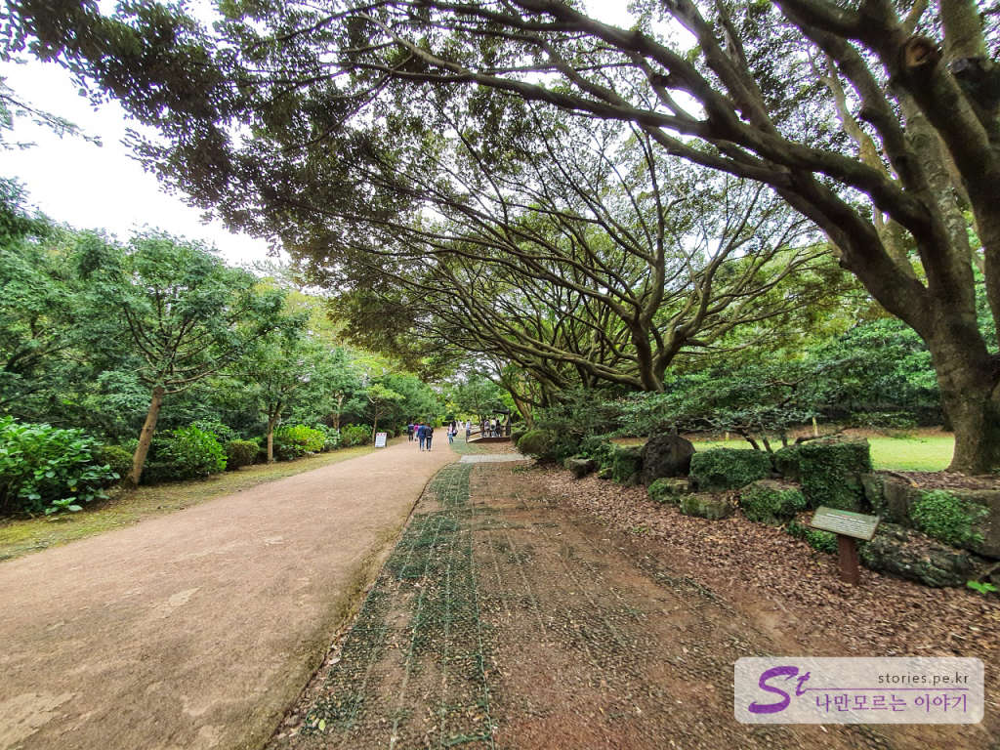  
초반에는 길게 뻗은 잘 닦여진 길을 따라 올라갈 수 있습니다. 

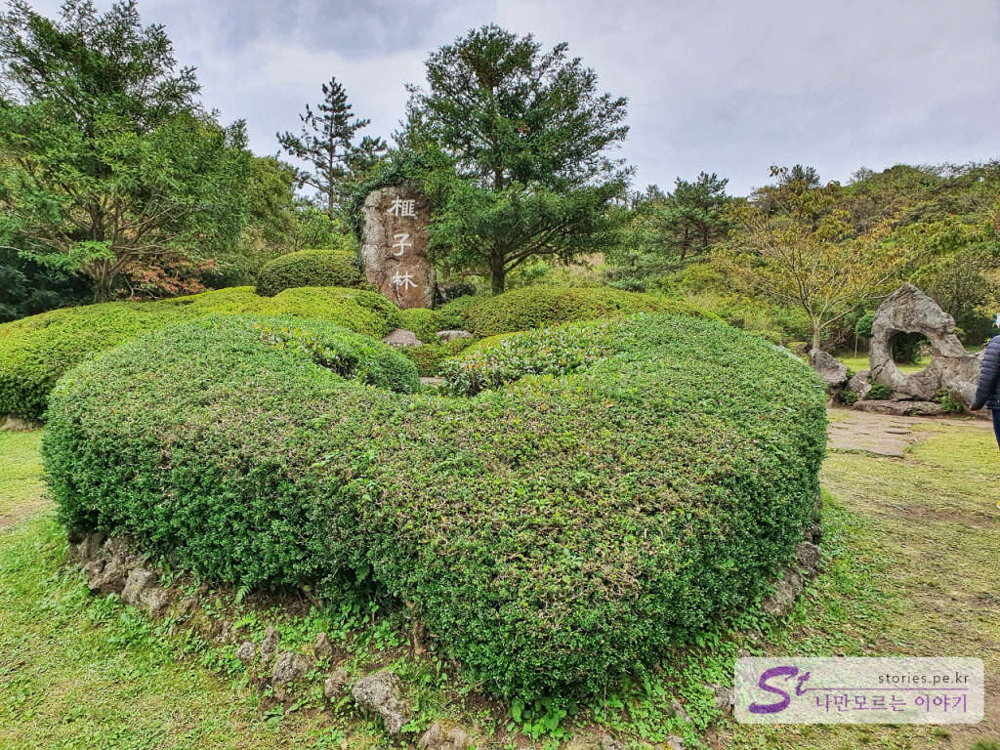  
이런 하트 조경물도 있습니다. 연인이라면 지나치기 쉽지 않은 촬영 스폿이지요 ㅎㅎㅎㅎ

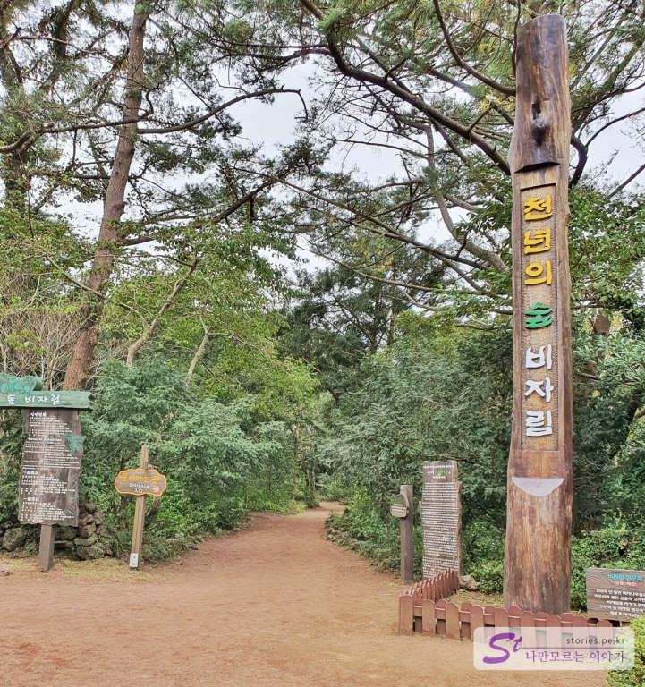  
조금 더 들어가면 또 한 번의 푯말이 나옵니다. 이제 여기부터 자연의 길로 들어서는 느낌이 납니다. 

  
아름다운 비자 숲을 거닐 수 있습니다. 피톤치드도 뿜 뿜~

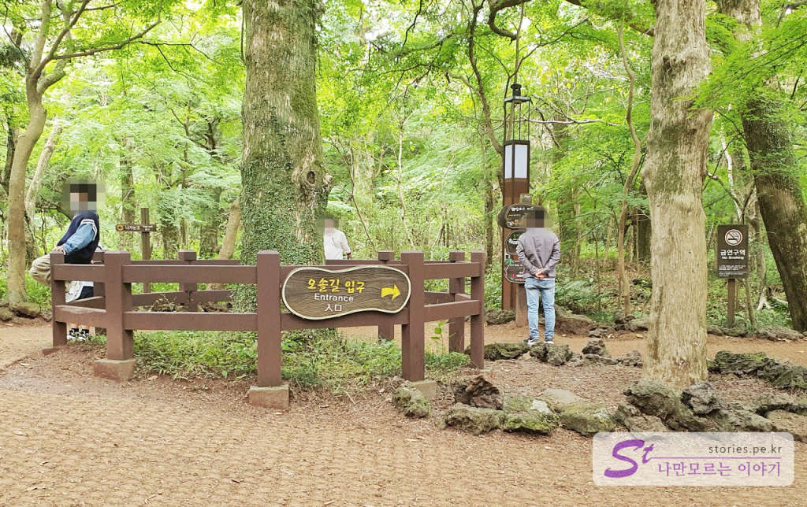  
돌맹이길로 가는 오솔길 입구의 이정표가 나옵니다. 오솔길로 들어서기를 추천합니다. 

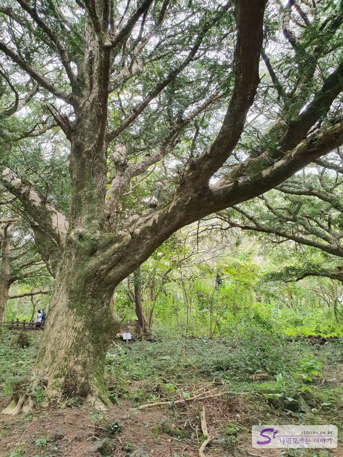  
아름드리 비자나무입니다. 이게 새천년 비자나무인 줄 알았으나 아니더라고요.  

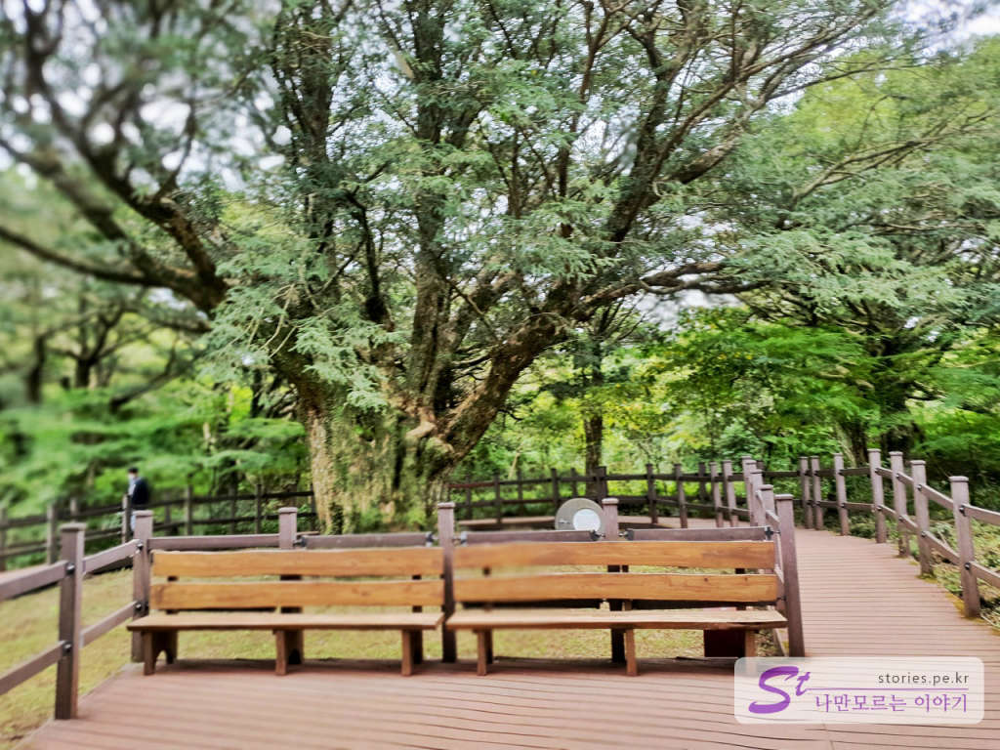  
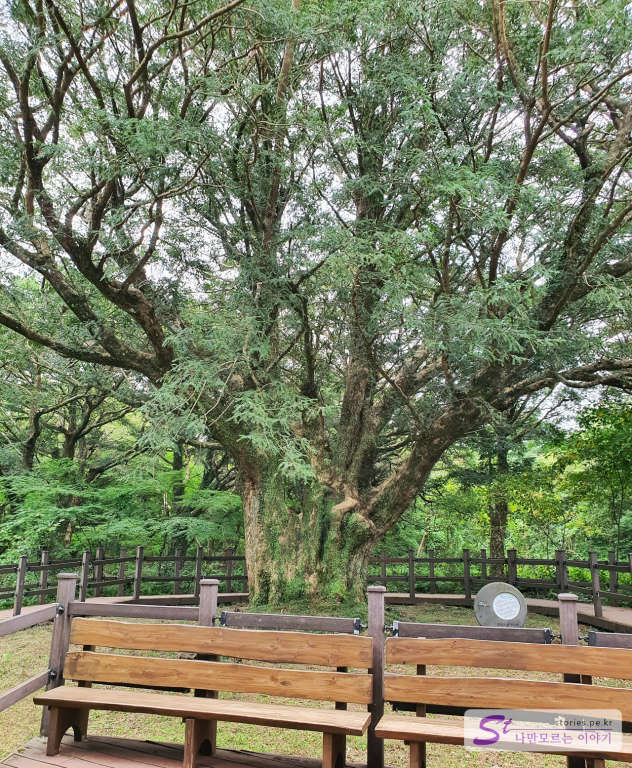  
이게 새천년 비자나무입니다 나무 앞에 벤치가 있어서 구분이 쉽네요. 크기가 어마어마합니다.  

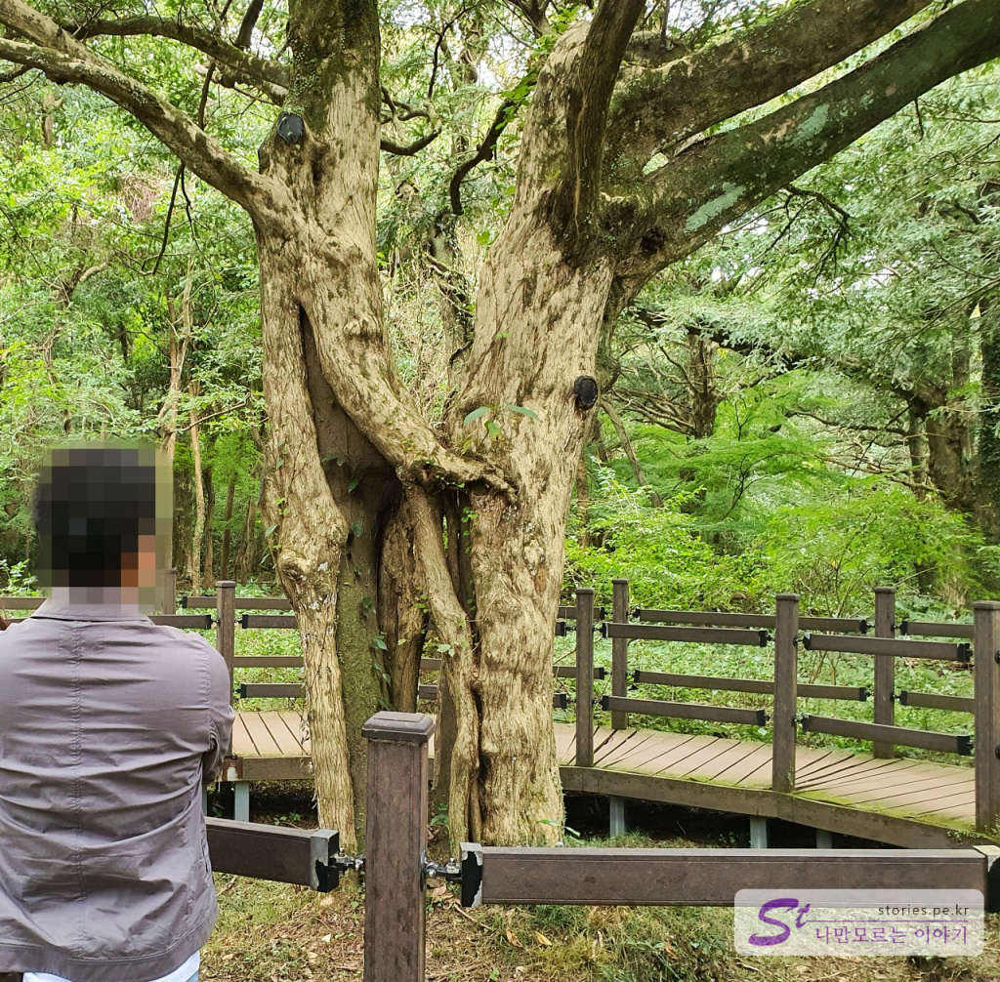  
이게 사랑나무라고 하는 연리목입니다. 2개의 나무가 서로 붙어있는 나무를 연리목이라고 합니다. 으이구...♥♥♥  

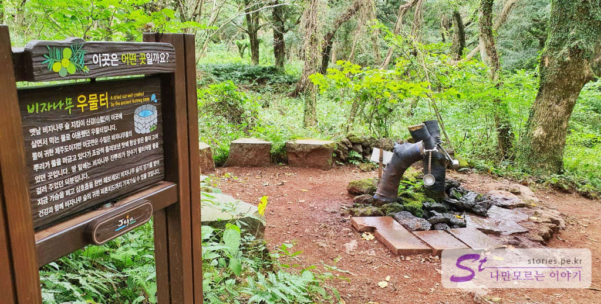  
조금 더 내려오면 우물터(음수대)가 나옵니다. 먹어도 되는 물이겠지요?? 저희는 그냥 패스하고 내려왔습니다. 

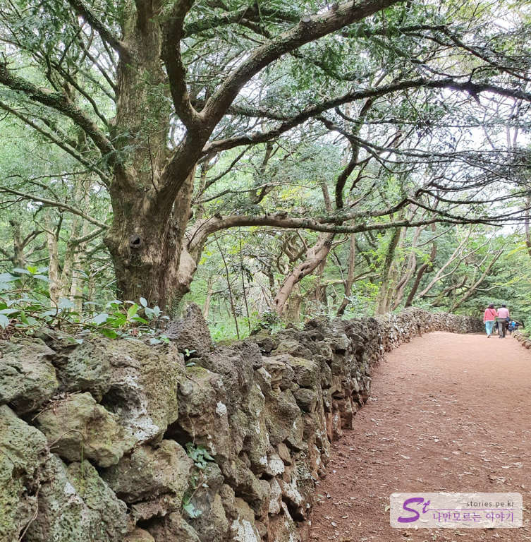  
이렇게 돌담길을 따라 내려오면 모든 일정이 끝납니다. 

## 방문 시기  
10월 비수기 한적할 때 다녀왔습니다. 

## 비용  
주차비는 무료 입장료는 어른 기준 3,000원, 어린이 1500원입니다.

## 입장시간  
- 시작시간 : 09:00 
- 마감시간 : 17:00 (입장 마감)    
- 소요시간 : 왕복 1시간 ~ 1시간 30분 (B코스) 
- 휴무일 : 연중무휴  

## 여행지 정보  
- 주소 : 제주 제주시 구좌읍 비자숲길 55  
- 연락처 : 064-710-7912  
- URL : https://www.visitjeju.net/kr/detail/view?contentsid=CONT_000000000500270     

    <iframe src='https://www.google.com/maps/embed?pb=!1m18!1m12!1m3!1d6850.2978018454005!2d126.80251883815474!3d33.48467931686885!2m3!1f0!2f0!3f0!3m2!1i1024!2i768!4f13.1!3m3!1m2!1s0x350d17330b2d9d17%3A0x7bedd232f66acd24!2z67mE7J6Q66a8!5e0!3m2!1sko!2skr!4v1603251141661!5m2!1sko!2skr' class='embed-responsive-item' allowfullscreen></iframe>

## 주차정보  
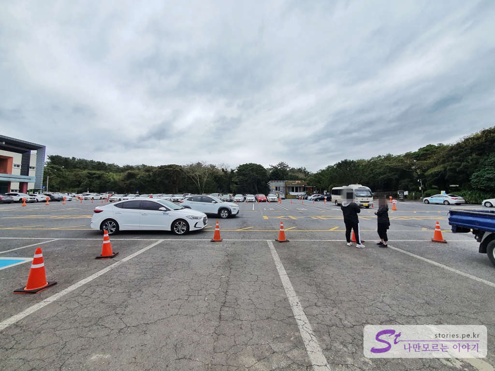  
주차는 무료입니다.  
약 100대의 승용차와 20대 정도의 버스를 주차할 수 있습니다. 
