성산일출봉과 함께 제주 동쪽의 꼭 봐야 할 여행지 중 하나가 섭지코지입니다. 

> 섭지코지의 섭지란, 재사(才士)가 많이 배출되는 지세라는 뜻이며, 코지는 육지에서 바다로 톡 튀어나온 '곶'을 뜻하는 제주방언이다. - www.visitjeju.net 참조 -

섭지코지가 대중에게 알려진 결정적인 이유는 2003년에 이병헌, 송혜교가 출연한 SBS 드라마 **올인** 때문입니다. 하지만 지금까지 사랑받는 이유는 나름 섭지코지가 가지고 있는 멋진 풍경 때문이겠지요.

섭지코지로 갈 수 있는 길은 크게 3가지가 있는데.. 대부분 섭지코지 노외공영주차장에  주차를 하고 올라갑니다. 

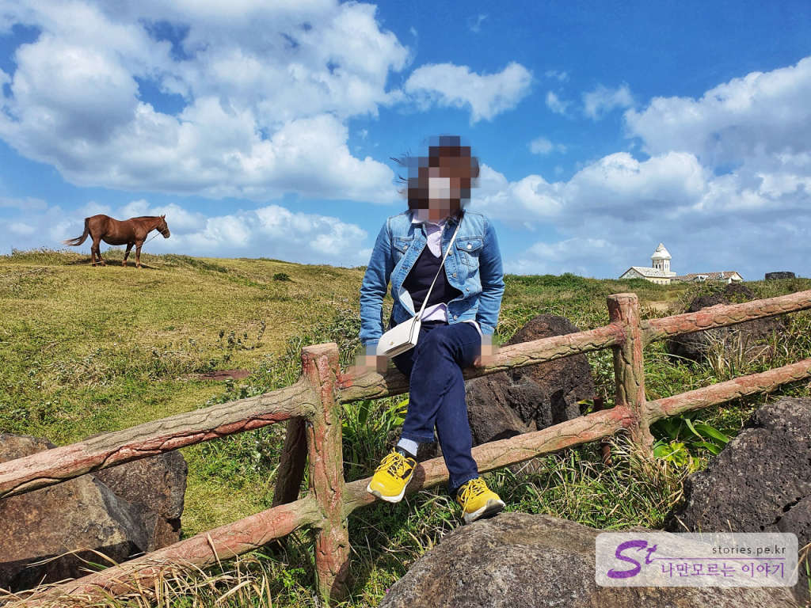  
오른쪽으로는 하얗게 부서지는 파도를 품은 바다를 볼 수 있고 왼쪽으로는 초원을 등지고 있는 멋진 말들을 볼 수 있습니다. 

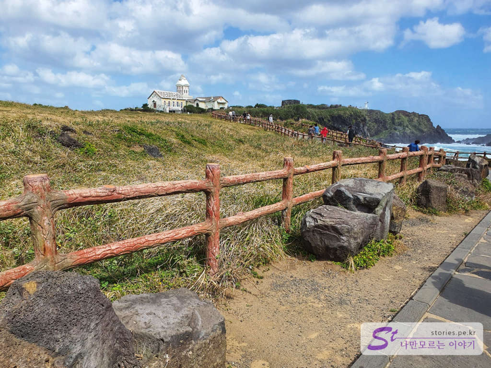  
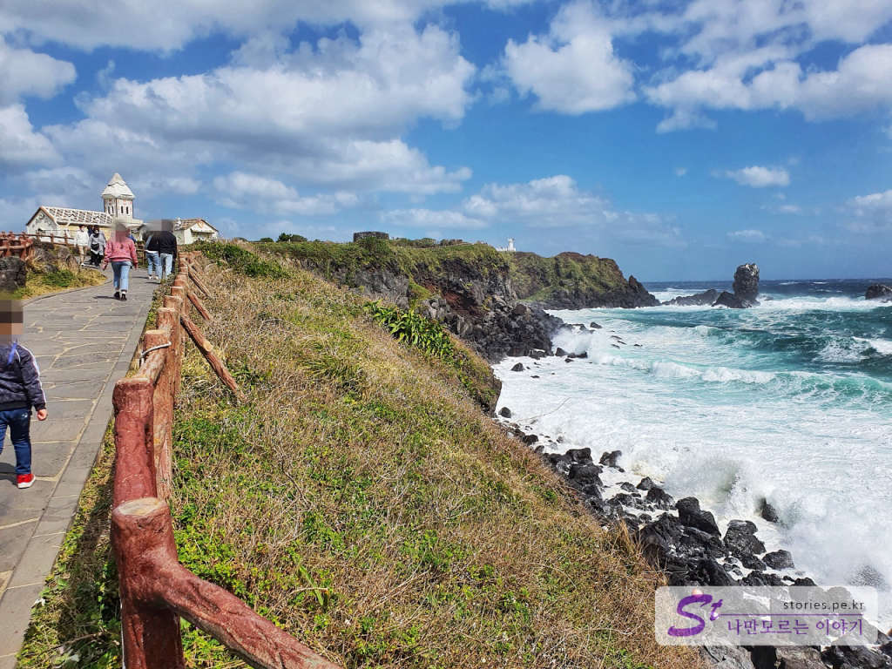  
예전에 세워진 **올인 하우스**가 낡아 **달콤한 하우스**로 개보수하였으나 이마저도 폐가 수준으로 바뀌어서 흉물스러운 상태로 남아 있습니다. 멀리서 보면 이쁜데.. 가까이서 보면... 그지같습니다. 그냥 올인하우스로 운영하는 게 더 낮지 않았을까 하는 생각도 해봅니다. 

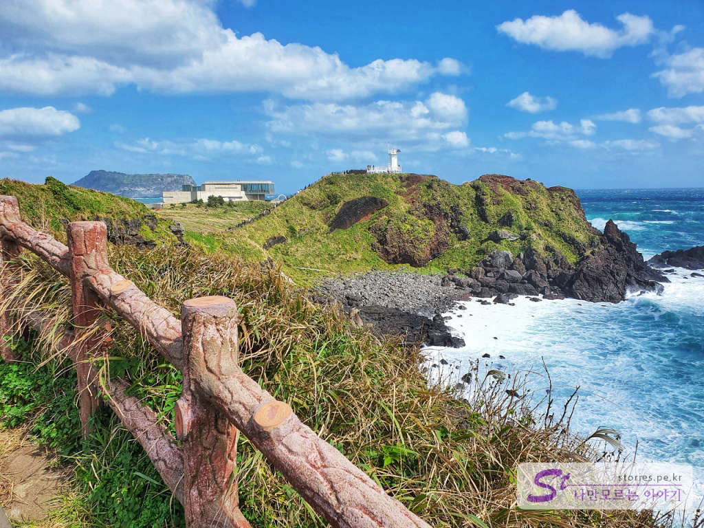  
저~ 멀리 붉은오름 위에 서있는 하얀 등대가 보입니다. 그리고 그 뒤에 일본의 유명한 근대 건축가인 안도 다다오가 설계했다는 **글라스 하우스**도 보이구요. 

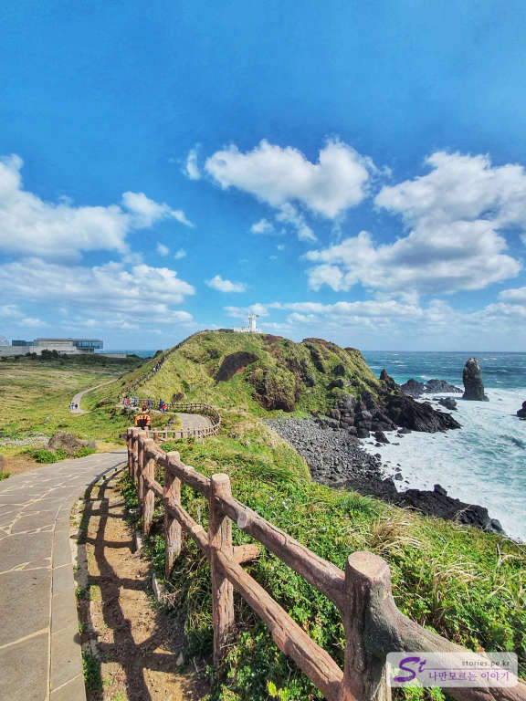  
바람의 언덕에서 붉은오름으로 오르는 길이 보이네요. 에메랄드빛을 머금고 있는 하얀 파도와 푸른 풀밭이 아주 멋지게 잘 어우러져 있습니다. 
예전에 섭지코지를 몇번 와 봤을 때는 사람들이 너무 많아서 대부분 여기에서 발길을 돌렸었습니다. 그러나 이번에는 등대까지 올라가 볼 생각입니다.  

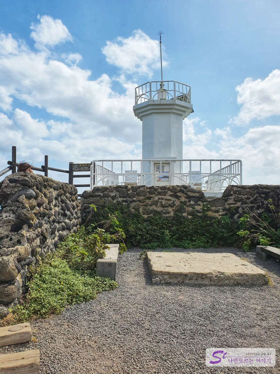  
방두포 등대가 그렇게 크지 않습니다. 바람은 엄청나게 불고요..

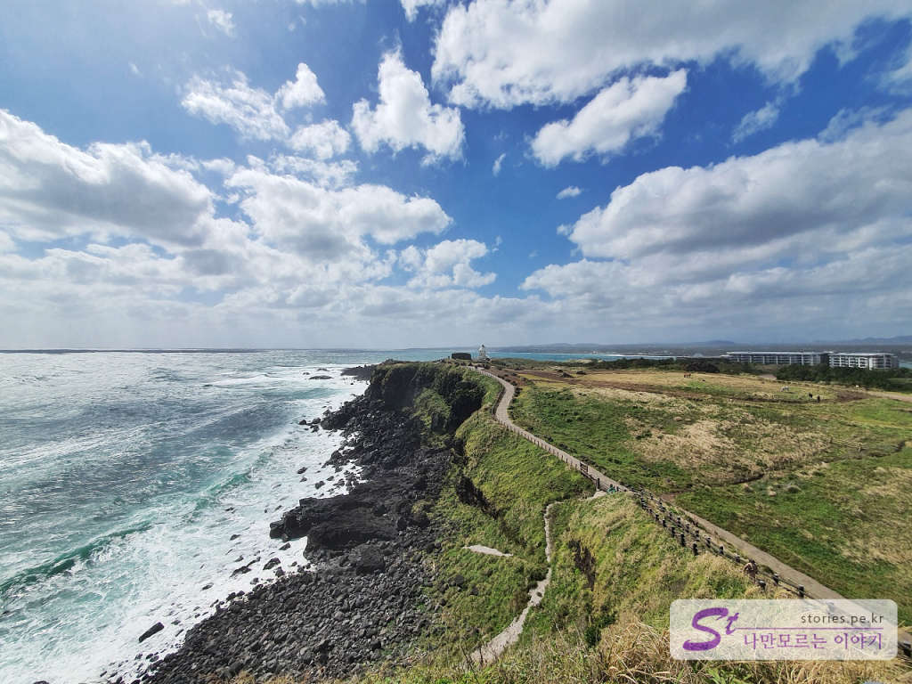  
등대에서 지금까지 걸어왔던 주차장 방향의 모습입니다. 너무 아름답습니다. 

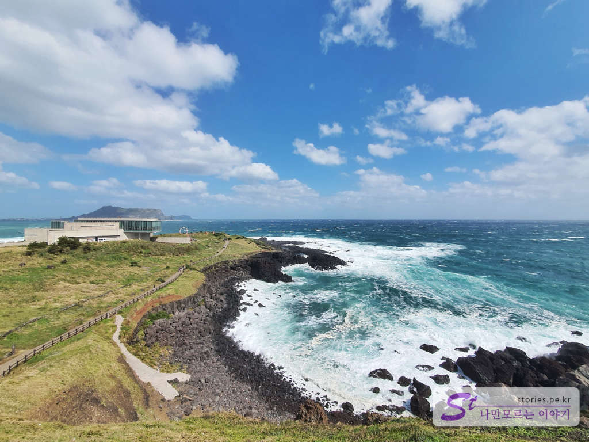  
이번에는 성산일출봉 방향입니다. 딱 글라스하우스가 성산일출봉 밑에 깔려있네요. 아마도 등대 아래쪽에서 보면 성산일출봉이 글라스하우스에 가려서 보이지 않을 것 같습니다. 

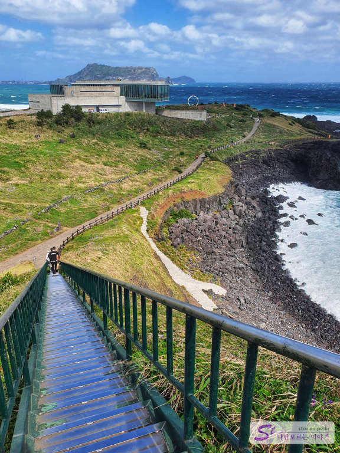  
등대로 올라오는 길 반대쪽에는 내려가는 길도 있습니다. 이 길을 따라 내려가면 글라스하우스로 이동할 수 있습니다. 

글라스하우스는 현재 보광 휘닉스에서 레스토랑으로 운영하고 있습니다. 그 뒷쪽으로 포토스폿이 하나 생겼습니다. 

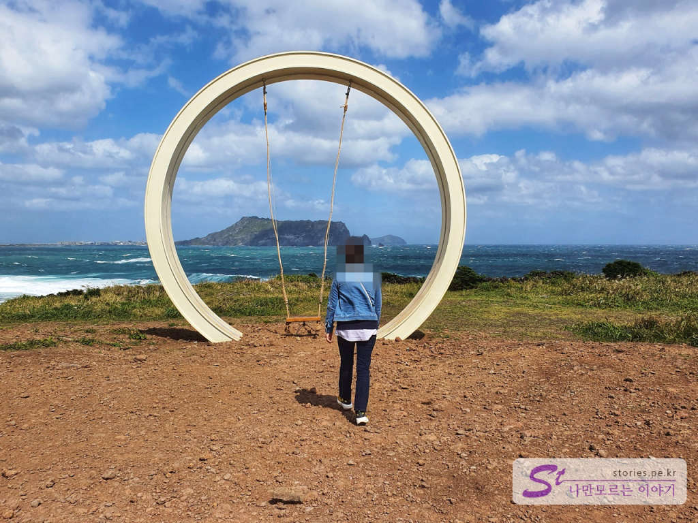  
원형 그네인데요. 주변이 잔디밭이었으면 좋았을 텐데... 지금은 돌과 흙으로 되어 있어서 좀 아쉬운 점은 있습니다. 그래도 그네 뒤쪽으로 성산일출봉이 보이기 때문에 사진 찍기에는 좀 있어 보이긴 합니다.   

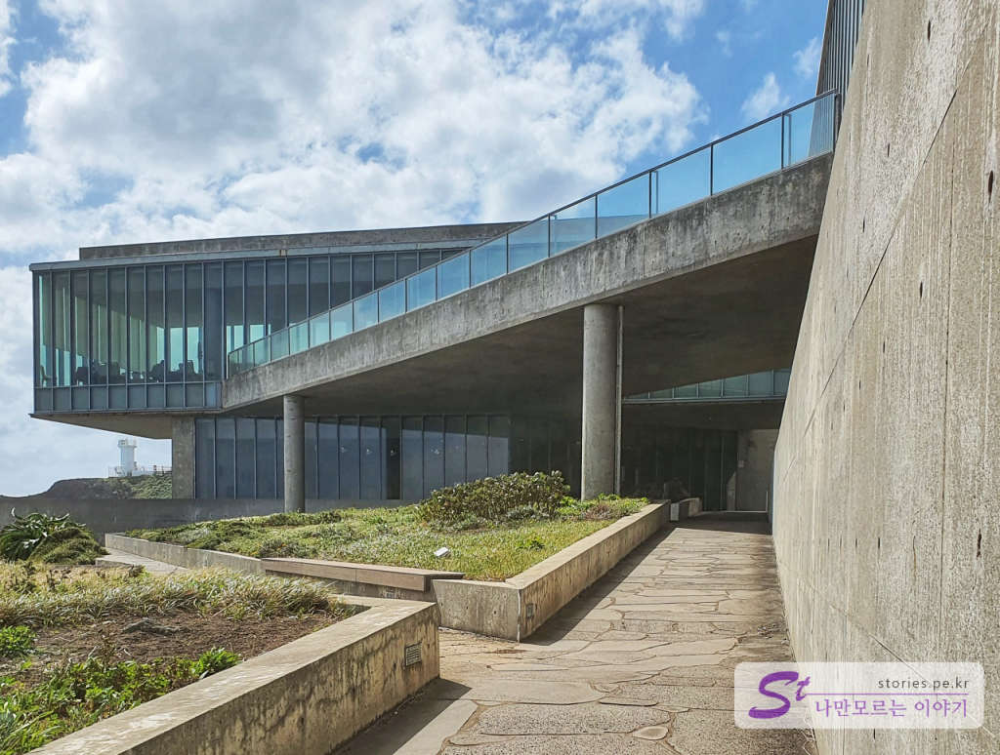  
글라스하우스는 유명 건축가인 안도 다다오가 설계했다고 합니다. 매끄러운 콘크리트로 자연과 어우러지게 세운 건축물이 있다면 대부분 안도 다다오의 작품이거나 영향을 받은 건물이라고 보시면 됩니다. 

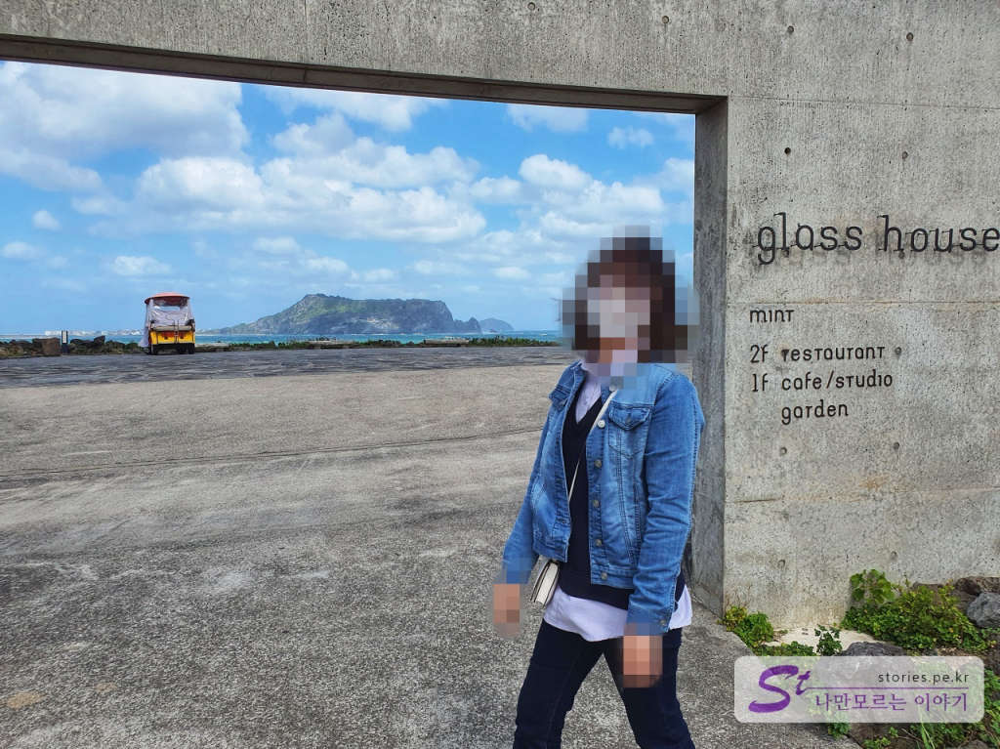  
건물 뒤쪽에 글라스하우스(glass house)라고 푯말이 있네요. 문처럼 생겼으나 문 역할은 하지 않고 있습니다. 뒤쪽으로 성산일출봉이 보여서 찍어봤습니다.   

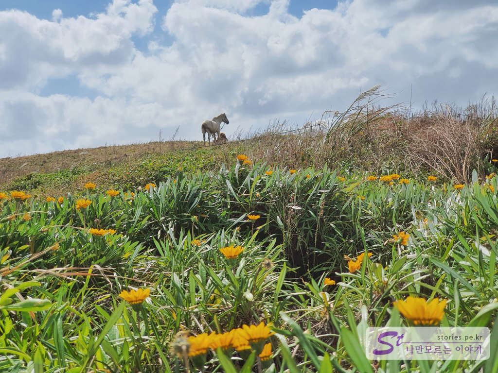  
이제 섭지코지 관광을 마치고 주차장으로 돌아오는 길입니다. **역시 제주도라 말이 많습니다**. 

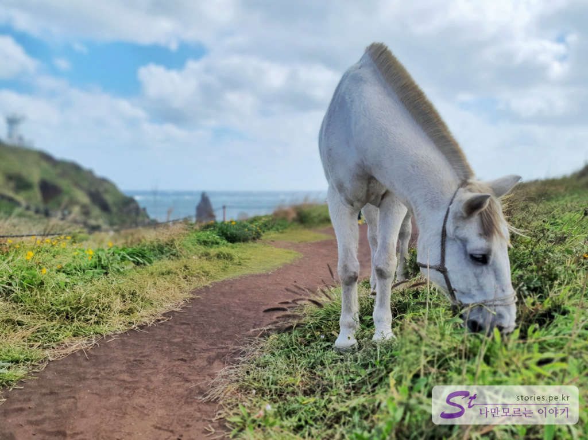  
친한 척 다가오길래 두려움을 무릅쓰고 가까이서 찍어 봤습니다. 뒷발만 조심하면 될 것 같았거든요..

섭지코지 땅을 보광이 구입했는지 그 안에 있는 건물들이 대부분 보광 휘닉스의 건물이였습니다. 섭지코지의 자연경관을 너무 해치지 말고 잘 운영했으면 하는 바렘입니다.   

## 방문시기  
10월에 방문했어요 성수기가 아니라서 그런지 사람이 많지 않아 구경하기 좋았습니다. 

## 비용  
입장료는 따로 없고 주차비만 지불하면 됩니다. 

## 입장시간  
- 시작시간 : 08:30  
- 마감시간 : 18:30 (동절기 : 17:30) 
- 휴무일 : 연중무휴  

## 여행지 정보  
- 주소 : 제주특별자치도 서귀포시 성산읍 고성리 62-3  
- 연락처 : 064-784-2810   
- URL : https://www.visitjeju.net/kr/detail/view?contentsid=CONT_000000000500343    

## 주차정보  
- 최초 30분 : 1,000원
- 추가 15분마다 : 500원

## 인근맛집  
> [[제주맛집] 성산에 위치한 인생 가성비 맛집 맛나식당 바로가기](https://blog.stories.pe.kr/505)  
