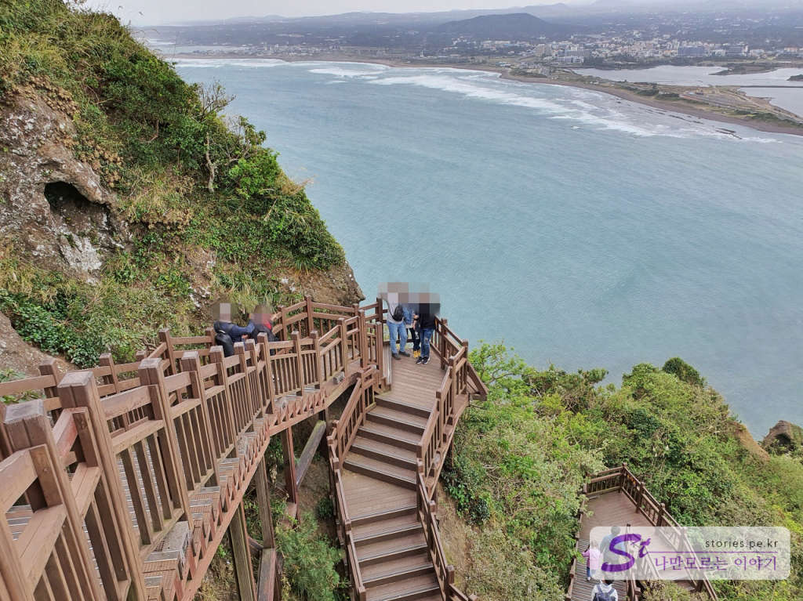

제주도에 처음 왔다면 꼭 방문해야 하는 곳이 몇 군데 있는데 그중에 하나가 성산일출봉입니다. 아침 일찍부터 바지런히 일출봉 꼭대기에 올라가서 떠오르는 태양을 보는 것도 의미가 있겠지만 저처럼 게으른 사람도 느긋히 방문해서 보게 되는 성산일출봉도 감탄이 절로 나오는 곳입니다. 

   
제주의 대표적 관광지라서 주차장과 상점, 화장실 등 부대시설이 모두 잘 갖춰져 있습니다.  주차장에서 바라보는 성산일출봉도 멋지지만 가까이서 보는 성산일출봉도 너무 멋집니다.   

  
일출봉은 무료 구간과 유료 구간이 있습니다. **무료 구간**은 오르는 언덕의 왼쪽 부분을 관람하는 구간이며 언덕과 바다 쪽을 산책하는 길입니다. **유료 구간**은 오른쪽의 성산일출봉을 올라가는 구간입니다.  
제가 도착했던 날은 바람이 너무 세게 불어서 우도행 배도 뜨지 못했던 날이라서 그런지 무료구간이 통제되어 들어갈 수 없게 막아놨습니다. 그래서 유료 구간밖에 가볼 수 없었습니다. 유료 구간의 유일한 단점이라면.. 힘들어요. 올라가야 하거등요. 그래도 올라가면 감동적인 풍경으로 보상을 받습니다. 

  
매표를 하고 입장을 합니다. 어른 기준 인당 5,000원입니다. 

  
성산일출봉에 오르는 중간지점입니다. 저 멀리 성산리 마을이 아름답게 펼쳐져 있는 모습을 볼 수 있습니다.  

  
꾸역꾸역 일출봉 꼭대기까지 오르면 분화구의 모습을 볼 수 있습니다. 오르는 길의 계단과 정상은 나무데크로 모두 되어 있어서 힘들긴 하지만 깔끔하게 올라갈 수 있습니다. 

  
분화구의 반대쪽을 보면 온전한 성산리 마을이 보입니다. 광치기 해변도 보이고 저희가 묵었던 코업시티 호텔도 보이네요. 

  
오르는 길 옆쪽에 내려가는 길이 따로 나누어져 있습니다. 내려가는 길에는 저 멀리 섭지코지와 광치기 해변을 볼 수 있는 뷰가 펼쳐집니다. 너무 아름답습니다. 

## 비용  
  
어른은 5,000원, 청소년/군인, 어린이는 2,500원입니다.  

## 입장시간  
- 시작시간 : 07:30  
- 마감시간 : 17:50 (19:00까지 관람)  
- 소요시간 : 왕복 약 50분 ~1시간
- 휴무일 : 연중무휴

## 여행지 정보  
- 주소 : 제주특별자치도 서귀포시 성산읍 성산리 78    
- 연락처 : 064-783-0959  
- URL : https://www.visitjeju.net/kr/detail/view?contentsid=CONT_000000000500349   

    <iframe src='https://www.google.com/maps/embed?pb=!1m18!1m12!1m3!1d13314.656645363633!2d126.93374523144178!3d33.45805519234616!2m3!1f0!2f0!3f0!3m2!1i1024!2i768!4f13.1!3m3!1m2!1s0x350d14b9f6e3789f%3A0x555132053a23b64b!2z7ISx7IKwIOydvOy2nOu0iQ!5e0!3m2!1sko!2skr!4v1603245584425!5m2!1sko!2skr' class='embed-responsive-item' allowfullscreen></iframe>

## 주차정보  
주차는 무료이고 대략 60~70대의 승용차와 50대가량의 버스를 주차할 수 있는 공간이 있습니다. 

## 인근맛집  
> [[제주맛집] 성산에 위치한 인생 가성비 맛집 맛나식당 바로가기](https://blog.stories.pe.kr/505)   
> 카페 오르다  
