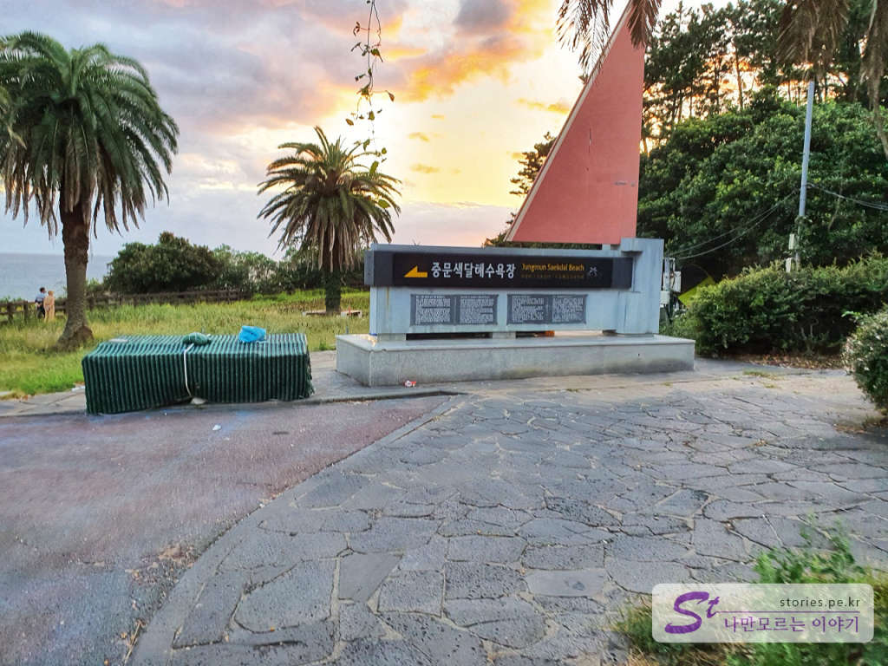
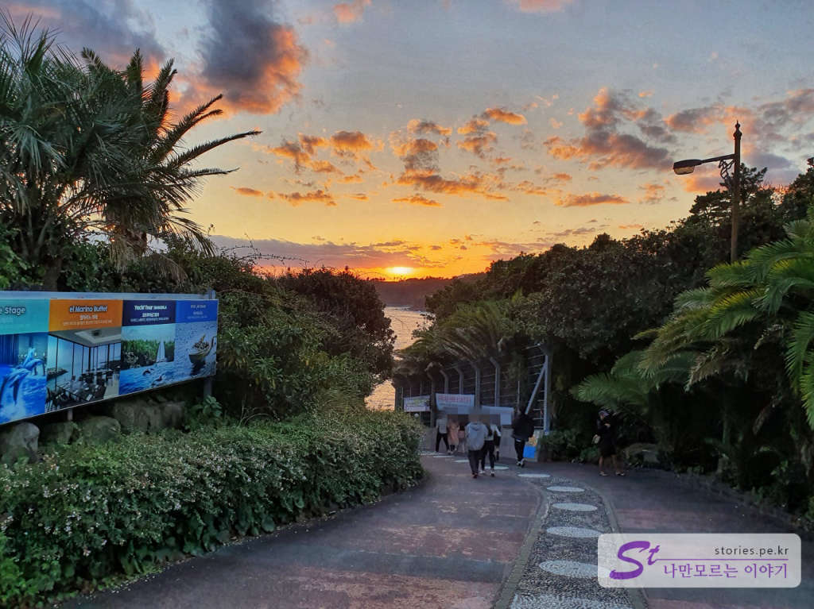
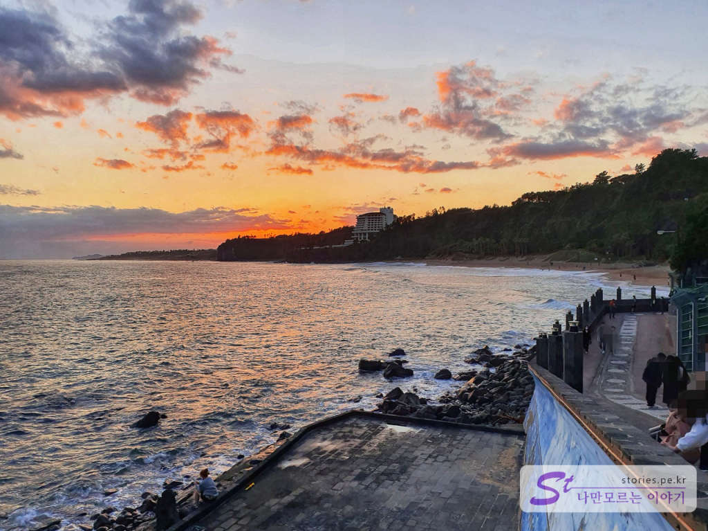
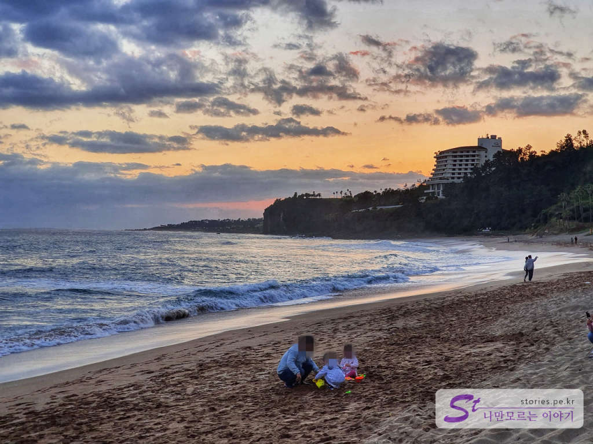
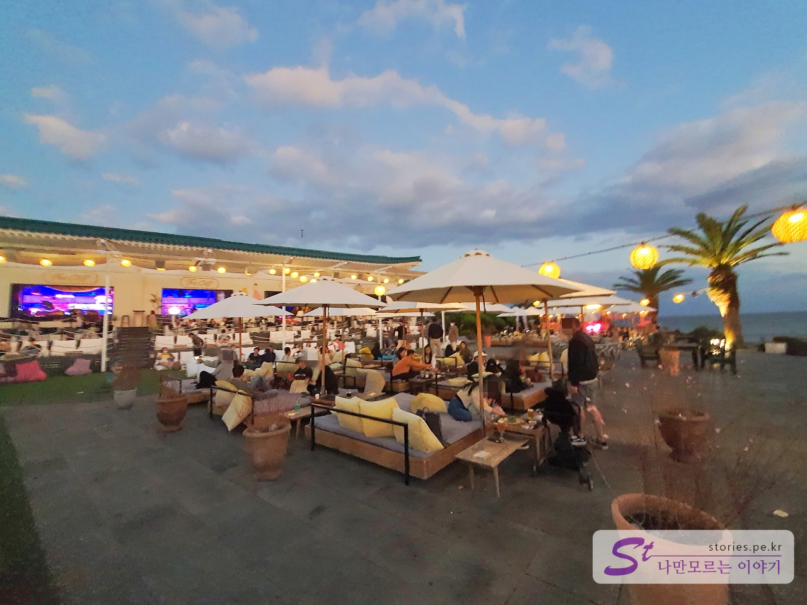

중문은 제주에서 여행객들이 가장 많이 찾는 곳입니다. 다양한 고급 브랜드의 호텔들도 많고 놀이 시설과 박물관도 모두 여기에 모여 있습니다. 저희도 마지막 날 숙소를 중문 부영리조트로 예약했기 때문에 저녁때가 되었을 때 제주의 서쪽인 중문으로 넘어왔습니다. 시간이 거의 저녁해가 질 때쯤이라 낙조를 보기위해 빨리 체크인만 하고 바로 옆에 있는 색달해수욕장으로 이동했습니다. 색달해수욕장에서 보는 낙조가 상당히 아름답다고 소문이 나 있기 때문입니다. 

  
이런 이정표를 본다면 잘 찾아온 것입니다. 넓은 주차장에 주차를 하고 이 이정표를 따라 걸어내려가면 됩니다.  

  
아.. 아쉽게도 내려가는 길에 낙조를 보게 되었습니다. 좀 더 빨리 왔으면 하는 약간의 아쉬움이 있습니다만.. 그래도 이쁘네요. ㅎㅎ

  
곧곧에 묻어 있는 붉은 낙조의 흔적이 장관입니다. 

  
10월이라 물에 들어가는 사람은 없었습니다. 그래도 모래놀이를 하는 아이들은 상당히 많이 있더군요. 저~ 멀리 광고에 많이 나오는 더 쇼어 호텔 제주(구 하얏트 리젠시 제주)가 보입니다. 저기서 보는 바다 전망도 매우 아름다울 것 같습니다. 

  
올라오는 길에 있는 **더클리프**라는 카페입니다. 낙조보기에 최적화된 카페인것 같습니다. 그것을 위해 만들어진것 같구요 여기서 보는 경치도 매우 아름다울 것 같습니다. 편안한 의자와 테이블이 많습니다.

## 방문시기  
10월 오후 6시쯤..

## 비용  
해수욕장의 비용은 없습니다. 

## 여행지 정보  
- 주소 : 제주 서귀포시 색달동  
- 연락처 : 064-760-4993  
- URL : https://www.visitjeju.net/kr/detail/view?contentsid=CONT_000000000500604  

    <iframe src='https://www.google.com/maps/embed?pb=!1m18!1m12!1m3!1d2195.120912952811!2d126.41186088668216!3d33.245436064213045!2m3!1f0!2f0!3f0!3m2!1i1024!2i768!4f13.1!3m3!1m2!1s0x0%3A0x398b7fae2476faad!2z7KSR66y4IOyDieuLrO2VtOyImOyaleyepQ!5e0!3m2!1sko!2skr!4v1603271520586!5m2!1sko!2skr' class='embed-responsive-item' allowfullscreen></iframe>

## 주차정보  
넓은 무료 주차장을 보유하고 있습니다. 
**중문색달해수욕장 주차장**으로

## 인근맛집  
- [[제주맛집] 중문에서 먹은 로컬 맛집 큰돈가 바로가기](https://blog.stories.pe.kr/513)  
- [[제주맛집] 중문에서 만난 인생커피 마노 커피 하우스(난 녹차라떼가 좋아)](https://blog.stories.pe.kr/514)

