전날 중문에 있는 부영리조트에서 숙박을 했습니다. 아침에 체크아웃을 하기 전에 아침산책 겸 **대포 주상절리대**를 걸어서 다녀왔습니다. 부영리조트에서 대포 주상절리대까지는 걸어서 5분~10분 정도의 거리에 있기 때문에 산책하기에 딱 좋습니다. 

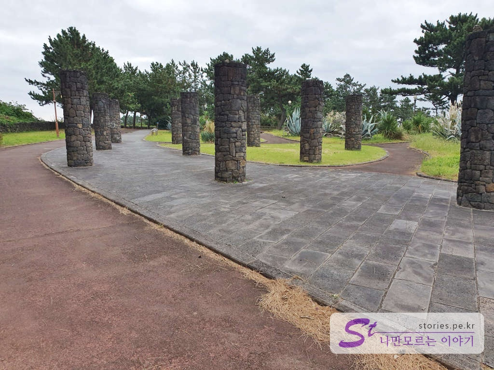  
걸어가는 길이 제주올레길 8코스에 해당되어서 걷기에 좋게 가꾸어져 있습니다. 

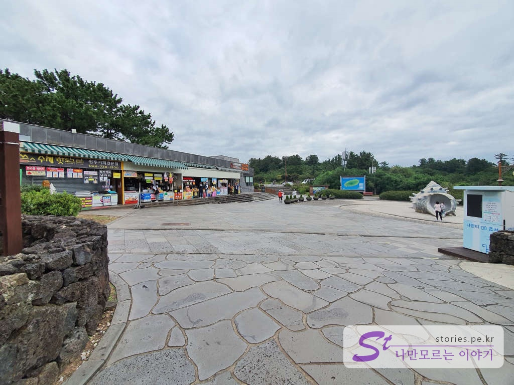  
이런 관경을 본다면 입구에 다 온 것입니다. 상점들이 몇 개 있고 소라 조형물도 있습니다. 좀 더 앞으로 가면 주차장이 있지만 그전에 입구가 있어서 주차장까지는 가보지 않았습니다. 

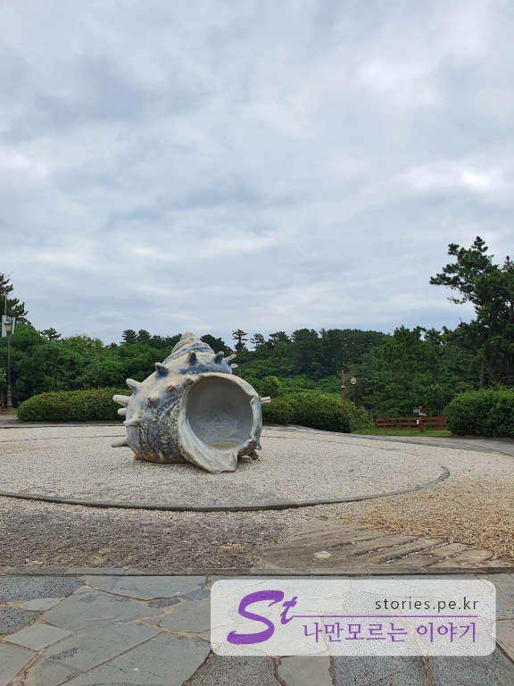  
많은 사람들이 소라조형물에서 사진을 찍더라고요. 

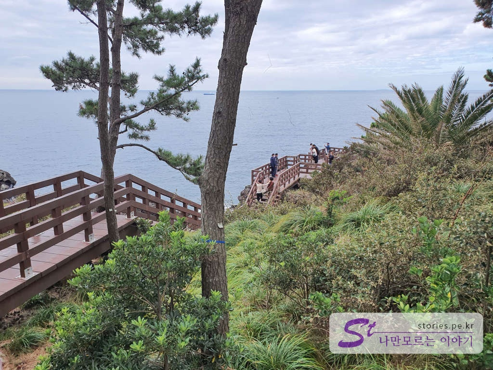  
매표를 하고 입장을 하면 대포 주상절리대의 모습을 볼 수 있는 해안가로 갈 수 있습니다.  

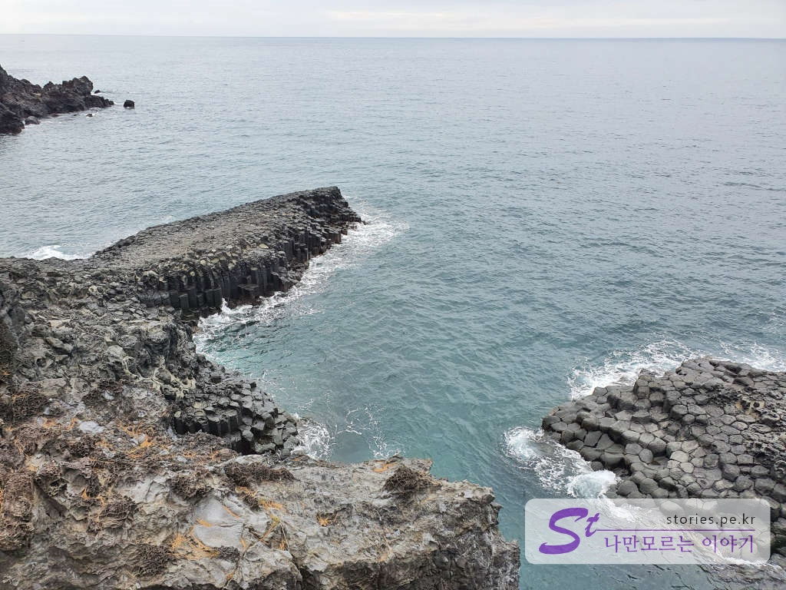  
주상절리가 보입니다. 자연이 만든 멋진 작품에 감탄이 절로 납니다. 바닷가 돌이 육각형 모양으로 형성되어 있습니다. 

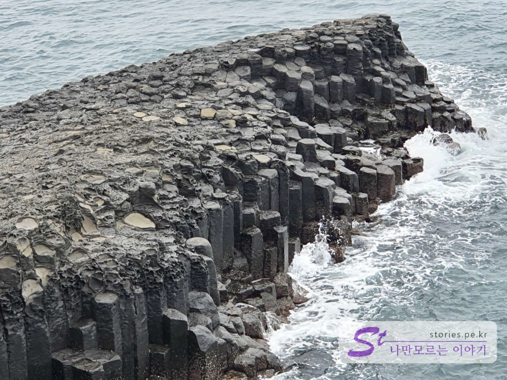  
신기합니다. 사람이 만든 것 같지만 또 사람이 이렇게는 만들지 못할 것 같은 모습입니다. 

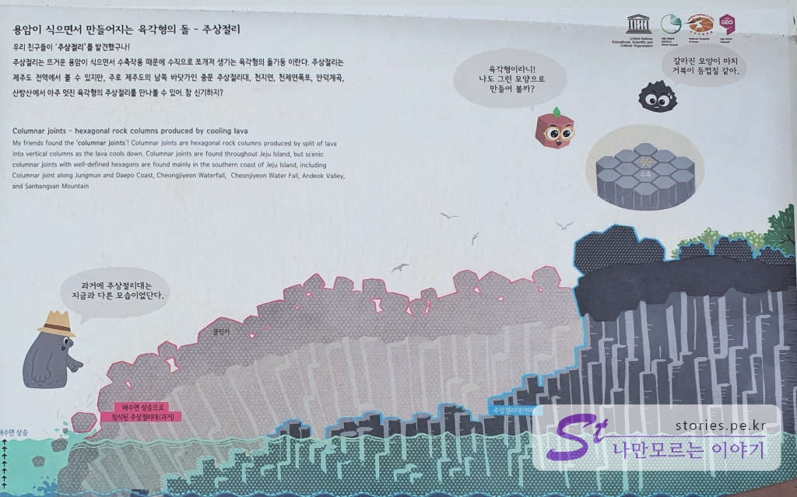  
나 같은 지식이 부족한 사람을 위해 자세히 설명되어 있는 설명문이 설치되어 있습니다.  
한라산에서 터져 나온 용암이 식으면서 만들어진 육각형의 돌을 주상절리라고 한다고 하네요. 처음에는 겉에 용암이 둘러쳐저 있었는데(클링커) 침식작용으로 겉표면(클링커)이 제거되고 속 안에 있던 주상절리가 모습을 드러낸 것이라고 합니다. 

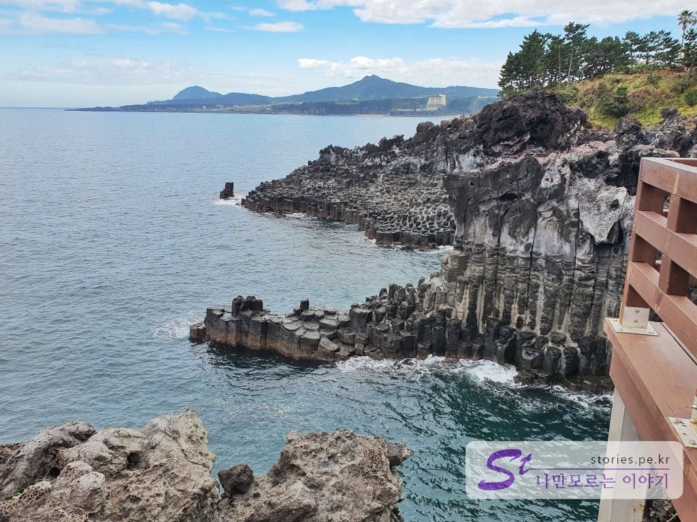  
잘 조성된 나무데크를 따라 이동을 하면서 구경을 할 수 있습니다. 반대편의 주상절리도 멋진 모습을 하고 있습니다.  

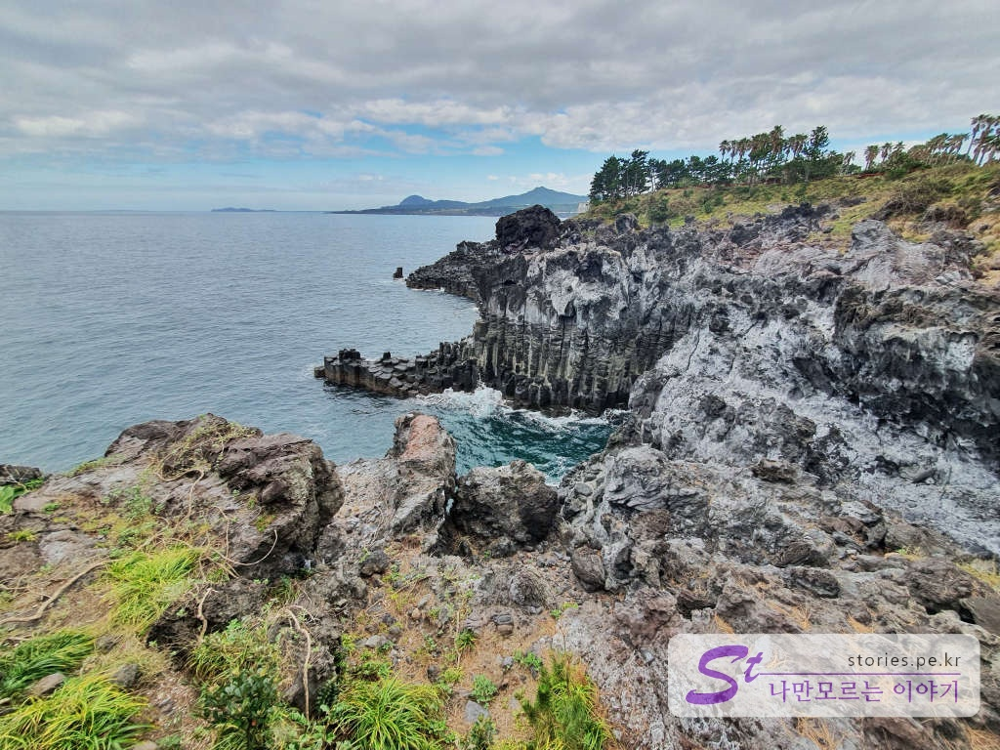  
멋지네요~~ 절경이고요, 신이 주신 선물이네요.

주상절리대의 해안구경을 마치면 이제 해안가에 있는 공원을 한 바퀴 돌면서 구경하기에 좋습니다. 마치 외국에 나온 느낌이 물씬 납니다. 

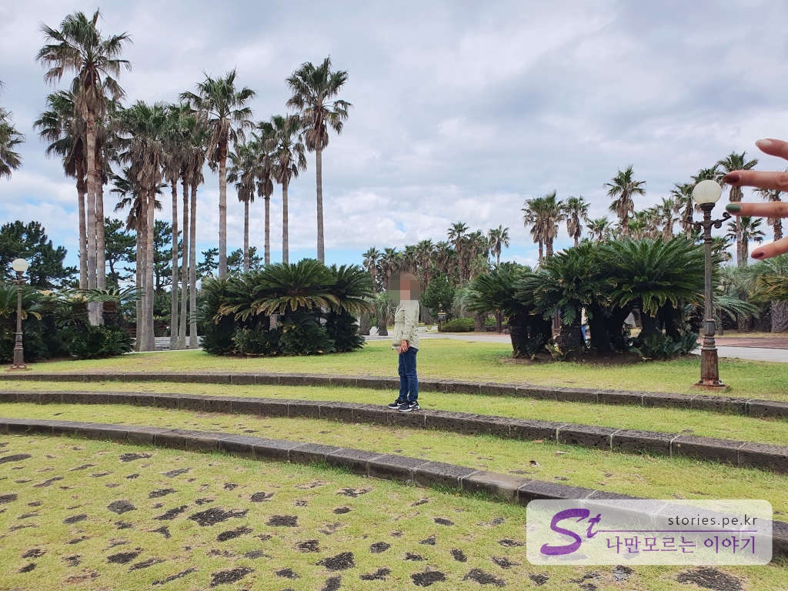  
주상절리대공원의 내부도 잘 꾸며져 있고 가꾸어져 있습니다. 야자수가 해외에 온 느낌을 배가 시키네요.  

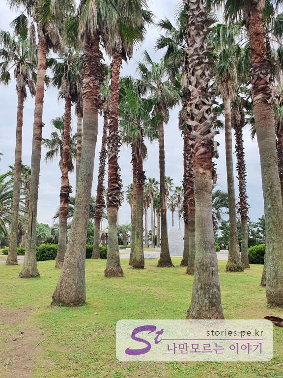  
이게 야자수인가요? 뭔지 몰라도 매우 큰 나무가 하늘로 길게 뻗어 있습니다.  

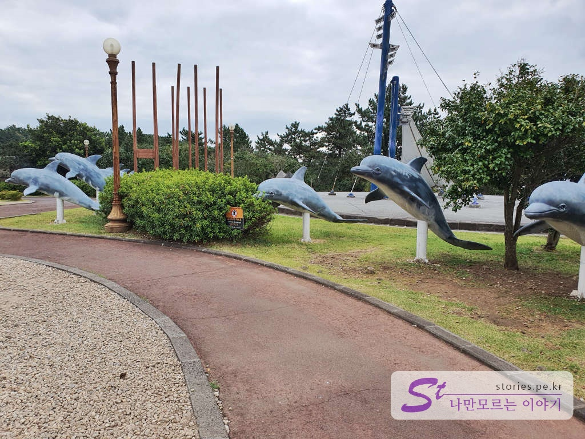  
이제 다시 돌고래가 춤추고 있는 입구 쪽으로 나오면 됩니다. 

## 비용  
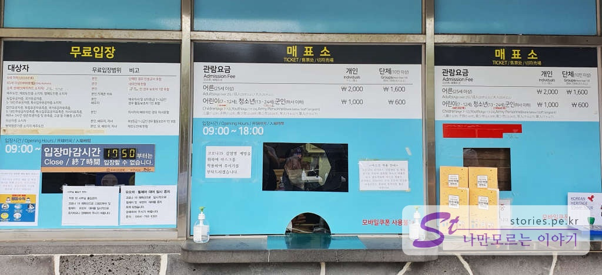  
요금은 대인 기준 2,000원, 소인은 1,000원입니다. 

## 입장시간  
- 시작시간 : 09:00
- 마감시간 : 17:50  
- 소요시간 : 왕복 30분 ~ 1시간  
- 휴무일 : 연중무휴 

## 여행지 정보  
- 주소 : 제주특별자치도 서귀포시 이어도로 36-30  
- 연락처 : 064-738-1521   
- URL : https://www.visitjeju.net/kr/detail/view?contentsid=CNTS_000000000020476    

    <iframe src='https://www.google.com/maps/embed?pb=!1m18!1m12!1m3!1d3337.0927837077056!2d126.42236241504213!3d33.23787258083523!2m3!1f0!2f0!3f0!3m2!1i1024!2i768!4f13.1!3m3!1m2!1s0x350c5bc25561356d%3A0xb1372a7c2b2bf8e5!2z64yA7Y-sIOyjvOyDgeygiOumrOuMgA!5e0!3m2!1sko!2skr!4v1603421831441!5m2!1sko!2skr' class='embed-responsive-item' allowfullscreen></iframe>

## 주차정보  
약 60대가량 주차할 수 있는 무료 주차장이 있습니다. 

