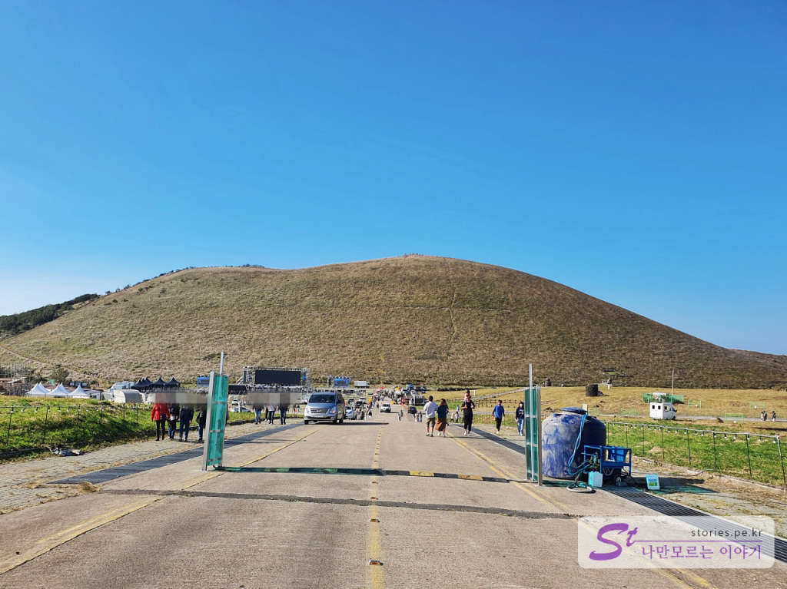
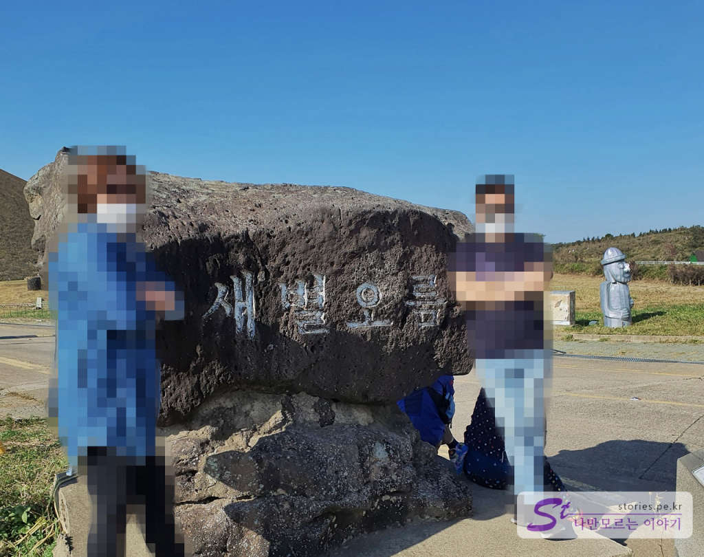
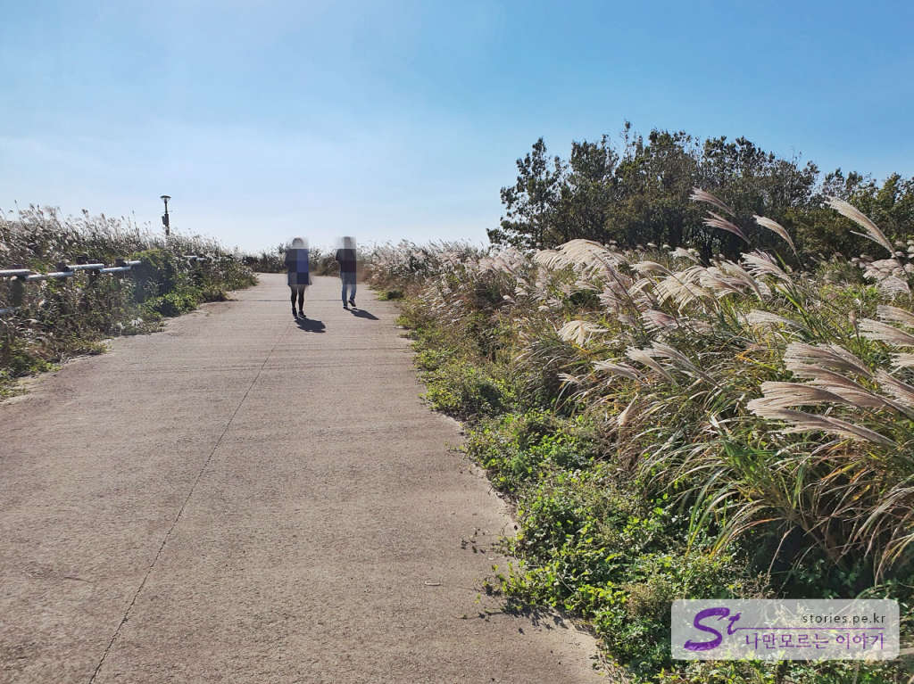
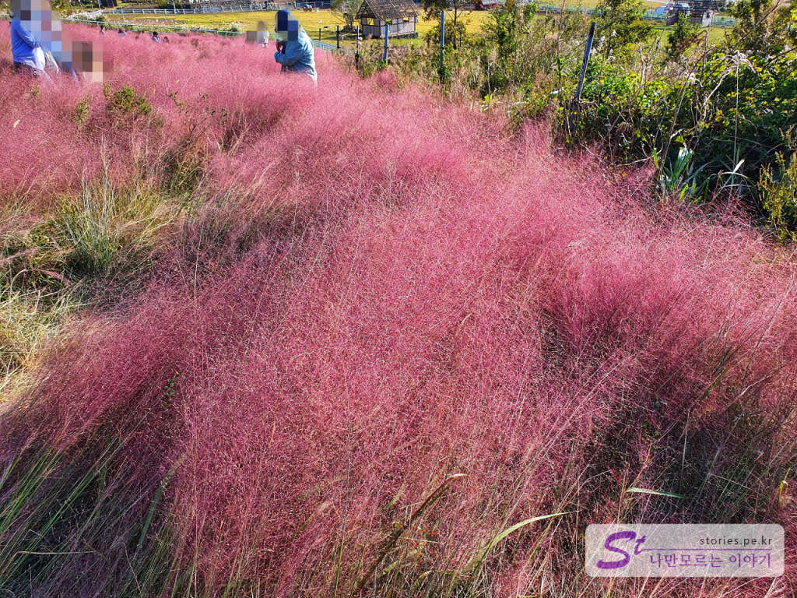
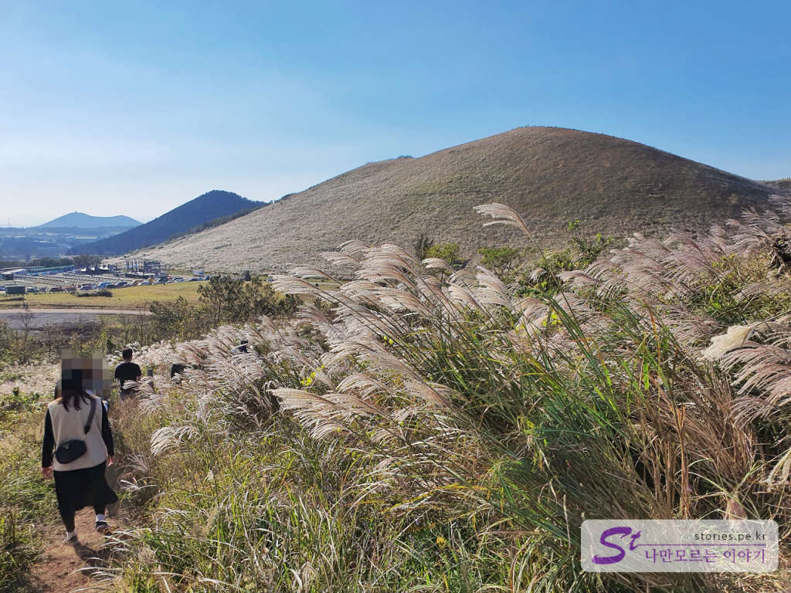
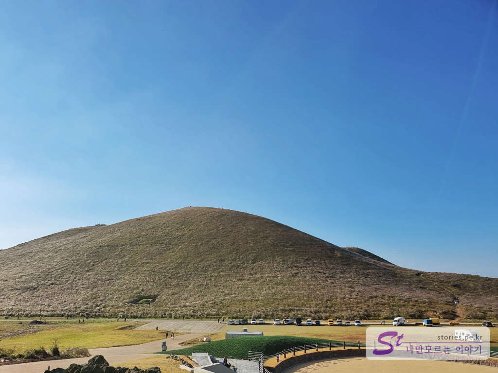

가을에 제주도를 왔다면 꼭 봐야 할 장관 중에 억새가 있습니다. 제주도에는 여기저기 억새밭을 볼 수 있는 곳이 여러 군데가 있지만 그중에서도 단연 첫 번째가 새별오름입니다. 

  
우리도 여행의 마지막을 억새 장관으로 마무리하기 위해 새별오름으로 갔습니다. 마침 제주에서 무슨 행사를 하는지 차량 진입도 통제하고 사람도 많고 다리도 힘들고 해서 들어갈까? 말까? 심하게 갈등을 했습니다. 무엇보다도 새별오름을 쳐다보니.. 너무나 높고 크고 기~~ㄴ 겁니다. 

  
그래서 인증숏만 찍고 주변을 살펴보기 시작했습니다. 

  
왼쪽을 보니 가을을 표현할 수 있는 멋진 억새꽃들이 있어서 사진을 찍고 이번엔 오른쪽을 쳐다봤습니다. 

  
저 멀리 핑크뮬리가 보입니다. **카페 새빌**에서 심어놓은 핑크뮬리입니다. 좀비가 사람쫒아다니듯 새빌로 발걸음을 옮겼습니다. 핑크뮬리가 넓게 펼쳐져 있었으나 사람들에게 짓밟혀서 보기가 좋지 않았습니다. 그래서 저희도 빈자리를 찾아 몇 장 찍고 내려왔네요. 

  
카페 새빌에서 주차장 쪽으로 내려오는 길입니다. 여기도 억새가 넓게 펼쳐져 있습니다. 

  
새별오름에 오르지 못한 것을 아쉬워하며 발걸음을 돌렸습니다. 다음에는 꼭!! 와서 힘있을때 올라가 보리라...

## 비용  
무료입니다. 주차비도 없어요.

## 입장시간  
- 소요시간 : 1시간 30분 ~2시간  

## 여행지 정보  
- 주소 : 제주 제주시 애월읍 봉성리 산59-8    
- URL : https://www.visitjeju.net/kr/detail/view?contentsid=CONT_000000000500309  

    <iframe src='https://www.google.com/maps/embed?pb=!1m18!1m12!1m3!1d39367.759615688!2d126.34025293578497!3d33.36778775411787!2m3!1f0!2f0!3f0!3m2!1i1024!2i768!4f13.1!3m3!1m2!1s0x350c592ebfc92321%3A0xb173dbb86962eaf7!2z7IOI67OE7Jik66aE!5e0!3m2!1sko!2skr!4v1603445215993!5m2!1sko!2skr' class='embed-responsive-item' allowfullscreen></iframe>

## 주차정보  
매우 넓은 주차장이 무료로 운영되고 있습니다.
