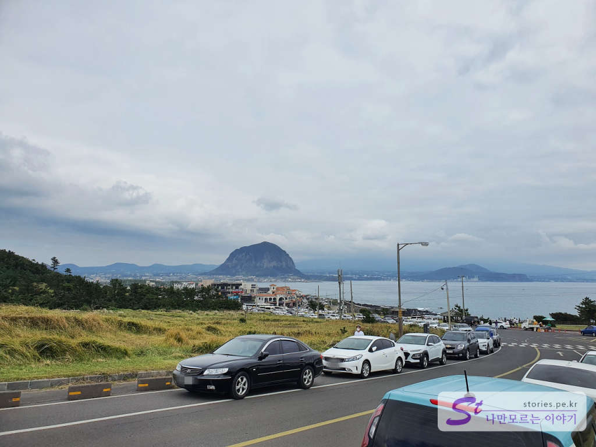
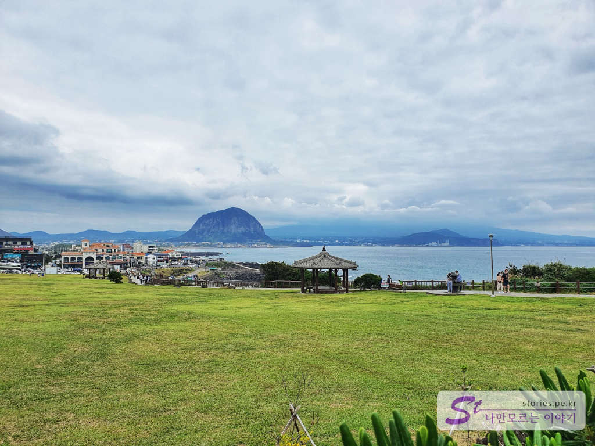
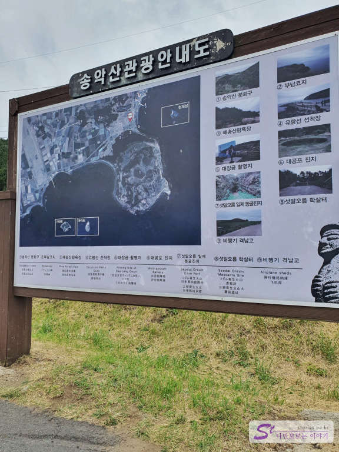
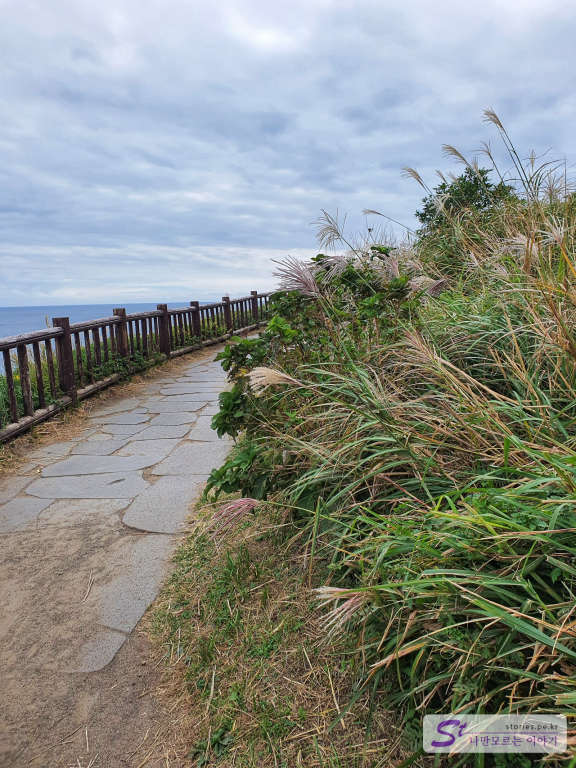
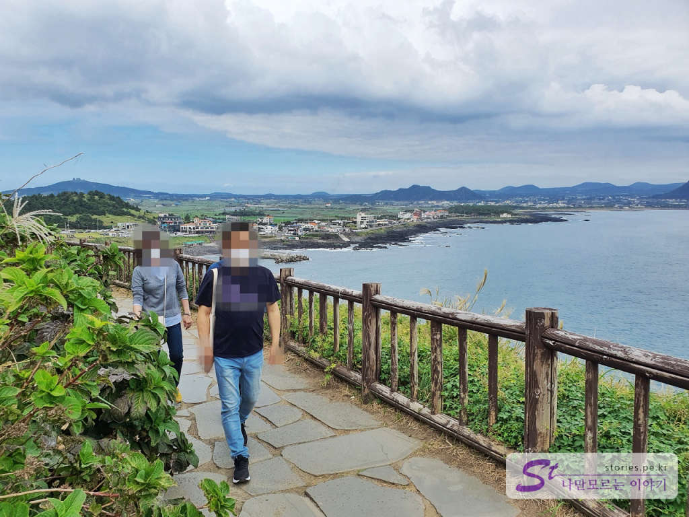
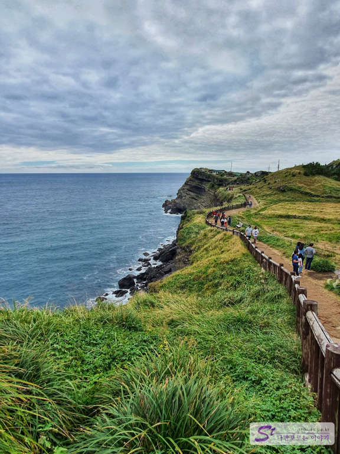
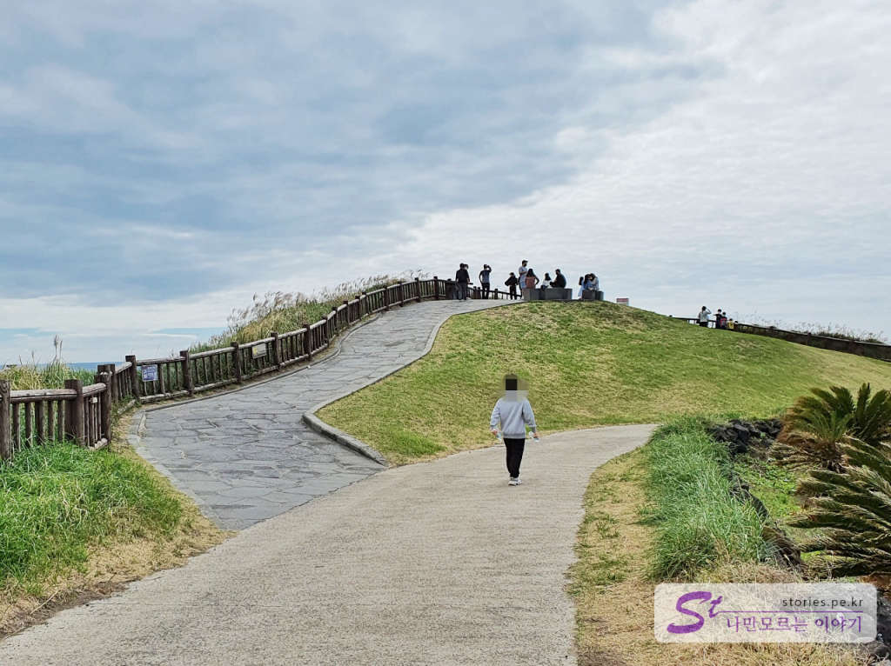
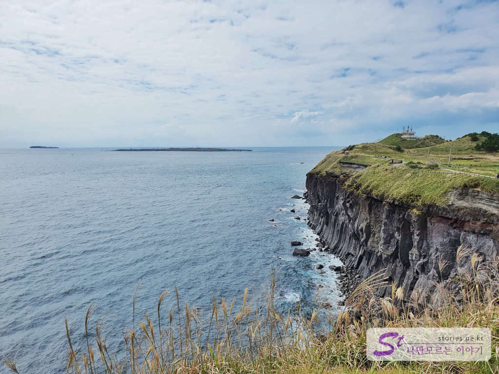
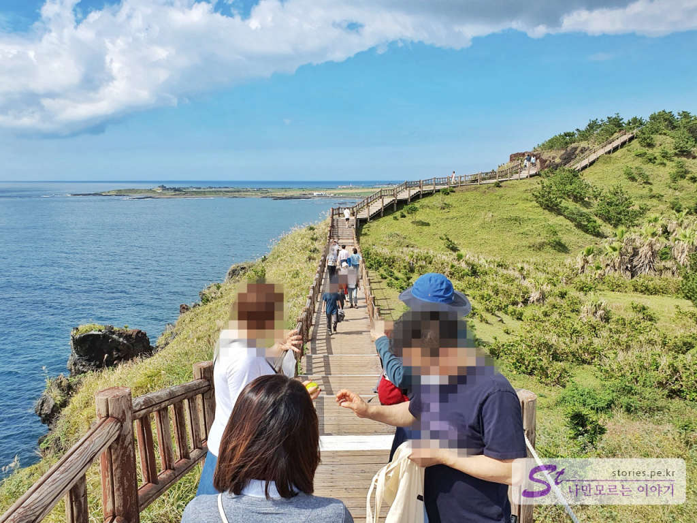
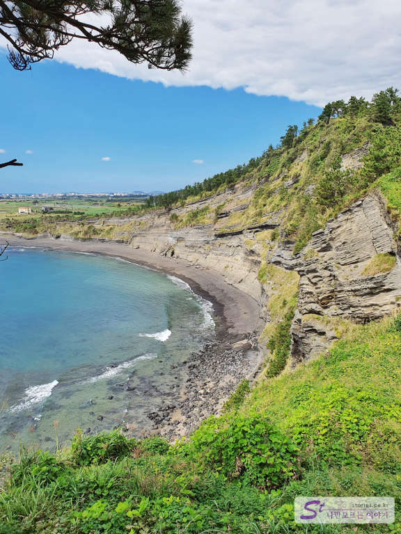

제주 동쪽의 대표 관광지가 성산일출봉이라면 서쪽의 대표 관광지는 중문 관광단지와 송악산이라고 할 수 있습니다. 10년 전만 하더라도 송악산 일대는 그렇게 번화하지 않았었는데 마라도로 가는 배를 탈 수 있는 조그만 산이수동 항구가 알려지면서 현재의 송악산 일대는 매우 번화하고 번창한 곳이 되었습니다. 

    
마라도 가는 배를 타려면 공영주차장에 주차를 하는 것이 좋지만 송악산 둘레길을 가려면 길가에 차를 주차하는 것이 좀 더 빠르긴 합니다. 물론 이날은 토요일이라 차들이 많아서 주차장에 주차를 할 수가 없긴 했습니다. 

  
저 멀리 산방산도 보입니다. 우뚝 솟은 산방산도 상당히 매력적인 산입니다.  

  
송악산 둘레길 초입에 관광안내도가 있네요.. 간단하게 정보를 볼 수 있습니다. 송악산의 왼쪽에는 형제섬, 오른쪽에는 가파도와 마라도가 있습니다.  

  
송악산의 둘레길을 걸으면서 바라보는 바다의 모습이 너무 멋집니다.  

  
반대편으로는 우리가 올라온 산이수동항과 마을이 보입니다.   

  
절경입니다. 꼭 와서 봐야 할 곳입니다. 직접 보면 감동이 더 크더라고요. 올라가는 길에 말타기 체험도 있습니다. 한번 타고 살짝 도는데 5,000원~8,000원 정도인데 생각보다 저렴해서 아이들이 있다면 한 번쯤 해볼 만한 체험입니다. 

  
둘레길의 거의 중간쯤인 송악산 전망대입니다. 

  
송악산 전망대에서 보면 바닷가 쪽에 2개의 크고 작은 섬이 보이는데 오른쪽의 큰 섬이 가파도, 왼쪽의 작은 섬이 마라도입니다.  

  
계속 이동해서 앞으로 갑니다. 길이 모두 나무데크로 되어 있어서 힘들지 않게 갈 수 있습니다.  

  
거의 막바지에 다다랐을 때의 풍경입니다. 너무 멋지지요. 감탄이 절로 나옵니다. 
이렇게 해서 출발했던 주차장쪽으로가면 됩니다. 

## 비용  
비용은 따로 받지 않습니다. 무료입니다. 심지어 주차비도 무료입니다. 

## 입장시간  
- 해지면 올라가지 마세요.
- 소요시간 : 왕복  1시간 ~ 1시간30분 
- 휴무일 : 연중무휴   

## 여행지 정보  
- 주소 : 제주특별자치도 서귀포시 대정읍 상모리 산 2  
- 연락처 : 064-760-2655  
- URL : https://www.visitjeju.net/kr/detail/view?contentsid=CONT_000000000500378 

    <iframe src='https://www.google.com/maps/embed?pb=!1m18!1m12!1m3!1d13354.486753459014!2d126.28316713132669!3d33.19779429355007!2m3!1f0!2f0!3f0!3m2!1i1024!2i768!4f13.1!3m3!1m2!1s0x350c4189c6d1a901%3A0x88a245340e9f8fd0!2z7Iah7JWF7IKw!5e0!3m2!1sko!2skr!4v1603425114921!5m2!1sko!2skr' class='embed-responsive-item' allowfullscreen></iframe>

## 주차정보  
50대의 승용차, 15대의 버스를 주차할 수 있는 공영주차장과 마라도 가는 배를 타기 위한 주차장 70대 정도를 주차할 수 있는 주차장, 갓길 주차 등을 할 수 있습니다. 
웬만하면 주차로 고생하지는 않을 것 같습니다. 
