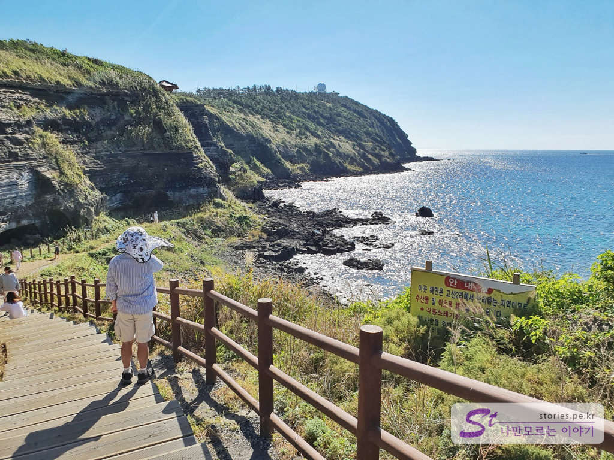
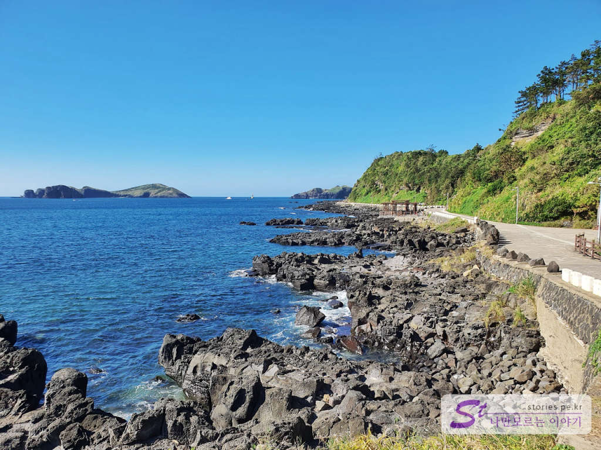
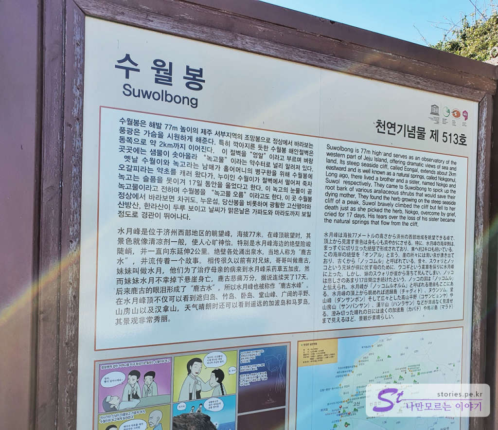
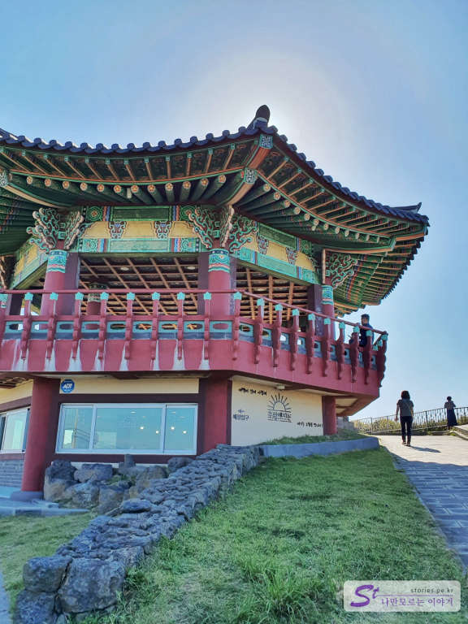
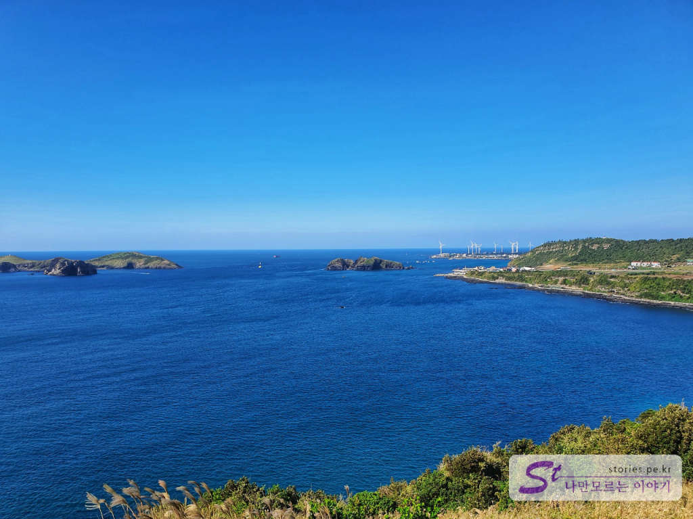
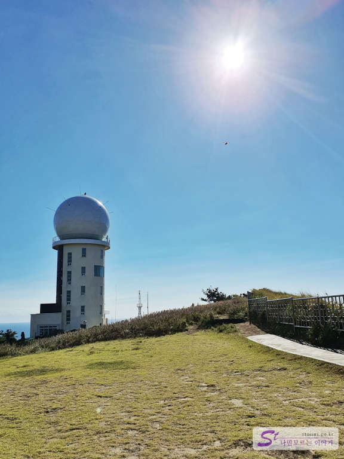

송악산 둘레길을 한 바퀴 도니 나의 체력으로는 더 이상 걷기 힘든 한계에 부딪혔습니다. 그래서 편하면서 경치가 좋은 수월봉 전망대를 가보기로 했습니다. 제주 올레길 12코스에 포함되어 있는 곳이기도 합니다. 

  
먼저 **수월봉 입구 교차로** 부근에 잠시 주차를 하고 바닷가를 먼저 구경해 봤습니다. 여기도 길이 잘되어 있어서 편하게 둘러볼 수 있는 곳입니다. 

  
둘레길로 연결이 되어 있어서 차귀도 포구로 갈 수 있는 길도 잘 되어있습니다. 저 멀리 차귀도가 보이네요. 여기까지 간다면 또 한참을 걸어야 하기 때문에 바로 차귀도로 향했습니다. 

**수월봉 입구 교차로**에 주차를 하고 걸어서 전망대까지 가도 되겠지만 우리는 힘들기 때문에 차를 타고 전망대 주차장까지 갔습니다. 주차장이 크지 않기 때문에 차량이 많을 경우는 낭패를 겪을 수도 있습니다. 

  
주차장에 도착을 하면 수월봉에 대한 설명 게시판을 볼 수 있습니다. 내용은 수월봉에 대한 전설이네요. 옛날 수월이와 녹고라는 남매가 있었는데.. 수월이가 엄마의 약초를 캐려다가 절벽에서 떨어 죽고 이를 슬퍼한 녹고가 눈물을 흘려 녹고물이 되었다는 전설입니다. 

  
그리고 이렇게 멋진 전망대를 볼 수 있습니다. 노약자도 오기에 좋게 되어 있습니다. 

  
수월봉 전망대에서 바라본 차귀도입니다. 저~~ 멀리 풍차도 보이네요. 저기가 드라이브코스로도 유명한 **신창풍차해안도로**입니다. 

  
수월봉 전망대 바로 옆에는 **고산기상대**가 같이 있습니다. 

## 비용  
비용은 모두 무료입니다. 

## 입장시간  
- 소요시간 : 왕복  30분 ~1시간이면 충분합니다.  

## 여행지 정보  
- 주소 : 제주특별자치도 제주시 한경면 고산리 -3  
- URL : https://www.visitjeju.net/kr/detail/view?contentsid=CNTS_000000000020148 

    <iframe src='https://www.google.com/maps/embed?pb=!1m18!1m12!1m3!1d3334.9172658578373!2d126.16019981504385!3d33.294827380818745!2m3!1f0!2f0!3f0!3m2!1i1024!2i768!4f13.1!3m3!1m2!1s0x350c6f3a3ade7e9b%3A0x85ac8411e6390709!2z7IiY7JuU67SJ7KCE66ed64yA!5e0!3m2!1sko!2skr!4v1603432198055!5m2!1sko!2skr' class='embed-responsive-item' allowfullscreen></iframe>

## 주차정보  
10~15 정도 주차할 수 있는 주차장이 있고 갓길에 주차를 하는 경우도 있습니다. 

