제주 여행을 마치며 공항으로 이동했습니다. 출국시간까지 시간이 조금 남아서 용두암을 방문했습니다. 

## 용두암  
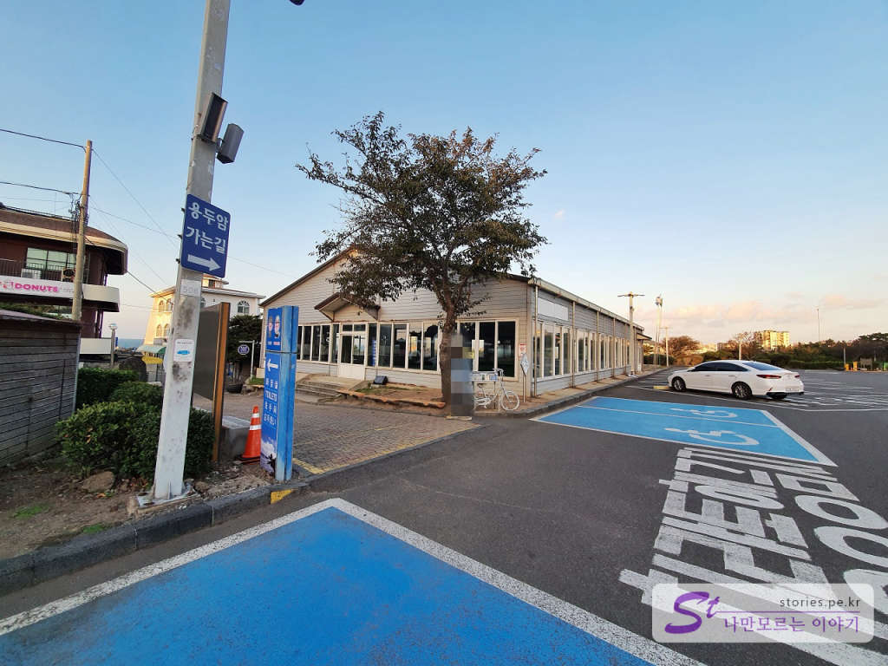  
용두암에는 유료 공영주차장이 있습니다. 주차장에 주차를 하고 **용두암 가는 길** 이정표를 따라 골목으로 진입을 하면 됩니다.  

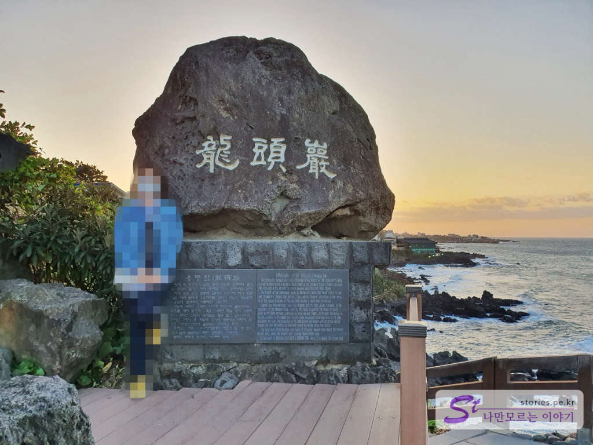 
잠깐 가다 보면 용두암 비석이 보입니다. 전설에 의하면 용연에 살던 용이 바다를 통해 나가다 돌로 굳어져 생긴 것이 용두암이라고 합니다. 

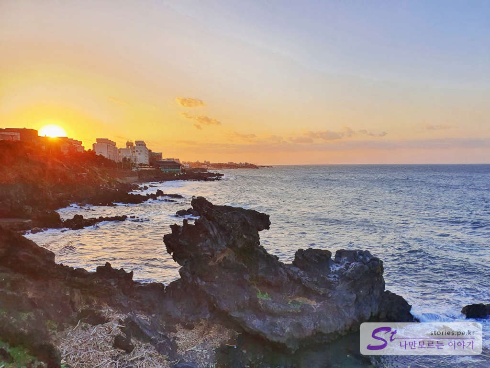  
용두암과 석양이 지는 모습이 대조를 이루고 있는 모습입니다.  

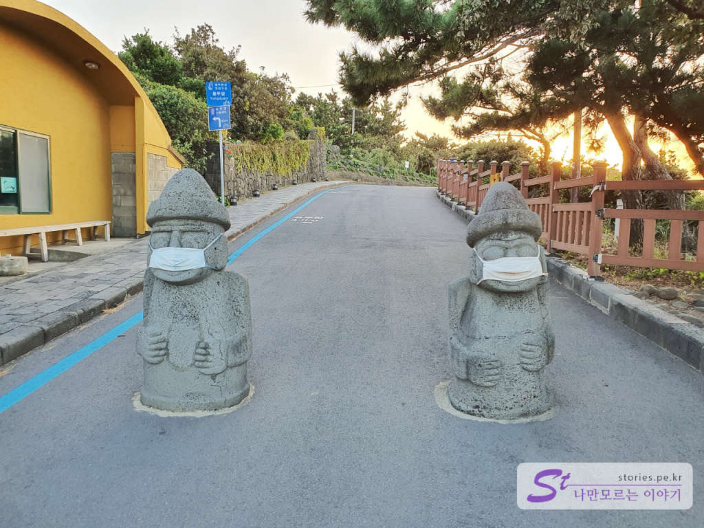  
용두암을 사진으로 남기기 좋은 곳으로 이동하기 위해 반대쪽 방향으로 이동합니다. 여기도 코로나 때문에 돌하르방이 고생이네요. 

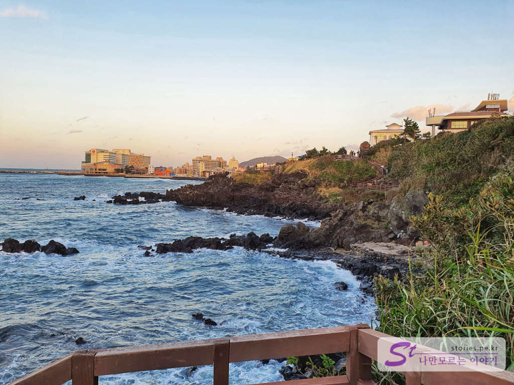  
반대쪽에서 바라본 용두암입니다. 사진으로 보니 뭐가 뭔지 잘 보이지는 않네요. 

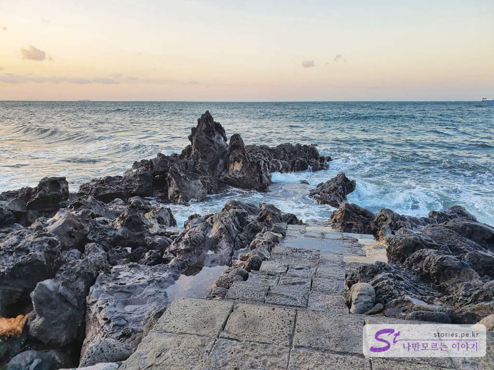  
~~용궁으로 내려갈 수 있는 길..~~ 바다로 이어져 있는 길이 있네요. 요기에서 사진을 잘 찍으면 날아가는 비행기와 함께 인증숏을 찍을 수 있습니다.  

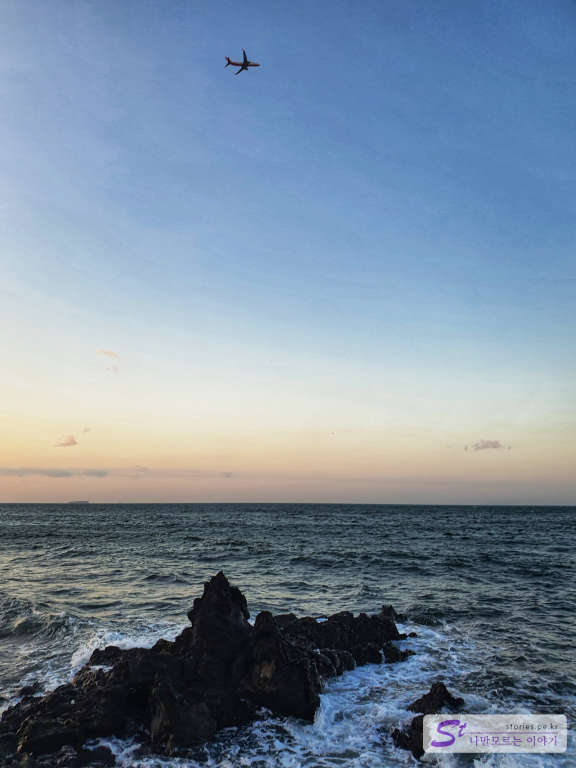  
이렇게요.. 여기에 사람만 잘 넣으면 됩니다. 사진 찍는 사람이 겸손하게 엎드려줘야 합니다. 

## 용연  
다시 왔던 방향으로 되돌아 가면서 용두암 입구를 지나쳐 쭉~ 더 갑니다. 용연에도 주차를 할 수 있는 곳이 몇 군데 있는데 여기는 주차요금을 받지 않습니다. 만약 성수기나 주말이 아니라면 주차를 용연 쪽에 하시고 걸어서 용두암을 보는 것도 주차비를 아낄 수 있는 방법입니다. 

용연은 밑물이 바다로 흘러들어 가는 길목이며 깊이가 깊고 특이한 형태를 하고 있어서 마치 용이 살 것 같은 연못이라 하여 용연이라고 이름 지어졌다고 합니다. 

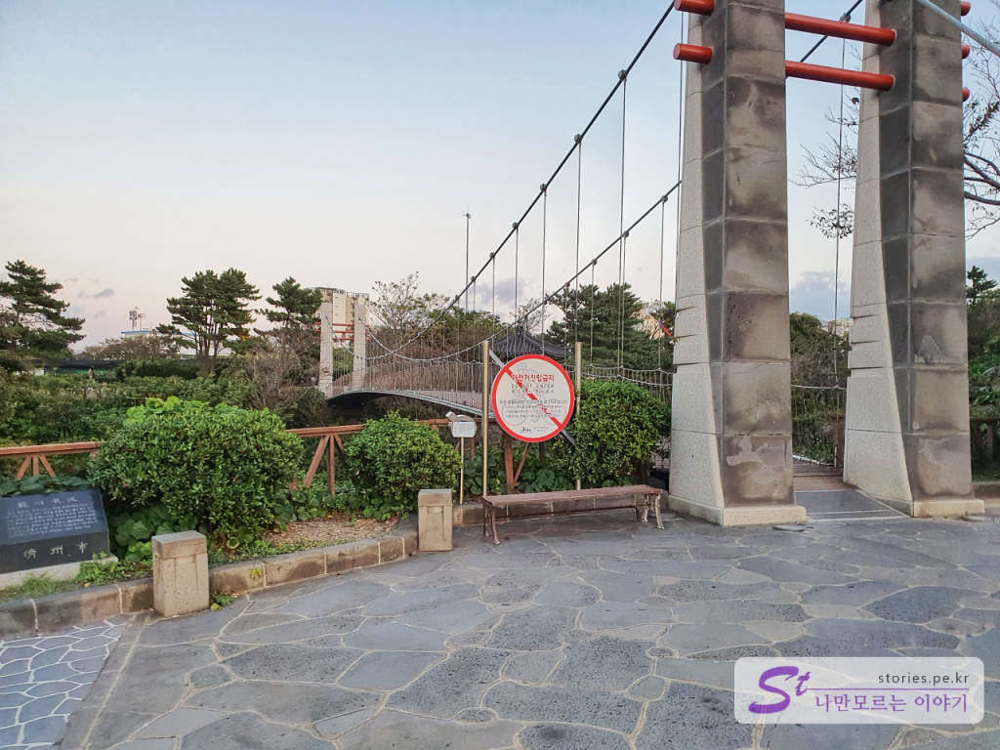  
용연으로 넘어가는 다리입니다. 약간 흔들 다리이고 이 다리 위에서도 용연을 볼 수 있습니다. 

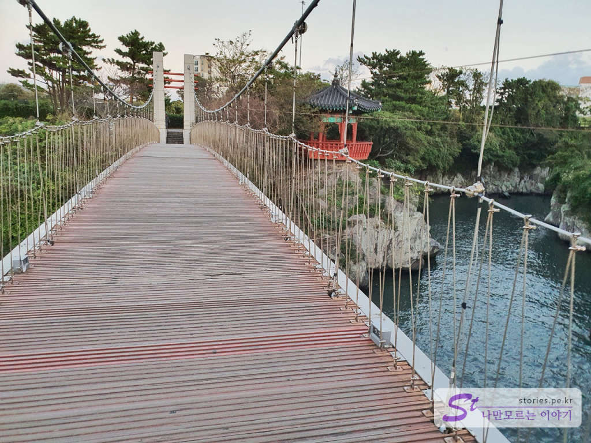  
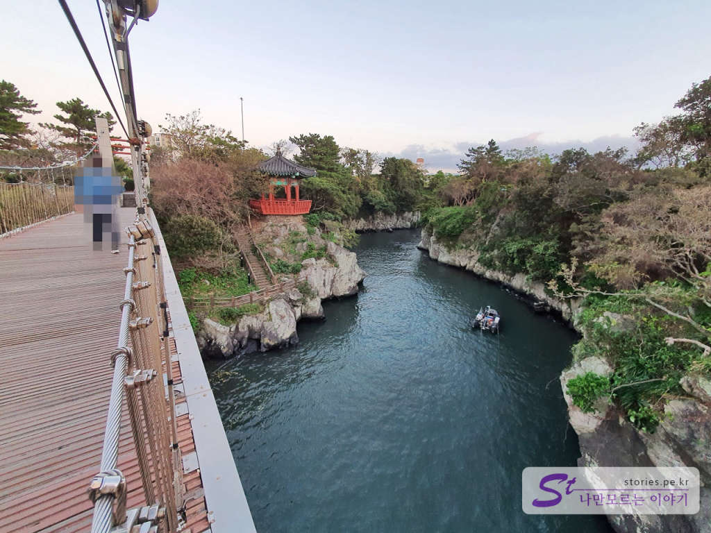  
용연과 정자를 볼 수 있습니다. 상당히 깊고 특이하게 생겨서 정말 용이 살 것 같은 모습입니다.  

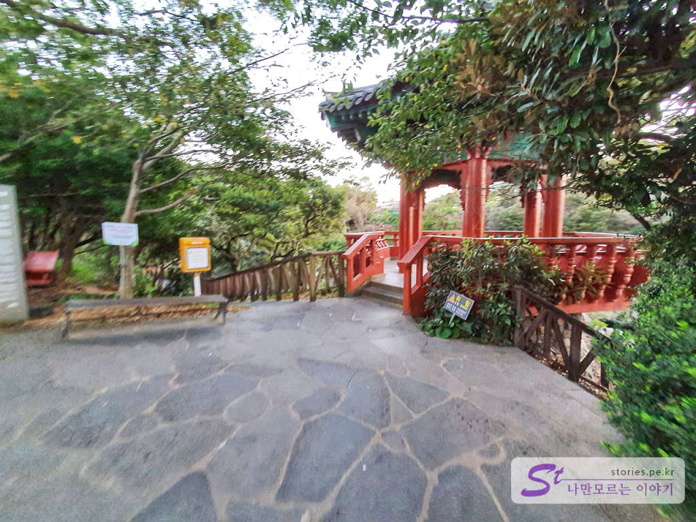  
다리를 건너면 바로 정자로 갈 수 있습니다. 사람도 별로 없고 해서 별로 볼거리는 없네요. 

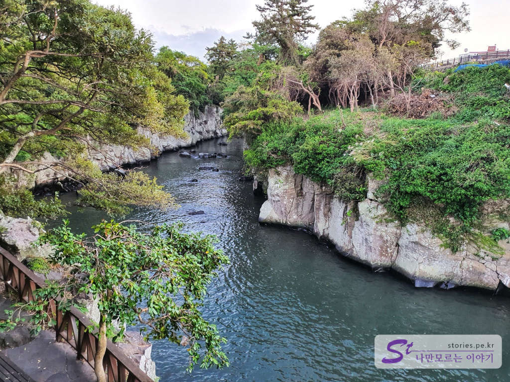  
정자에서 용연을 찍어봤습니다. 용연은 **용이사는 연못**이란 뜻인가 봅니다. 

## 비용  
입장료는 없고 용두암 공영주차장에 주차를 할 경우 주차비가 있습니다. 업무시간 이후에는 관리하시는 분이 없어서 무료로 주차 할 수 있습니다. 

## 입장시간  
- 시작시간 : 시간제한 없음 
- 마감시간 : 컴컴해도 불은 들어오나 무섭긴 해요  
- 소요시간 : 왕복 용두암과 용연을 모두 둘러보는데 30분 ~ 1시간 정도 소요
- 휴무일 : 연중무휴

## 여행지 정보  
- 주소 : 제주특별자치도 제주시 용두암길 15  
- 연락처 : 064-728-3601  
- URL : https://www.visitjeju.net/kr/detail/view?contentsid=CONT_000000000500469   

    <iframe src='https://www.google.com/maps/embed?pb=!1m18!1m12!1m3!1d3326.4289186492488!2d126.5098750150497!3d33.51623228075521!2m3!1f0!2f0!3f0!3m2!1i1024!2i768!4f13.1!3m3!1m2!1s0x350ce4b2810e4315%3A0x3044bfd3cfaa7bb0!2z7Jqp65GQ7JWU!5e0!3m2!1sko!2skr!4v1603449753420!5m2!1sko!2skr' class='embed-responsive-item' allowfullscreen></iframe>

## 주차정보  
용연 쪽에는 무료로 15대 정도 주차할 수 있는 공간(정식 주차장은 아님)이 있으며 용두암 쪽에 공영주차장이 있습니다. 
비용을 받는 시간은 09:00 - 18:30이고 그 이후는 무료로 주차를 할 수 있습니다. 

- 30분 1,000원
- 60분 2,000원
- 120분 4,000원  
