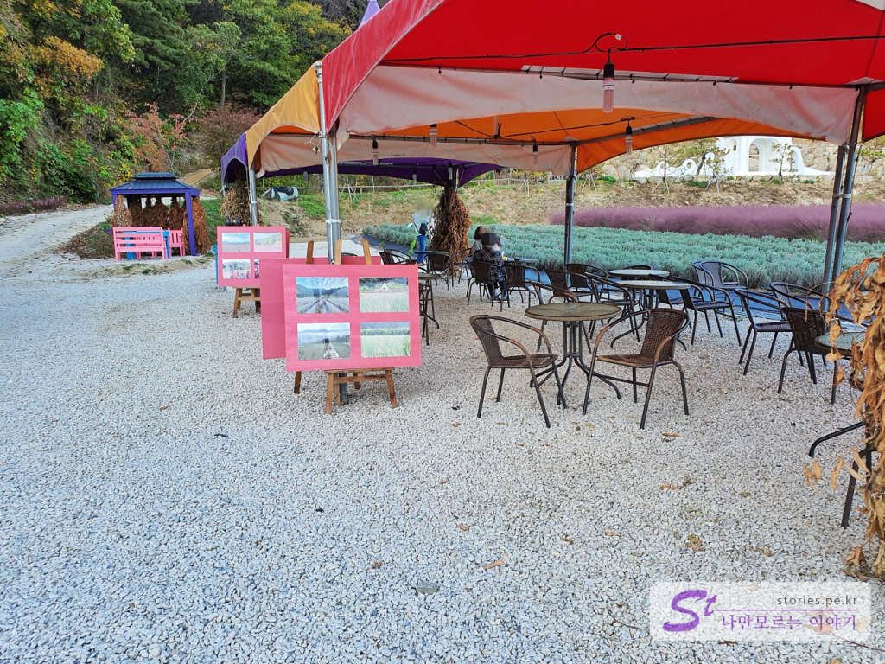
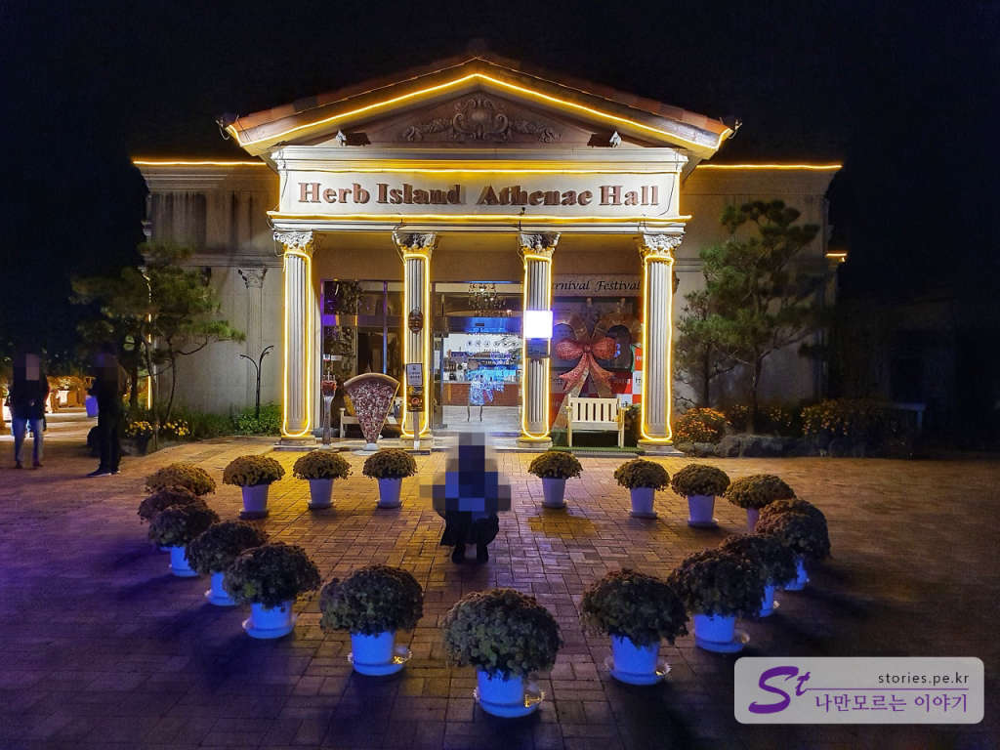
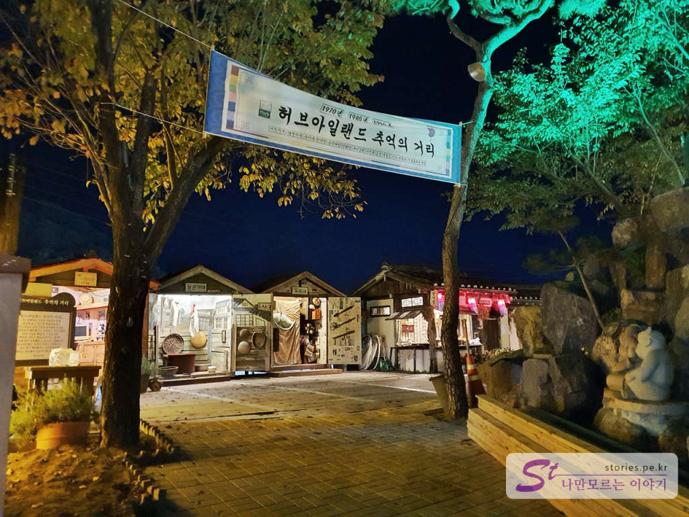

###### 방문일 : 2020년 10월20일  

  
이제 가을로 한참 접어든 때입니다. 남쪽에서 단풍이 서서히 올라오고 핑크뮬리가 분홍색으로 언덕을 물들인 때 서울 근교에 있는 포천 허브아일랜드는 산책하면서 사진 찍기에 너무 좋은 곳입니다.   

  
  
주차장에 주차를 하고 매표소로 이동을 합니다. 사람이 많지 않은 평일이라면 주차를 매표소 앞쪽에도 할 수 있습니다. 

 
입장료는 성인 인당 9,000원입니다.  

  
먼저 전체적인 약도를 한번 보겠습니다. 일단 입장을 하면 힐링센터에 들리게 됩니다. 둘러보는 순서는 번호순으로 둘러보면 적당합니다. 

### 1. 힐링센터  
  
출입구로 들어서면 먼저 힐링센터를 만나게 됩니다. 서양풍의 건물로 들어가면 마사지, 허브제품 구매, 사진 찍기 좋은 스폿들이 있습니다.  

  
건물 안으로 들어서면 다양한 허브 제품을 만날 수 있으며 점원은 있으나 구매를 강요하지 않으니 편안하게 구경하면서 필요한 경우 구매를 하면 됩니다. 

  
실내는 곳곳에 사진을 찍기 좋게 꾸며 놨습니다. 실물 크기의 강아지 모형이 살아 움직이는 듯합니다. 

  
다양한 허브차를 만들어서 판매하고 있습니다. 디스플레이가 한몫하는 것 같아요. 

  
포장된 상품도 있어서 선물용으로도 좋을 것 같습니다. 저도 예전에 누군가에게 한번 받았는지 동일한 제품이 아직도 저희집 진열장에 놓여있습니다. 커헙~

  

야외로 나오면 여기저기 사진을 찍기 좋은 곳이 많이 있습니다. 전체적으로 둘러보니 허브아일랜드는 **사진찍기 좋은 곳**이라는 컨셉으로 꾸미는것 같습니다.  
여기는 백설공주 콘셉트로 사진을 찍을 수 있는 곳입니다. 멋진 정원입니다. 

### 2. 스카이 허브팜
힐링센터를 지나면 스카이 허브팜으로 가는 길을 만나게 됩니다. 스카이 허브팜은 봄과 여름에는 라벤더가, 가을에는 핑크뮬리가 펼쳐저 있어 사진 찍기에 좋습니다. 

  
다만 야외에 있기 때문에 해가 있을 때만 운영을 합니다. 밤에는 컴컴해서 귀신이 나올 수도 있습니다. ~~무셔~~ ~~

  
스카이 허브팜이 언덕 위에 있기 때문에 올라갈 때 힘이 들 수 있습니다. 그래서 정기적으로 운영하는 트렉터를 타고 올라갈 수 있습니다.

  
  
젊은 사람이라면 천천히 올라가도 되지만 노약자 또는 트렉터를 미치도록 타보고 싶은 사람이라면 아주 좋은 선택입니다.

  
  
  
오르막 길이지만 운동한다 생각하고 걸어 올라가도 좋습니다. 우산길을 3곳을 지나가면 도착해요.

  
  
  
오르는 길에 포토죤이 3군데 정도 있습니다. 이게 이렇게 봐서 별거 아닌 것 같지만 배경으로 사진을 찍으면 아주 멋지게 나옵니다. 트랙터를 타고 올라가는 사람은 가질 수 없는 인생샷이 나올 수 있습니다.  

  
봄, 여름에 왔다면 라벤더를 만날 수 있었겠지만 저희는 10월에 올라갔기 때문에 핑크뮬리를 만날 수 있었습니다.  

  
소원을 이루어 준다는 종탑도 보입니다. 핑크뮬리와 곁들여 찍으면 사진이 이쁘게 나와요. 

 
평일에 방문하면 사람도 많이 없어서 멋진 인생 샷을 남길 수 있습니다. 

  
라벤더는 여름에 피지만 초록색의 나무도 나름대로 멋진 사진이 됩니다. 

  
오후 4시쯤 도착하면 해가 걸려있는 배경으로 멋진 사진을 찍을 수 있어요.  

  
밭 옆에는 이렇게 앉아서 쉴 수 있는 곳도 있습니다. 시원한 허브 아이스크림도 팔고 있어서 사진 찍느라 지친 몸과 마음을 달래줄 수 있습니다.   

### 3. 산타마을

  
다시 내려와서 중앙광장을 지나 위쪽으로 올라가면 산타마을을 만날 수 있습니다.  

산타마을은 1년 365일 매일 캐롤송을 듣고 앉아있는 산타할아버지를 만날 수 있는 곳입니다. 10월에 캐럴송을 들으니 미묘한 느낌이 들긴 합니다. ㅎㅎ

> 참고로 저희는 이정표를 보고가지 않아서 우연히 **허브 식물 박물관**을 먼저 구경했었는데 산타마을이 조명이 들어왔을 때도 멋지기 때문에 순서를 바꿔서 허브 식물 박물관을 보고 산타마을로 이동해도 괜찮았습니다.  

  
산타마을은 조명이 들어오기 때문에 평일은 오후 10시, 토요일은 11시까지 운영을 합니다.  

  
고생하시는 산타할아버지와 매인 출입구가 보입니다. 

  
매인 출입구로 들어가지 마시고 우측에 있는 터널길을 따라 꽃밭을 한 바퀴 돌면서 구경하며 사진을 찍으면 좋습니다. 

  
고흐 작품을 콘셉트로 꾸며놓은 포토스폿들이 줄지어 있습니다.  

  
고흐의 명작 그림도 좋은데 포토스폿도 많이 있습니다. 배경이 있는 인물사진이 잘 나옵니다. 

  
반 바퀴를 돌면 멋진 꽃밭과 조명이 어우러진 모습을 볼 수 있습니다. 우리는 오후 6시쯤 해 질 녘에 들어가서 조명이 켜지는 것도 봤습니다. 

  
성당 건물 안으로 들어가 봤습니다. 모양은 성당인데 물건을 구매할 수 있는 상업시설입니다.  

  
정교한 미니어처들이 많이 있습니다.  

  
가까이 찍어도 매우 정교합니다. 상당히 비쌀 것 같은 모양새입니다.  

 
해가 빨리 져서 이제는 밤이 되었습니다. 산타마을의 조명이 더욱 멋지게 보입니다.  

  
산타할아버지가 이제는 멋진 조명을 배경으로 앉아 있습니다. 옆자리에 앉아서 사진을 찍으라고 자리를 비워노셨네요. ㅋ

  
3명이 얼굴 집어넣고 사진을 찍을 수 있는 포토스폿입니다. 

### 9. 아테네홀 레스토랑  
산타마을 옆에 아테네홀 레스토랑이 있습니다. 

  
  
한참 유명한 LOVE 조형물도 조명을 달아 더 멋지게 빛나고 있습니다. 

  
높은 곳에 있는 아테네홀에서 바라본 조명이 켜진 허브아일랜드 전경입니다. 

  
낮에 찍어둔 메뉴판입니다. 시중보다 조금 비싼 것 같긴 하지만 이해 못할 수준은 아닌 것 같습니다. 

### 4.허브 식물 박물관
원래 추천코스는 산타마을 다음에 허브 식물 박물관인데 저희는 반대로 허브 식물 박물관을 먼저 보고 산타마을로 이동했습니다. 그래서 사진이 다시 밝은 대낮이 되었네요 ㅎㅎ 만약 어느 가을날 3시 ~ 4시쯤 허브아일랜드에 도착한다면 저희처럼 이동하는 동선이 더 좋을 수 있다고 추천해 봅니다. 

  
중앙광장에서 허브 식물 박물관으로 가기 위해서는 관광안내소를 지나야 합니다. 

  
허브 식물 박물관은 실내 온실에 있습니다. 입구가 좀 허접하긴 해도 안에는 잘 꾸며 놨습니다. 

  
  
  
  
길을 따라 이동하면 다양한 식물과 허브들을 만날 수 있습니다. 또한 조명이 비치는 길도 있고 다채로워서 지루할 틈이 없습니다. 

  
허브 박물관에서 전망대 가는 길이라고 해서 가봤는데.. 별로 전망할 것은 없네요. 

  
  
허브 박물관에서 바로 산타마을로 나가는 길이 이어져 있습니다. 우리는 허브 박물관을 구경하고 이 길을 따라 산타마을로 갔는데.. 만약 산타마을을 먼저 구경했다면 반대로 이쪽으로 들어와서 허브박물관을 구경하는 것이 좋습니다.  

### 5. 만들기 체험장  
  
이정표에는 만들기 체험장이라고 되어 있지만 만들기 체험장은 아니고 만들기 체험장으로 가는 길목에 있는 정원이라고 보시면 됩니다. 만들기 체험장은 가보지 않았습니다. 제가 뭐... 오밤중에 뭘 만들일은 없으닌까요.. 

  
  
조명이 너무 멋지게 되어 있습니다. 사진도 매우 잘 나옵니다. 어디든 포토존입니다. 

  
매인 조형물인 원형 돔입니다. 실제로 보면 입구로 사람이 드나들 수 있는 정도의 큰 크기입니다. 

### 6. 허브 성  
  
조금 더 지나가면 허브 성을 만날 수 있습니다. 성 주위로 물이 있어서 곤돌라 배를 타고 한 바퀴 돌 수 있습니다. 

  
공주 드레스 같은 옷도 빌려 입고 사진을 찍을 수도 있습니다.  춥고 평일이라 사람도 없고 한산하네요.  

  
곤돌라 배를 탈 수 있습니다. 직접 노를 저어서 이동해야 합니다. 가족끼리는 몰라도 연인끼리 타는 것은 모험입니다. 모아니면 도거든요.. 물이 깨끗해 보이지 않아요...

  
1척 빌려 타는데 5,000원이네요.

### 7. 향기가게   
향기 거리는 아쉽게도 가보지 못했습니다. 사람도 없고 시간도 늦었고 해서 그냥 먼발치에서 여기가 향기 가게야? 하고 지나쳤습니다. ㅎㅎ

### 8. 추억의 거리  
  
추억의 거리는 옛날 한국의 일상적인 모습을 꾸며놓은 곳입니다. 

  
평일 저녁이라 사람이 없었습니다. 조금 느낌이 그랬습니다. 이런 곳은 의례 사람들이 북적이고 해야 하는데... 

  
  
  
옛날 어린 시절의 풍경도 볼 수 있고 옛날 물건도 살 수 있습니다. 

  
추억의 거리 끝부분에 도착하면 민속관도 만날 수 있습니다. 간단한 전통음식을 파는 곳 같은데.. 사람이 없어서 그냥 사진만 찍고 왔습니다. 아마 이쪽으로 향기가게와 연결이 되지 않을까 합니다.  

## 비용  
입장료는 성인 9,000원, 어린이 7,000원입니다. 

## 입장시간  
- 시작시간 : 10:00 
- 마감시간 : 21:00 (토요일, 공휴일에는 23:00, 일요일에는 22:00)  
- 소요시간 : 왕복 4시간 ~ 5시간 정도  
- 휴무일 : 매주 수요일 정기 휴무  
  

## 여행지 정보  
- 주소 : 경기 포천시 신북면 청신로947번길 35  
- 연락처 : 031-535-6494  
- URL : https://www.herbisland.co.kr  

    <iframe src='https://www.google.com/maps/embed?pb=!1m18!1m12!1m3!1d3145.5049603788816!2d127.12946251518002!3d37.965343379725304!2m3!1f0!2f0!3f0!3m2!1i1024!2i768!4f13.1!3m3!1m2!1s0x357cd7f4012c94c5%3A0x6d620243fa5290a4!2z7Y-s7LKcIO2XiOu4jCDslYTsnbzrnpzrk5w!5e0!3m2!1sko!2skr!4v1603850306609!5m2!1sko!2skr' class='embed-responsive-item' allowfullscreen></iframe>

## 주차정보  
주차장은 엄청 넓어요.. 주차 걱정은 없습니다. 
  

