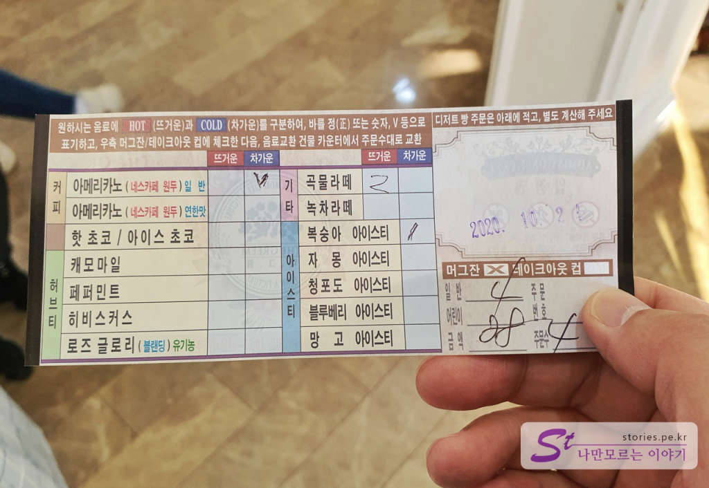
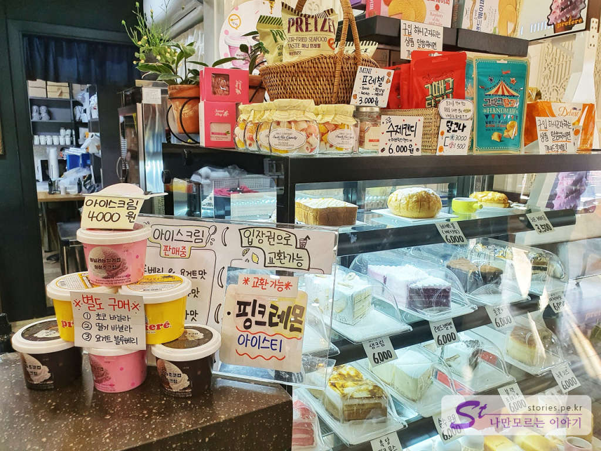

가을날 당일치기로 강아지와 같이 다녀오기 좋은 양평의 경치 맛집이 있습니다.  

  
  
서울에서 대략 1시간 정도 소요되는 거리인 경기도 양평군 옥천면 용천리에 있는 **더 그림**입니다. 사장님이 자신의 별장을 정원처럼 꾸미다가 2002년에 일반에게 입장료를 받고 개방을 하고 있는 곳입니다. 놀이동산처럼 넓지는 않고 적당한 정원 수준 크기의 장소입니다. (저는 포천 허브아일랜드처럼 넓은 곳인 줄 알았어요 ㅎㅎ)
좋은 점은 성인 기준으로 입장료가 7,000원인데 입장료를 지불하면 커피를 한잔 무료로 줍니다. 사실 따지고 보면 7,000원짜리 커피값으로 멋진 정원을 구경한다 생각하지면 딱 맞습니다. [포천허브아일랜드](https://blog.stories.pe.kr/521) 는 공간이 넓은 편이라 많이 걸어 다니며 즐기는 곳이지만 **더 그림**은 편한곳에 앉아서 멋진 정원을 보며 사진도 찍고 커피(음료)도 마시는 곳입니다.  

  
차를 타고 도착하면 먼저 출입구에 매표소가 보이는데 매표소 왼쪽 편으로 이동해서 주차를 먼저 하고 매표를 합니다. 

  
매표권을 주는데 매표권이 음료 주문서입니다. ㅎㅎ 인원수에 맞게 음료를 선택해서 카페에 제출을 하면 음료수로 바꿔줍니다. 

  
굳이 필요는 없지만 팸플릿을 하나 챙겨봅니다. 

  
매표소 바로 옆에 있는 조그만 출입구로 들어가면 됩니다.   

  
  
입구에서부터 포토존입니다. 레트로 한 스타일의 자동차가 있어서 사진 찍기 좋습니다. 

  
  
입구 컷입니다. 멋진 정원이네요. 주인장이 정말 부지런히 공들여 꾸며 놓은 티가 납니다. 

  
**더 그림**은 중앙에 있는 넓고 푸른 잔디밭을 중심으로 삥 둘러 여러 건물들과 벤치들을 배치해서 마음에 드는 곳에 앉아서 쉬면서 음료도 마시고 사진도 찍게 해 놨습니다.    

  
먼저 카페에서 음료수를 받아야 합니다. 카페는 입구에 들어서자마자 보이는 **수채화(생활용품카페)** 건물에 있습니다.  

  
음료는 1인당 한잔을 무료로 주며 기타 빵이나 간식거리는 별도로 현장에서 구매를 하시면 됩니다. 

  
카페 안에도 커피를 마실 수 있는 테이블이 있기는 하지만 날씨가 좋다면 나가서 정원을 보며 먹는 맛이 또 일품입니다. 커피맛보다는 풍경 맛이 좋습니다.  

  
음료를 주문하면 진동벨을 줍니다. 저희는 토요일에 방문해서 사람이 많은 편이었습니다. 대략 5분~10분 정도 기다린 것 같습니다.  

  
이제 커피를 들고 좋은 자리에 앉아서 마시면 됩니다. 참고로 커피맛은 너무 기대하지 마세요. 그냥 시원한 맛에 먹는 보통 커피입니다.  

  
아이들이 좋아할 만한 캐릭터가 있는 포토존입니다. 포토존에서는 사진만 빨리 찍고 나오셔야 합니다. 여기 앉아서 커피 마시면 안돼요..ㅎㅎ

  
이런 포토존도 있네요. 생각보다 사진이 이쁘게 나와요 ㅎ

  
입구의 정반대 편에 있는 앉아서 커피 마시기에 좋은 장소입니다. 

  
데크 위에서 깔끔하게 커피 마시는 장소입니다. 

  
  
물이 흐르게 꾸며놓은 아주 작은 연못 앞에 정자도 있습니다. 절대 눕지 말라는 당부의 글도 있으니 누울 생각은 하지 않는 것이 좋습니다. 모기 밥이 될 수 있습니다.  

  
  
입구의 반대방향 쪽에서 입구를 보고 찍은 사진입니다. 잔디밭 가운데 있는 강아지는 실제 강아지는 아니고 모형입니다. 실제로 강아지도, 사람도 잔디밭 안으로 들어갈 수는 없습니다.  

  
대형견은 안되지만 목줄을 한 소형견과 배변처리용품을 챙기면 반려견과 같이 산책할 수 있습니다. 실내는 출입이 안되고 실외만 가능합니다. 저희는 유모차를 끌고 가서 크게 문제는 없었습니다.   

  
온실(동백 허브 체험관)입니다. 식물들 사이사이에 포토존을 만들어 놔서 사진 찍기에 좋습니다.   

  
  
뒷배경은 그림이지만 사진을 찍어보면 그럴싸해 보입니다.  

  
온실 앞에 있는 마지막 포토존을 지나면 출구입니다. 

## 비용  

  
입장료는 **일반 7,000원**, **어린이는 5,000원** 입니다. **양평군민이면 6,000원**이라고하네요.
1인당 음료 한잔을 무료로 줍니다. (개꿀~)

## 입장시간  
- 시작시간 : 10:00 (주말은 9:30)  
- 마감시간 : 일몰 시(조명이 없어서 해지면 끝나요)  
- 소요시간 : 정원을 한 바퀴 도는 데는 10분이면 가능합니다. 다만 쉬며 커피 마시며 사진 찍고 하면 사람마다 다르겠지요.   
- 휴무일 :  매주 수요일 (단, 수요일이 공휴일이면 반드시 정상 운영), 모든 명절과 공휴일도 정상 운영

## 여행지 정보  
- 주소 : 경기 양평군 옥천면 사나사길 175  
- 연락처 : 070-4257-2210    
- URL : www.thegreem.com   

    <iframe src='https://www.google.com/maps/embed?pb=!1m18!1m12!1m3!1d3164.1023906028367!2d127.49485301516668!3d37.529083579804855!2m3!1f0!2f0!3f0!3m2!1i1024!2i768!4f13.1!3m3!1m2!1s0x356347bcf0c8183d%3A0x2f7062566019b8e4!2z642U6re466a8!5e0!3m2!1sko!2skr!4v1604332656466!5m2!1sko!2skr' class='embed-responsive-item' allowfullscreen></iframe>

## 주차정보  
  
주차장은 100대 이상 주차할 수 있는 넓은 크기입니다. 

## 인근 맛집  
옥천면이라 인근에 **옥천냉면집**들이 많이 있습니다. 
