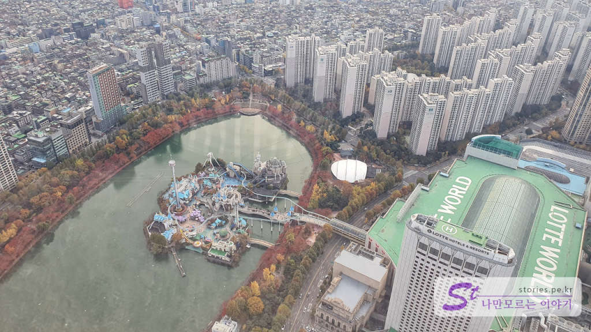
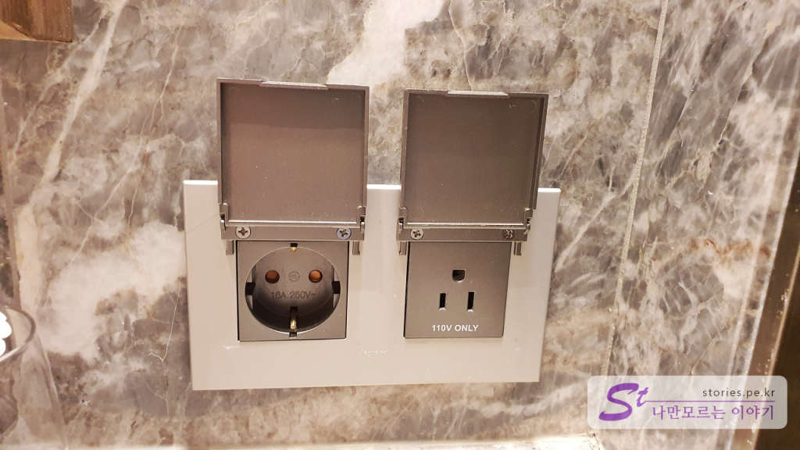
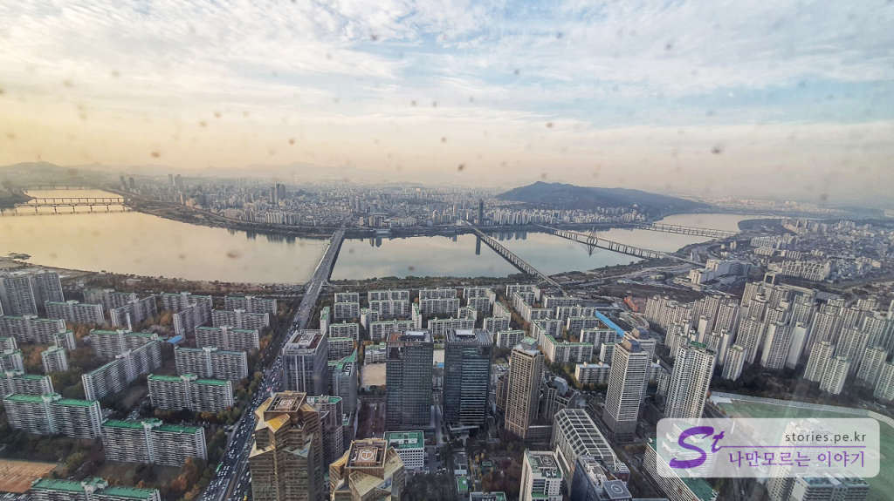

2017년에 개장한 국내 최대 높이의 초고층빌딩인 롯데월드타워는 여러 용도로 사용되지만 그중에서도 **76층~101층에는 시그니엘 호텔**이 자리하고 있습니다. 아마도 국내에서 가장 높은 곳에 위치한 호텔일 것입니다. 

  
촌놈이 좋은 기회가 되어 시그니엘 호텔에서 하루 숙박할 기회가 생겨 방문기를 남겨  봅니다. 

## 주차하기  
일단 롯데월드타워와 롯데월드 몰, 롯데 에비뉴엘이 지하로 연결된 주차장을 같이 사용하기 때문에 상당히 넓습니다. 그래서 아무 생각 없이 갔다가는 주차 구역을 찾다가 지쳐버리게 되니 주차 위치를 미리 확인하고 가시는 것을 추천합니다. 주차는 지하 2층(B2F)과 지하 3층(B3F)을 활용할 수 있습니다. 

### 지하 2층(B2F) 주차   
지하 2층에서 가장 가까운 구역은 순서대로 아래와 같습니다.
> **K11**, L11, M11, D1 ~ D10입니다. 

### 지하 3층(B3F) 주차
만약 지하 3층까지 내려갔다면 가장 가까운 구역은 순서대로 아래와 같습니다.
> **F11**, G11, H11, J11, K11, D7 ~ D10입니다.  

만약 그곳의 주차구역이 없다면 북문 쪽에도 차선책으로 주차를 할 수 있습니다. 북문으로 들어갔다면 1층 로비에서 남문 쪽에 있는 호텔 입구로 걸어서 이동을 해야 합니다. 
> H3, H4, J3, **J4**, K3, K4 L3, L4, M3, M4 

 지하 2층이라면 <b>K11</b>, 지하 3층이라면 <b>F11</b> 을 기억하세요 

  
저희는 모르고 가서 한참 헤매다가 북문 쪽인 J4에 주차를 하고 들어가 갔습니다. 사실 그곳도 나쁘지는 않았습니다. 
지하에서 바로 호텔 로비인 79층으로 올라가는 엘리베이터는 현재 없습니다. 1층 **남쪽 구역**에 별도로 마련된 호텔 전용 엘리베이터로 갈아타야 합니다. 

  
지하에서 먼저 1층으로 이동합니다. 

  
1층 호텔 전용 엘리베이터 입구에는 항시 가이드가 배치돼 있어서 호텔로 가는지 물어보고 문을 열어줍니다. 안으로 들어갔다면 엘리베이터를 타고 79층으로 이동해야 합니다. 

## 체크인 하기   
  
79층에 도착하면 먼저 **The Lounge**가 보입니다. 여기는 **유료 식당**입니다. (호텔 이용객 무료인 **Salon de SIGNIEL**이 아닌 점 유의해야 합니다.) 이곳에서 우측으로 돌아서 들어가면 호텔 로비가 나옵니다. 도착을 하면 로비 입구에서 가이드가 안내를 해줍니다. 안내를 받고 편한 자리에 앉아 기다리면 체크인 차례가 되었을 때 데스크로 안내를 해줍니다. (역시 고급은 달라...)  

  
  
로비에서 기다리는 동안 창문을 통해 롯데월드가 보여서 찍어봤습니다. 창문에 그림자가 비치기는 했지만 멋진 모습을 담을 수 있습니다.  
체크인할 때 투숙객에 대한 기본 정보를 작성하고 투숙객 본인 신용카드로 30만원의 예치금을 미리 결제합니다. 객실에 있는 유료 미니바를 이용할 경우 차감하기 위한 금액이고 유료 미니바를 이용하지 않을 경우 다시 환불을 해 줍니다. 

> 저는 아마 삼성페이 밖에 없어서 30만원을 결제한 것 같고 실물 카드라면 카드정보만 가지고 있다가 비용이 발생할 경우 그때 결제를 하는 것 같습니다.

  
체크인이 끝나면 안내 가이드가 객실까지 캐리어를 이동해 주고 객실 사용에 대한 설명을 하나씩 자세히 해 줍니다. 

## 객실 (그랜드 디럭스 룸)
객실은 그랜드 디럭스 룸, 프리미어 룸, 시그니엘 프리미어 룸, 스위트 룸으로 구성되어 있고 우리가 이용한 룸은 가장 기본인 그랜드 디럭스 룸입니다. 기본 시티뷰를 가지고 있고 한강이 보이는 리버뷰로 업그레이드하려면 **6만원의 추가금액**을 지불해야 합니다. 시티뷰도 충분한 감동을 주기 때문에 굳이 업그레이드를 할 필요는 없습니다. 

#### 출입문  
  
출입구로 들어서면 신발을 앉아서 갈아 신을 수 있는 서랍이 있고 문 바로 옆에는 세탁이나 구두 서비스를 받을 수 있는 조그만 문이 있습니다. 

  
이 문은 바깥 쪽에서도 열 수 있어서 방해를 받지 않고 세탁을 맡기거나 받을 수 있습니다. 

  
문에서 객실로 들어가는 입구입니다. 우측에 옷장이 있는데 이 옷장은 반대편 파우더룸에서도 열 수가 있어서 사용성이 매우 좋게 되어 있습니다. 좌측에는 문이 아니고 전신 거울입니다. 

  
복도의 끝쪽에 온도조절장치가 있습니다. 룸 전체의 컨디션을 조절할 수 있습니다. 

#### 옷장  
  
  
출입구와 파우더룸 쪽에서 열 수 있는 옷장에는 우산, 금고, 실내화 2개, 쇼핑백, 먼지떨이 테이프, 손전등, 간이 방독면 등 외출할 때 필요한 물품들이 적절히 비치되어 있습니다.  

#### 파우더 룸  
파우더 룸은 전체가 비싼 대리석으로 구성되어 있어서 고급스러움이 물씬 납니다. 

  
세면대도 넓게 2개로 되어 있고 서랍에는 다양한 어메니티가 비치되어 있습니다.  

 
서랍 아래쪽에는 샤워가운이 2개 비치되어 있습니다. 

  
전원코드는 220V와 110V 2개가 있습니다. 

  
반대쪽에는 간단하게 화장을 할 수 있는 화장대와 서랍 안에 드라이어기가 비치되어 있습니다. 

#### 미니바  
미니바는 유료와 무료가 다양하게 섞여있어서 잘 선택해서 드셔야 합니다. **무료는 에비앙 물과 커피머신을 이용한 캡슐커피, 다양한 티백**입니다. 그 외 기타 음료는 모두 유료이며 유료상품을 먹었다면 체크인 때 결제한 30만원의 금액에서 차감을 합니다.  

  
술 종류와 음료는 유료입니다.  

  
냉장고 아래에 컵이 있으니 활용하면 됩니다. 

#### 데스크  
  
조그만 데스크도 하나 있습니다. 크게 사용할 일은 없었네요. 일기를 쓸 것도 아니고....

#### 침대  
침대는 매우 푹신하고 포근합니다. 집에서 자는 것처럼 편안한 잠자리를 제공해 주었습니다.  

  
침대가 있고 양 옆으로 탁자와 스위치가 있습니다. 

  
침대 옆 테이블에는 시계와 전화, 리모컨이 위치해 있고 벽에는 스위치가 붙어 있어서 전체적인 조명을 컨트롤할 수 있습니다.   

  
침대 왼쪽에 있는 스위치입니다. 
좌측부터 USB 충전단자(충전 케이블은 아래 서랍에 3가지 종류로 구비되어 있음)가 있고 속 커튼, 겉 커튼을 자동 열고 닫아주는 버튼 2개가 있습니다. 독서등, 침대 위쪽에서 나오는 조명, 침대 아래에서 나오는 조명, 취침등 버튼이 있습니다. 그리고 모든 조명을 온오프 할 수 있는 MASTER버튼이 있습니다.  

  
침대 오른쪽에는 약식 버튼으로 USB 단자, 독서등, 침대 위의 조명, 침대 아래 조명, 전체 조명 온오프 버튼이 있습니다. 

  
침대 앞에는 조그만 티테이블이 있습니다. 가이드가 룸 설명을 하고 나간 후 잠시 후에 웰컴 티를 가져다줍니다. 무료로 먹을 수 있습니다.  

#### 배스룸  
   
정말 가지고 싶은 비데입니다. 사람이 근처에 오면 자동으로 뚜껑이 열리면서 손님 맞을 준비를 합니다. 볼일을 보고 일어나서 나가면 자동으로 물을 내리고 도기까지 세척을 합니다. 좋아요 찌~~ㅇ 찌이~ㅇ ㅎㅎ

  
이탈리아 북부 알프스 천연 대리석으로 제작한 욕실입니다. 따듯하게 반신욕 할 수 있게 바스 소금과 바스티가 구비되어 있습니다.  욕실에서 미끄러지지 말라고 미끄럼 방지 패드도 준비되어 있네요. 

  
샤워기도 있습니다. 여기도 대리석으로 되어 있네요.  

  
샤워기 오른쪽에 어메니티가 있고 거품을 낼 수 있는 샤워타월도 하나 있습니다. 

#### 경치  
창문을 통해 본 경치는 시티뷰입니다. 그러나 왼쪽에 살짝 한강뷰가 보이니 한강뷰라고 우겨도 될 것 같습니다.  

 
우리가 묵은 숙소는 석촌호수가 내려다 보이는 동쪽 방향의 방입니다.  

  
야경입니다. 핸드폰으로 찍는 거라 더 멋지게 못 찍어 아쉽습니다.  

  
~~사실 이런 사진 찍고 싶어서.. 비싼 돈 내고 온...~~

  
창문 밖 풍경이 멋진 액자 같네요.  

    <iframe src='https://www.youtube.com/embed/TlbgSxcqmhM' class='embed-responsive-item' allowfullscreen></iframe>

#### 안내문  
  
수기로 작성한 감사편지입니다. 수기로 쓴듯하지만 내용은 동일합니다. 고마워요 올튼 엔더슨~~~

  
체크인할 때 주는 전체 사용 안내문입니다. 주의 깊게 읽어보셔서 알차게 이용하세요. 
중요 내용만 말씀드리면 Fitness와 사우나, 수영장 무료 이용, 셔츠 다림질 서비스, 구두 손질 서비스도 한정수량 무료 서비스라는 뜻입니다.  
그리고 1회 무료 턴다운 서비스, 매일 물 한 통 무료, 신문 무료라는 이야기와 담배는 피우지 말아라, 창문 밖으로 사람이 나타나도 놀라지 마라 유리창 닦아주는 사람이다라는 안내입니다. 

  
**출입 카드키**입니다. 총 2개를 줍니다. 투숙객이 2명이닌까요.. 이 카드는 항시 소지하고 다녀야 합니다. 살롱 드 시그니엘, 수영장, 사우나, 엘리베이터를 이용할 때 꼭 필요합니다. 

> 엘리베이터를 이용해서 객실로 갈 때 객실층이 눌리지 않는다면 엘리베이터 버튼 아래에 카드키를 먼저 대서 인식을 시키고 객실층을 눌러야 합니다. 이걸 몰라서 좀 고생했습니다.  

#### 무료 서비스 이용  
호텔에 투숙을 하면 몇 가지 무료 서비스를 받을 수 있습니다. 턴다운 서비스는 오후 6시~8시쯤에 객실 정리를 한번 해주는 서비스입니다. 침구를 다시 펴주고 사용한 어메니티를 다시 채워주는 등 간단한 정리를 해주는 서비스입니다. 혹시 사용하고 있는 룸에 누가 들어오는 것이 싫다면 출입문 바로 옆에 있는 턴다운 서비스 필요 없음 버튼을 눌러놓으면 해당 서비스를 해주지 않습니다.  
또 하나는 **셔츠 다림질 서비스**와 **구두 손질 서비스**도 있습니다. 구두 손질 서비스는 그냥 먼지만 떨어내는 수준의 서비스이지 광을 내주거나 하지는 않습니다. 셔츠 다림질 서비스는 객실당 2장의 셔츠를 무료로 서비스해 주는데 마치 세탁 후에 다림질을 해주는 것처럼 결과물이 좋습니다.  

  
가격은 한 장에 14,000원 정도 하나 디스카운트되어 무료로 서비스해 줍니다. 

  

## 호텔 이용객 무료 라운지 Salon de SIGNIEL  
또 하나의 무료 서비스는 무료 라운지인 **Salon de SIGNIEL**을 이용할 수 있습니다. Salon de SIGNIEL은 창문으로 한강을 볼 수 있어서 한강뷰를 보고 싶다면 라운지로 내려오면 됩니다. 

  
Salon de SIGNIEL 라운지는 처음 체크인을 했던 호텔 로비에서 레스토랑 반대편에 있는 조그만 출입구를 지나야 합니다. 이곳에 들어갈 때는 숙소 카드키로 인증을 한 후에 출입을 할 수 있습니다.  

> 저희는 출구 쪽에 있는 레스토랑인 더 라운지를 잘못 알고 찾아갔다가 다시 되돌아왔네요. 

  
  
Salon de SIGNIEL은 멋진 한강뷰를 가지고 있습니다.  

  
창문을 바라보며 음료를 마실 수 있는 자리가 10석 정도 있습니다. 

  
옆쪽에는 PC와 프린터가 있어서 간단한 업무를 처리할 수 있습니다. PC는 맥킨토시네요. 

  

라운지에 있는 간단한 바입니다. 간단한 스낵과 아주 맛있는 커피를 무료로 마실 수 있습니다. 냉장고에는 다양한 음료도 준비되어 있고요. **아침에는 간단한 제철과일** 몇 가지가 나오고 저녁에는(5시 ~8시) **샴페인**이 나옵니다. 모두 무료로 먹을 수 있습니다. 

  
음료도 라운드바 안에서 마시면 무료로 마실 수 있습니다. 

## 수영장  
이번에는 수영장을 다녀왔습니다. 원래는 수영을 하려고 하였으나 차마 들어가지는 못하고 잠깐 사진만 찍어 봤습니다. 

수영장은 85층에 피트니스센터와 같이 붙어 있고 투숙객은 무료로 이용할 수 있습니다.  

  
  
수영장은 3개의 레인으로 조그맣게 되어 있고 관리하시는 분이 1~2명이 계십니다. 

  
이용수칙도 한번 찍어 봤습니다. 

## 롯데월드타워 외부 
저녁에 식사도 할 겸 밖으로 나와 봤습니다. 롯데월드타워에 호텔 말고도 사무실이 많아서 직장인이 많이 있었습니다. 

   
   
건물 앞은 다양한 조경과 조명으로 이쁘게 꾸며놨습니다.  

  
이 LED 터널은 롯데월드 몰 앞쪽에 있는 조형물입니다. 

### 송파나루공원 (석촌호수)
바로 앞에는 석촌호수를 끼고 있는 송파나루공원이 있습니다. 석촌호수를 한 바퀴 돌 수 있는 산책코스로 조경이 아주 잘 되어 있습니다. 우리가 갔을 때는 **단풍&낙엽 축제**를 하고 있던 때라 사람도 많았었습니다. 

  
  
  
  

단풍축제가 맞네요.   

  
석촌호수에서 바라본 롯데월드타워입니다. 

## 여행지 정보  
- 주소 : 서울특별시 송파구 올림픽로 300 롯데월드타워 76-101층  
- 연락처 : 02-3213-1000  
- URL : https://www.lottehotel.com/seoul-signiel/ko.html  

    <iframe src='https://www.google.com/maps/embed?pb=!1m18!1m12!1m3!1d3164.8013190837605!2d127.10033551516615!3d37.512603879808125!2m3!1f0!2f0!3f0!3m2!1i1024!2i768!4f13.1!3m3!1m2!1s0x357ca50ac1c8bccb%3A0xbeb4a183daa6684f!2z7Iuc6re464uI7JeYIOyEnOyauA!5e0!3m2!1sko!2skr!4v1604984754640!5m2!1sko!2skr' class='embed-responsive-item' allowfullscreen></iframe>

## 주차정보  
투숙객은 주차 무료입니다. 

 지하 2층이라면 <b>K11</b>, 지하 3층이라면 <b>F11</b> 을 기억하세요 

## 인근 맛집  
인근에 송리단길이 있어서 맛집이 많습니다. 그중에 저희는 일식 비빔 우동, 소바로 유명한 **멘야하나비**를 다녀왔습니다. 맛있습니다. 

> [[서울] 송리단길 비벼먹는 마제소바로 유명한 맛집 멘야하나비](https://blog.stories.pe.kr/526)
