동해 여행에서 빠지지 않는 곳이 추암해변입니다. 아주 예전에 방문했을 때는 촛대바위와 해변 말고는 볼 것이 없었는데 지금은 주차장부터 화장실, 커피 마시는 곳 출렁다리 등 다양한 볼거리와 쉴 거리가 많아져서 멋진 관광지의 모습을 하고 있습니다. 

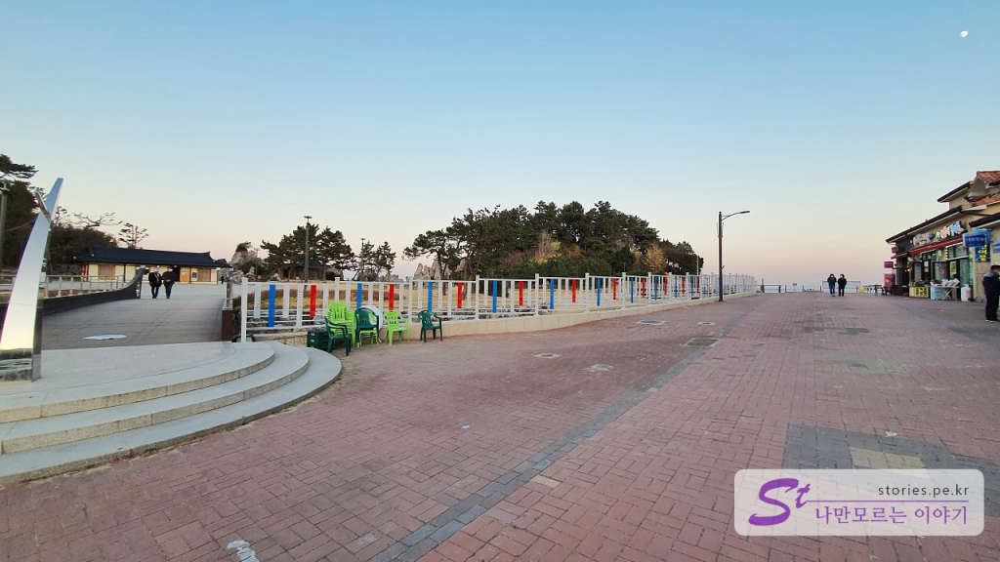  
예전 기억으로는 흑 길이였던 것 같은데 지금은 보도블록을 깔아놔서 걷기에도 나쁘지 않습니다. 

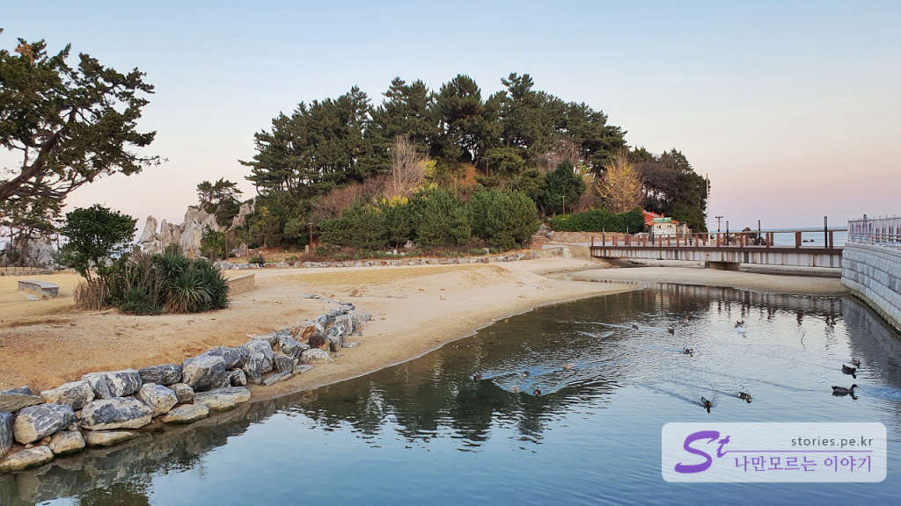  
왼쪽으로는 민물이 바다로 흘러 들어가는 조그만 개울이 있고 오리들이 노닐고 있습니다. 이 모습은 예전이나 지금이나 똑같네요.  

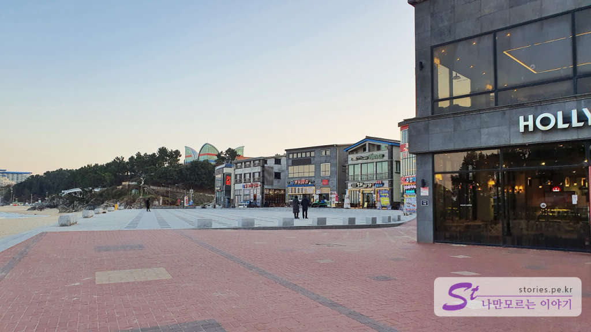  
할리스커피나 횟집, 대게집, 생선구이집 등 다양한 상점들이 들어서 있어서 겨울에 해변의 찬바람이나 여름에 더위를 피할 수 있습니다. 

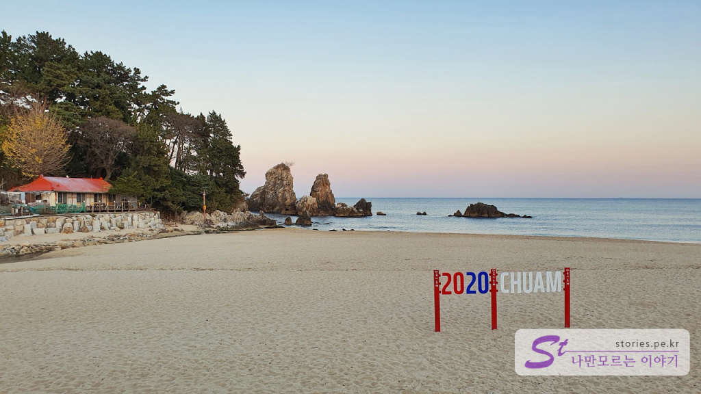  
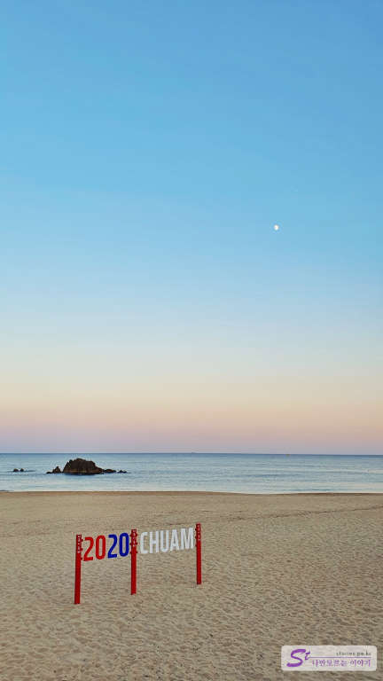  
늦가을의 바다라 사람 없이 한적합니다. 

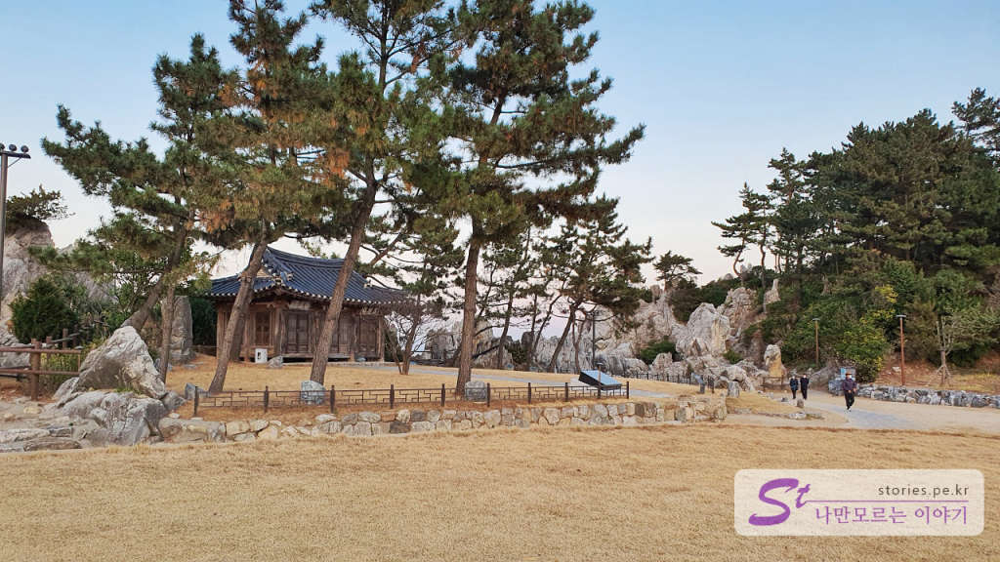
이번엔 해변에서 나와서 출렁다리가 있는 방향으로 가는 길에 강원도 유형문화재 제63호인 **북평해암정**이 보입니다.  

> 삼척 심씨의 시조 심동로가 벼슬을 버리고 내려와 제자를 가르치며 생활할 때 지은 정자로 고려 공민왕 10년(1361)에 처음 짓고, 조선 중종 25년(1530)에 심언광이 다시 지었다. 
심동로는 어려서부터 글을 잘하였는데, 고려말의 혼란한 상태를 바로잡으려 노력하다가 권력을 잡고 있던 간신배들이 마음에 들지 않아 고향으로 내려가려고 하였다. 왕은 그를 말렸으나 노인이 동쪽으로 간다는 뜻의 ‘동로(東老)’라는 이름을 내리면서 결국 허락하였다.
앞면 3칸·옆면 2칸 규모이며, 지붕 옆면이 여덟 팔(八)자 모양인 팔작지붕집이다. 앞면을 제외한 3면은 모두 4척 정도의 높이까지 벽을 만들고 모두 개방하였다. 
이곳에는 송시열이 덕원으로 유배되어 가는 도중 들러 남긴 ‘초합운심경전사(草合雲深逕轉斜)’라는 글이 남아 있다.
> -- 국가 문화유산 포털 글 참조 --

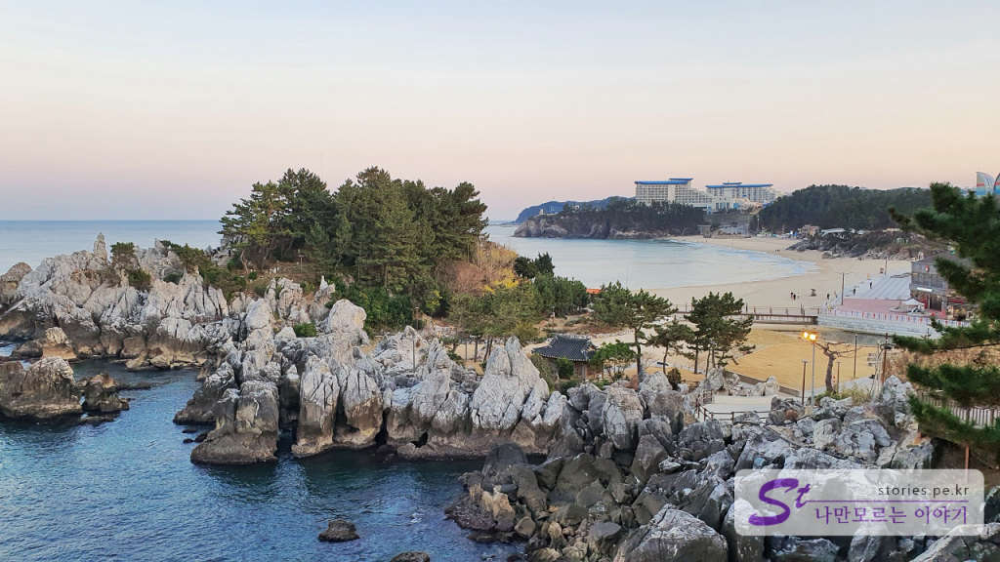  
북평해암정을 지나 조금만 걸어 올라가서 추암 능파대 쪽을 바라보면 멋진 경치를 볼 수 있습니다. 

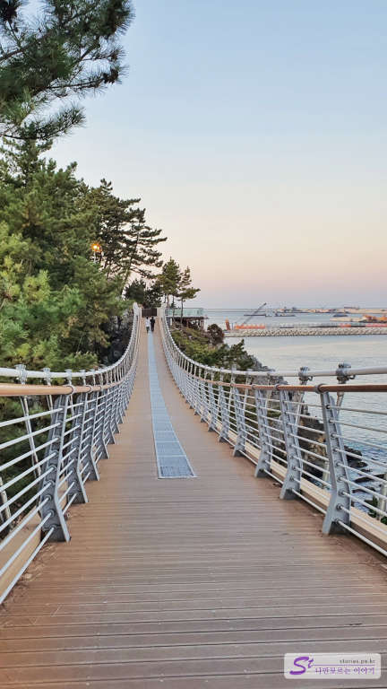  
그리고 바로 출렁다리를 만날 수 있습니다. 그렇게 길지는 않지만 걸을 때마다 출렁출렁 거려서 출렁다리의 재미를 느낄 수 있습니다. 그렇게 한 바퀴 돌아서 추암 조각공원 쪽으로 내려올 수 있습니다. 

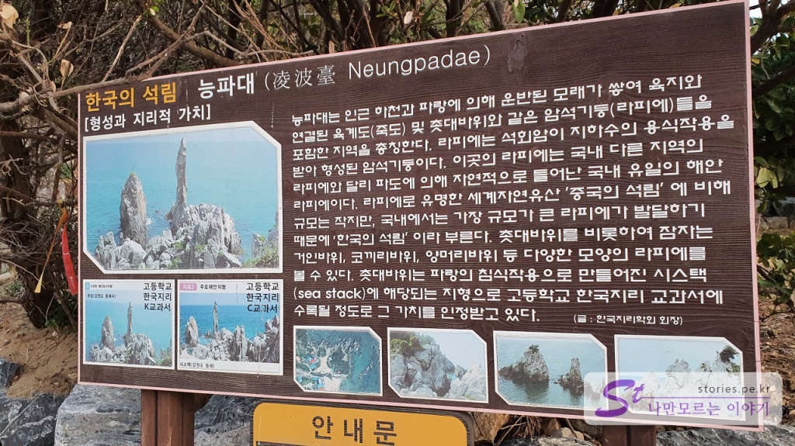  
출렁다리에서 내려오면 능파대로 올라갈 수 있습니다. 

> 원래는 먼저 능파대에서 촛대바위를 보고 출렁다리 쪽으로 이동하는 것이 일반적인 코스입니다. 

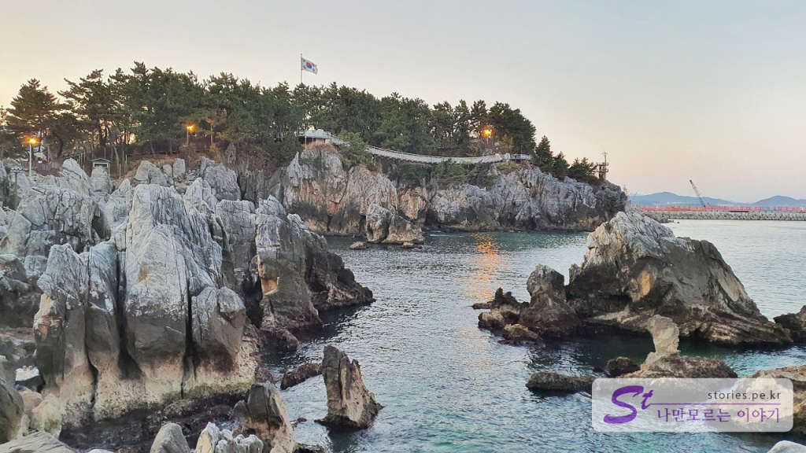  
이번에는 능파대에서 출렁다리를 바라본 풍경입니다. 너무 멋있습니다. 

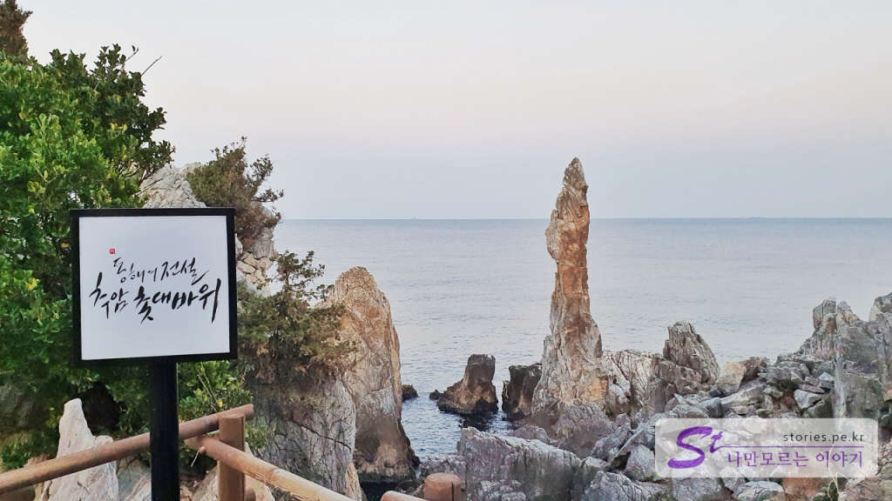  
그 유명한 추암 촛대바위입니다. 옛날에 밤 12시쯤 공영방송이 종료될 때 애국가의 배경화면으로 나왔던 장소입니다. 

## 여행지 정보  
- 주소 : 강원 동해시 추암동 474-20  
- 연락처 : 033-530-2801  
- URL : [동해관광 홈페이지](http://www.dh.go.kr/tour/sub.htm?mode=view&mv_data=aWR4PTE2MyZuYXZfY29kZT10b3UxNDk2OTY5ODEyJnN0YXJ0UGFnZT0yMCZsaXN0Tm89NyZ0YWJsZT1jc190b3VyX3N5bmNfbWV0YSZjb2RlPXNlYSZzZWFyY2hfaXRlbT0mc2VhcmNoX29yZGVyPSZvcmRlcl9saXN0PSZsaXN0X3NjYWxlPSZ2aWV3X2xldmVsPSZ2aWV3X2NhdGU9JnZpZXdfY2F0ZTI9JnBhcnQ9)
 
  

<iframe src='https://www.google.com/maps/embed?pb=!1m18!1m12!1m3!1d1247.503898498092!2d129.1589366498697!3d37.477439035017106!2m3!1f0!2f0!3f0!3m2!1i1024!2i768!4f13.1!3m3!1m2!1s0x3561b78bff4c0d1b%3A0x1112e472698a8a14!2z7LaU7JWU7ZW067OA!5e0!3m2!1sko!2skr!4v1606749514964!5m2!1sko!2skr' class='embed-responsive-item' allowfullscreen></iframe>

## 주차정보  
넓은 무료 주차 공간이 있습니다. 

## 인근 맛집 
> [[동해 맛집] 동해시의 숨은 맛집 차돌짬뽕 율짬뽕](https://blog.stories.pe.kr/529)
